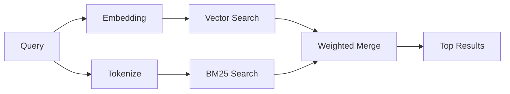

---
read_when:
    - Je wilt begrijpen hoe memory_search werkt
    - Je wilt een embeddingprovider kiezen
    - Je wilt de zoekkwaliteit afstemmen
summary: Hoe geheugenzoekopdrachten relevante notities vinden met embeddings en hybride retrieval
title: Geheugen zoeken
x-i18n:
    generated_at: "2026-06-28T22:33:11Z"
    model: gpt-5.5
    postprocess_version: locale-links-v1
    provider: openai
    source_hash: 32ffb9d996851566eb92b7812c5425f545ecbb5387a0a445686df35a6c8ae143
    source_path: concepts/memory-search.md
    workflow: 16
---

`memory_search` vindt relevante notities uit je geheugenbestanden, zelfs wanneer de
formulering afwijkt van de oorspronkelijke tekst. Het werkt door geheugen in kleine
fragmenten te indexeren en die te doorzoeken met embeddings, trefwoorden of beide.

## Snelstart

Geheugen zoeken gebruikt standaard OpenAI-embeddings. Stel expliciet een provider in
om een andere embedding-backend te gebruiken:

```json5
{
  agents: {
    defaults: {
      memorySearch: {
        provider: "openai", // or "gemini", "local", "ollama", "openai-compatible", etc.
      },
    },
  },
}
```

Voor setups met meerdere endpoints en geheugenspecifieke providers kan `provider`
ook een aangepaste `models.providers.<id>`-vermelding zijn, zoals `ollama-5080`,
wanneer die provider `api: "ollama"` of een andere eigenaar van een
geheugen-embeddingadapter instelt.

Installeer voor lokale embeddings zonder API-sleutel
`@openclaw/llama-cpp-provider` en stel `provider: "local"` in. Broncheckouts
kunnen nog steeds goedkeuring voor native builds vereisen: `pnpm approve-builds`
en daarna `pnpm rebuild node-llama-cpp`.

Sommige OpenAI-compatibele embedding-endpoints vereisen asymmetrische labels zoals
`input_type: "query"` voor zoekopdrachten en `input_type: "document"` of `"passage"`
voor geïndexeerde fragmenten. Configureer die met `memorySearch.queryInputType` en
`memorySearch.documentInputType`; zie de [referentie voor geheugenconfiguratie](/nl/reference/memory-config#provider-specific-config).

## Ondersteunde providers

| Provider          | ID                  | API-sleutel nodig | Opmerkingen                   |
| ----------------- | ------------------- | ----------------- | ----------------------------- |
| Bedrock           | `bedrock`           | Nee               | Gebruikt AWS-credentialketen  |
| DeepInfra         | `deepinfra`         | Ja                | Standaard: `BAAI/bge-m3`      |
| Gemini            | `gemini`            | Ja                | Ondersteunt indexering van afbeeldingen/audio |
| GitHub Copilot    | `github-copilot`    | Nee               | Gebruikt Copilot-abonnement   |
| Local             | `local`             | Nee               | GGUF-model, download van ~0,6 GB |
| Mistral           | `mistral`           | Ja                |                               |
| Ollama            | `ollama`            | Nee               | Lokaal/zelf gehost            |
| OpenAI            | `openai`            | Ja                | Standaard                     |
| OpenAI-compatible | `openai-compatible` | Meestal           | Generieke `/v1/embeddings`    |
| Voyage            | `voyage`            | Ja                |                               |

## Hoe zoeken werkt

OpenClaw voert twee ophaalpaden parallel uit en voegt de resultaten samen:



- **Vectorzoekopdracht** vindt notities met een vergelijkbare betekenis ("gateway host" komt overeen met
  "the machine running OpenClaw").
- **BM25-trefwoordzoekopdracht** vindt exacte overeenkomsten (ID's, foutstrings, config-sleutels).

Als er slechts één pad beschikbaar is, draait het andere pad alleen. Opzettelijke
FTS-only-modus (`provider: "none"`) en automatische/standaard providerselectie
kunnen nog steeds lexicale rangschikking gebruiken wanneer embeddings niet beschikbaar zijn.

Expliciete niet-lokale embeddingproviders zijn anders. Als je
`memorySearch.provider` instelt op een concrete remote-backed provider en die provider
tijdens runtime niet beschikbaar is, rapporteert `memory_search` geheugen als niet beschikbaar
in plaats van stilzwijgend FTS-only-resultaten te gebruiken. Zo blijft een kapotte geconfigureerde semantische
provider zichtbaar. Stel `provider: "none"` in voor bewuste FTS-only-herinnering, of los
de provider-/auth-configuratie op om semantische rangschikking te herstellen.

## Zoekkwaliteit verbeteren

Twee optionele functies helpen wanneer je een grote notitiegeschiedenis hebt:

### Tijdverval

Oude notities verliezen geleidelijk rangschikkingsgewicht, zodat recente informatie eerst naar boven komt.
Met de standaard halfwaardetijd van 30 dagen scoort een notitie van vorige maand 50% van
het oorspronkelijke gewicht. Evergreen-bestanden zoals `MEMORY.md` worden nooit verlaagd.

<Tip>
Schakel tijdverval in als je agent maanden aan dagelijkse notities heeft en verouderde
informatie steeds hoger scoort dan recente context.
</Tip>

### MMR (diversiteit)

Vermindert redundante resultaten. Als vijf notities allemaal dezelfde routerconfiguratie noemen, zorgt MMR
ervoor dat de topresultaten verschillende onderwerpen behandelen in plaats van te herhalen.

<Tip>
Schakel MMR in als `memory_search` steeds bijna-duplicaatfragmenten uit
verschillende dagelijkse notities teruggeeft.
</Tip>

### Beide inschakelen

```json5
{
  agents: {
    defaults: {
      memorySearch: {
        query: {
          hybrid: {
            mmr: { enabled: true },
            temporalDecay: { enabled: true },
          },
        },
      },
    },
  },
}
```

## Multimodaal geheugen

Met Gemini Embedding 2 kun je afbeeldingen en audiobestanden naast
Markdown indexeren. Zoekopdrachten blijven tekst, maar ze matchen met visuele en audio-inhoud.
Zie de [referentie voor geheugenconfiguratie](/nl/reference/memory-config) voor
setup.

## Sessiegeheugen zoeken

Je kunt optioneel sessietranscripten indexeren zodat `memory_search` eerdere
gesprekken kan terughalen. Dit is opt-in via
`memorySearch.experimental.sessionMemory` en `sources: ["sessions"]`; de standaard
bronlijst bevat alleen geheugen. De experimentele vlag schakelt indexering van sessietranscripten in,
terwijl `sources` bepaalt of sessiefragmenten worden doorzocht.

Sessietreffers houden zich aan `tools.sessions.visibility`: de standaardinstelling `tree`
stelt alleen de huidige sessie en sessies die daaruit zijn voortgekomen beschikbaar. Om een niet-gerelateerde
same-agent, door de Gateway verzonden sessie uit een afzonderlijke DM-sessie terug te halen, verbreed je
de zichtbaarheid bewust naar `agent`.

Stel bij gebruik van QMD ook `memory.qmd.sessions.enabled: true` in, zodat transcripten worden
geëxporteerd naar een QMD-collectie. Zie de
[configuratiereferentie](/nl/reference/memory-config) voor details.

## Problemen oplossen

**Geen resultaten?** Voer `openclaw memory status` uit om de index te controleren. Als die leeg is, voer dan
`openclaw memory index --force` uit.

**Alleen trefwoordovereenkomsten?** Je embeddingprovider is mogelijk niet geconfigureerd. Controleer
`openclaw memory status --deep`.

**Time-out bij lokale embeddings?** `ollama`, `lmstudio` en `local` gebruiken standaard een langere
inline batch-time-out. Als de host gewoon traag is, stel dan
`agents.defaults.memorySearch.sync.embeddingBatchTimeoutSeconds` in en voer opnieuw
`openclaw memory index --force` uit.

**CJK-tekst niet gevonden?** Bouw de FTS-index opnieuw op met
`openclaw memory index --force`.

## Verder lezen

- [Active Memory](/nl/concepts/active-memory) -- subagentgeheugen voor interactieve chatsessies
- [Geheugen](/nl/concepts/memory) -- bestandsindeling, backends, tools
- [Referentie voor geheugenconfiguratie](/nl/reference/memory-config) -- alle configuratieknoppen

## Gerelateerd

- [Geheugenoverzicht](/nl/concepts/memory)
- [Active Memory](/nl/concepts/active-memory)
- [Ingebouwde geheugenengine](/nl/concepts/memory-builtin)
