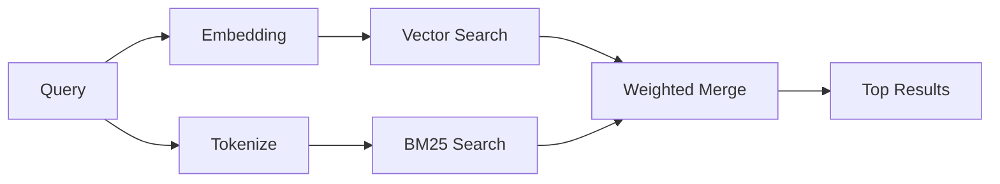

---
read_when:
    - Je wilt begrijpen hoe memory_search werkt
    - Je wilt een embeddingprovider kiezen
    - Je wilt de zoekkwaliteit afstemmen
summary: Hoe geheugenzoekfunctie relevante notities vindt met embeddings en hybride informatieopvraging
title: Geheugen zoeken
x-i18n:
    generated_at: "2026-05-02T11:14:03Z"
    model: gpt-5.5
    provider: openai
    source_hash: 2a71fb0809d5c70689e8046f854e4b4b4e79f45769ac2964e40a762ebb4e91a8
    source_path: concepts/memory-search.md
    workflow: 16
---

`memory_search` vindt relevante notities uit je geheugenbestanden, zelfs wanneer de
formulering afwijkt van de oorspronkelijke tekst. Het werkt door geheugen in kleine
stukken te indexeren en die te doorzoeken met embeddings, trefwoorden, of beide.

## Snel starten

Als je een GitHub Copilot-abonnement of een geconfigureerde API-sleutel voor
OpenAI, Gemini, Voyage of Mistral hebt, werkt geheugenzoekfunctie automatisch. Om
een provider expliciet in te stellen:

```json5
{
  agents: {
    defaults: {
      memorySearch: {
        provider: "openai", // or "gemini", "local", "ollama", etc.
      },
    },
  },
}
```

Voor set-ups met meerdere eindpunten kan `provider` ook een aangepaste
`models.providers.<id>`-vermelding zijn, zoals `ollama-5080`, wanneer die provider
`api: "ollama"` of een andere eigenaar van een embedding-adapter instelt.

Voor lokale embeddings zonder API-sleutel stel je `provider: "local"` in. Source-checkouts
kunnen nog steeds goedkeuring voor native builds vereisen: `pnpm approve-builds` en daarna
`pnpm rebuild node-llama-cpp`.

Sommige OpenAI-compatibele embedding-eindpunten vereisen asymmetrische labels zoals
`input_type: "query"` voor zoekopdrachten en `input_type: "document"` of `"passage"`
voor geïndexeerde stukken. Configureer die met `memorySearch.queryInputType` en
`memorySearch.documentInputType`; zie de [referentie voor geheugenconfiguratie](/nl/reference/memory-config#provider-specific-config).

## Ondersteunde providers

| Provider       | ID               | API-sleutel vereist | Notities                                             |
| -------------- | ---------------- | ------------------- | ---------------------------------------------------- |
| Bedrock        | `bedrock`        | Nee                 | Automatisch gedetecteerd wanneer de AWS-referentieketen wordt opgelost |
| Gemini         | `gemini`         | Ja                  | Ondersteunt indexering van afbeeldingen/audio        |
| GitHub Copilot | `github-copilot` | Nee                 | Automatisch gedetecteerd, gebruikt Copilot-abonnement |
| Lokaal         | `local`          | Nee                 | GGUF-model, download van ~0,6 GB                     |
| Mistral        | `mistral`        | Ja                  | Automatisch gedetecteerd                             |
| Ollama         | `ollama`         | Nee                 | Lokaal, moet expliciet worden ingesteld              |
| OpenAI         | `openai`         | Ja                  | Automatisch gedetecteerd, snel                       |
| Voyage         | `voyage`         | Ja                  | Automatisch gedetecteerd                             |

## Hoe zoeken werkt

OpenClaw voert twee ophaalpaden parallel uit en voegt de resultaten samen:



- **Vectorzoekfunctie** vindt notities met een vergelijkbare betekenis ("gateway host" komt overeen met
  "the machine running OpenClaw").
- **BM25-trefwoordzoekfunctie** vindt exacte overeenkomsten (ID's, foutstrings, configuratie-
  sleutels).

Als slechts één pad beschikbaar is (geen embeddings of geen FTS), wordt alleen het andere uitgevoerd.

Wanneer embeddings niet beschikbaar zijn, gebruikt OpenClaw nog steeds lexicale rangschikking over FTS-resultaten in plaats van alleen terug te vallen op ruwe exacte-overeenkomstvolgorde. Die gedegradeerde modus geeft stukken met sterkere dekking van zoektermen en relevante bestandspaden meer gewicht, waardoor recall nuttig blijft, zelfs zonder `sqlite-vec` of een embedding-provider.

## Zoekkwaliteit verbeteren

Twee optionele functies helpen wanneer je een grote geschiedenis met notities hebt:

### Tijdverval

Oude notities verliezen geleidelijk rangschikkingsgewicht, zodat recente informatie eerst naar voren komt.
Met de standaard halfwaardetijd van 30 dagen scoort een notitie van vorige maand 50% van
haar oorspronkelijke gewicht. Evergreen-bestanden zoals `MEMORY.md` vervallen nooit.

<Tip>
Schakel tijdverval in als je agent maanden aan dagelijkse notities heeft en verouderde
informatie recente context blijft overtreffen.
</Tip>

### MMR (diversiteit)

Vermindert redundante resultaten. Als vijf notities allemaal dezelfde routerconfiguratie noemen, zorgt MMR
ervoor dat de topresultaten verschillende onderwerpen behandelen in plaats van te herhalen.

<Tip>
Schakel MMR in als `memory_search` bijna-duplicaatfragmenten uit
verschillende dagelijkse notities blijft teruggeven.
</Tip>

### Beide inschakelen

```json5
{
  agents: {
    defaults: {
      memorySearch: {
        query: {
          hybrid: {
            mmr: { enabled: true },
            temporalDecay: { enabled: true },
          },
        },
      },
    },
  },
}
```

## Multimodaal geheugen

Met Gemini Embedding 2 kun je afbeeldingen en audiobestanden naast
Markdown indexeren. Zoekopdrachten blijven tekst, maar ze matchen met visuele en audio-
inhoud. Zie de [referentie voor geheugenconfiguratie](/nl/reference/memory-config) voor
instelling.

## Geheugenzoekfunctie voor sessies

Je kunt optioneel sessietranscripten indexeren, zodat `memory_search`
eerdere gesprekken kan terughalen. Dit is opt-in via
`memorySearch.experimental.sessionMemory`. Zie de
[configuratiereferentie](/nl/reference/memory-config) voor details.

## Probleemoplossing

**Geen resultaten?** Voer `openclaw memory status` uit om de index te controleren. Als die leeg is, voer dan
`openclaw memory index --force` uit.

**Alleen trefwoordovereenkomsten?** Je embedding-provider is mogelijk niet geconfigureerd. Controleer
`openclaw memory status --deep`.

**Time-out bij lokale embeddings?** `ollama`, `lmstudio` en `local` gebruiken standaard een langere
inline batchtime-out. Als de host gewoon traag is, stel dan
`agents.defaults.memorySearch.sync.embeddingBatchTimeoutSeconds` in en voer opnieuw
`openclaw memory index --force` uit.

**CJK-tekst niet gevonden?** Bouw de FTS-index opnieuw op met
`openclaw memory index --force`.

## Verder lezen

- [Active Memory](/nl/concepts/active-memory) -- subagentgeheugen voor interactieve chatsessies
- [Geheugen](/nl/concepts/memory) -- bestandsindeling, backends, tools
- [Referentie voor geheugenconfiguratie](/nl/reference/memory-config) -- alle configuratieknoppen

## Gerelateerd

- [Geheugenoverzicht](/nl/concepts/memory)
- [Active Memory](/nl/concepts/active-memory)
- [Ingebouwde geheugenengine](/nl/concepts/memory-builtin)
