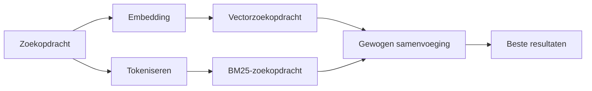

---
read_when:
    - Je wilt begrijpen hoe memory_search werkt
    - Je wilt een embeddingprovider kiezen
    - Je wilt de zoekkwaliteit optimaliseren
summary: Hoe zoeken in het geheugen relevante notities vindt met embeddings en hybride retrieval
title: Geheugen doorzoeken
x-i18n:
    generated_at: "2026-07-16T15:42:24Z"
    model: gpt-5.6
    postprocess_version: locale-links-v1
    prompt_version: 32
    provider: openai
    source_hash: 2ae0830843fba28c24159d85425240051fb8caf086cd0563d3091890045dcfad
    source_path: concepts/memory-search.md
    workflow: 16
---

`memory_search` vindt relevante notities in je geheugenbestanden, zelfs wanneer de
formulering afwijkt van de oorspronkelijke tekst. Het verdeelt het geheugen in kleine stukken en
doorzoekt deze met embeddings, trefwoorden of beide.

## Snel aan de slag

OpenClaw gebruikt standaard OpenAI-embeddings. Stel een andere provider
expliciet in om deze te gebruiken:

```json5
{
  agents: {
    defaults: {
      memorySearch: {
        provider: "openai", // of "gemini", "voyage", "mistral", "bedrock", "local", "ollama", "lmstudio", "github-copilot", "openai-compatible"
      },
    },
  },
}
```

`provider` kan ook verwijzen naar een aangepaste `models.providers.<id>`-vermelding (bijvoorbeeld
`ollama-5080`), zolang die vermelding `api` instelt op `"ollama"` of
een andere provider-id met een adapter voor geheugenembeddings.

Installeer voor lokale embeddings zonder API-sleutel de officiële llama.cpp-provider-
plugin en stel `provider: "local"` in:

```bash
openclaw plugins install @openclaw/llama-cpp-provider
```

Voor broncode-checkouts is nog steeds goedkeuring voor de native build nodig: `pnpm approve-builds`, daarna
`pnpm rebuild node-llama-cpp`.

Sommige OpenAI-compatibele embedding-eindpunten vereisen asymmetrische `input_type`-
labels, zoals `"query"` voor zoekopdrachten en `"document"`/`"passage"` voor geïndexeerde
stukken. Stel deze in met `queryInputType` en `documentInputType`; zie
[Referentie voor geheugenconfiguratie](/nl/reference/memory-config#provider-specific-config).

## Ondersteunde providers

| Provider          | ID                  | API-sleutel vereist | Opmerkingen                             |
| ----------------- | ------------------- | ------------------- | --------------------------------------- |
| Bedrock           | `bedrock`           | Nee                 | Gebruikt de AWS-referentieketen         |
| DeepInfra         | `deepinfra`         | Ja                  | Standaardmodel `BAAI/bge-m3`       |
| Gemini            | `gemini`            | Ja                  | Ondersteunt indexering van beeld/audio  |
| GitHub Copilot    | `github-copilot`    | Nee                 | Gebruikt je Copilot-abonnement          |
| Lokaal            | `local`             | Nee                 | GGUF-model, automatische download van ~0.6 GB |
| LM Studio         | `lmstudio`          | Nee                 | Lokale/zelfgehoste server               |
| Mistral           | `mistral`           | Ja                  |                                         |
| Ollama            | `ollama`            | Nee                 | Lokale/zelfgehoste server               |
| OpenAI            | `openai`            | Ja                  | Standaard                               |
| OpenAI-compatibel | `openai-compatible` | Meestal             | Algemeen `/v1/embeddings`-eindpunt    |
| Voyage            | `voyage`            | Ja                  |                                         |

## Hoe zoeken werkt

OpenClaw voert twee ophaalmethoden parallel uit en voegt de resultaten samen:



- **Vectorzoekopdracht** vindt vergelijkbare betekenissen ("gateway-host" komt overeen met "de
  machine waarop OpenClaw wordt uitgevoerd").
- **BM25-trefwoordzoekopdracht** vindt exacte termen (ID's, foutteksten, configuratie-
  sleutels).
- **Zoeken op bestandsnaam** indexeert paden afzonderlijk van de inhoud van notities. Exacte volledige
  paden, basisbestandsnamen en bestandsnaamstammen krijgen een hogere positie dan gedeeltelijke padovereenkomsten,
  terwijl fragmenten en trefwoordscores voor de inhoud nog steeds uit de inhoud van notities komen.

Als slechts één methode beschikbaar is, wordt alleen die uitgevoerd.

**Alleen-FTS-modus.** Stel `provider: "none"` in om embeddings bewust uit te schakelen
en alleen met trefwoorden te zoeken. Als `provider` niet is ingesteld of is ingesteld op `"auto"`,
wordt ook teruggevallen op rangschikking met alleen trefwoorden wanneer geen embedding-authenticatie is geconfigureerd,
zonder een fout te geven. Hetzelfde geldt voor `provider: "local"` (de GGUF/llama.cpp-
provider) wanneer deze mislukt.

**Expliciete provider niet beschikbaar.** Als je expliciet een andere provider opgeeft
(bijvoorbeeld `openai`, `ollama`, `gemini`) en deze tijdens de aanvraag niet beschikbaar
wordt (ongeldige authenticatie, netwerkstoring), meldt `memory_search` dat het geheugen
niet beschikbaar is in plaats van stilzwijgend terug te vallen op alleen-FTS-resultaten. Hierdoor blijft een
defecte geconfigureerde provider zichtbaar. Stel `provider: "none"` in voor bewust
ophalen met alleen FTS, of herstel de provider-/authenticatieconfiguratie om semantische
rangschikking te herstellen.

## Zoekkwaliteit verbeteren

Twee optionele functies helpen bij een uitgebreide notitiegeschiedenis.

### Temporeel verval

Oude notities verliezen geleidelijk rangschikkingsgewicht, zodat recente informatie als eerste verschijnt.
Met de standaardhalfwaardetijd van 30 dagen krijgt een notitie van vorige maand 50% van het
oorspronkelijke gewicht. `MEMORY.md` en andere bestanden zonder datum onder `memory/` zijn
tijdloos en vervallen nooit; alleen gedateerde `memory/YYYY-MM-DD.md`-bestanden vervallen.

<Tip>
Schakel dit in als je agent maanden aan dagelijkse notities heeft en verouderde informatie
steeds hoger eindigt dan recente context.
</Tip>

### MMR (diversiteit)

Vermindert redundante resultaten. Als vijf notities allemaal dezelfde routerconfiguratie vermelden,
zorgt MMR ervoor dat de beste resultaten verschillende onderwerpen behandelen in plaats van zich te herhalen.

<Tip>
Schakel dit in als `memory_search` steeds bijna identieke fragmenten uit
verschillende dagelijkse notities retourneert.
</Tip>

### Beide inschakelen

```json5
{
  agents: {
    defaults: {
      memorySearch: {
        query: {
          hybrid: {
            mmr: { enabled: true },
            temporalDecay: { enabled: true },
          },
        },
      },
    },
  },
}
```

## Multimodaal geheugen

Met `gemini-embedding-2-preview` kun je afbeeldingen en audio naast
Markdown indexeren. Dit geldt alleen voor bestanden onder `memorySearch.extraPaths`; standaard-
geheugenhoofdmappen (`MEMORY.md`, `memory/*.md`) blijven uitsluitend voor Markdown. Zoekopdrachten
blijven tekst, maar worden vergeleken met visuele en audio-inhoud. Zie
[Referentie voor geheugenconfiguratie](/nl/reference/memory-config#multimodal-memory-gemini)
voor de installatie.

## Zoeken in sessiegeheugen

Gebruik voor het exact doorzoeken van volledige tekst uit sessietranscripten [`sessions_search`](/concepts/session-search)
en open vervolgens een resultaat met `sessions_history`. Zoeken in sessiegeheugen blijft de semantische,
experimentele aanvulling.

Indexeer optioneel sessietranscripten zodat `memory_search` eerdere
gesprekken kan terughalen. Hiervoor moet je je aanmelden: stel `experimental.sessionMemory: true` in en voeg
`"sessions"` toe aan `sources` (standaard is `sources` gelijk aan `["memory"]`).

Sessieresultaten volgen `tools.sessions.visibility`: de standaardwaarde `"tree"`
maakt alleen de huidige sessie en de daaruit gestarte sessies zichtbaar. Om vanuit een andere sessie
een niet-gerelateerde sessie van dezelfde agent terug te halen (bijvoorbeeld een door de Gateway gestarte
sessie vanuit een privébericht), verruim je de zichtbaarheid tot `"agent"`.

Stel bij gebruik van de QMD-backend ook `memory.qmd.sessions.enabled: true` in, zodat
transcripten naar de QMD-verzameling worden geëxporteerd; alleen `experimental.sessionMemory`
en `sources` exporteren geen transcripten naar QMD. Zie
[configuratiereferentie](/nl/reference/memory-config#session-memory-search-experimental).

## Probleemoplossing

**Geen resultaten?** Voer `openclaw memory status` uit om de index te controleren. Voer
`openclaw memory index --force` uit als deze leeg is.

**Alleen trefwoordovereenkomsten?** Je embeddingprovider is mogelijk niet geconfigureerd. Controleer
`openclaw memory status --deep`.

**Time-out bij lokale embeddings?** `ollama`, `lmstudio` en `local` gebruiken standaard een langere
time-out voor inline batches. Als de host alleen traag is, stel je
`agents.defaults.memorySearch.sync.embeddingBatchTimeoutSeconds` in en voer je
`openclaw memory index --force` opnieuw uit.

**CJK-tekst niet gevonden?** Bouw de FTS-index opnieuw op met
`openclaw memory index --force`.

## Gerelateerd

- [Geheugenoverzicht](/nl/concepts/memory)
- [Active Memory](/nl/concepts/active-memory)
- [Ingebouwde geheugenengine](/nl/concepts/memory-builtin)
- [Referentie voor geheugenconfiguratie](/nl/reference/memory-config)
