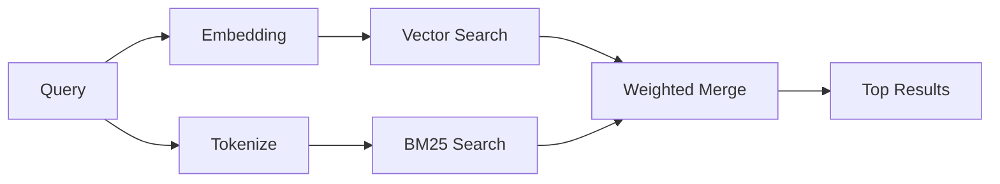

---
read_when:
    - Je wilt begrijpen hoe memory_search werkt
    - Je wilt een embeddingprovider kiezen
    - Je wilt de zoekkwaliteit verfijnen
summary: Hoe zoeken in het geheugen relevante notities vindt met inbeddingen en hybride opvraging
title: Geheugen zoeken
x-i18n:
    generated_at: "2026-04-30T16:28:09Z"
    model: gpt-5.5
    provider: openai
    source_hash: 7f40bbe32453a28070ffc67f19a4c06e2fe59a24237a2aef353f4b9b8260bcf2
    source_path: concepts/memory-search.md
    workflow: 16
---

`memory_search` zoekt relevante notities in je geheugenbestanden, zelfs wanneer de
formulering afwijkt van de oorspronkelijke tekst. Dit werkt door geheugen in
kleine chunks te indexeren en die te doorzoeken met embeddings, trefwoorden of
beide.

## Snel aan de slag

Als je een GitHub Copilot-abonnement, OpenAI, Gemini, Voyage of Mistral
API-sleutel hebt geconfigureerd, werkt geheugenzoekfunctie automatisch. Om een
provider expliciet in te stellen:

```json5
{
  agents: {
    defaults: {
      memorySearch: {
        provider: "openai", // or "gemini", "local", "ollama", etc.
      },
    },
  },
}
```

Voor setups met meerdere endpoints kan `provider` ook een aangepaste
`models.providers.<id>`-vermelding zijn, zoals `ollama-5080`, wanneer die provider
`api: "ollama"` of een andere eigenaar van een embedding-adapter instelt.

Voor lokale embeddings zonder API-sleutel stel je `provider: "local"` in. Verpakte
installaties behouden de native `node-llama-cpp` runtime in OpenClaw's beheerde
pluginruntime-deps-boom; voer `openclaw doctor --fix` uit als die boom moet
worden gerepareerd.

Sommige OpenAI-compatibele embedding-endpoints vereisen asymmetrische labels zoals
`input_type: "query"` voor zoekopdrachten en `input_type: "document"` of `"passage"`
voor geïndexeerde chunks. Configureer die met `memorySearch.queryInputType` en
`memorySearch.documentInputType`; zie de [referentie voor geheugenconfiguratie](/nl/reference/memory-config#provider-specific-config).

## Ondersteunde providers

| Provider       | ID               | API-sleutel nodig | Opmerkingen                                                |
| -------------- | ---------------- | ----------------- | ---------------------------------------------------------- |
| Bedrock        | `bedrock`        | Nee               | Automatisch gedetecteerd wanneer de AWS-credentialketen wordt opgelost |
| Gemini         | `gemini`         | Ja                | Ondersteunt indexering van afbeeldingen/audio              |
| GitHub Copilot | `github-copilot` | Nee               | Automatisch gedetecteerd, gebruikt Copilot-abonnement      |
| Local          | `local`          | Nee               | GGUF-model, download van ~0,6 GB                           |
| Mistral        | `mistral`        | Ja                | Automatisch gedetecteerd                                  |
| Ollama         | `ollama`         | Nee               | Lokaal, moet expliciet worden ingesteld                    |
| OpenAI         | `openai`         | Ja                | Automatisch gedetecteerd, snel                             |
| Voyage         | `voyage`         | Ja                | Automatisch gedetecteerd                                  |

## Hoe zoeken werkt

OpenClaw voert twee ophaalpaden parallel uit en voegt de resultaten samen:



- **Vectorzoekfunctie** vindt notities met een vergelijkbare betekenis ("gateway host" komt overeen met
  "de machine waarop OpenClaw draait").
- **BM25-trefwoordzoekfunctie** vindt exacte overeenkomsten (ID's, foutstrings, configuratie
  keys).

Als slechts één pad beschikbaar is (geen embeddings of geen FTS), draait het andere alleen.

Wanneer embeddings niet beschikbaar zijn, gebruikt OpenClaw nog steeds lexicale rangschikking over FTS-resultaten in plaats van alleen terug te vallen op ruwe exacte-overeenkomstvolgorde. Die gedegradeerde modus versterkt chunks met sterkere dekking van zoektermen en relevante bestandspaden, waardoor recall ook zonder `sqlite-vec` of een embedding-provider nuttig blijft.

## Zoekkwaliteit verbeteren

Twee optionele functies helpen wanneer je een grote notitiegeschiedenis hebt:

### Tijdelijk verval

Oude notities verliezen geleidelijk rangschikkingsgewicht, zodat recente informatie eerst naar voren komt.
Met de standaardhalfwaardetijd van 30 dagen scoort een notitie van vorige maand op 50% van
het oorspronkelijke gewicht. Tijdloze bestanden zoals `MEMORY.md` vervallen nooit.

<Tip>
Schakel tijdelijk verval in als je agent maanden aan dagelijkse notities heeft en verouderde
informatie recente context blijft overtreffen.
</Tip>

### MMR (diversiteit)

Vermindert redundante resultaten. Als vijf notities allemaal dezelfde routerconfiguratie noemen, zorgt MMR
ervoor dat de topresultaten verschillende onderwerpen behandelen in plaats van te herhalen.

<Tip>
Schakel MMR in als `memory_search` steeds bijna-duplicaatfragmenten uit
verschillende dagelijkse notities teruggeeft.
</Tip>

### Beide inschakelen

```json5
{
  agents: {
    defaults: {
      memorySearch: {
        query: {
          hybrid: {
            mmr: { enabled: true },
            temporalDecay: { enabled: true },
          },
        },
      },
    },
  },
}
```

## Multimodaal geheugen

Met Gemini Embedding 2 kun je afbeeldingen en audiobestanden naast
Markdown indexeren. Zoekopdrachten blijven tekst, maar ze matchen met visuele en audio-
inhoud. Zie de [referentie voor geheugenconfiguratie](/nl/reference/memory-config) voor
installatie.

## Sessiegeheugen zoeken

Je kunt optioneel sessietranscripten indexeren zodat `memory_search`
eerdere gesprekken kan herinneren. Dit is opt-in via
`memorySearch.experimental.sessionMemory`. Zie de
[configuratiereferentie](/nl/reference/memory-config) voor details.

## Problemen oplossen

**Geen resultaten?** Voer `openclaw memory status` uit om de index te controleren. Als die leeg is, voer je
`openclaw memory index --force` uit.

**Alleen trefwoordovereenkomsten?** Je embedding-provider is mogelijk niet geconfigureerd. Controleer
`openclaw memory status --deep`.

**Lokale embeddings krijgen een time-out?** `ollama`, `lmstudio` en `local` gebruiken standaard een langere
inline batch-time-out. Als de host gewoon traag is, stel dan
`agents.defaults.memorySearch.sync.embeddingBatchTimeoutSeconds` in en voer opnieuw
`openclaw memory index --force` uit.

**CJK-tekst niet gevonden?** Bouw de FTS-index opnieuw met
`openclaw memory index --force`.

## Verder lezen

- [Active Memory](/nl/concepts/active-memory) -- subagentgeheugen voor interactieve chatsessies
- [Geheugen](/nl/concepts/memory) -- bestandsindeling, backends, tools
- [Referentie voor geheugenconfiguratie](/nl/reference/memory-config) -- alle configuratieknoppen

## Gerelateerd

- [Geheugenoverzicht](/nl/concepts/memory)
- [Active memory](/nl/concepts/active-memory)
- [Ingebouwde geheugenengine](/nl/concepts/memory-builtin)
