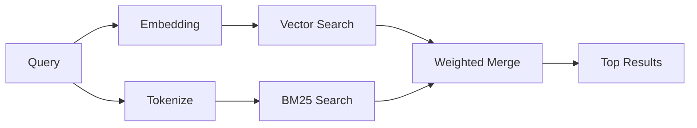

---
read_when:
    - Je wilt begrijpen hoe memory_search werkt
    - Je wilt een embeddingprovider kiezen
    - Je wilt de zoekkwaliteit afstemmen
summary: Hoe geheugenzoeken relevante notities vindt met embeddings en hybride ophaalmethoden
title: Geheugen zoeken
x-i18n:
    generated_at: "2026-06-27T17:27:00Z"
    model: gpt-5.5
    postprocess_version: locale-links-v1
    provider: openai
    source_hash: b0bcb8cf400100ba8b6ddbb46bdf8b2a89a8bc32a550ee6df47c874e7e9e0879
    source_path: concepts/memory-search.md
    workflow: 16
---

`memory_search` vindt relevante notities in je geheugenbestanden, zelfs wanneer de
formulering verschilt van de oorspronkelijke tekst. Dit werkt door geheugen in
kleine chunks te indexeren en die te doorzoeken met embeddings, trefwoorden of
beide.

## Snel aan de slag

Geheugenzoekopdrachten gebruiken standaard OpenAI-embeddings. Stel expliciet een
provider in om een andere embedding-backend te gebruiken:

```json5
{
  agents: {
    defaults: {
      memorySearch: {
        provider: "openai", // or "gemini", "local", "ollama", "openai-compatible", etc.
      },
    },
  },
}
```

Voor setups met meerdere endpoints en geheugenspecifieke providers kan
`provider` ook een aangepaste `models.providers.<id>`-vermelding zijn, zoals
`ollama-5080`, wanneer die provider `api: "ollama"` of een andere eigenaar van
een geheugen-embeddingadapter instelt.

Voor lokale embeddings zonder API-sleutel installeer je
`@openclaw/llama-cpp-provider` en stel je `provider: "local"` in. Source checkouts
kunnen nog steeds goedkeuring voor native builds vereisen: `pnpm approve-builds`
en daarna `pnpm rebuild node-llama-cpp`.

Sommige OpenAI-compatible embedding-endpoints vereisen asymmetrische labels,
zoals `input_type: "query"` voor zoekopdrachten en `input_type: "document"` of
`"passage"` voor geindexeerde chunks. Configureer die met
`memorySearch.queryInputType` en `memorySearch.documentInputType`; zie de
[referentie voor geheugenconfiguratie](/nl/reference/memory-config#provider-specific-config).

## Ondersteunde providers

| Provider          | ID                  | API-sleutel vereist | Opmerkingen                         |
| ----------------- | ------------------- | ------------------- | ----------------------------------- |
| Bedrock           | `bedrock`           | Nee                 | Gebruikt AWS-referentieketen        |
| DeepInfra         | `deepinfra`         | Ja                  | Standaard: `BAAI/bge-m3`            |
| Gemini            | `gemini`            | Ja                  | Ondersteunt indexering van afbeeldingen/audio |
| GitHub Copilot    | `github-copilot`    | Nee                 | Gebruikt Copilot-abonnement         |
| Local             | `local`             | Nee                 | GGUF-model, download van ~0,6 GB    |
| Mistral           | `mistral`           | Ja                  |                                     |
| Ollama            | `ollama`            | Nee                 | Lokaal/zelf gehost                  |
| OpenAI            | `openai`            | Ja                  | Standaard                           |
| OpenAI-compatible | `openai-compatible` | Meestal             | Generieke `/v1/embeddings`          |
| Voyage            | `voyage`            | Ja                  |                                     |

## Hoe zoeken werkt

OpenClaw voert twee ophaalpaden parallel uit en voegt de resultaten samen:



- **Vectorzoekopdrachten** vinden notities met vergelijkbare betekenis
  ("gateway host" komt overeen met "de machine waarop OpenClaw draait").
- **BM25-trefwoordzoekopdrachten** vinden exacte overeenkomsten (ID's,
  foutstrings, configuratiesleutels).

Als er maar een pad beschikbaar is, wordt alleen het andere pad uitgevoerd.
Opzettelijke modus met alleen FTS (`provider: "none"`) en automatische/standaard
providerselectie kunnen nog steeds lexicale ranking gebruiken wanneer embeddings
niet beschikbaar zijn.

Expliciete niet-lokale embeddingproviders zijn anders. Als je
`memorySearch.provider` instelt op een concrete remote-backed provider en die
provider tijdens runtime niet beschikbaar is, meldt `memory_search` geheugen als
niet beschikbaar in plaats van stilzwijgend alleen FTS-resultaten te gebruiken.
Zo blijft een defecte geconfigureerde semantische provider zichtbaar. Stel
`provider: "none"` in voor bewuste FTS-only recall, of herstel de
provider-/auth-configuratie om semantische ranking terug te brengen.

## Zoekkwaliteit verbeteren

Twee optionele functies helpen wanneer je een grote notitiegeschiedenis hebt:

### Temporeel verval

Oude notities verliezen geleidelijk rankinggewicht zodat recente informatie als
eerste naar boven komt. Met de standaard halfwaardetijd van 30 dagen scoort een
notitie van vorige maand op 50% van het oorspronkelijke gewicht. Evergreen
bestanden zoals `MEMORY.md` vervallen nooit.

<Tip>
Schakel temporeel verval in als je agent maanden aan dagelijkse notities heeft
en verouderde informatie recente context blijft overtreffen.
</Tip>

### MMR (diversiteit)

Vermindert redundante resultaten. Als vijf notities allemaal dezelfde
routerconfiguratie noemen, zorgt MMR ervoor dat de bovenste resultaten
verschillende onderwerpen dekken in plaats van te herhalen.

<Tip>
Schakel MMR in als `memory_search` bijna-duplicaatfragmenten uit verschillende
dagelijkse notities blijft teruggeven.
</Tip>

### Beide inschakelen

```json5
{
  agents: {
    defaults: {
      memorySearch: {
        query: {
          hybrid: {
            mmr: { enabled: true },
            temporalDecay: { enabled: true },
          },
        },
      },
    },
  },
}
```

## Multimodaal geheugen

Met Gemini Embedding 2 kun je afbeeldingen en audiobestanden naast Markdown
indexeren. Zoekopdrachten blijven tekst, maar ze matchen met visuele en
audiocontent. Zie de [referentie voor geheugenconfiguratie](/nl/reference/memory-config)
voor de setup.

## Geheugenzoekopdrachten voor sessies

Je kunt optioneel sessietranscripten indexeren zodat `memory_search` eerdere
gesprekken kan ophalen. Dit is opt-in via
`memorySearch.experimental.sessionMemory`. Zie de
[configuratiereferentie](/nl/reference/memory-config) voor details.

## Problemen oplossen

**Geen resultaten?** Voer `openclaw memory status` uit om de index te
controleren. Als die leeg is, voer je `openclaw memory index --force` uit.

**Alleen trefwoordovereenkomsten?** Je embeddingprovider is mogelijk niet
geconfigureerd. Controleer `openclaw memory status --deep`.

**Time-out bij lokale embeddings?** `ollama`, `lmstudio` en `local` gebruiken
standaard een langere inline batch-time-out. Als de host gewoon traag is, stel
dan `agents.defaults.memorySearch.sync.embeddingBatchTimeoutSeconds` in en voer
`openclaw memory index --force` opnieuw uit.

**CJK-tekst niet gevonden?** Bouw de FTS-index opnieuw op met
`openclaw memory index --force`.

## Verder lezen

- [Active Memory](/nl/concepts/active-memory) -- subagentgeheugen voor interactieve chatsessies
- [Geheugen](/nl/concepts/memory) -- bestandsindeling, backends, tools
- [Referentie voor geheugenconfiguratie](/nl/reference/memory-config) -- alle configuratieknoppen

## Gerelateerd

- [Geheugenoverzicht](/nl/concepts/memory)
- [Active Memory](/nl/concepts/active-memory)
- [Ingebouwde geheugenengine](/nl/concepts/memory-builtin)
