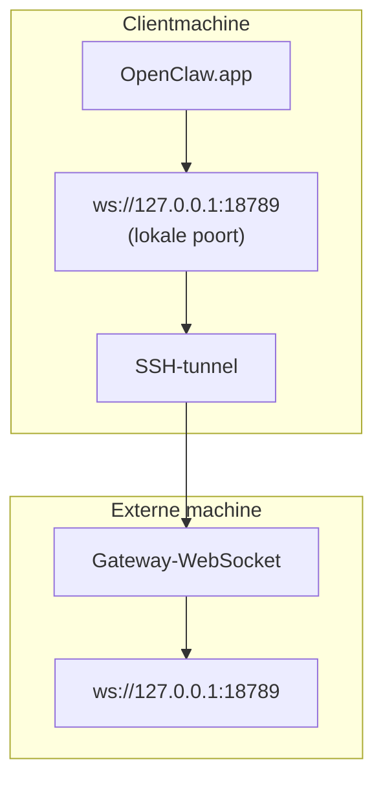

<Note>
Deze inhoud staat nu in [Externe toegang](/nl/gateway/remote#macos-persistent-ssh-tunnel-via-launchagent). Gebruik die pagina voor de actuele handleiding; deze pagina blijft bestaan als omleidingsdoel.
</Note>

# OpenClaw.app uitvoeren met een externe Gateway

OpenClaw.app bereikt een externe Gateway via een SSH-tunnel: een SSH-`LocalForward` koppelt een lokale poort aan de WebSocket-poort van de Gateway op de externe host.

## Instellen

1. Voeg een SSH-configuratie-item toe met `LocalForward 18789 127.0.0.1:18789` (zie [Externe toegang](/nl/gateway/remote#macos-persistent-ssh-tunnel-via-launchagent) voor het volledige configuratieblok).
2. Kopieer je SSH-sleutel naar de externe host met `ssh-copy-id`.
3. Stel `gateway.remote.token` (of `gateway.remote.password`) in via `openclaw config set gateway.remote.token "<your-token>"`.
4. Start de tunnel: `ssh -N remote-gateway &`.
5. Sluit OpenClaw.app af en open de app opnieuw.

Gebruik voor een tunnel die opnieuw opstarten overleeft en automatisch opnieuw verbinding maakt de LaunchAgent-configuratie op de pagina [Externe toegang](/nl/gateway/remote#macos-persistent-ssh-tunnel-via-launchagent) in plaats van een handmatige `ssh -N`.

## Werking

| Component                            | Functie                                                        |
| ------------------------------------ | -------------------------------------------------------------- |
| `LocalForward 18789 127.0.0.1:18789` | Stuurt lokale poort 18789 door naar externe poort 18789         |
| `ssh -N`                             | SSH zonder externe opdrachten uit te voeren (alleen poortdoorschakeling) |
| `KeepAlive`                          | Start de tunnel automatisch opnieuw als deze vastloopt (LaunchAgent) |
| `RunAtLoad`                          | Start de tunnel wanneer de LaunchAgent wordt geladen (LaunchAgent) |

OpenClaw.app maakt op de client verbinding met `ws://127.0.0.1:18789`. De tunnel stuurt die verbinding door naar poort 18789 op de externe host waarop de Gateway wordt uitgevoerd.

## Gerelateerd

- [Externe toegang](/nl/gateway/remote)
- [Tailscale](/nl/gateway/tailscale)
