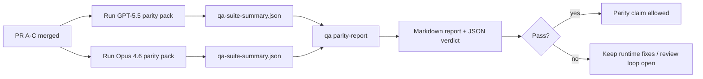

---
read_when:
    - Beoordeling van de GPT-5.5-/Codex-pariteits-PR-reeks
    - Onderhoud van de agentische architectuur met zes contracten achter het pariteitsprogramma
summary: Het GPT-5.5 / Codex-pariteitsprogramma beoordelen als vier merge-eenheden
title: GPT-5.5 / Codex-pariteitsnotities voor maintainers
x-i18n:
    generated_at: "2026-04-29T22:50:25Z"
    model: gpt-5.5
    provider: openai
    source_hash: 8de69081f5985954b88583880c36388dc47116c3351c15d135b8ab3a660058e3
    source_path: help/gpt55-codex-agentic-parity-maintainers.md
    workflow: 16
---

Deze notitie legt uit hoe je het GPT-5.5 / Codex-pariteitsprogramma als vier merge-eenheden kunt beoordelen zonder de oorspronkelijke architectuur met zes contracten te verliezen.

## Merge-eenheden

### PR A: strikte agentische uitvoering

Is eigenaar van:

- `executionContract`
- GPT-5-eerst same-turn opvolging
- `update_plan` als niet-terminale voortgangsregistratie
- expliciete geblokkeerde toestanden in plaats van stille stops met alleen een plan

Is geen eigenaar van:

- classificatie van auth-/runtimefouten
- waarheidsgetrouwheid van permissies
- herontwerp van replay/continuation
- pariteitsbenchmarking

### PR B: runtime-waarheidsgetrouwheid

Is eigenaar van:

- correctheid van Codex OAuth-scopes
- getypeerde classificatie van provider-/runtimefouten
- waarheidsgetrouwe beschikbaarheid van `/elevated full` en geblokkeerde redenen

Is geen eigenaar van:

- normalisatie van toolschema’s
- replay-/liveness-toestand
- benchmark-gating

### PR C: uitvoeringscorrectheid

Is eigenaar van:

- provider-beheerde OpenAI/Codex-toolcompatibiliteit
- parameterloze afhandeling van strikte schema’s
- zichtbaar maken van replay-invalid
- zichtbaarheid van gepauzeerde, geblokkeerde en verlaten langlopende taaktoestanden

Is geen eigenaar van:

- zelfgekozen continuation
- generiek Codex-dialectgedrag buiten provider-hooks
- benchmark-gating

### PR D: pariteitsharnas

Is eigenaar van:

- eerste golf GPT-5.5 versus Opus 4.6 scenariopakket
- pariteitsdocumentatie
- pariteitsrapport en release-gate-mechanica

Is geen eigenaar van:

- runtimegedragswijzigingen buiten QA-lab
- auth-/proxy-/DNS-simulatie binnen het harnas

## Mapping terug naar de oorspronkelijke zes contracten

| Oorspronkelijk contract                   | Merge-eenheid |
| ----------------------------------------- | ------------- |
| Correctheid van providertransport/auth    | PR B          |
| Compatibiliteit van toolcontract/schema   | PR C          |
| Same-turn uitvoering                      | PR A          |
| Waarheidsgetrouwheid van permissies       | PR B          |
| Correctheid van replay/continuation/liveness | PR C       |
| Benchmark-/release-gate                   | PR D          |

## Reviewvolgorde

1. PR A
2. PR B
3. PR C
4. PR D

PR D is de bewijslaag. Het mag niet de reden zijn dat runtime-correctheids-PR’s worden vertraagd.

## Waar je op moet letten

### PR A

- GPT-5-runs handelen of falen gesloten in plaats van te stoppen bij commentaar
- `update_plan` ziet er niet langer op zichzelf uit als voortgang
- gedrag blijft GPT-5-eerst en beperkt tot embedded-Pi

### PR B

- auth-/proxy-/runtimefouten vallen niet langer samen in generieke afhandeling als “model failed”
- `/elevated full` wordt alleen als beschikbaar beschreven wanneer het daadwerkelijk beschikbaar is
- geblokkeerde redenen zijn zichtbaar voor zowel het model als de gebruikersgerichte runtime

### PR C

- strikte OpenAI/Codex-toolregistratie gedraagt zich voorspelbaar
- parameterloze tools falen niet op strikte schemacontroles
- replay- en compaction-uitkomsten behouden een waarheidsgetrouwe liveness-toestand

### PR D

- het scenariopakket is begrijpelijk en reproduceerbaar
- het pakket bevat een muterende replay-safety-lane, niet alleen alleen-lezen flows
- rapporten zijn leesbaar voor mensen en automatisering
- pariteitsclaims zijn onderbouwd met bewijs, niet anekdotisch

Verwachte artefacten uit PR D:

- `qa-suite-report.md` / `qa-suite-summary.json` voor elke modelrun
- `qa-agentic-parity-report.md` met vergelijking op totaal- en scenarioniveau
- `qa-agentic-parity-summary.json` met een machineleesbaar oordeel

## Release-gate

Claim geen pariteit of superioriteit van GPT-5.5 ten opzichte van Opus 4.6 totdat:

- PR A, PR B en PR C zijn gemerged
- PR D het eerste-golf pariteitspakket schoon draait
- regressiesuites voor runtime-waarheidsgetrouwheid groen blijven
- het pariteitsrapport geen nep-succesgevallen en geen regressie in stopgedrag toont

Het pariteitsharnas is niet de enige bewijsbron. Houd deze splitsing expliciet in review:

- PR D is eigenaar van de scenariogebaseerde vergelijking GPT-5.5 versus Opus 4.6
- PR B-deterministische suites blijven eigenaar van bewijs voor auth/proxy/DNS en waarheidsgetrouwheid van volledige toegang

## Snelle mergeworkflow voor maintainers

Gebruik dit wanneer je klaar bent om een pariteits-PR te landen en een herhaalbare reeks met laag risico wilt.

1. Bevestig dat de bewijsdrempel vóór merge is gehaald:
   - reproduceerbaar symptoom of falende test
   - geverifieerde hoofdoorzaak in aangeraakte code
   - fix in het betrokken pad
   - regressietest of expliciete notitie voor handmatige verificatie
2. Triage/label vóór merge:
   - pas eventuele `r:*` auto-close-labels toe wanneer de PR niet moet landen
   - houd mergekandidaten vrij van onopgeloste blokkadethreads
3. Valideer lokaal op het aangeraakte oppervlak:
   - `pnpm check:changed`
   - `pnpm test:changed` wanneer tests zijn gewijzigd of bugfixvertrouwen afhangt van testdekking
4. Land met de standaard maintainerflow (`/landpr`-proces) en verifieer daarna:
   - auto-close-gedrag van gekoppelde issues
   - CI en post-merge-status op `main`
5. Voer na het landen een duplicaatzoekactie uit voor gerelateerde open PR’s/issues en sluit alleen met een canonieke referentie.

Als een van de bewijsdrempelitems ontbreekt, vraag dan om wijzigingen in plaats van te mergen.

## Doel-naar-bewijs-mapping

| Item van voltooiingsgate                  | Primaire eigenaar | Reviewartefact                                                      |
| ----------------------------------------- | ----------------- | ------------------------------------------------------------------- |
| Geen stalls met alleen een plan           | PR A              | strikte agentische runtimetests en `approval-turn-tool-followthrough` |
| Geen nepvoortgang of nep-toolvoltooiing   | PR A + PR D       | pariteits-aantal nep-successen plus rapportdetails op scenarioniveau |
| Geen foutieve `/elevated full`-begeleiding | PR B             | deterministische suites voor runtime-waarheidsgetrouwheid            |
| Replay-/liveness-fouten blijven expliciet | PR C + PR D       | lifecycle-/replay-suites plus `compaction-retry-mutating-tool`       |
| GPT-5.5 evenaart of verslaat Opus 4.6     | PR D              | `qa-agentic-parity-report.md` en `qa-agentic-parity-summary.json`    |

## Reviewersteno: ervoor versus erna

| Gebruikerszichtbaar probleem ervoor                       | Reviewsignaal erna                                                                      |
| --------------------------------------------------------- | ---------------------------------------------------------------------------------------- |
| GPT-5.5 stopte na het plannen                             | PR A toont act-or-block-gedrag in plaats van voltooiing met alleen commentaar            |
| Toolgebruik voelde broos met strikte OpenAI/Codex-schema’s | PR C houdt toolregistratie en parameterloze aanroep voorspelbaar                         |
| `/elevated full`-hints waren soms misleidend              | PR B koppelt begeleiding aan daadwerkelijke runtimecapaciteit en geblokkeerde redenen    |
| Langlopende taken konden verdwijnen in replay-/compaction-ambiguïteit | PR C geeft expliciete gepauzeerde, geblokkeerde, verlaten en replay-invalid-toestand |
| Pariteitsclaims waren anekdotisch                         | PR D produceert een rapport plus JSON-oordeel met dezelfde scenariodekking op beide modellen |

## Gerelateerd

- [GPT-5.5 / Codex agentische pariteit](/nl/help/gpt55-codex-agentic-parity)
