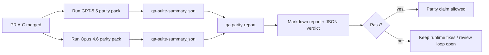

---
read_when:
    - De GPT-5.5 / Codex-pariteits-PR-reeks beoordelen
    - Het onderhouden van de agentische architectuur met zes contracten achter het pariteitsprogramma
summary: Hoe je het GPT-5.5 / Codex-pariteitsprogramma beoordeelt als vier merge-eenheden
title: GPT-5.5 / Codex-pariteit onderhoudersnotities
x-i18n:
    generated_at: "2026-05-06T09:16:34Z"
    model: gpt-5.5
    provider: openai
    source_hash: 5752b4610f8b0d70b80d880ea10df75478b5f85ca431cdb73d3b61d745b23356
    source_path: help/gpt55-codex-agentic-parity-maintainers.md
    workflow: 16
---

Deze notitie legt uit hoe je het GPT-5.5 / Codex-pariteitsprogramma kunt reviewen als vier merge-eenheden zonder de oorspronkelijke architectuur met zes contracten te verliezen.

## Merge-eenheden

### PR A: strikte agentische uitvoering

Is eigenaar van:

- `executionContract`
- GPT-5-eerst-doorvoering in dezelfde beurt
- `update_plan` als niet-terminale voortgangsregistratie
- expliciete geblokkeerde toestanden in plaats van stille stops met alleen een plan

Is geen eigenaar van:

- classificatie van auth-/runtimefouten
- waarheidsgetrouwheid van permissies
- herontwerp van replay/voortzetting
- pariteitsbenchmarking

### PR B: waarheidsgetrouwheid van de runtime

Is eigenaar van:

- correctheid van Codex OAuth-scopes
- getypeerde classificatie van provider-/runtimefouten
- waarheidsgetrouwe beschikbaarheid van `/elevated full` en geblokkeerde redenen

Is geen eigenaar van:

- normalisatie van toolschema's
- replay-/livenessstatus
- benchmark-gating

### PR C: uitvoeringscorrectheid

Is eigenaar van:

- provider-eigen OpenAI/Codex-toolcompatibiliteit
- verwerking van strikte schema's zonder parameters
- zichtbaar maken van ongeldige replay
- zichtbaarheid van gepauzeerde, geblokkeerde en verlaten status van lange taken

Is geen eigenaar van:

- zelfgekozen voortzetting
- generiek Codex-dialectgedrag buiten provider-hooks
- benchmark-gating

### PR D: pariteitsharnas

Is eigenaar van:

- eerste golf GPT-5.5 versus Opus 4.6-scenariopakket
- pariteitsdocumentatie
- pariteitsrapport en mechanismen voor release-gates

Is geen eigenaar van:

- runtimegedragswijzigingen buiten QA-lab
- auth-/proxy-/DNS-simulatie binnen het harnas

## Mapping terug naar de oorspronkelijke zes contracten

| Oorspronkelijk contract                   | Merge-eenheid |
| ----------------------------------------- | ------------- |
| Correctheid van providertransport/auth    | PR B          |
| Toolcontract-/schemacompatibiliteit       | PR C          |
| Uitvoering in dezelfde beurt              | PR A          |
| Waarheidsgetrouwheid van permissies       | PR B          |
| Correctheid van replay/voortzetting/liveness | PR C       |
| Benchmark-/release-gate                   | PR D          |

## Reviewvolgorde

1. PR A
2. PR B
3. PR C
4. PR D

PR D is de bewijslaag. Het mag niet de reden zijn dat PR's voor runtimecorrectheid worden vertraagd.

## Waar je op moet letten

### PR A

- GPT-5-runs handelen of falen gesloten in plaats van te stoppen bij commentaar
- `update_plan` ziet er op zichzelf niet langer uit als voortgang
- gedrag blijft GPT-5-eerst en beperkt tot embedded-Pi

### PR B

- auth-/proxy-/runtimefouten vallen niet meer samen tot generieke afhandeling van "model failed"
- `/elevated full` wordt alleen als beschikbaar beschreven wanneer het daadwerkelijk beschikbaar is
- geblokkeerde redenen zijn zichtbaar voor zowel het model als de gebruikersgerichte runtime

### PR C

- strikte OpenAI/Codex-toolregistratie gedraagt zich voorspelbaar
- tools zonder parameters falen niet op strikte schemacontroles
- replay- en compaction-uitkomsten behouden een waarheidsgetrouwe livenessstatus

### PR D

- het scenariopakket is begrijpelijk en reproduceerbaar
- het pakket bevat een muterende replay-safety-lane, niet alleen read-only flows
- rapporten zijn leesbaar voor mensen en automatisering
- pariteitsclaims worden door bewijs ondersteund, niet door anekdotes

Verwachte artefacten van PR D:

- `qa-suite-report.md` / `qa-suite-summary.json` voor elke modelrun
- `qa-agentic-parity-report.md` met geaggregeerde vergelijking en vergelijking op scenarioniveau
- `qa-agentic-parity-summary.json` met een machineleesbaar oordeel

## Release-gate

Claim geen GPT-5.5-pariteit of superioriteit ten opzichte van Opus 4.6 totdat:

- PR A, PR B en PR C zijn gemerged
- PR D het pariteitspakket van de eerste golf schoon uitvoert
- regressiesuites voor runtime-waarheidsgetrouwheid groen blijven
- het pariteitsrapport geen nep-succesgevallen toont en geen regressie in stopgedrag

Het pariteitsharnas is niet de enige bewijsbron. Houd deze splitsing expliciet in de review:

- PR D is eigenaar van de scenariogebaseerde GPT-5.5 versus Opus 4.6-vergelijking
- PR B-deterministische suites blijven eigenaar van bewijs voor auth/proxy/DNS en waarheidsgetrouwheid van volledige toegang

## Snelle mergeworkflow voor maintainers

Gebruik dit wanneer je klaar bent om een pariteits-PR te landen en een herhaalbare, laagrisicovolle volgorde wilt.

1. Bevestig vóór de merge dat aan de bewijsdrempel is voldaan:
   - reproduceerbaar symptoom of falende test
   - geverifieerde root cause in aangeraakte code
   - fix in het betrokken pad
   - regressietest of expliciete notitie voor handmatige verificatie
2. Triage/label vóór de merge:
   - pas eventuele `r:*` auto-close-labels toe wanneer de PR niet moet landen
   - houd mergekandidaten vrij van onopgeloste blockerthreads
3. Valideer lokaal op het aangeraakte oppervlak:
   - `pnpm check:changed`
   - `pnpm test:changed` wanneer tests zijn gewijzigd of vertrouwen in de bugfix afhankelijk is van testdekking
4. Land met de standaard maintainerflow (`/landpr`-proces), en verifieer daarna:
   - auto-closegedrag van gekoppelde issues
   - CI en post-mergestatus op `main`
5. Voer na het landen een duplicaatzoekactie uit voor gerelateerde open PR's/issues en sluit alleen met een canonieke referentie.

Als een van de bewijsdrempelitems ontbreekt, vraag dan wijzigingen aan in plaats van te mergen.

## Doel-naar-bewijs-map

| Item van voltooiingsgate                  | Primaire eigenaar | Reviewartefact                                                     |
| ----------------------------------------- | ----------------- | ------------------------------------------------------------------ |
| Geen plan-only vastlopers                 | PR A              | strikte agentische runtimetests en `approval-turn-tool-followthrough` |
| Geen nepvoortgang of nep-toolvoltooiing   | PR A + PR D       | pariteitstelling voor fake-success plus rapportdetails op scenarioniveau |
| Geen onjuiste `/elevated full`-richtlijnen | PR B             | deterministische suites voor runtime-waarheidsgetrouwheid          |
| Replay-/livenessfouten blijven expliciet  | PR C + PR D       | lifecycle-/replaysuites plus `compaction-retry-mutating-tool`      |
| GPT-5.5 evenaart of overtreft Opus 4.6    | PR D              | `qa-agentic-parity-report.md` en `qa-agentic-parity-summary.json`  |

## Reviewersafkorting: voor versus na

| Voorheen zichtbaar gebruikersprobleem                         | Reviewsignaal achteraf                                                                 |
| ------------------------------------------------------------- | -------------------------------------------------------------------------------------- |
| GPT-5.5 stopte na het plannen                                 | PR A toont act-or-block-gedrag in plaats van voltooiing met alleen commentaar          |
| Toolgebruik voelde broos met strikte OpenAI/Codex-schema's    | PR C houdt toolregistratie en aanroep zonder parameters voorspelbaar                   |
| `/elevated full`-hints waren soms misleidend                  | PR B koppelt richtlijnen aan daadwerkelijke runtimecapaciteit en geblokkeerde redenen  |
| Lange taken konden verdwijnen in replay-/compaction-ambiguïteit | PR C emitteert expliciete gepauzeerde, geblokkeerde, verlaten en replay-invalid-status |
| Pariteitsclaims waren anekdotisch                             | PR D produceert een rapport plus JSON-oordeel met dezelfde scenariodekking op beide modellen |

## Gerelateerd

- [GPT-5.5 / Codex-agentische pariteit](/nl/help/gpt55-codex-agentic-parity)
