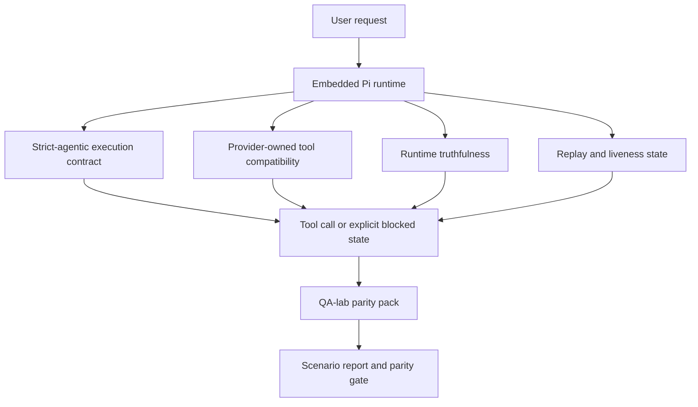
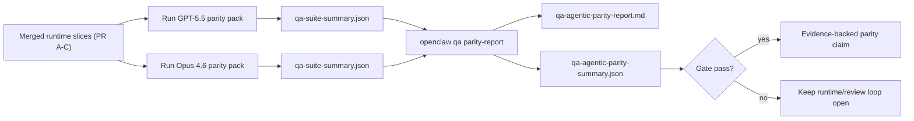

---
read_when:
    - Debuggen van GPT-5.5- of Codex-agentgedrag
    - OpenClaw-agentisch gedrag vergelijken tussen frontiermodellen
    - De oplossingen voor strikt-agentisch gedrag, toolschema's, elevatie en opnieuw afspelen beoordelen
summary: Hoe OpenClaw hiaten in agentische uitvoering voor GPT-5.5 en Codex-achtige modellen dicht
title: GPT-5.5 / agentische pariteit van Codex
x-i18n:
    generated_at: "2026-04-29T22:51:11Z"
    model: gpt-5.5
    provider: openai
    source_hash: 8a3b9375cd9e9d95855c4a1135953e00fd7a939e52fb7b75342da3bde2d83fe1
    source_path: help/gpt55-codex-agentic-parity.md
    workflow: 16
---

# GPT-5.5 / Codex agentische pariteit in OpenClaw

OpenClaw werkte al goed met grensverleggende modellen die tools gebruiken, maar GPT-5.5 en Codex-achtige modellen presteerden praktisch nog steeds minder goed op een paar manieren:

- ze konden stoppen na het plannen in plaats van het werk uit te voeren
- ze konden strikte OpenAI/Codex-toolschema's verkeerd gebruiken
- ze konden om `/elevated full` vragen, zelfs wanneer volledige toegang onmogelijk was
- ze konden de status van langlopende taken verliezen tijdens replay of Compaction
- pariteitsclaims tegenover Claude Opus 4.6 waren gebaseerd op anekdotes in plaats van herhaalbare scenario's

Dit pariteitsprogramma dicht die gaten in vier beoordeelbare delen.

## Wat is er veranderd

### PR A: strikte agentische uitvoering

Dit deel voegt een opt-in `strict-agentic` uitvoeringscontract toe voor ingebedde Pi GPT-5-runs.

Wanneer dit is ingeschakeld, accepteert OpenClaw alleen-plan-beurten niet langer als “goed genoeg” voltooiing. Als het model alleen zegt wat het van plan is te doen en niet daadwerkelijk tools gebruikt of voortgang boekt, probeert OpenClaw het opnieuw met een acteer-nu-sturing en faalt daarna gesloten met een expliciete geblokkeerde status in plaats van de taak stilzwijgend te beëindigen.

Dit verbetert de GPT-5.5-ervaring het meest bij:

- korte “ok doe het”-vervolgen
- codetaken waarbij de eerste stap duidelijk is
- flows waarbij `update_plan` voortgangsregistratie moet zijn in plaats van opvultekst

### PR B: waarheidsgetrouwheid van de runtime

Dit deel zorgt ervoor dat OpenClaw de waarheid vertelt over twee dingen:

- waarom de provider-/runtime-aanroep is mislukt
- of `/elevated full` daadwerkelijk beschikbaar is

Dat betekent dat GPT-5.5 betere runtimesignalen krijgt voor ontbrekende scope, mislukte auth-vernieuwingen, HTML 403-auth-fouten, proxyproblemen, DNS- of timeoutfouten en geblokkeerde modi voor volledige toegang. Het model hallucineert minder snel de verkeerde oplossing of blijft minder snel vragen om een machtigingsmodus die de runtime niet kan bieden.

### PR C: uitvoeringscorrectheid

Dit deel verbetert twee soorten correctheid:

- provider-eigen OpenAI/Codex-toolschema-compatibiliteit
- zichtbaarheid van replay en liveness van lange taken

Het tool-compatwerk vermindert schemafrictie voor strikte OpenAI/Codex-toolregistratie, vooral rond parametervrije tools en strikte verwachtingen voor een object-root. Het replay-/livenesswerk maakt langlopende taken beter waarneembaar, zodat gepauzeerde, geblokkeerde en verlaten statussen zichtbaar zijn in plaats van te verdwijnen in algemene fouttekst.

### PR D: pariteitsharnas

Dit deel voegt het eerste-golf QA-lab-pariteitspakket toe, zodat GPT-5.5 en Opus 4.6 via dezelfde scenario's kunnen worden geoefend en met gedeeld bewijs kunnen worden vergeleken.

Het pariteitspakket is de bewijslaag. Het verandert op zichzelf geen runtimegedrag.

Nadat je twee `qa-suite-summary.json`-artefacten hebt, genereer je de release-gate-vergelijking met:

```bash
pnpm openclaw qa parity-report \
  --repo-root . \
  --candidate-summary .artifacts/qa-e2e/gpt55/qa-suite-summary.json \
  --baseline-summary .artifacts/qa-e2e/opus46/qa-suite-summary.json \
  --output-dir .artifacts/qa-e2e/parity
```

Die opdracht schrijft:

- een voor mensen leesbaar Markdown-rapport
- een machineleesbaar JSON-oordeel
- een expliciet `pass` / `fail` gate-resultaat

## Waarom dit GPT-5.5 in de praktijk verbetert

Voor dit werk kon GPT-5.5 op OpenClaw in echte codeersessies minder agentisch aanvoelen dan Opus, omdat de runtime gedrag tolereerde dat vooral schadelijk is voor GPT-5-achtige modellen:

- beurten met alleen commentaar
- schemafrictie rond tools
- vage machtigingsfeedback
- stille replay- of Compaction-breuk

Het doel is niet om GPT-5.5 Opus te laten imiteren. Het doel is GPT-5.5 een runtimecontract te geven dat echte voortgang beloont, schonere tool- en machtigingssemantiek levert en faalmodi omzet in expliciete machine- en mensleesbare statussen.

Dat verandert de gebruikerservaring van:

- “het model had een goed plan maar stopte”

naar:

- “het model handelde, of OpenClaw toonde de exacte reden waarom dat niet kon”

## Voor en na voor GPT-5.5-gebruikers

| Voor dit programma                                                                            | Na PR A-D                                                                             |
| ---------------------------------------------------------------------------------------------- | ---------------------------------------------------------------------------------------- |
| GPT-5.5 kon stoppen na een redelijk plan zonder de volgende toolstap te zetten                   | PR A verandert “alleen plan” in “handel nu of toon een geblokkeerde status”                         |
| Strikte toolschema's konden parametervrije of OpenAI/Codex-vormige tools op verwarrende manieren weigeren | PR C maakt provider-eigen toolregistratie en aanroeping voorspelbaarder              |
| `/elevated full`-richtlijnen konden vaag of verkeerd zijn in geblokkeerde runtimes                          | PR B geeft GPT-5.5 en de gebruiker waarheidsgetrouwe runtime- en machtigingstips                    |
| Replay- of Compaction-fouten konden aanvoelen alsof de taak stilzwijgend verdween                    | PR C toont gepauzeerde, geblokkeerde, verlaten en replay-ongeldige uitkomsten expliciet         |
| “GPT-5.5 voelt slechter dan Opus” was grotendeels anekdotisch                                           | PR D verandert dat in hetzelfde scenariopakket, dezelfde metrieken en een harde pass/fail-gate |

## Architectuur



## Releaseflow



## Scenariopakket

Het eerste-golf pariteitspakket dekt momenteel vijf scenario's:

### `approval-turn-tool-followthrough`

Controleert dat het model niet stopt bij “Ik doe dat” na een korte goedkeuring. Het moet de eerste concrete actie in dezelfde beurt uitvoeren.

### `model-switch-tool-continuity`

Controleert dat werk dat tools gebruikt coherent blijft over model-/runtimewisselgrenzen heen, in plaats van te resetten naar commentaar of uitvoeringscontext te verliezen.

### `source-docs-discovery-report`

Controleert dat het model broncode en documentatie kan lezen, bevindingen kan synthetiseren en de taak agentisch kan voortzetten in plaats van een dunne samenvatting te produceren en vroeg te stoppen.

### `image-understanding-attachment`

Controleert dat mixed-mode-taken met bijlagen uitvoerbaar blijven en niet instorten tot vage vertelling.

### `compaction-retry-mutating-tool`

Controleert dat een taak met een echte muterende schrijfactie replay-onveiligheid expliciet houdt in plaats van er stilletjes replay-veilig uit te zien als de run compacteert, opnieuw probeert of antwoordstatus verliest onder druk.

## Scenariomatrix

| Scenario                           | Wat het test                           | Goed GPT-5.5-gedrag                                                          | Faal signaal                                                                 |
| ---------------------------------- | --------------------------------------- | ------------------------------------------------------------------------------ | ------------------------------------------------------------------------------ |
| `approval-turn-tool-followthrough` | Korte goedkeuringsbeurten na een plan       | Start onmiddellijk de eerste concrete toolactie in plaats van intentie opnieuw te formuleren  | alleen-plan-vervolg, geen toolactiviteit, of geblokkeerde beurt zonder echte blokkering  |
| `model-switch-tool-continuity`     | Runtime-/modelwisseling tijdens toolgebruik  | Behoudt taakcontext en blijft coherent handelen                         | reset naar commentaar, verliest toolcontext, of stopt na wissel              |
| `source-docs-discovery-report`     | Bron lezen + synthese + actie     | Vindt bronnen, gebruikt tools en produceert een nuttig rapport zonder vast te lopen       | dunne samenvatting, ontbrekend toolwerk, of stop bij onvolledige beurt                       |
| `image-understanding-attachment`   | Bijlage-gedreven agentisch werk          | Interpreteert de bijlage, verbindt die met tools en zet de taak voort        | vage vertelling, bijlage genegeerd, of geen concrete volgende actie                |
| `compaction-retry-mutating-tool`   | Muterend werk onder Compaction-druk | Voert een echte schrijfactie uit en houdt replay-onveiligheid expliciet na de bijwerking | muterende schrijfactie gebeurt maar replayveiligheid is geïmpliceerd, ontbreekt of is tegenstrijdig |

## Release-gate

GPT-5.5 kan alleen als op pariteit of beter worden beschouwd wanneer de samengevoegde runtime tegelijk het pariteitspakket en de regressies voor runtimewaarheidsgetrouwheid doorstaat.

Vereiste uitkomsten:

- geen alleen-plan-stilstand wanneer de volgende toolactie duidelijk is
- geen nepvoltooiing zonder echte uitvoering
- geen onjuiste `/elevated full`-richtlijnen
- geen stilzwijgende replay- of Compaction-verlating
- metrieken van het pariteitspakket die minstens zo sterk zijn als de overeengekomen Opus 4.6-baseline

Voor het eerste-golf harnas vergelijkt de gate:

- voltooiingspercentage
- percentage onbedoelde stops
- percentage geldige toolaanroepen
- aantal nep-successen

Pariteitsbewijs is bewust verdeeld over twee lagen:

- PR D bewijst GPT-5.5- versus Opus 4.6-gedrag met dezelfde scenario's via QA-lab
- PR B deterministische suites bewijzen auth-, proxy-, DNS- en `/elevated full`-waarheidsgetrouwheid buiten het harnas

## Doel-naar-bewijs-matrix

| Voltooiings-gate-item                                     | Eigenaar-PR   | Bewijsbron                                                    | Pass-signaal                                                                              |
| -------------------------------------------------------- | ----------- | ------------------------------------------------------------------ | ---------------------------------------------------------------------------------------- |
| GPT-5.5 loopt niet langer vast na planning                  | PR A        | `approval-turn-tool-followthrough` plus PR A-runtimesuites        | goedkeuringsbeurten starten echt werk of een expliciete geblokkeerde status                            |
| GPT-5.5 doet niet langer alsof er voortgang is of alsof tools zijn voltooid | PR A + PR D | scenariouitkomsten van het pariteitsrapport en aantal nep-successen             | geen verdachte pass-resultaten en geen voltooiing met alleen commentaar                             |
| GPT-5.5 geeft niet langer valse `/elevated full`-richtlijnen  | PR B        | deterministische waarheidsgetrouwheidssuites                                  | geblokkeerde redenen en volledige-toegangstips blijven runtime-accuraat                              |
| Replay-/livenessfouten blijven expliciet                   | PR C + PR D | PR C-lifecycle-/replaysuites plus `compaction-retry-mutating-tool` | muterend werk houdt replay-onveiligheid expliciet in plaats van stilzwijgend te verdwijnen            |
| GPT-5.5 evenaart of overtreft Opus 4.6 op de overeengekomen metrieken  | PR D        | `qa-agentic-parity-report.md` en `qa-agentic-parity-summary.json` | dezelfde scenariodekking en geen regressie in voltooiing, stopgedrag of geldig toolgebruik |

## Hoe je het pariteitsoordeel leest

Gebruik het oordeel in `qa-agentic-parity-summary.json` als de uiteindelijke machineleesbare beslissing voor het eerste-golf pariteitspakket.

- `pass` betekent dat GPT-5.5 dezelfde scenario's dekte als Opus 4.6 en geen regressie vertoonde op de overeengekomen geaggregeerde metriek.
- `fail` betekent dat minstens één harde gate afging: zwakkere voltooiing, slechtere onbedoelde stops, zwakker geldig toolgebruik, een geval van nep-succes, of niet-overeenkomende scenariodekking.
- “gedeeld/basis-CI-probleem” is op zichzelf geen pariteitsresultaat. Als CI-ruis buiten PR D een run blokkeert, moet het oordeel wachten op een schone uitvoering van de samengevoegde runtime in plaats van te worden afgeleid uit logs uit de branchtijd.
- Authenticatie, proxy, DNS en waarheidsgetrouwheid van `/elevated full` komen nog steeds uit de deterministische suites van PR B, dus de definitieve releaseclaim heeft beide nodig: een geslaagd PR D-pariteitsoordeel en groene PR B-dekking voor waarheidsgetrouwheid.

## Wie `strict-agentic` moet inschakelen

Gebruik `strict-agentic` wanneer:

- van de agent wordt verwacht dat die direct handelt wanneer een volgende stap duidelijk is
- GPT-5.5- of Codex-familiemodellen de primaire runtime zijn
- je expliciete geblokkeerde toestanden verkiest boven “behulpzame” antwoorden die alleen samenvatten

Behoud het standaardcontract wanneer:

- je het bestaande lossere gedrag wilt
- je geen modellen uit de GPT-5-familie gebruikt
- je prompts test in plaats van runtime-afdwinging

## Gerelateerd

- [Onderhoudersnotities voor GPT-5.5 / Codex-pariteit](/nl/help/gpt55-codex-agentic-parity-maintainers)
