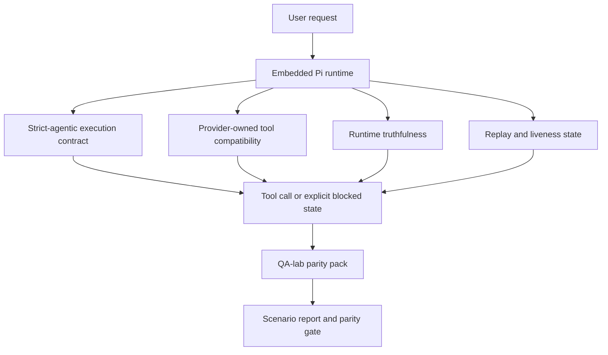
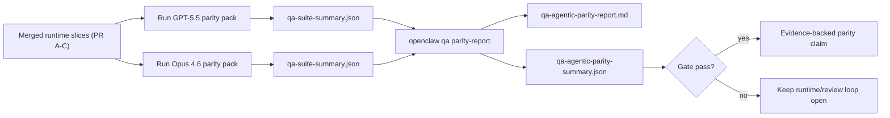

---
read_when:
    - Fouten opsporen in GPT-5.5- of Codex-agentgedrag
    - Vergelijking van agentisch gedrag van OpenClaw tussen frontier-modellen
    - De strikt-agentische, toolschema-, rechtenverhogings- en herhalingsfixes beoordelen
summary: Hoe OpenClaw hiaten in agentische uitvoering sluit voor GPT-5.5 en Codex-achtige modellen
title: GPT-5.5 / Codex agentische pariteit
x-i18n:
    generated_at: "2026-05-06T09:16:47Z"
    model: gpt-5.5
    provider: openai
    source_hash: bbc32f418dfffe2786093fa6b42b19f92a2d382c9408dfc55dd0154d67959390
    source_path: help/gpt55-codex-agentic-parity.md
    workflow: 16
---

OpenClaw werkte al goed met frontiermodellen die tools gebruiken, maar GPT-5.5 en Codex-achtige modellen presteerden op een paar praktische punten nog ondermaats:

- ze konden na het plannen stoppen in plaats van het werk te doen
- ze konden strikte OpenAI/Codex-toolschema's verkeerd gebruiken
- ze konden om `/elevated full` vragen, zelfs wanneer volledige toegang onmogelijk was
- ze konden de status van langlopende taken verliezen tijdens replay of Compaction
- pariteitsclaims tegenover Claude Opus 4.6 waren gebaseerd op anekdotes in plaats van herhaalbare scenario's

Dit pariteitsprogramma lost die gaten op in vier beoordeelbare delen.

## Wat is gewijzigd

### PR A: strikte agentische uitvoering

Dit deel voegt een opt-in `strict-agentic` uitvoeringscontract toe voor ingesloten Pi GPT-5-runs.

Wanneer dit is ingeschakeld, accepteert OpenClaw plan-only-beurten niet langer als "goed genoeg" voltooiing. Als het model alleen zegt wat het van plan is te doen en niet daadwerkelijk tools gebruikt of voortgang boekt, probeert OpenClaw het opnieuw met een sturing om nu te handelen en faalt daarna gesloten met een expliciete geblokkeerde status in plaats van de taak stilzwijgend te beëindigen.

Dit verbetert de GPT-5.5-ervaring vooral bij:

- korte "ok doe het"-vervolgen
- codetaken waarbij de eerste stap voor de hand ligt
- flows waarin `update_plan` voortgangsregistratie moet zijn in plaats van opvultekst

### PR B: runtime-waarheidsgetrouwheid

Dit deel zorgt ervoor dat OpenClaw de waarheid vertelt over twee dingen:

- waarom de provider-/runtime-aanroep is mislukt
- of `/elevated full` daadwerkelijk beschikbaar is

Dat betekent dat GPT-5.5 betere runtimesignalen krijgt voor ontbrekende scope, mislukte auth-verversingen, HTML 403-authfouten, proxyproblemen, DNS- of time-outfouten en geblokkeerde modi met volledige toegang. Het model zal minder snel de verkeerde oplossing hallucineren of blijven vragen om een permissiemodus die de runtime niet kan bieden.

### PR C: uitvoeringscorrectheid

Dit deel verbetert twee soorten correctheid:

- door providers beheerde OpenAI/Codex-toolschema-compatibiliteit
- zichtbaarheid van replay en liveness bij lange taken

Het tool-compat-werk vermindert schemafrictie voor strikte OpenAI/Codex-toolregistratie, vooral rond tools zonder parameters en strikte verwachtingen voor object-roots. Het replay/liveness-werk maakt langlopende taken beter observeerbaar, zodat gepauzeerde, geblokkeerde en verlaten statussen zichtbaar zijn in plaats van te verdwijnen in generieke fouttekst.

### PR D: pariteitsharnas

Dit deel voegt het eerste QA-lab-pariteitspakket toe, zodat GPT-5.5 en Opus 4.6 via dezelfde scenario's kunnen worden uitgevoerd en met gedeeld bewijs kunnen worden vergeleken.

Het pariteitspakket is de bewijslaag. Op zichzelf wijzigt het geen runtimegedrag.

Nadat je twee `qa-suite-summary.json`-artefacten hebt, genereer je de release-gatevergelijking met:

```bash
pnpm openclaw qa parity-report \
  --repo-root . \
  --candidate-summary .artifacts/qa-e2e/gpt55/qa-suite-summary.json \
  --baseline-summary .artifacts/qa-e2e/opus46/qa-suite-summary.json \
  --output-dir .artifacts/qa-e2e/parity
```

Die opdracht schrijft:

- een voor mensen leesbaar Markdown-rapport
- een machineleesbaar JSON-oordeel
- een expliciet `pass` / `fail`-gateresultaat

## Waarom dit GPT-5.5 in de praktijk verbetert

Vóór dit werk kon GPT-5.5 op OpenClaw in echte codeersessies minder agentisch aanvoelen dan Opus, omdat de runtime gedrag tolereerde dat vooral schadelijk is voor GPT-5-achtige modellen:

- beurten met alleen commentaar
- schemafrictie rond tools
- vage permissiefeedback
- stille replay- of Compaction-breuk

Het doel is niet om GPT-5.5 Opus te laten imiteren. Het doel is GPT-5.5 een runtimecontract te geven dat echte voortgang beloont, schonere tool- en permissiesemantiek levert en faalmodi omzet in expliciete machine- en mensleesbare statussen.

Dat verandert de gebruikerservaring van:

- "het model had een goed plan, maar stopte"

naar:

- "het model handelde, of OpenClaw toonde de exacte reden waarom dat niet kon"

## Voor en na voor GPT-5.5-gebruikers

| Vóór dit programma                                                                            | Na PR A-D                                                                             |
| ---------------------------------------------------------------------------------------------- | ---------------------------------------------------------------------------------------- |
| GPT-5.5 kon na een redelijk plan stoppen zonder de volgende toolstap te nemen                   | PR A verandert "alleen plan" in "handel nu of toon een geblokkeerde status"                         |
| Strikte toolschema's konden parameterloze of OpenAI/Codex-vormige tools op verwarrende manieren weigeren | PR C maakt door providers beheerde toolregistratie en aanroep voorspelbaarder              |
| `/elevated full`-richtlijnen konden vaag of onjuist zijn in geblokkeerde runtimes                          | PR B geeft GPT-5.5 en de gebruiker waarheidsgetrouwe runtime- en permissiehints                    |
| Replay- of Compaction-fouten konden aanvoelen alsof de taak stilzwijgend was verdwenen                    | PR C toont gepauzeerde, geblokkeerde, verlaten en replay-ongeldige uitkomsten expliciet         |
| "GPT-5.5 voelt slechter dan Opus" was vooral anekdotisch                                           | PR D zet dat om in hetzelfde scenariopakket, dezelfde metrics en een harde pass/fail-gate |

## Architectuur



## Releaseflow



## Scenariopakket

Het eerste pariteitspakket bevat momenteel vijf scenario's:

### `approval-turn-tool-followthrough`

Controleert dat het model niet stopt bij "I'll do that" na een korte goedkeuring. Het moet in dezelfde beurt de eerste concrete actie uitvoeren.

### `model-switch-tool-continuity`

Controleert dat werk met tools coherent blijft over model-/runtimewisselgrenzen heen in plaats van terug te vallen naar commentaar of uitvoeringscontext te verliezen.

### `source-docs-discovery-report`

Controleert dat het model broncode en docs kan lezen, bevindingen kan synthetiseren en de taak agentisch kan voortzetten in plaats van een dunne samenvatting te produceren en vroeg te stoppen.

### `image-understanding-attachment`

Controleert dat taken in gemengde modus met bijlagen uitvoerbaar blijven en niet instorten tot vage vertelling.

### `compaction-retry-mutating-tool`

Controleert dat een taak met een echte muterende schrijfactie replay-onveiligheid expliciet houdt in plaats van stilletjes replay-veilig te lijken als de run compacter wordt, opnieuw probeert of antwoordstatus verliest onder druk.

## Scenariomatrix

| Scenario                           | Wat het test                           | Goed GPT-5.5-gedrag                                                          | Faalindicator                                                                 |
| ---------------------------------- | --------------------------------------- | ------------------------------------------------------------------------------ | ------------------------------------------------------------------------------ |
| `approval-turn-tool-followthrough` | Korte goedkeuringsbeurten na een plan       | Start onmiddellijk de eerste concrete toolactie in plaats van intentie opnieuw te formuleren  | plan-only-vervolg, geen toolactiviteit of geblokkeerde beurt zonder echte blokkade  |
| `model-switch-tool-continuity`     | Runtime-/modelwissel tijdens toolgebruik  | Behoudt taakcontext en blijft coherent handelen                         | valt terug naar commentaar, verliest toolcontext of stopt na de wissel              |
| `source-docs-discovery-report`     | Bron lezen + synthese + actie     | Vindt bronnen, gebruikt tools en produceert een nuttig rapport zonder vast te lopen       | dunne samenvatting, ontbrekend toolwerk of stop bij onvolledige beurt                       |
| `image-understanding-attachment`   | Agentisch werk gedreven door bijlagen          | Interpreteert de bijlage, verbindt die met tools en zet de taak voort        | vage vertelling, bijlage genegeerd of geen concrete volgende actie                |
| `compaction-retry-mutating-tool`   | Muterend werk onder Compaction-druk | Voert een echte schrijfactie uit en houdt replay-onveiligheid expliciet na het neveneffect | muterende schrijfactie gebeurt, maar replayveiligheid wordt geïmpliceerd, ontbreekt of is tegenstrijdig |

## Release-gate

GPT-5.5 kan alleen als op pariteit of beter worden beschouwd wanneer de samengevoegde runtime tegelijkertijd slaagt voor het pariteitspakket en de runtime-waarheidsgetrouwheidsregressies.

Vereiste uitkomsten:

- geen plan-only-vastloper wanneer de volgende toolactie duidelijk is
- geen schijnvoltooiing zonder echte uitvoering
- geen onjuiste `/elevated full`-richtlijnen
- geen stille replay- of Compaction-verlating
- pariteitspakketmetrics die minstens zo sterk zijn als de overeengekomen Opus 4.6-baseline

Voor het eerste harnas vergelijkt de gate:

- voltooiingspercentage
- percentage onbedoelde stops
- percentage geldige toolaanroepen
- aantal schijnsuccessen

Pariteitsbewijs is bewust verdeeld over twee lagen:

- PR D bewijst GPT-5.5- versus Opus 4.6-gedrag in dezelfde scenario's met QA-lab
- PR B deterministische suites bewijzen auth-, proxy-, DNS- en `/elevated full`-waarheidsgetrouwheid buiten het harnas

## Matrix van doel naar bewijs

| Completion gate-item                                     | Eigenaar-PR   | Bewijsbron                                                    | Pass-signaal                                                                              |
| -------------------------------------------------------- | ----------- | ------------------------------------------------------------------ | ---------------------------------------------------------------------------------------- |
| GPT-5.5 loopt niet langer vast na planning                  | PR A        | `approval-turn-tool-followthrough` plus PR A-runtimesuites        | goedkeuringsbeurten starten echt werk of een expliciete geblokkeerde status                            |
| GPT-5.5 veinst niet langer voortgang of schijnbare toolvoltooiing | PR A + PR D | pariteitsrapport-scenario-uitkomsten en aantal schijnsuccessen             | geen verdachte pass-resultaten en geen voltooiing met alleen commentaar                             |
| GPT-5.5 geeft niet langer valse `/elevated full`-richtlijnen  | PR B        | deterministische waarheidsgetrouwheidssuites                                  | geblokkeerde redenen en hints voor volledige toegang blijven runtime-accuraat                              |
| Replay-/liveness-fouten blijven expliciet                   | PR C + PR D | PR C-lifecycle-/replaysuites plus `compaction-retry-mutating-tool` | muterend werk houdt replay-onveiligheid expliciet in plaats van stilzwijgend te verdwijnen            |
| GPT-5.5 evenaart of verslaat Opus 4.6 op de overeengekomen metrics  | PR D        | `qa-agentic-parity-report.md` en `qa-agentic-parity-summary.json` | dezelfde scenariodekking en geen regressie op voltooiing, stopgedrag of geldig toolgebruik |

## Hoe je het pariteitsoordeel leest

Gebruik het oordeel in `qa-agentic-parity-summary.json` als de definitieve machineleesbare beslissing voor het eerste pariteitspakket.

- `pass` betekent dat GPT-5.5 dezelfde scenario's heeft gedekt als Opus 4.6 en niet is teruggevallen op de overeengekomen geaggregeerde metriek.
- `fail` betekent dat ten minste één harde gate is afgegaan: zwakkere voltooiing, meer onbedoelde stops, zwakker geldig toolgebruik, een nep-succesgeval of niet-overeenkomende scenariodekking.
- "gedeeld/basis-CI-probleem" is op zichzelf geen pariteitsresultaat. Als CI-ruis buiten PR D een run blokkeert, moet het oordeel wachten op een schone uitvoering van de samengevoegde runtime in plaats van te worden afgeleid uit logs van de branchfase.
- Auth, proxy, DNS en waarheidsgetrouwheid van `/elevated full` komen nog steeds uit de deterministische suites van PR B, dus de uiteindelijke releaseclaim heeft beide nodig: een geslaagd pariteitsoordeel voor PR D en groene waarheidsgetrouwheidsdekking voor PR B.

## Wie `strict-agentic` moet inschakelen

Gebruik `strict-agentic` wanneer:

- van de agent wordt verwacht dat deze onmiddellijk handelt wanneer een volgende stap duidelijk is
- GPT-5.5- of Codex-familiemodellen de primaire runtime zijn
- u de voorkeur geeft aan expliciete geblokkeerde statussen boven "behulpzame" antwoorden die alleen samenvatten

Behoud het standaardcontract wanneer:

- u het bestaande lossere gedrag wilt
- u geen GPT-5-familiemodellen gebruikt
- u prompts test in plaats van runtime-handhaving

## Gerelateerd

- [Onderhoudersnotities voor GPT-5.5 / Codex-pariteit](/nl/help/gpt55-codex-agentic-parity-maintainers)
