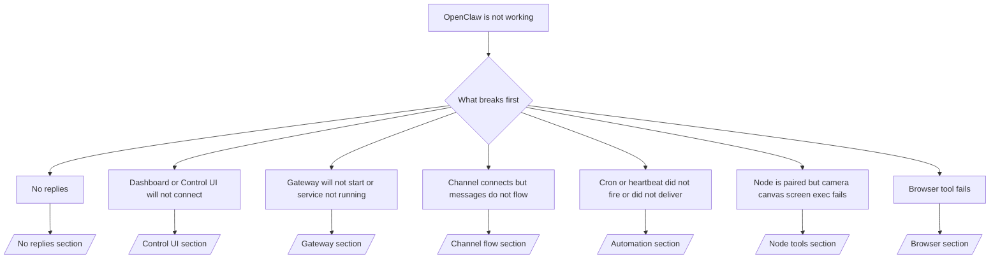

---
read_when:
    - OpenClaw werkt niet en je hebt de snelste weg naar een oplossing nodig
    - Je wilt een triageflow voordat je je verdiept in uitgebreide runbooks
summary: Symptoomgericht probleemoplossingscentrum voor OpenClaw
title: Algemene probleemoplossing
x-i18n:
    generated_at: "2026-04-29T22:51:40Z"
    model: gpt-5.5
    provider: openai
    source_hash: c832c3f7609c56a5461515ed0f693d2255310bf2d3958f69f57c482bcbef97f0
    source_path: help/troubleshooting.md
    workflow: 16
---

Als je slechts 2 minuten hebt, gebruik deze pagina dan als triage-ingang.

## Eerste 60 seconden

Voer deze exacte ladder in volgorde uit:

```bash
openclaw status
openclaw status --all
openclaw gateway probe
openclaw gateway status
openclaw doctor
openclaw channels status --probe
openclaw logs --follow
```

Goede uitvoer in één regel:

- `openclaw status` → toont geconfigureerde kanalen en geen duidelijke authenticatiefouten.
- `openclaw status --all` → volledig rapport is aanwezig en deelbaar.
- `openclaw gateway probe` → het verwachte gateway-doel is bereikbaar (`Reachable: yes`). `Capability: ...` vertelt welk authenticatieniveau de probe kon aantonen, en `Read probe: limited - missing scope: operator.read` is beperkte diagnostiek, geen verbindingsfout.
- `openclaw gateway status` → `Runtime: running`, `Connectivity probe: ok` en een plausibele regel `Capability: ...`. Gebruik `--require-rpc` als je ook RPC-bewijs voor lees-scope nodig hebt.
- `openclaw doctor` → geen blokkerende configuratie- of servicefouten.
- `openclaw channels status --probe` → bereikbare Gateway geeft live transportstatus per account terug plus probe-/auditresultaten zoals `works` of `audit ok`; als de Gateway onbereikbaar is, valt de opdracht terug op samenvattingen op basis van alleen configuratie.
- `openclaw logs --follow` → stabiele activiteit, geen herhaalde fatale fouten.

## Anthropic lange context 429

Als je dit ziet:
`HTTP 429: rate_limit_error: Extra usage is required for long context requests`,
ga dan naar [/gateway/troubleshooting#anthropic-429-extra-usage-required-for-long-context](/nl/gateway/troubleshooting#anthropic-429-extra-usage-required-for-long-context).

## Lokale OpenAI-compatibele backend werkt direct maar faalt in OpenClaw

Als je lokale of zelf gehoste `/v1`-backend kleine directe
`/v1/chat/completions`-probes beantwoordt maar faalt bij `openclaw infer model run` of normale
agent-beurten:

1. Als de fout meldt dat `messages[].content` een string verwacht, stel dan
   `models.providers.<provider>.models[].compat.requiresStringContent: true` in.
2. Als de backend nog steeds alleen bij OpenClaw-agentbeurten faalt, stel dan
   `models.providers.<provider>.models[].compat.supportsTools: false` in en probeer opnieuw.
3. Als kleine directe aanroepen nog steeds werken maar grotere OpenClaw-prompts de
   backend laten crashen, behandel het resterende probleem dan als een beperking van het upstreammodel of de upstreamserver en
   ga verder in het uitgebreide runbook:
   [/gateway/troubleshooting#local-openai-compatible-backend-passes-direct-probes-but-agent-runs-fail](/nl/gateway/troubleshooting#local-openai-compatible-backend-passes-direct-probes-but-agent-runs-fail)

## Plugin-installatie faalt met ontbrekende openclaw-extensies

Als installatie faalt met `package.json missing openclaw.extensions`, gebruikt het Plugin-pakket
een oude vorm die OpenClaw niet langer accepteert.

Los dit op in het Plugin-pakket:

1. Voeg `openclaw.extensions` toe aan `package.json`.
2. Laat vermeldingen verwijzen naar gebouwde runtimebestanden (meestal `./dist/index.js`).
3. Publiceer de Plugin opnieuw en voer `openclaw plugins install <package>` opnieuw uit.

Voorbeeld:

```json
{
  "name": "@openclaw/my-plugin",
  "version": "1.2.3",
  "openclaw": {
    "extensions": ["./dist/index.js"]
  }
}
```

Referentie: [Plugin-architectuur](/nl/plugins/architecture)

## Beslisboom



<AccordionGroup>
  <Accordion title="Geen antwoorden">
    ```bash
    openclaw status
    openclaw gateway status
    openclaw channels status --probe
    openclaw pairing list --channel <channel> [--account <id>]
    openclaw logs --follow
    ```

    Goede uitvoer ziet er zo uit:

    - `Runtime: running`
    - `Connectivity probe: ok`
    - `Capability: read-only`, `write-capable` of `admin-capable`
    - Je kanaal toont dat het transport verbonden is en, waar ondersteund, `works` of `audit ok` in `channels status --probe`
    - Afzender lijkt goedgekeurd (of DM-beleid is open/allowlist)

    Veelvoorkomende logsignaturen:

    - `drop guild message (mention required` → mention-gating blokkeerde het bericht in Discord.
    - `pairing request` → afzender is niet goedgekeurd en wacht op goedkeuring voor DM-koppeling.
    - `blocked` / `allowlist` in kanaallogs → afzender, ruimte of groep wordt gefilterd.

    Uitgebreide pagina's:

    - [/gateway/troubleshooting#no-replies](/nl/gateway/troubleshooting#no-replies)
    - [/channels/troubleshooting](/nl/channels/troubleshooting)
    - [/channels/pairing](/nl/channels/pairing)

  </Accordion>

  <Accordion title="Dashboard of Control UI maakt geen verbinding">
    ```bash
    openclaw status
    openclaw gateway status
    openclaw logs --follow
    openclaw doctor
    openclaw channels status --probe
    ```

    Goede uitvoer ziet er zo uit:

    - `Dashboard: http://...` wordt weergegeven in `openclaw gateway status`
    - `Connectivity probe: ok`
    - `Capability: read-only`, `write-capable` of `admin-capable`
    - Geen authenticatielus in logs

    Veelvoorkomende logsignaturen:

    - `device identity required` → HTTP-/niet-beveiligde context kan apparaat-authenticatie niet voltooien.
    - `origin not allowed` → browser-`Origin` is niet toegestaan voor het Gateway-doel van de Control UI.
    - `AUTH_TOKEN_MISMATCH` met retry-hints (`canRetryWithDeviceToken=true`) → één vertrouwde retry met apparaattoken kan automatisch plaatsvinden.
    - Die retry met gecachte token hergebruikt de gecachte scopeset die bij de gekoppelde
      apparaattoken is opgeslagen. Aanroepers met expliciete `deviceToken` / expliciete `scopes` behouden
      in plaats daarvan hun aangevraagde scopeset.
    - Op het async Tailscale Serve Control UI-pad worden mislukte pogingen voor dezelfde
      `{scope, ip}` geserialiseerd voordat de limiter de fout registreert, waardoor een
      tweede gelijktijdige slechte retry al `retry later` kan tonen.
    - `too many failed authentication attempts (retry later)` vanuit een localhost
      browser-origin → herhaalde fouten vanaf dezelfde `Origin` worden tijdelijk
      uitgesloten; een andere localhost-origin gebruikt een aparte bucket.
    - herhaalde `unauthorized` na die retry → verkeerde token/wachtwoord, mismatch in authenticatiemodus of verlopen gekoppelde apparaattoken.
    - `gateway connect failed:` → UI gebruikt de verkeerde URL/poort of een onbereikbare Gateway.

    Uitgebreide pagina's:

    - [/gateway/troubleshooting#dashboard-control-ui-connectivity](/nl/gateway/troubleshooting#dashboard-control-ui-connectivity)
    - [/web/control-ui](/nl/web/control-ui)
    - [/gateway/authentication](/nl/gateway/authentication)

  </Accordion>

  <Accordion title="Gateway start niet of service is geïnstalleerd maar draait niet">
    ```bash
    openclaw status
    openclaw gateway status
    openclaw logs --follow
    openclaw doctor
    openclaw channels status --probe
    ```

    Goede uitvoer ziet er zo uit:

    - `Service: ... (loaded)`
    - `Runtime: running`
    - `Connectivity probe: ok`
    - `Capability: read-only`, `write-capable` of `admin-capable`

    Veelvoorkomende logsignaturen:

    - `Gateway start blocked: set gateway.mode=local` of `existing config is missing gateway.mode` → Gateway-modus is remote, of het configuratiebestand mist de local-mode-stempel en moet worden gerepareerd.
    - `refusing to bind gateway ... without auth` → non-loopback-bind zonder geldig Gateway-authenticatiepad (token/wachtwoord, of trusted-proxy waar geconfigureerd).
    - `another gateway instance is already listening` of `EADDRINUSE` → poort is al in gebruik.

    Uitgebreide pagina's:

    - [/gateway/troubleshooting#gateway-service-not-running](/nl/gateway/troubleshooting#gateway-service-not-running)
    - [/gateway/background-process](/nl/gateway/background-process)
    - [/gateway/configuration](/nl/gateway/configuration)

  </Accordion>

  <Accordion title="Kanaal maakt verbinding maar berichten stromen niet door">
    ```bash
    openclaw status
    openclaw gateway status
    openclaw logs --follow
    openclaw doctor
    openclaw channels status --probe
    ```

    Goede uitvoer ziet er zo uit:

    - Kanaaltransport is verbonden.
    - Pairing-/allowlist-controles slagen.
    - Vermeldingen worden gedetecteerd waar vereist.

    Veelvoorkomende logsignaturen:

    - `mention required` → groepsmention-gating blokkeerde verwerking.
    - `pairing` / `pending` → DM-afzender is nog niet goedgekeurd.
    - `not_in_channel`, `missing_scope`, `Forbidden`, `401/403` → probleem met kanaalpermissietoken.

    Uitgebreide pagina's:

    - [/gateway/troubleshooting#channel-connected-messages-not-flowing](/nl/gateway/troubleshooting#channel-connected-messages-not-flowing)
    - [/channels/troubleshooting](/nl/channels/troubleshooting)

  </Accordion>

  <Accordion title="Cron of Heartbeat is niet gestart of niet afgeleverd">
    ```bash
    openclaw status
    openclaw gateway status
    openclaw cron status
    openclaw cron list
    openclaw cron runs --id <jobId> --limit 20
    openclaw logs --follow
    ```

    Goede uitvoer ziet er zo uit:

    - `cron.status` toont ingeschakeld met een volgende wake.
    - `cron runs` toont recente `ok`-vermeldingen.
    - Heartbeat is ingeschakeld en valt niet buiten actieve uren.

    Veelvoorkomende logsignaturen:

    - `cron: scheduler disabled; jobs will not run automatically` → Cron is uitgeschakeld.
    - `heartbeat skipped` met `reason=quiet-hours` → buiten geconfigureerde actieve uren.
    - `heartbeat skipped` met `reason=empty-heartbeat-file` → `HEARTBEAT.md` bestaat maar bevat alleen lege scaffolding of scaffolding met alleen koppen.
    - `heartbeat skipped` met `reason=no-tasks-due` → `HEARTBEAT.md`-taakmodus is actief maar geen van de taakintervallen is al aan de beurt.
    - `heartbeat skipped` met `reason=alerts-disabled` → alle zichtbaarheid van Heartbeat is uitgeschakeld (`showOk`, `showAlerts` en `useIndicator` staan allemaal uit).
    - `requests-in-flight` → hoofdlane bezig; Heartbeat-wake is uitgesteld.
    - `unknown accountId` → doelaccount voor Heartbeat-levering bestaat niet.

    Uitgebreide pagina's:

    - [/gateway/troubleshooting#cron-and-heartbeat-delivery](/nl/gateway/troubleshooting#cron-and-heartbeat-delivery)
    - [/automation/cron-jobs#troubleshooting](/nl/automation/cron-jobs#troubleshooting)
    - [/gateway/heartbeat](/nl/gateway/heartbeat)

  </Accordion>

  <Accordion title="Node is gekoppeld maar tool faalt voor camera canvas screen exec">
    ```bash
    openclaw status
    openclaw gateway status
    openclaw nodes status
    openclaw nodes describe --node <idOrNameOrIp>
    openclaw logs --follow
    ```

    Goede uitvoer ziet er zo uit:

    - Node wordt vermeld als verbonden en gekoppeld voor rol `node`.
    - Capability bestaat voor de opdracht die je aanroept.
    - Permissiestatus is verleend voor de tool.

    Veelvoorkomende logsignaturen:

    - `NODE_BACKGROUND_UNAVAILABLE` → breng de Node-app naar de voorgrond.
    - `*_PERMISSION_REQUIRED` → OS-permissie is geweigerd/ontbreekt.
    - `SYSTEM_RUN_DENIED: approval required` → exec-goedkeuring is in behandeling.
    - `SYSTEM_RUN_DENIED: allowlist miss` → opdracht staat niet op exec-allowlist.

    Uitgebreide pagina's:

    - [/gateway/troubleshooting#node-paired-tool-fails](/nl/gateway/troubleshooting#node-paired-tool-fails)
    - [/nodes/troubleshooting](/nl/nodes/troubleshooting)
    - [/tools/exec-approvals](/nl/tools/exec-approvals)

  </Accordion>

  <Accordion title="Exec vraagt plots om goedkeuring">
    ```bash
    openclaw config get tools.exec.host
    openclaw config get tools.exec.security
    openclaw config get tools.exec.ask
    openclaw gateway restart
    ```

    Wat is gewijzigd:

    - Als `tools.exec.host` niet is ingesteld, is de standaardwaarde `auto`.
    - `host=auto` wordt omgezet naar `sandbox` wanneer een sandboxruntime actief is, anders naar `gateway`.
    - `host=auto` is alleen routering; het promptloze "YOLO"-gedrag komt van `security=full` plus `ask=off` op gateway/node.
    - Op `gateway` en `node` is de standaardwaarde voor niet-ingestelde `tools.exec.security` `full`.
    - De standaardwaarde voor niet-ingestelde `tools.exec.ask` is `off`.
    - Resultaat: als je goedkeuringen ziet, heeft een hostlokaal of sessiespecifiek beleid exec strenger gemaakt dan de huidige standaardwaarden.

    Herstel het huidige standaardgedrag zonder goedkeuring:

    ```bash
    openclaw config set tools.exec.host gateway
    openclaw config set tools.exec.security full
    openclaw config set tools.exec.ask off
    openclaw gateway restart
    ```

    Veiligere alternatieven:

    - Stel alleen `tools.exec.host=gateway` in als je alleen stabiele hostroutering wilt.
    - Gebruik `security=allowlist` met `ask=on-miss` als je host-exec wilt maar nog steeds beoordeling wilt bij allowlist-misses.
    - Schakel sandboxmodus in als je wilt dat `host=auto` weer naar `sandbox` wordt omgezet.

    Veelvoorkomende logsignaturen:

    - `Approval required.` → opdracht wacht op `/approve ...`.
    - `SYSTEM_RUN_DENIED: approval required` → goedkeuring voor node-host-exec is in behandeling.
    - `exec host=sandbox requires a sandbox runtime for this session` → impliciete/expliciete sandboxselectie, maar sandboxmodus staat uit.

    Diepgaande pagina's:

    - [/tools/exec](/nl/tools/exec)
    - [/tools/exec-approvals](/nl/tools/exec-approvals)
    - [/gateway/security#what-the-audit-checks-high-level](/nl/gateway/security#what-the-audit-checks-high-level)

  </Accordion>

  <Accordion title="Browsertool mislukt">
    ```bash
    openclaw status
    openclaw gateway status
    openclaw browser status
    openclaw logs --follow
    openclaw doctor
    ```

    Goede uitvoer ziet er zo uit:

    - Browserstatus toont `running: true` en een gekozen browser/profiel.
    - `openclaw` start, of `user` kan lokale Chrome-tabbladen zien.

    Veelvoorkomende logsignaturen:

    - `unknown command "browser"` of `unknown command 'browser'` → `plugins.allow` is ingesteld en bevat `browser` niet.
    - `Failed to start Chrome CDP on port` → starten van lokale browser is mislukt.
    - `browser.executablePath not found` → geconfigureerd binair pad is onjuist.
    - `browser.cdpUrl must be http(s) or ws(s)` → de geconfigureerde CDP-URL gebruikt een niet-ondersteund schema.
    - `browser.cdpUrl has invalid port` → de geconfigureerde CDP-URL heeft een ongeldige poort of een poort buiten het bereik.
    - `No Chrome tabs found for profile="user"` → het Chrome MCP-koppelprofiel heeft geen geopende lokale Chrome-tabbladen.
    - `Remote CDP for profile "<name>" is not reachable` → het geconfigureerde externe CDP-eindpunt is niet bereikbaar vanaf deze host.
    - `Browser attachOnly is enabled ... not reachable` of `Browser attachOnly is enabled and CDP websocket ... is not reachable` → attach-only-profiel heeft geen live CDP-doel.
    - verouderde viewport-/donkere-modus-/locale-/offline-overschrijvingen op attach-only- of externe CDP-profielen → voer `openclaw browser stop --browser-profile <name>` uit om de actieve controlesessie te sluiten en de emulatiestatus vrij te geven zonder de gateway opnieuw te starten.

    Diepgaande pagina's:

    - [/gateway/troubleshooting#browser-tool-fails](/nl/gateway/troubleshooting#browser-tool-fails)
    - [/tools/browser#missing-browser-command-or-tool](/nl/tools/browser#missing-browser-command-or-tool)
    - [/tools/browser-linux-troubleshooting](/nl/tools/browser-linux-troubleshooting)
    - [/tools/browser-wsl2-windows-remote-cdp-troubleshooting](/nl/tools/browser-wsl2-windows-remote-cdp-troubleshooting)

  </Accordion>

</AccordionGroup>

## Gerelateerd

- [FAQ](/nl/help/faq) — veelgestelde vragen
- [Gateway-probleemoplossing](/nl/gateway/troubleshooting) — gateway-specifieke problemen
- [Doctor](/nl/gateway/doctor) — geautomatiseerde gezondheidscontroles en reparaties
- [Kanaalprobleemoplossing](/nl/channels/troubleshooting) — problemen met kanaalconnectiviteit
- [Automatiseringsprobleemoplossing](/nl/automation/cron-jobs#troubleshooting) — problemen met cron en heartbeat
