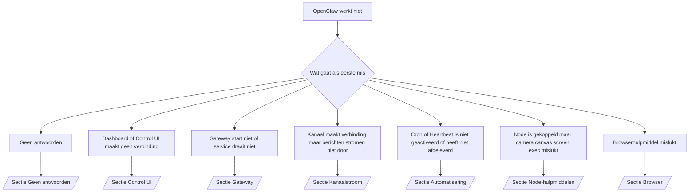

---
read_when:
    - OpenClaw werkt niet en je hebt de snelste weg naar een oplossing nodig
    - Je wilt een triageproces voordat je in diepgaande draaiboeken duikt
summary: Probleemoplossingscentrum voor OpenClaw, op basis van symptomen
title: Algemene probleemoplossing
x-i18n:
    generated_at: "2026-07-12T09:01:45Z"
    model: gpt-5.6
    postprocess_version: locale-links-v1
    provider: openai
    source_hash: db50e0cdf4d11f3aa6196be445358d904a2b9c40c89243f1b124c77167f6dd85
    source_path: help/troubleshooting.md
    workflow: 16
---

Ingang voor triage. Binnen 2 minuten een diagnose, ga daarna naar de verdiepende pagina.

## Eerste 60 seconden

Voer deze reeks in de aangegeven volgorde uit:

```bash
openclaw status
openclaw status --all
openclaw gateway probe
openclaw gateway status
openclaw doctor
openclaw channels status --probe
openclaw logs --follow
```

Goede uitvoer, één regel per opdracht:

- `openclaw status` toont geconfigureerde kanalen zonder authenticatiefouten.
- `openclaw status --all` produceert een volledig, deelbaar rapport.
- `openclaw gateway probe` toont `Reachable: yes`. `Capability: ...` is het
  authenticatieniveau dat door de probe is aangetoond; `Read probe: limited - missing scope:
operator.read` duidt op beperkte diagnostiek, niet op een verbindingsfout.
- `openclaw gateway status` toont `Runtime: running`, `Connectivity probe:
ok` en een aannemelijke `Capability: ...`. Voeg `--require-rpc` toe om ook
  RPC-bewijs voor leesbereik te vereisen.
- `openclaw doctor` meldt geen blokkerende configuratie- of servicefouten.
- `openclaw channels status --probe` retourneert de actuele transportstatus per account
  (`works` / `audit ok`) wanneer de Gateway bereikbaar is; anders wordt
  teruggevallen op samenvattingen die alleen op de configuratie zijn gebaseerd.
- `openclaw logs --follow` toont gestage activiteit zonder terugkerende fatale fouten.

## Assistent voelt beperkt aan of mist hulpmiddelen

Controleer het effectieve hulpmiddelenprofiel:

```bash
openclaw status
openclaw status --all
openclaw doctor
```

Veelvoorkomende oorzaken:

- `tools.profile: "minimal"` staat alleen `session_status` toe.
- `tools.profile: "messaging"` is beperkt en bedoeld voor agents die alleen chatten.
- `tools.profile: "coding"` is de standaard voor nieuwe lokale configuraties (werk aan repository,
  bestanden, shell en runtime).
- `tools.profile: "full"` verwijdert profielbeperkingen; beperk dit tot vertrouwde
  agents die door de operator worden beheerd.
- `agents.list[].tools` per agent overschrijft het hoofdprofiel om dit voor één agent
  te beperken of uit te breiden.

Wijzig het profiel, start de Gateway opnieuw of laad deze opnieuw en controleer daarna opnieuw met
`openclaw status --all`. Volledige profiel-/groepentabel: [Hulpmiddelenprofielen](/nl/gateway/config-tools#tool-profiles).

## Anthropic 429 bij lange context

`HTTP 429: rate_limit_error: Extra usage is required for long context requests`
→ [Voor lange context is extra Anthropic-gebruik vereist bij fout 429](/nl/gateway/troubleshooting#anthropic-429-extra-usage-required-for-long-context).

## Lokale OpenAI-compatibele backend werkt rechtstreeks, maar mislukt in OpenClaw

Uw lokale/zelfgehoste `/v1`-backend beantwoordt rechtstreekse probes naar `/v1/chat/completions`,
maar mislukt bij `openclaw infer model run` of normale agentbeurten:

1. Als de fout vermeldt dat `messages[].content` een tekenreeks verwacht: stel
   `models.providers.<provider>.models[].compat.requiresStringContent: true` in.
2. Als het nog steeds alleen bij agentbeurten van OpenClaw mislukt: stel
   `models.providers.<provider>.models[].compat.supportsTools: false` in en probeer het opnieuw.
3. Als kleine rechtstreekse aanroepen werken, maar grotere prompts van OpenClaw de backend laten vastlopen:
   dit is een beperking van het bovenliggende model/de server, geen fout in OpenClaw. Ga verder in
   [Lokale OpenAI-compatibele backend slaagt voor rechtstreekse probes, maar agentuitvoeringen mislukken](/nl/gateway/troubleshooting#local-openai-compatible-backend-passes-direct-probes-but-agent-runs-fail).

## Installatie van Plugin mislukt door ontbrekende openclaw-extensies

`package.json missing openclaw.extensions` betekent dat het pluginpakket een
structuur gebruikt die OpenClaw niet meer accepteert.

Los dit op in het pluginpakket:

1. Voeg `openclaw.extensions` toe aan `package.json` en laat dit verwijzen naar gebouwde runtimebestanden
   (meestal `./dist/index.js`).
2. Publiceer opnieuw en voer daarna nogmaals `openclaw plugins install <package>` uit.

```json
{
  "name": "@openclaw/my-plugin",
  "version": "1.2.3",
  "openclaw": {
    "extensions": ["./dist/index.js"]
  }
}
```

Referentie: [Pluginarchitectuur](/nl/plugins/architecture)

## Installatiebeleid blokkeert installaties of updates van plugins

De update wordt voltooid, maar plugins zijn verouderd, uitgeschakeld of tonen `blocked by install
policy`, `install policy failed closed` of `Disabled "<plugin>" after plugin
update failure`: controleer `security.installPolicy`.

Het installatiebeleid wordt uitgevoerd bij installaties en updates van plugins. Versies van plugins
onder `@openclaw/*` veranderen normaal gesproken mee met de OpenClaw-release, waardoor een OpenClaw-update
tijdens de synchronisatie na de update een bijpassende pluginupdate kan vereisen.

Vermijd deze beleidsvormen, tenzij u ook de bijpassende upgraderegel onderhoudt:

- Plugins van OpenClaw vastzetten op één specifieke oude versie (bijvoorbeeld alleen
  `@openclaw/*@2026.5.3`).
- Alleen op basis van het brontype blokkeren (elk npm-, netwerk- of `request.mode:
"update"`-verzoek).
- De beleidsopdracht als optioneel behandelen: wanneer `security.installPolicy` is
  ingeschakeld, zorgt een ontbrekend, traag, onleesbaar of door machtigingen geblokkeerd
  uitvoerbaar beleidsbestand ervoor dat het systeem uit veiligheidsoverwegingen blokkeert.
- Versies goedkeuren zonder de `openclawVersion` van het verzoek te vergelijken met
  de metagegevens van de kandidaat-plugin.

Geef de voorkeur aan regels die vertrouwde updates van `@openclaw/*` toestaan wanneer deze compatibel zijn met
de huidige host, in plaats van één release voor altijd vast te zetten. Als u npm
standaard blokkeert, voegt u een beperkte uitzondering toe voor de plugin-id's die u gebruikt en past u dezelfde
vertrouwensregel toe op `request.mode: "update"` als op installaties.

Herstel:

```bash
openclaw doctor --deep
openclaw plugins update --all
openclaw status --all
```

Als het beleid bewust streng is, versoepelt u het tijdens het vertrouwde
upgradevenster, voert u `openclaw plugins update --all` opnieuw uit en herstelt u daarna de strengere regel.
Als een mislukte update een plugin heeft uitgeschakeld, inspecteert u deze voordat u hem opnieuw inschakelt:

```bash
openclaw plugins inspect <plugin-id> --runtime --json
openclaw plugins enable <plugin-id>
```

Referentie: [Installatiebeleid voor operators](/nl/tools/skills-config#operator-install-policy-securityinstallpolicy)

## Plugin aanwezig, maar geblokkeerd wegens verdacht eigendom

Waarschuwingen van `openclaw doctor`, de installatie of het opstarten tonen:

```text
blocked plugin candidate: suspicious ownership (... uid=1000, expected uid=0 or root)
plugin present but blocked
```

De pluginbestanden zijn eigendom van een andere Unix-gebruiker dan het proces dat
ze laadt. Verwijder de pluginconfiguratie niet; corrigeer het bestandseigendom of voer
OpenClaw uit als de gebruiker die eigenaar is van de statusmap.

Docker-installaties worden uitgevoerd als `node` (uid `1000`). Herstel de bindmounts van de host:

```bash
sudo chown -R 1000:1000 /path/to/openclaw-config /path/to/openclaw-workspace
openclaw doctor --fix
```

Als u OpenClaw bewust als root uitvoert, herstelt u in plaats daarvan
de beheerde hoofdmap voor plugins:

```bash
sudo chown -R root:root /path/to/openclaw-config/npm
openclaw doctor --fix
```

Verdiepende documentatie: [Geblokkeerd eigendom van pluginpad](/nl/tools/plugin#blocked-plugin-path-ownership), [Docker: machtigingen en EACCES](/nl/install/docker#shell-helpers-optional)

## Beslisboom



<AccordionGroup>
  <Accordion title="Geen antwoorden">
    ```bash
    openclaw status
    openclaw gateway status
    openclaw channels status --probe
    openclaw pairing list --channel <channel> [--account <id>]
    openclaw logs --follow
    ```

    Goede uitvoer:

    - `Runtime: running`
    - `Connectivity probe: ok`
    - `Capability: read-only`, `write-capable` of `admin-capable`
    - Kanaal toont dat het transport is verbonden en, waar ondersteund, `works` of
      `audit ok` in `channels status --probe`
    - Afzender is goedgekeurd (of het DM-beleid is open/toelatingslijst)

    Logboekpatronen:

    - `drop guild message (mention required` → Discord-vermeldingscontrole heeft het bericht geblokkeerd.
    - `pairing request` → afzender niet goedgekeurd; wacht op goedkeuring van DM-koppeling.
    - `blocked` / `allowlist` in kanaallogboeken → afzender, ruimte of groep is uitgefilterd.

    Verdiepende pagina's: [Geen antwoorden](/nl/gateway/troubleshooting#no-replies), [Problemen met kanalen oplossen](/nl/channels/troubleshooting), [Koppelen](/nl/channels/pairing)

  </Accordion>

  <Accordion title="Dashboard of Control UI maakt geen verbinding">
    ```bash
    openclaw status
    openclaw gateway status
    openclaw logs --follow
    openclaw doctor
    openclaw channels status --probe
    ```

    Goede uitvoer:

    - `Dashboard: http://...` wordt getoond in `openclaw gateway status`
    - `Connectivity probe: ok`
    - `Capability: read-only`, `write-capable` of `admin-capable`
    - Geen authenticatielus in de logboeken

    Logboekpatronen:

    - `device identity required` → HTTP/niet-beveiligde context kan apparaatauthenticatie niet voltooien.
    - `origin not allowed` → browser-`Origin` is niet toegestaan voor het Gateway-doel van de Control UI.
    - `AUTH_TOKEN_MISMATCH` met `canRetryWithDeviceToken=true` → één nieuwe poging met een vertrouwd apparaattoken kan automatisch plaatsvinden, waarbij de in het cachegeheugen opgeslagen bereiken van het gekoppelde token opnieuw worden gebruikt.
    - herhaaldelijk `unauthorized` na die nieuwe poging → verkeerd token/wachtwoord, niet-overeenkomende authenticatiemodus of verouderd token van gekoppeld apparaat.
    - `too many failed authentication attempts (retry later)` → herhaalde mislukkingen vanuit die browser-`Origin` zijn tijdelijk geblokkeerd; andere localhost-origins gebruiken afzonderlijke categorieën. Zie [Connectiviteit van Dashboard/Control UI](/nl/gateway/troubleshooting#dashboard-control-ui-connectivity) voor de nuance rond gelijktijdige nieuwe pogingen met Tailscale Serve.
    - `gateway connect failed:` → UI is gericht op de verkeerde URL/poort of de Gateway is onbereikbaar.

    Verdiepende pagina's: [Connectiviteit van Dashboard/Control UI](/nl/gateway/troubleshooting#dashboard-control-ui-connectivity), [Control UI](/nl/web/control-ui), [Authenticatie](/nl/gateway/authentication)

  </Accordion>

  <Accordion title="Gateway start niet of service is geïnstalleerd maar draait niet">
    ```bash
    openclaw status
    openclaw gateway status
    openclaw logs --follow
    openclaw doctor
    openclaw channels status --probe
    ```

    Goede uitvoer:

    - `Service: ... (loaded)`
    - `Runtime: running`
    - `Connectivity probe: ok`
    - `Capability: read-only`, `write-capable` of `admin-capable`

    Logboekpatronen:

    - `Gateway start blocked: set gateway.mode=local` of `existing config is missing gateway.mode` → de Gateway-modus is extern of de configuratie mist de markering voor lokale modus en moet worden hersteld.
    - `refusing to bind gateway ... without auth` → binding buiten local loopback zonder geldig authenticatiepad (token/wachtwoord of vertrouwde proxy indien geconfigureerd).
    - `another gateway instance is already listening` of `EADDRINUSE` → de poort is al in gebruik.

    Verdiepende pagina's: [Gateway-service draait niet](/nl/gateway/troubleshooting#gateway-service-not-running), [Achtergrondproces](/nl/gateway/background-process), [Configuratie](/nl/gateway/configuration)

  </Accordion>

  <Accordion title="Kanaal maakt verbinding, maar berichten stromen niet door">
    ```bash
    openclaw status
    openclaw gateway status
    openclaw logs --follow
    openclaw doctor
    openclaw channels status --probe
    ```

    Goede uitvoer:

    - Kanaaltransport is verbonden.
    - Controles voor koppeling/toelatingslijst slagen.
    - Vermeldingen worden gedetecteerd waar dat vereist is.

    Logboekpatronen:

    - `mention required` → controle op groepsvermeldingen heeft de verwerking geblokkeerd.
    - `pairing` / `pending` → DM-afzender is nog niet goedgekeurd.
    - `not_in_channel`, `missing_scope`, `Forbidden`, `401/403` → probleem met het machtigingstoken van het kanaal.

    Verdiepende pagina's: [Kanaal verbonden, berichten stromen niet door](/nl/gateway/troubleshooting#channel-connected-messages-not-flowing), [Problemen met kanalen oplossen](/nl/channels/troubleshooting)

  </Accordion>

  <Accordion title="Cron of Heartbeat is niet geactiveerd of heeft niet afgeleverd">
    ```bash
    openclaw status
    openclaw gateway status
    openclaw cron status
    openclaw cron list
    openclaw cron runs --id <jobId> --limit 20
    openclaw logs --follow
    ```

    Goede uitvoer:

    - `cron status` toont dat de planner is ingeschakeld en wanneer deze de volgende keer wordt geactiveerd.
    - `cron runs` toont recente vermeldingen met `ok`.
    - Heartbeat is ingeschakeld en bevindt zich binnen de actieve uren.

    Logboekpatronen:

    - `cron: scheduler disabled; jobs will not run automatically` → cron is uitgeschakeld.
    - `heartbeat skipped` reden `quiet-hours` → buiten de geconfigureerde actieve uren.
    - `heartbeat skipped` reden `empty-heartbeat-file` → `HEARTBEAT.md` bestaat, maar bevat alleen lege regels, opmerkingen, koppen, fences of een lege checkliststructuur.
    - `heartbeat skipped` reden `no-tasks-due` → taakmodus is actief, maar er is nog geen taakinterval verstreken.
    - `heartbeat skipped` reden `alerts-disabled` → `showOk`, `showAlerts` en `useIndicator` zijn allemaal uitgeschakeld.
    - `requests-in-flight` → hoofdlane is bezet; Heartbeat-activering is uitgesteld.
    - `unknown accountId` → het doelaccount voor Heartbeat-bezorging bestaat niet.

    Verdiepende pagina's: [Cron- en Heartbeat-bezorging](/nl/gateway/troubleshooting#cron-and-heartbeat-delivery), [Geplande taken: probleemoplossing](/nl/automation/cron-jobs#troubleshooting), [Heartbeat](/nl/gateway/heartbeat)

  </Accordion>

  <Accordion title="Node is gekoppeld, maar de tool voor camera, canvas, scherm of exec werkt niet">
    ```bash
    openclaw status
    openclaw gateway status
    openclaw nodes status
    openclaw nodes describe --node <idOrNameOrIp>
    openclaw logs --follow
    ```

    Goede uitvoer:

    - Node wordt vermeld als verbonden en gekoppeld voor de rol `node`.
    - De mogelijkheid bestaat voor de opdracht die u uitvoert.
    - De machtigingsstatus voor de tool is toegekend.

    Logpatronen:

    - `NODE_BACKGROUND_UNAVAILABLE` → breng de Node-app naar de voorgrond.
    - `*_PERMISSION_REQUIRED` → machtiging van het besturingssysteem is geweigerd of ontbreekt.
    - `SYSTEM_RUN_DENIED: approval required` → goedkeuring voor exec is in behandeling.
    - `SYSTEM_RUN_DENIED: allowlist miss` → opdracht staat niet op de exec-toestaanlijst.

    Verdiepende pagina's: [Node gekoppeld, tool werkt niet](/nl/gateway/troubleshooting#node-paired-tool-fails), [Probleemoplossing voor Node](/nl/nodes/troubleshooting), [Exec-goedkeuringen](/nl/tools/exec-approvals)

  </Accordion>

  <Accordion title="Exec vraagt plotseling om goedkeuring">
    ```bash
    openclaw config get tools.exec.host
    openclaw config get tools.exec.security
    openclaw config get tools.exec.ask
    openclaw gateway restart
    ```

    Wat er is gewijzigd:

    - Een niet-ingestelde `tools.exec.host` gebruikt standaard `auto`, wat wordt omgezet naar `sandbox`
      wanneer een sandbox-runtime actief is, en anders naar `gateway`.
    - `host=auto` bepaalt alleen de routering; het gedrag zonder prompt komt van
      `security=full` in combinatie met `ask=off` op Gateway/Node.
    - Een niet-ingestelde `tools.exec.security` gebruikt standaard `full` op `gateway`/`node`.
    - Een niet-ingestelde `tools.exec.ask` gebruikt standaard `off`.
    - Als u goedkeuringsverzoeken ziet, heeft lokaal hostbeleid of beleid per sessie
      exec aangescherpt ten opzichte van deze standaardwaarden.

    Herstel de huidige standaardwaarden zonder goedkeuring:

    ```bash
    openclaw config set tools.exec.host gateway
    openclaw config set tools.exec.security full
    openclaw config set tools.exec.ask off
    openclaw gateway restart
    ```

    Veiligere alternatieven:

    - Stel alleen `tools.exec.host=gateway` in voor stabiele hostroutering.
    - Gebruik `security=allowlist` met `ask=on-miss` voor exec op de host met beoordeling
      wanneer een opdracht niet op de toestaanlijst staat.
    - Schakel de sandboxmodus in, zodat `host=auto` weer naar `sandbox` wordt omgezet.

    Logpatronen:

    - `Approval required.` → opdracht wacht op `/approve ...`.
    - `SYSTEM_RUN_DENIED: approval required` → goedkeuring voor exec op de Node-host is in behandeling.
    - `exec host=sandbox requires a sandbox runtime for this session` → impliciete/expliciete sandboxselectie, maar de sandboxmodus is uitgeschakeld.

    Verdiepende pagina's: [Exec](/nl/tools/exec), [Exec-goedkeuringen](/nl/tools/exec-approvals), [Beveiliging: wat de audit controleert](/nl/gateway/security#what-the-audit-checks-high-level)

  </Accordion>

  <Accordion title="Browsertool werkt niet">
    ```bash
    openclaw status
    openclaw gateway status
    openclaw browser status
    openclaw logs --follow
    openclaw doctor
    ```

    Goede uitvoer:

    - De browserstatus toont `running: true` en een gekozen browser/profiel.
    - Het profiel `openclaw` start, of het profiel `user` ziet lokale Chrome-tabbladen.

    Logpatronen:

    - `unknown command "browser"` → `plugins.allow` is ingesteld en sluit `browser` uit.
    - `Failed to start Chrome CDP on port` → starten van de lokale browser is mislukt.
    - `browser.executablePath not found` → het geconfigureerde pad naar het uitvoerbare bestand is onjuist.
    - `browser.cdpUrl must be http(s) or ws(s)` → de geconfigureerde CDP-URL gebruikt een niet-ondersteund schema.
    - `browser.cdpUrl has invalid port` → de geconfigureerde CDP-URL heeft een ongeldige poort of een poort buiten het toegestane bereik.
    - `No Chrome tabs found for profile="user"` → het Chrome MCP-koppelprofiel heeft geen geopende lokale Chrome-tabbladen.
    - `Remote CDP for profile "<name>" is not reachable` → het geconfigureerde externe CDP-eindpunt is vanaf deze host niet bereikbaar.
    - `Browser attachOnly is enabled ... not reachable` → het profiel dat alleen koppelt, heeft geen actief CDP-doel.
    - Verouderde overschrijvingen voor viewport, donkere modus, landinstelling of offlinemodus op profielen die alleen koppelen of externe CDP-profielen → voer `openclaw browser stop --browser-profile <name>` uit om de besturingssessie te sluiten en de emulatiestatus vrij te geven zonder de Gateway opnieuw te starten.

    Verdiepende pagina's: [Browsertool werkt niet](/nl/gateway/troubleshooting#browser-tool-fails), [Ontbrekende browseropdracht of -tool](/nl/tools/browser#missing-browser-command-or-tool), [Browser: probleemoplossing voor Linux](/nl/tools/browser-linux-troubleshooting), [Browser: probleemoplossing voor externe CDP met WSL2/Windows](/nl/tools/browser-wsl2-windows-remote-cdp-troubleshooting)

  </Accordion>

</AccordionGroup>

## Gerelateerd

- [Veelgestelde vragen](/nl/help/faq) — veelgestelde vragen
- [Probleemoplossing voor Gateway](/nl/gateway/troubleshooting) — Gateway-specifieke problemen
- [Doctor](/nl/gateway/doctor) — geautomatiseerde statuscontroles en reparaties
- [Probleemoplossing voor kanalen](/nl/channels/troubleshooting) — verbindingsproblemen met kanalen
- [Geplande taken: probleemoplossing](/nl/automation/cron-jobs#troubleshooting) — problemen met cron en Heartbeat
