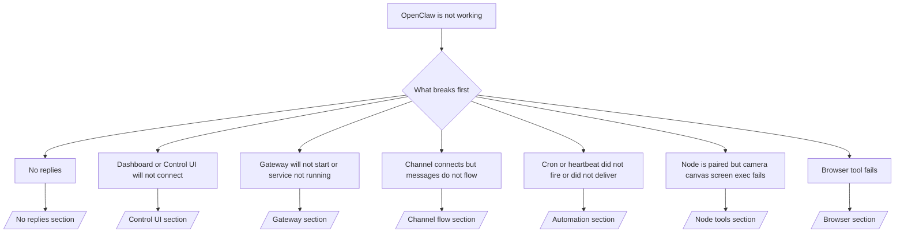

---
read_when:
    - OpenClaw werkt niet en je hebt de snelste weg naar een oplossing nodig
    - Je wilt een triageflow voordat je in diepgaande runbooks duikt
summary: Probleemgericht probleemoplossingscentrum voor OpenClaw
title: Algemene probleemoplossing
x-i18n:
    generated_at: "2026-06-27T17:41:12Z"
    model: gpt-5.5
    postprocess_version: locale-links-v1
    provider: openai
    source_hash: ae1236c73e3a5c9237bd81d603e8dca18c595a8bcbb71f5931bfbf2389b342cd
    source_path: help/troubleshooting.md
    workflow: 16
---

Als je slechts 2 minuten hebt, gebruik deze pagina dan als triage-ingang.

## Eerste 60 seconden

Voer deze exacte ladder in volgorde uit:

```bash
openclaw status
openclaw status --all
openclaw gateway probe
openclaw gateway status
openclaw doctor
openclaw channels status --probe
openclaw logs --follow
```

Goede uitvoer in één regel:

- `openclaw status` → toont geconfigureerde kanalen en geen duidelijke auth-fouten.
- `openclaw status --all` → volledig rapport is aanwezig en deelbaar.
- `openclaw gateway probe` → verwacht Gateway-doel is bereikbaar (`Reachable: yes`). `Capability: ...` vertelt welk auth-niveau de probe kon bewijzen, en `Read probe: limited - missing scope: operator.read` betekent beperkte diagnostiek, geen verbindingsfout.
- `openclaw gateway status` → `Runtime: running`, `Connectivity probe: ok` en een plausibele `Capability: ...`-regel. Gebruik `--require-rpc` als je ook RPC-bewijs met lees-scope nodig hebt.
- `openclaw doctor` → geen blokkerende configuratie- of servicefouten.
- `openclaw channels status --probe` → bereikbare Gateway retourneert live transportstatus per account plus probe-/auditresultaten zoals `works` of `audit ok`; als de Gateway onbereikbaar is, valt de opdracht terug op alleen configuratiesamenvattingen.
- `openclaw logs --follow` → gestage activiteit, geen herhalende fatale fouten.

## Assistent voelt beperkt of mist tools

Als de assistent geen bestanden kan inspecteren, opdrachten kan uitvoeren, browserautomatisering kan gebruiken of verwachte tools niet ziet, controleer dan eerst het effectieve toolprofiel:

```bash
openclaw status
openclaw status --all
openclaw doctor
```

Veelvoorkomende oorzaken:

- `tools.profile: "messaging"` is bewust smal voor agents die alleen chatten.
- `tools.profile: "coding"` is het gebruikelijke profiel voor repository-, bestands-, shell- en runtime-workflows.
- `tools.profile: "full"` stelt de breedste toolset beschikbaar en moet worden beperkt tot vertrouwde, door operators beheerde agents.
- Per-agent-overschrijvingen via `agents.list[].tools` kunnen het rootprofiel voor één agent beperken of uitbreiden.

Wijzig het root- of per-agent-toolprofiel, herstart of herlaad daarna de Gateway en voer `openclaw status --all` opnieuw uit. Zie [Tools](/nl/tools) voor het profielmodel en allow-/deny-overschrijvingen.

## Anthropic lange context 429

Als je dit ziet:
`HTTP 429: rate_limit_error: Extra usage is required for long context requests`,
ga naar [/gateway/troubleshooting#anthropic-429-extra-usage-required-for-long-context](/nl/gateway/troubleshooting#anthropic-429-extra-usage-required-for-long-context).

## Lokale OpenAI-compatibele backend werkt direct maar faalt in OpenClaw

Als je lokale of zelfgehoste `/v1`-backend kleine directe `/v1/chat/completions`-probes beantwoordt maar faalt bij `openclaw infer model run` of normale agentbeurten:

1. Als de fout vermeldt dat `messages[].content` een string verwacht, stel dan `models.providers.<provider>.models[].compat.requiresStringContent: true` in.
2. Als de backend nog steeds alleen faalt bij OpenClaw-agentbeurten, stel dan `models.providers.<provider>.models[].compat.supportsTools: false` in en probeer opnieuw.
3. Als kleine directe aanroepen nog steeds werken maar grotere OpenClaw-prompts de backend laten crashen, behandel het resterende probleem dan als een beperking in het upstream-model of de upstream-server en ga verder in het diepe runbook:
   [/gateway/troubleshooting#local-openai-compatible-backend-passes-direct-probes-but-agent-runs-fail](/nl/gateway/troubleshooting#local-openai-compatible-backend-passes-direct-probes-but-agent-runs-fail)

## Plugin-installatie faalt door ontbrekende openclaw-extensies

Als installatie faalt met `package.json missing openclaw.extensions`, gebruikt het Plugin-pakket een oude vorm die OpenClaw niet langer accepteert.

Oplossing in het Plugin-pakket:

1. Voeg `openclaw.extensions` toe aan `package.json`.
2. Laat vermeldingen wijzen naar gebouwde runtime-bestanden (meestal `./dist/index.js`).
3. Publiceer de Plugin opnieuw en voer `openclaw plugins install <package>` opnieuw uit.

Voorbeeld:

```json
{
  "name": "@openclaw/my-plugin",
  "version": "1.2.3",
  "openclaw": {
    "extensions": ["./dist/index.js"]
  }
}
```

Referentie: [Plugin-architectuur](/nl/plugins/architecture)

## Installatiebeleid blokkeert Plugin-installaties of updates

Als een update is voltooid maar Plugins verouderd of uitgeschakeld zijn, of berichten tonen zoals `blocked by install policy`, `install policy failed closed` of `Disabled "<plugin>" after plugin update failure`, controleer dan `security.installPolicy`.

Installatiebeleid draait bij Plugin-installaties en updates. Door OpenClaw beheerde Plugin-versies bewegen normaal mee met de OpenClaw-release, dus een OpenClaw-update kan tijdens post-update-synchronisatie ook bijpassende `@openclaw/*`-Plugin-updates nodig hebben.

Vermijd deze brede beleidsvormen, tenzij je ook de bijbehorende upgraderegel onderhoudt:

- Door OpenClaw beheerde Plugins vastzetten op één exacte oude versie, zoals alleen `@openclaw/*@2026.5.3` toestaan.
- Alleen blokkeren op brontype, zoals elk npm-, netwerk- of `request.mode: "update"`-Plugin-verzoek.
- De beleidsopdracht als optioneel behandelen. Wanneer `security.installPolicy` is ingeschakeld, faalt een ontbrekend, traag, onleesbaar of door permissies geblokkeerd beleidsuitvoerbaar bestand gesloten.
- Plugin-versies goedkeuren zonder rekening te houden met de `openclawVersion` van het beleidsverzoek en de metadata van de Plugin-kandidaat.

Veiliger beleidsregels staan vertrouwde, door OpenClaw beheerde Plugin-updates toe wanneer de kandidaat compatibel is met de huidige OpenClaw-host, in plaats van voor altijd één release vast te pinnen. Als je npm standaard blokkeert, maak dan een smalle uitzondering voor de vertrouwde `@openclaw/*`-Plugin-pakketten of Plugin-id's die je gebruikt. Als je installatie- en updateverzoeken onderscheidt, pas dan dezelfde vertrouwensregel toe op `request.mode: "update"`.

Herstel:

```bash
openclaw doctor --deep
openclaw plugins update --all
openclaw status --all
```

Als het beleid bewust strikt is, versoepel het dan voor het vertrouwde OpenClaw-upgradevenster, voer `openclaw plugins update --all` opnieuw uit en herstel daarna de striktere regel. Als een Plugin is uitgeschakeld na een updatefout, inspecteer deze en schakel deze pas opnieuw in nadat de update is geslaagd:

```bash
openclaw plugins inspect <plugin-id> --runtime --json
openclaw plugins enable <plugin-id>
```

Referentie: [Operator-installatiebeleid](/nl/tools/skills-config#operator-install-policy-securityinstallpolicy)

## Plugin aanwezig maar geblokkeerd door verdachte eigendom

Als `openclaw doctor`, installatie of opstartwaarschuwingen dit tonen:

```text
blocked plugin candidate: suspicious ownership (... uid=1000, expected uid=0 or root)
plugin present but blocked
```

dan zijn de Plugin-bestanden eigendom van een andere Unix-gebruiker dan het proces dat ze laadt. Verwijder de Plugin-configuratie niet. Herstel het bestandseigendom of voer OpenClaw uit als dezelfde gebruiker die eigenaar is van de state-directory.

Docker-installaties draaien normaal als `node` (uid `1000`). Herstel voor de standaard Docker-installatie de host-bindmounts:

```bash
sudo chown -R 1000:1000 /path/to/openclaw-config /path/to/openclaw-workspace
openclaw doctor --fix
```

Als je OpenClaw bewust als root uitvoert, herstel dan in plaats daarvan de beheerde Plugin-root naar root-eigendom:

```bash
sudo chown -R root:root /path/to/openclaw-config/npm
openclaw doctor --fix
```

Diepere docs:

- [Plugin-padeigendom](/nl/tools/plugin#blocked-plugin-path-ownership)
- [Docker-permissies](/nl/install/docker#permissions-and-eacces)

## Beslisboom



<AccordionGroup>
  <Accordion title="No replies">
    ```bash
    openclaw status
    openclaw gateway status
    openclaw channels status --probe
    openclaw pairing list --channel <channel> [--account <id>]
    openclaw logs --follow
    ```

    Goede uitvoer ziet er zo uit:

    - `Runtime: running`
    - `Connectivity probe: ok`
    - `Capability: read-only`, `write-capable` of `admin-capable`
    - Je kanaal toont dat transport verbonden is en, waar ondersteund, `works` of `audit ok` in `channels status --probe`
    - Afzender lijkt goedgekeurd (of DM-beleid is open/allowlist)

    Veelvoorkomende logsignaturen:

    - `drop guild message (mention required` → mention-gating blokkeerde het bericht in Discord.
    - `pairing request` → afzender is niet goedgekeurd en wacht op goedkeuring voor DM-koppeling.
    - `blocked` / `allowlist` in kanaallogs → afzender, ruimte of groep wordt gefilterd.

    Diepe pagina's:

    - [/gateway/troubleshooting#no-replies](/nl/gateway/troubleshooting#no-replies)
    - [/channels/troubleshooting](/nl/channels/troubleshooting)
    - [/channels/pairing](/nl/channels/pairing)

  </Accordion>

  <Accordion title="Dashboard or Control UI will not connect">
    ```bash
    openclaw status
    openclaw gateway status
    openclaw logs --follow
    openclaw doctor
    openclaw channels status --probe
    ```

    Goede uitvoer ziet er zo uit:

    - `Dashboard: http://...` wordt getoond in `openclaw gateway status`
    - `Connectivity probe: ok`
    - `Capability: read-only`, `write-capable` of `admin-capable`
    - Geen auth-loop in logs

    Veelvoorkomende logsignaturen:

    - `device identity required` → HTTP-/niet-beveiligde context kan device-auth niet voltooien.
    - `origin not allowed` → browser-`Origin` is niet toegestaan voor het Gateway-doel van de Control UI.
    - `AUTH_TOKEN_MISMATCH` met retry-hints (`canRetryWithDeviceToken=true`) → één vertrouwde retry met device-token kan automatisch plaatsvinden.
    - Die retry met gecachte token hergebruikt de gecachte scope-set die is opgeslagen met de gekoppelde device-token. Callers met expliciete `deviceToken` / expliciete `scopes` behouden in plaats daarvan hun aangevraagde scope-set.
    - Op het async Tailscale Serve Control UI-pad worden mislukte pogingen voor dezelfde `{scope, ip}` geserialiseerd voordat de limiter de mislukking registreert, waardoor een tweede gelijktijdige foutieve retry al `retry later` kan tonen.
    - `too many failed authentication attempts (retry later)` vanuit een localhost-browser-origin → herhaalde mislukkingen vanaf dezelfde `Origin` worden tijdelijk geblokkeerd; een andere localhost-origin gebruikt een aparte bucket.
    - herhaald `unauthorized` na die retry → verkeerde token/wachtwoord, mismatch in auth-modus of verouderde gekoppelde device-token.
    - `gateway connect failed:` → UI richt zich op de verkeerde URL/poort of een onbereikbare Gateway.

    Diepe pagina's:

    - [/gateway/troubleshooting#dashboard-control-ui-connectivity](/nl/gateway/troubleshooting#dashboard-control-ui-connectivity)
    - [/web/control-ui](/nl/web/control-ui)
    - [/gateway/authentication](/nl/gateway/authentication)

  </Accordion>

  <Accordion title="Gateway will not start or service installed but not running">
    ```bash
    openclaw status
    openclaw gateway status
    openclaw logs --follow
    openclaw doctor
    openclaw channels status --probe
    ```

    Goede uitvoer ziet er zo uit:

    - `Service: ... (loaded)`
    - `Runtime: running`
    - `Connectivity probe: ok`
    - `Capability: read-only`, `write-capable` of `admin-capable`

    Veelvoorkomende logsignaturen:

    - `Gateway start blocked: set gateway.mode=local` of `existing config is missing gateway.mode` → Gateway-modus is remote, of het configuratiebestand mist de local-mode-stempel en moet worden hersteld.
    - `refusing to bind gateway ... without auth` → niet-loopback-binding zonder geldig Gateway-auth-pad (token/wachtwoord, of trusted-proxy waar geconfigureerd).
    - `another gateway instance is already listening` of `EADDRINUSE` → poort is al in gebruik.

    Diepe pagina's:

    - [/gateway/troubleshooting#gateway-service-not-running](/nl/gateway/troubleshooting#gateway-service-not-running)
    - [/gateway/background-process](/nl/gateway/background-process)
    - [/gateway/configuration](/nl/gateway/configuration)

  </Accordion>

  <Accordion title="Kanaal maakt verbinding, maar berichten stromen niet door">
    ```bash
    openclaw status
    openclaw gateway status
    openclaw logs --follow
    openclaw doctor
    openclaw channels status --probe
    ```

    Goede uitvoer ziet er zo uit:

    - Kanaaltransport is verbonden.
    - Koppelings-/allowlist-controles slagen.
    - Vermeldingen worden gedetecteerd waar vereist.

    Veelvoorkomende logsignaturen:

    - `mention required` → groepsvermeldingscontrole blokkeerde verwerking.
    - `pairing` / `pending` → DM-afzender is nog niet goedgekeurd.
    - `not_in_channel`, `missing_scope`, `Forbidden`, `401/403` → probleem met kanaalmachtigingstoken.

    Diepgaande pagina's:

    - [/gateway/troubleshooting#channel-connected-messages-not-flowing](/nl/gateway/troubleshooting#channel-connected-messages-not-flowing)
    - [/channels/troubleshooting](/nl/channels/troubleshooting)

  </Accordion>

  <Accordion title="Cron of heartbeat is niet gestart of niet afgeleverd">
    ```bash
    openclaw status
    openclaw gateway status
    openclaw cron status
    openclaw cron list
    openclaw cron runs --id <jobId> --limit 20
    openclaw logs --follow
    ```

    Goede uitvoer ziet er zo uit:

    - `cron.status` toont ingeschakeld met een volgende wekactie.
    - `cron runs` toont recente `ok`-items.
    - Heartbeat is ingeschakeld en valt niet buiten actieve uren.

    Veelvoorkomende logsignaturen:

    - `cron: scheduler disabled; jobs will not run automatically` → Cron is uitgeschakeld.
    - `heartbeat skipped` met `reason=quiet-hours` → buiten geconfigureerde actieve uren.
    - `heartbeat skipped` met `reason=empty-heartbeat-file` → `HEARTBEAT.md` bestaat maar bevat alleen lege regels, opmerkingen, koppen, fences of lege-checklist-scaffolding.
    - `heartbeat skipped` met `reason=no-tasks-due` → `HEARTBEAT.md`-taakmodus is actief, maar geen van de taakintervallen is al verlopen.
    - `heartbeat skipped` met `reason=alerts-disabled` → alle Heartbeat-zichtbaarheid is uitgeschakeld (`showOk`, `showAlerts` en `useIndicator` staan allemaal uit).
    - `requests-in-flight` → hoofdlane bezet; Heartbeat-wekactie is uitgesteld.
    - `unknown accountId` → doelaccount voor Heartbeat-aflevering bestaat niet.

    Diepgaande pagina's:

    - [/gateway/troubleshooting#cron-and-heartbeat-delivery](/nl/gateway/troubleshooting#cron-and-heartbeat-delivery)
    - [/automation/cron-jobs#troubleshooting](/nl/automation/cron-jobs#troubleshooting)
    - [/gateway/heartbeat](/nl/gateway/heartbeat)

  </Accordion>

  <Accordion title="Node is gekoppeld, maar tool mislukt: camera canvas scherm exec">
    ```bash
    openclaw status
    openclaw gateway status
    openclaw nodes status
    openclaw nodes describe --node <idOrNameOrIp>
    openclaw logs --follow
    ```

    Goede uitvoer ziet er zo uit:

    - Node staat vermeld als verbonden en gekoppeld voor rol `node`.
    - Capability bestaat voor de opdracht die je aanroept.
    - Machtigingsstatus is verleend voor de tool.

    Veelvoorkomende logsignaturen:

    - `NODE_BACKGROUND_UNAVAILABLE` → breng de node-app naar de voorgrond.
    - `*_PERMISSION_REQUIRED` → OS-machtiging is geweigerd/ontbreekt.
    - `SYSTEM_RUN_DENIED: approval required` → exec-goedkeuring is in behandeling.
    - `SYSTEM_RUN_DENIED: allowlist miss` → opdracht staat niet op de exec-allowlist.

    Diepgaande pagina's:

    - [/gateway/troubleshooting#node-paired-tool-fails](/nl/gateway/troubleshooting#node-paired-tool-fails)
    - [/nodes/troubleshooting](/nl/nodes/troubleshooting)
    - [/tools/exec-approvals](/nl/tools/exec-approvals)

  </Accordion>

  <Accordion title="Exec vraagt plots om goedkeuring">
    ```bash
    openclaw config get tools.exec.host
    openclaw config get tools.exec.security
    openclaw config get tools.exec.ask
    openclaw gateway restart
    ```

    Wat is er gewijzigd:

    - Als `tools.exec.host` niet is ingesteld, is de standaardwaarde `auto`.
    - `host=auto` wordt opgelost naar `sandbox` wanneer een sandbox-runtime actief is, anders naar `gateway`.
    - `host=auto` is alleen routering; het promptloze "YOLO"-gedrag komt van `security=full` plus `ask=off` op gateway/node.
    - Op `gateway` en `node` is de standaardwaarde van niet-ingestelde `tools.exec.security` `full`.
    - De standaardwaarde van niet-ingestelde `tools.exec.ask` is `off`.
    - Resultaat: als je goedkeuringen ziet, heeft een hostlokaal of sessiespecifiek beleid exec strenger gemaakt dan de huidige standaardwaarden.

    Herstel huidig standaardgedrag zonder goedkeuring:

    ```bash
    openclaw config set tools.exec.host gateway
    openclaw config set tools.exec.security full
    openclaw config set tools.exec.ask off
    openclaw gateway restart
    ```

    Veiligere alternatieven:

    - Stel alleen `tools.exec.host=gateway` in als je alleen stabiele hostroutering wilt.
    - Gebruik `security=allowlist` met `ask=on-miss` als je host-exec wilt maar nog steeds beoordeling wilt bij allowlist-misses.
    - Schakel sandboxmodus in als je wilt dat `host=auto` weer naar `sandbox` wordt opgelost.

    Veelvoorkomende logsignaturen:

    - `Approval required.` → opdracht wacht op `/approve ...`.
    - `SYSTEM_RUN_DENIED: approval required` → node-host-exec-goedkeuring is in behandeling.
    - `exec host=sandbox requires a sandbox runtime for this session` → impliciete/expliciete sandboxselectie, maar sandboxmodus staat uit.

    Diepgaande pagina's:

    - [/tools/exec](/nl/tools/exec)
    - [/tools/exec-approvals](/nl/tools/exec-approvals)
    - [/gateway/security#what-the-audit-checks-high-level](/nl/gateway/security#what-the-audit-checks-high-level)

  </Accordion>

  <Accordion title="Browsertool mislukt">
    ```bash
    openclaw status
    openclaw gateway status
    openclaw browser status
    openclaw logs --follow
    openclaw doctor
    ```

    Goede uitvoer ziet er zo uit:

    - Browserstatus toont `running: true` en een gekozen browser/profiel.
    - `openclaw` start, of `user` kan lokale Chrome-tabbladen zien.

    Veelvoorkomende logsignaturen:

    - `unknown command "browser"` of `unknown command 'browser'` → `plugins.allow` is ingesteld en bevat `browser` niet.
    - `Failed to start Chrome CDP on port` → lokaal starten van browser is mislukt.
    - `browser.executablePath not found` → geconfigureerd binair pad is onjuist.
    - `browser.cdpUrl must be http(s) or ws(s)` → de geconfigureerde CDP-URL gebruikt een niet-ondersteund schema.
    - `browser.cdpUrl has invalid port` → de geconfigureerde CDP-URL heeft een ongeldige poort of een poort buiten bereik.
    - `No Chrome tabs found for profile="user"` → het Chrome MCP-koppelprofiel heeft geen geopende lokale Chrome-tabbladen.
    - `Remote CDP for profile "<name>" is not reachable` → het geconfigureerde externe CDP-eindpunt is niet bereikbaar vanaf deze host.
    - `Browser attachOnly is enabled ... not reachable` of `Browser attachOnly is enabled and CDP websocket ... is not reachable` → attach-only-profiel heeft geen live CDP-doel.
    - verouderde viewport-/donkere-modus-/locale-/offline-overschrijvingen op attach-only- of externe CDP-profielen → voer `openclaw browser stop --browser-profile <name>` uit om de actieve controlesessie te sluiten en emulatiestatus vrij te geven zonder de Gateway opnieuw te starten.

    Diepgaande pagina's:

    - [/gateway/troubleshooting#browser-tool-fails](/nl/gateway/troubleshooting#browser-tool-fails)
    - [/tools/browser#missing-browser-command-or-tool](/nl/tools/browser#missing-browser-command-or-tool)
    - [/tools/browser-linux-troubleshooting](/nl/tools/browser-linux-troubleshooting)
    - [/tools/browser-wsl2-windows-remote-cdp-troubleshooting](/nl/tools/browser-wsl2-windows-remote-cdp-troubleshooting)

  </Accordion>

</AccordionGroup>

## Gerelateerd

- [FAQ](/nl/help/faq) — veelgestelde vragen
- [Gateway Troubleshooting](/nl/gateway/troubleshooting) — Gateway-specifieke problemen
- [Doctor](/nl/gateway/doctor) — geautomatiseerde gezondheidscontroles en reparaties
- [Channel Troubleshooting](/nl/channels/troubleshooting) — problemen met kanaalconnectiviteit
- [Automation Troubleshooting](/nl/automation/cron-jobs#troubleshooting) — Cron- en Heartbeat-problemen
