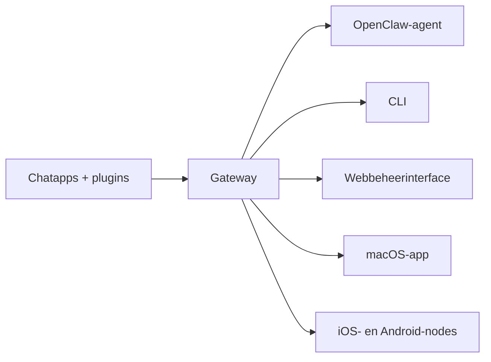

---
read_when:
    - OpenClaw introduceren aan nieuwkomers
summary: OpenClaw is een multikanaals Gateway voor AI-agents die op elk besturingssysteem draait.
title: OpenClaw
x-i18n:
    generated_at: "2026-07-12T08:59:27Z"
    model: gpt-5.6
    postprocess_version: locale-links-v1
    provider: openai
    source_hash: 2b87c2a9ce06f110bda45709fb6055ed8000f73993793ea7386db2a47a782828
    source_path: index.md
    workflow: 16
---

# OpenClaw 🦞

<p align="center">
    
    
</p>

> _"SCRUBBEN! SCRUBBEN!"_ — Waarschijnlijk een ruimtekreeft

<p align="center">
  <strong>Gateway voor elk besturingssysteem voor AI-agents via Discord, Google Chat, iMessage, Matrix, Microsoft Teams, Signal, Slack, Telegram, WhatsApp, Zalo en meer.</strong><br />
  Stuur een bericht en ontvang waar je ook bent een reactie van een agent. Gebruik één Gateway voor kanaalplugins, WebChat en mobiele nodes.
</p>

<Columns>
  <Card title="Aan de slag" href="/nl/start/getting-started" icon="rocket">
    Installeer OpenClaw en start de Gateway binnen enkele minuten.
  </Card>
  <Card title="Onboarding uitvoeren" href="/nl/start/wizard" icon="list-checks">
    Begeleide configuratie met `openclaw onboard` en koppelingsprocedures.
  </Card>
  <Card title="Een kanaal verbinden" href="/nl/channels" icon="message-circle">
    Koppel Discord, Signal, Telegram, WhatsApp en meer om overal te kunnen chatten.
  </Card>
  <Card title="De beheerinterface openen" href="/nl/web/control-ui" icon="layout-dashboard">
    Start het browserdashboard voor chat, configuratie en sessies.
  </Card>
</Columns>

## Documentatie bekijken

Mobiele browsers tonen mogelijk het sectiemenu zonder de volledige tabbladenbalk van de desktopversie. Gebruik
deze overzichtskoppelingen om vanuit de pagina dezelfde hoofdonderdelen van de documentatie te bereiken.

<Columns>
  <Card title="Aan de slag" href="/nl" icon="rocket">
    Overzicht, voorbeelden, eerste stappen en configuratiehandleidingen.
  </Card>
  <Card title="Installeren" href="/nl/install" icon="download">
    Installatiemethoden, updates, containers, hosting en geavanceerde configuratie.
  </Card>
  <Card title="Kanalen" href="/nl/channels" icon="messages-square">
    Berichtkanalen, koppeling, routering, toegangsgroepen en kwaliteitscontrole van kanalen.
  </Card>
  <Card title="Agents" href="/nl/concepts/architecture" icon="bot">
    Architectuur, sessies, context, geheugen en routering met meerdere agents.
  </Card>
  <Card title="Mogelijkheden" href="/nl/tools" icon="wand-sparkles">
    Hulpmiddelen, Skills, Cron, Webhooks en automatiseringsmogelijkheden.
  </Card>
  <Card title="ClawHub" href="/nl/clawhub" icon="store">
    Marktplaats voor plugins, publicatie, beheer en richtlijnen voor vertrouwen.
  </Card>
  <Card title="Modellen" href="/nl/providers" icon="brain">
    Providers, modelconfiguratie, failover en lokale modeldiensten.
  </Card>
  <Card title="Platformen" href="/nl/platforms" icon="monitor-smartphone">
    macOS, Windows, iOS, Android, nodes en webinterfaces.
  </Card>
  <Card title="Gateway en beheer" href="/nl/gateway" icon="server">
    Gateway-configuratie, beveiliging, diagnostiek en beheer.
  </Card>
  <Card title="Naslagwerk" href="/nl/cli" icon="terminal">
    CLI-naslagwerk, schema's, RPC, releaseopmerkingen en sjablonen.
  </Card>
  <Card title="Hulp" href="/nl/help" icon="life-buoy">
    Probleemoplossing, veelgestelde vragen, tests, diagnostiek en omgevingscontroles.
  </Card>
</Columns>

## Wat is OpenClaw?

OpenClaw is een **zelfgehoste Gateway** die je favoriete chatapps — Discord, Google Chat, iMessage, Matrix, Microsoft Teams, Signal, Slack, Telegram, WhatsApp, Zalo en meer via kanaalplugins — verbindt met AI-agents voor programmeren. Je voert één Gateway-proces uit op je eigen computer (of een server), dat de brug vormt tussen je berichtenapps en een altijd beschikbare AI-assistent.

**Voor wie is het bedoeld?** Ontwikkelaars en ervaren gebruikers die een persoonlijke AI-assistent willen waaraan ze overal berichten kunnen sturen, zonder de controle over hun gegevens op te geven of afhankelijk te zijn van een gehoste dienst.

**Wat maakt het anders?**

- **Zelfgehost**: draait op jouw hardware, volgens jouw regels
- **Meerdere kanalen**: één Gateway bedient alle geconfigureerde kanaalplugins tegelijkertijd
- **Ontworpen voor agents**: gebouwd voor programmeeragents met hulpmiddelengebruik, sessies, geheugen en routering met meerdere agents
- **Open source**: met MIT-licentie en ontwikkeld door de gemeenschap

**Wat heb je nodig?** Node 24 (aanbevolen), of Node 22 LTS (`22.19+`) voor compatibiliteit, een API-sleutel van de gekozen provider en 5 minuten. Gebruik voor de beste kwaliteit en beveiliging het krachtigste beschikbare model van de nieuwste generatie.

## Hoe het werkt



De Gateway is de enige bron van waarheid voor sessies, routering en kanaalverbindingen.

## Belangrijkste mogelijkheden

<Columns>
  <Card title="Gateway voor meerdere kanalen" icon="network" href="/nl/channels">
    Discord, iMessage, Signal, Slack, Telegram, WhatsApp, WebChat en meer met één Gateway-proces.
  </Card>
  <Card title="Plugin-kanalen" icon="plug" href="/nl/tools/plugin">
    Kanaalplugins voegen Matrix, Nostr, Twitch, Zalo en meer toe; officiële plugins worden naar behoefte geïnstalleerd.
  </Card>
  <Card title="Routering met meerdere agents" icon="route" href="/nl/concepts/multi-agent">
    Afzonderlijke sessies per agent, werkruimte of afzender.
  </Card>
  <Card title="Mediaondersteuning" icon="image" href="/nl/nodes/images">
    Verzend en ontvang afbeeldingen, audio en documenten.
  </Card>
  <Card title="Webbeheerinterface" icon="monitor" href="/nl/web/control-ui">
    Browserdashboard voor chat, configuratie, sessies en nodes.
  </Card>
  <Card title="Mobiele nodes" icon="smartphone" href="/nl/nodes">
    Koppel iOS- en Android-nodes voor workflows met Canvas, camera en spraak.
  </Card>
</Columns>

## Snel aan de slag

<Steps>
  <Step title="OpenClaw installeren">
    ```bash
    npm install -g openclaw@latest
    ```
  </Step>
  <Step title="Onboarding uitvoeren en de service installeren">
    ```bash
    openclaw onboard --install-daemon
    ```
  </Step>
  <Step title="Chatten">
    Open de beheerinterface in je browser en stuur een bericht:

    ```bash
    openclaw dashboard
    ```

    Of verbind een kanaal ([Telegram](/nl/channels/telegram) is het snelst) en chat vanaf je telefoon.

  </Step>
</Steps>

Heb je de volledige installatie- en ontwikkelconfiguratie nodig? Zie [Aan de slag](/nl/start/getting-started).

## Dashboard

Open de beheerinterface in de browser nadat de Gateway is gestart.

- Lokale standaard: [http://127.0.0.1:18789/](http://127.0.0.1:18789/)
- Externe toegang: [Webinterfaces](/nl/web) en [Tailscale](/nl/gateway/tailscale)

<p align="center">
  
</p>

## Configuratie (optioneel)

De configuratie staat in `~/.openclaw/openclaw.json`.

- Als je **niets doet**, gebruikt OpenClaw de meegeleverde OpenClaw-agentruntime; privéberichten delen de hoofdsessie van de agent en elke groepschat krijgt een eigen sessie.
- Als je de toegang wilt beperken, begin je met `channels.whatsapp.allowFrom` en (voor groepen) regels voor vermeldingen.

Voorbeeld:

```json5
{
  channels: {
    whatsapp: {
      allowFrom: ["+15555550123"],
      groups: { "*": { requireMention: true } },
    },
  },
  messages: { groupChat: { mentionPatterns: ["@openclaw"] } },
}
```

## Begin hier

<Columns>
  <Card title="Documentatieoverzichten" href="/nl/start/hubs" icon="book-open">
    Alle documentatie en handleidingen, geordend op gebruikssituatie.
  </Card>
  <Card title="Configuratie" href="/nl/gateway/configuration" icon="settings">
    Belangrijkste Gateway-instellingen, tokens en providerconfiguratie.
  </Card>
  <Card title="Externe toegang" href="/nl/gateway/remote" icon="globe">
    Toegangspatronen voor SSH en tailnet.
  </Card>
  <Card title="Kanalen" href="/nl/channels/telegram" icon="message-square">
    Kanaalspecifieke configuratie voor Discord, Feishu, Microsoft Teams, Telegram, WhatsApp en meer.
  </Card>
  <Card title="Nodes" href="/nl/nodes" icon="smartphone">
    iOS- en Android-nodes met koppeling, Canvas, camera en apparaatacties.
  </Card>
  <Card title="Hulp" href="/nl/help" icon="life-buoy">
    Veelvoorkomende oplossingen en startpunt voor probleemoplossing.
  </Card>
</Columns>

## Meer informatie

<Columns>
  <Card title="Volledige functielijst" href="/nl/concepts/features" icon="list">
    Volledig overzicht van kanaal-, routerings- en mediamogelijkheden.
  </Card>
  <Card title="Routering met meerdere agents" href="/nl/concepts/multi-agent" icon="route">
    Isolatie van werkruimten en sessies per agent.
  </Card>
  <Card title="Beveiliging" href="/nl/gateway/security" icon="shield">
    Tokens, toelatingslijsten en veiligheidsmaatregelen.
  </Card>
  <Card title="Probleemoplossing" href="/nl/gateway/troubleshooting" icon="wrench">
    Gateway-diagnostiek en veelvoorkomende fouten.
  </Card>
  <Card title="Over het project en dankwoord" href="/nl/reference/credits" icon="info">
    Oorsprong van het project, bijdragers en licentie.
  </Card>
</Columns>
