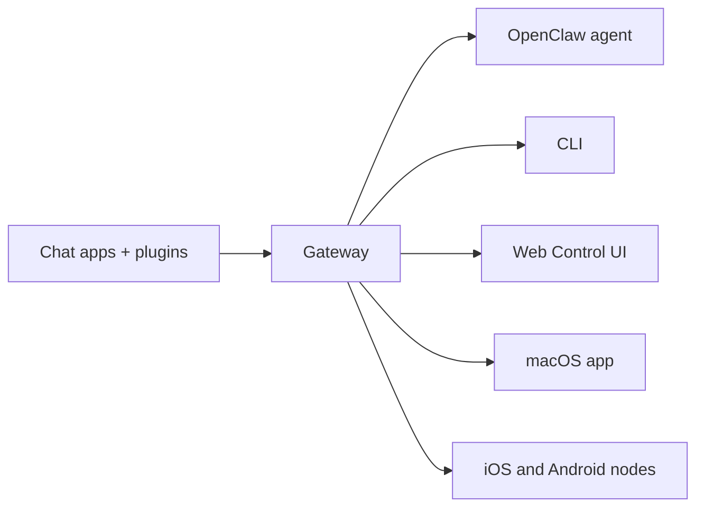

---
read_when:
    - OpenClaw introduceren bij nieuwkomers
summary: OpenClaw is een meerkanaals Gateway voor AI-agenten die op elk besturingssysteem draait.
title: OpenClaw
x-i18n:
    generated_at: "2026-06-27T17:41:21Z"
    model: gpt-5.5
    postprocess_version: locale-links-v1
    provider: openai
    source_hash: fcaa54a0a6d7aa62193fd9f03428bbcbfdcb2c00a184bcd6f49e4e093fefc473
    source_path: index.md
    workflow: 16
---

# OpenClaw 🦞

<p align="center">
    
    
</p>

> _"EXFOLIATE! EXFOLIATE!"_ — Waarschijnlijk een ruimtekreeft

<p align="center">
  <strong>Gateway voor elk besturingssysteem voor AI-agents via Discord, Google Chat, iMessage, Matrix, Microsoft Teams, Signal, Slack, Telegram, WhatsApp, Zalo en meer.</strong><br />
  Stuur een bericht en ontvang een agentantwoord vanuit je broekzak. Voer één Gateway uit voor ingebouwde kanalen, gebundelde kanaalplugins, WebChat en mobiele nodes.
</p>

<Columns>
  <Card title="Aan de slag" href="/nl/start/getting-started" icon="rocket">
    Installeer OpenClaw en start de Gateway binnen enkele minuten.
  </Card>
  <Card title="Onboarding uitvoeren" href="/nl/start/wizard" icon="list-checks">
    Begeleide installatie met `openclaw onboard` en koppelingsflows.
  </Card>
  <Card title="De Control UI openen" href="/nl/web/control-ui" icon="layout-dashboard">
    Start het browserdashboard voor chat, configuratie en sessies.
  </Card>
</Columns>

## Wat is OpenClaw?

OpenClaw is een **zelfgehoste gateway** die je favoriete chatapps en kanaaloppervlakken verbindt — ingebouwde kanalen plus gebundelde of externe kanaalplugins zoals Discord, Google Chat, iMessage, Matrix, Microsoft Teams, Signal, Slack, Telegram, WhatsApp, Zalo en meer — met AI-codeagents. Je voert één Gateway-proces uit op je eigen machine (of een server), en het wordt de brug tussen je berichtenapps en een altijd beschikbare AI-assistent.

**Voor wie is het bedoeld?** Ontwikkelaars en power users die een persoonlijke AI-assistent willen die ze overal kunnen berichten — zonder de controle over hun gegevens op te geven of afhankelijk te zijn van een gehoste dienst.

**Wat maakt het anders?**

- **Zelfgehost**: draait op jouw hardware, volgens jouw regels
- **Meerdere kanalen**: één Gateway bedient ingebouwde kanalen plus gebundelde of externe kanaalplugins tegelijk
- **Agent-native**: gebouwd voor codeagents met toolgebruik, sessies, geheugen en multi-agent-routering
- **Open source**: MIT-licentie, communitygedreven

**Wat heb je nodig?** Node 24 (aanbevolen), of Node 22 LTS (`22.19+`) voor compatibiliteit, een API-sleutel van je gekozen provider en 5 minuten. Gebruik voor de beste kwaliteit en beveiliging het krachtigste beschikbare model van de nieuwste generatie.

## Hoe het werkt



De Gateway is de enige bron van waarheid voor sessies, routering en kanaalverbindingen.

## Belangrijkste mogelijkheden

<Columns>
  <Card title="Gateway voor meerdere kanalen" icon="network" href="/nl/channels">
    Discord, iMessage, Signal, Slack, Telegram, WhatsApp, WebChat en meer met één Gateway-proces.
  </Card>
  <Card title="Plugin-kanalen" icon="plug" href="/nl/tools/plugin">
    Gebundelde plugins voegen Matrix, Nostr, Twitch, Zalo en meer toe in normale huidige releases.
  </Card>
  <Card title="Multi-agent-routering" icon="route" href="/nl/concepts/multi-agent">
    Geïsoleerde sessies per agent, workspace of afzender.
  </Card>
  <Card title="Mediaondersteuning" icon="image" href="/nl/nodes/images">
    Verstuur en ontvang afbeeldingen, audio en documenten.
  </Card>
  <Card title="Web Control UI" icon="monitor" href="/nl/web/control-ui">
    Browserdashboard voor chat, configuratie, sessies en nodes.
  </Card>
  <Card title="Mobiele nodes" icon="smartphone" href="/nl/nodes">
    Koppel iOS- en Android-nodes voor Canvas, camera en spraakgestuurde workflows.
  </Card>
</Columns>

## Snel starten

<Steps>
  <Step title="OpenClaw installeren">
    ```bash
    npm install -g openclaw@latest
    ```
  </Step>
  <Step title="Onboarden en de service installeren">
    ```bash
    openclaw onboard --install-daemon
    ```
  </Step>
  <Step title="Chatten">
    Open de Control UI in je browser en stuur een bericht:

    ```bash
    openclaw dashboard
    ```

    Of verbind een kanaal ([Telegram](/nl/channels/telegram) is het snelst) en chat vanaf je telefoon.

  </Step>
</Steps>

Heb je de volledige installatie- en ontwikkelsetup nodig? Zie [Aan de slag](/nl/start/getting-started).

## Dashboard

Open de browser-Control UI nadat de Gateway is gestart.

- Lokale standaard: [http://127.0.0.1:18789/](http://127.0.0.1:18789/)
- Externe toegang: [Weboppervlakken](/nl/web) en [Tailscale](/nl/gateway/tailscale)

<p align="center">
  
</p>

## Configuratie (optioneel)

Configuratie staat in `~/.openclaw/openclaw.json`.

- Als je **niets doet**, gebruikt OpenClaw de gebundelde OpenClaw-agentruntime met sessies per afzender.
- Als je dit wilt vergrendelen, begin dan met `channels.whatsapp.allowFrom` en (voor groepen) vermeldingsregels.

Voorbeeld:

```json5
{
  channels: {
    whatsapp: {
      allowFrom: ["+15555550123"],
      groups: { "*": { requireMention: true } },
    },
  },
  messages: { groupChat: { mentionPatterns: ["@openclaw"] } },
}
```

## Begin hier

<Columns>
  <Card title="Docshubs" href="/nl/start/hubs" icon="book-open">
    Alle documentatie en gidsen, georganiseerd per use case.
  </Card>
  <Card title="Configuratie" href="/nl/gateway/configuration" icon="settings">
    Kerninstellingen van de Gateway, tokens en providerconfiguratie.
  </Card>
  <Card title="Externe toegang" href="/nl/gateway/remote" icon="globe">
    Toegangspatronen voor SSH en tailnet.
  </Card>
  <Card title="Kanalen" href="/nl/channels/telegram" icon="message-square">
    Kanaalspecifieke installatie voor Feishu, Microsoft Teams, WhatsApp, Telegram, Discord en meer.
  </Card>
  <Card title="Nodes" href="/nl/nodes" icon="smartphone">
    iOS- en Android-nodes met koppeling, Canvas, camera en apparaatacties.
  </Card>
  <Card title="Help" href="/nl/help" icon="life-buoy">
    Startpunt voor veelvoorkomende oplossingen en probleemoplossing.
  </Card>
</Columns>

## Meer leren

<Columns>
  <Card title="Volledige functielijst" href="/nl/concepts/features" icon="list">
    Volledige kanaal-, routerings- en mediamogelijkheden.
  </Card>
  <Card title="Multi-agent-routering" href="/nl/concepts/multi-agent" icon="route">
    Workspace-isolatie en sessies per agent.
  </Card>
  <Card title="Beveiliging" href="/nl/gateway/security" icon="shield">
    Tokens, allowlists en veiligheidscontroles.
  </Card>
  <Card title="Probleemoplossing" href="/nl/gateway/troubleshooting" icon="wrench">
    Gateway-diagnostiek en veelvoorkomende fouten.
  </Card>
  <Card title="Over en credits" href="/nl/reference/credits" icon="info">
    Projectoorsprong, bijdragers en licentie.
  </Card>
</Columns>
