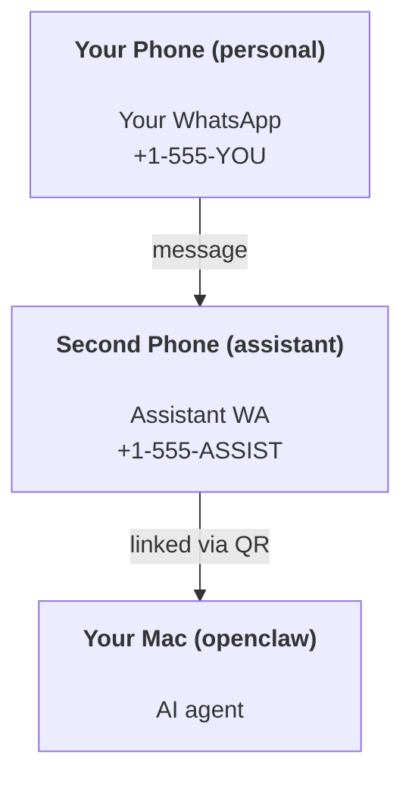

---
read_when:
    - Ingebruikname van een nieuwe assistentinstantie
    - Veiligheids- en machtigingsimplicaties beoordelen
summary: End-to-endgids voor het gebruiken van OpenClaw als persoonlijke assistent met veiligheidswaarschuwingen
title: Persoonlijke assistent instellen
x-i18n:
    generated_at: "2026-05-11T20:50:27Z"
    model: gpt-5.5
    provider: openai
    source_hash: 74dd13c4b43faa8e29e1fd56a355f36c6cf7c3fa8193bb62c1056211933f4df9
    source_path: start/openclaw.md
    workflow: 16
---

OpenClaw is een zelfgehoste Gateway die Discord, Google Chat, iMessage, Matrix, Microsoft Teams, Signal, Slack, Telegram, WhatsApp, Zalo en meer verbindt met AI-agents. Deze gids behandelt de setup voor een "persoonlijke assistent": een speciaal WhatsApp-nummer dat zich gedraagt als je altijd beschikbare AI-assistent.

## ⚠️ Veiligheid eerst

Je plaatst een agent in een positie waarin die het volgende kan doen:

- opdrachten uitvoeren op je machine (afhankelijk van je toolbeleid)
- bestanden lezen/schrijven in je workspace
- berichten terugsturen via WhatsApp/Telegram/Discord/Mattermost en andere meegeleverde kanalen

Begin conservatief:

- Stel altijd `channels.whatsapp.allowFrom` in (draai nooit open-voor-de-wereld op je persoonlijke Mac).
- Gebruik een speciaal WhatsApp-nummer voor de assistent.
- Heartbeats staan nu standaard op elke 30 minuten. Schakel dit uit totdat je de setup vertrouwt door `agents.defaults.heartbeat.every: "0m"` in te stellen.

## Vereisten

- OpenClaw geïnstalleerd en geonboard - zie [Aan de slag](/nl/start/getting-started) als je dit nog niet hebt gedaan
- Een tweede telefoonnummer (SIM/eSIM/prepaid) voor de assistent

## De setup met twee telefoons (aanbevolen)

Je wilt dit:



Als je je persoonlijke WhatsApp koppelt aan OpenClaw, wordt elk bericht aan jou "agent-invoer". Dat is zelden wat je wilt.

## Snelstart in 5 minuten

1. Koppel WhatsApp Web (toont QR; scan met de assistenttelefoon):

```bash
openclaw channels login
```

2. Start de Gateway (laat deze draaien):

```bash
openclaw gateway --port 18789
```

3. Zet een minimale configuratie in `~/.openclaw/openclaw.json`:

```json5
{
  gateway: { mode: "local" },
  channels: { whatsapp: { allowFrom: ["+15555550123"] } },
}
```

Stuur nu een bericht naar het assistentnummer vanaf je telefoon op de allowlist.

Wanneer onboarding klaar is, opent OpenClaw automatisch het dashboard en print het een schone (niet-getokeniseerde) link. Als het dashboard om authenticatie vraagt, plak dan het geconfigureerde gedeelde geheim in de Control UI-instellingen. Onboarding gebruikt standaard een token (`gateway.auth.token`), maar wachtwoordauthenticatie werkt ook als je `gateway.auth.mode` hebt gewijzigd naar `password`. Later opnieuw openen: `openclaw dashboard`.

## Geef de agent een workspace (AGENTS)

OpenClaw leest bedieningsinstructies en "geheugen" uit de workspace-directory.

Standaard gebruikt OpenClaw `~/.openclaw/workspace` als agent-workspace en maakt deze automatisch aan (plus startbestanden `AGENTS.md`, `SOUL.md`, `TOOLS.md`, `IDENTITY.md`, `USER.md`, `HEARTBEAT.md`) tijdens setup/eerste agent-run. `BOOTSTRAP.md` wordt alleen aangemaakt wanneer de workspace helemaal nieuw is (het hoort niet terug te komen nadat je het verwijdert). `MEMORY.md` is optioneel (wordt niet automatisch aangemaakt); wanneer aanwezig, wordt het geladen voor normale sessies. Subagent-sessies injecteren alleen `AGENTS.md` en `TOOLS.md`.

<Tip>
Behandel deze map als het geheugen van OpenClaw en maak er een git-repo van (idealiter privé), zodat je `AGENTS.md` en geheugenbestanden zijn geback-upt. Als git is geïnstalleerd, worden gloednieuwe workspaces automatisch geïnitialiseerd.
</Tip>

```bash
openclaw setup
```

Volledige workspace-indeling + backupgids: [Agent-workspace](/nl/concepts/agent-workspace)
Geheugenworkflow: [Geheugen](/nl/concepts/memory)

Optioneel: kies een andere workspace met `agents.defaults.workspace` (ondersteunt `~`).

```json5
{
  agents: {
    defaults: {
      workspace: "~/.openclaw/workspace",
    },
  },
}
```

Als je al je eigen workspace-bestanden vanuit een repo levert, kun je het aanmaken van bootstrap-bestanden volledig uitschakelen:

```json5
{
  agents: {
    defaults: {
      skipBootstrap: true,
    },
  },
}
```

## De configuratie die er "een assistent" van maakt

OpenClaw staat standaard op een goede assistent-setup, maar meestal wil je dit afstemmen:

- persona/instructies in [`SOUL.md`](/nl/concepts/soul)
- denkstandaarden (indien gewenst)
- Heartbeats (zodra je het vertrouwt)

Voorbeeld:

```json5
{
  logging: { level: "info" },
  agents: {
    defaults: {
      model: { primary: "anthropic/claude-opus-4-6" },
      workspace: "~/.openclaw/workspace",
      thinkingDefault: "high",
      timeoutSeconds: 1800,
      // Start with 0; enable later.
      heartbeat: { every: "0m" },
    },
    list: [
      {
        id: "main",
        default: true,
        groupChat: {
          mentionPatterns: ["@openclaw", "openclaw"],
        },
      },
    ],
  },
  channels: {
    whatsapp: {
      allowFrom: ["+15555550123"],
      groups: {
        "*": { requireMention: true },
      },
    },
  },
  session: {
    scope: "per-sender",
    resetTriggers: ["/new", "/reset"],
    reset: {
      mode: "daily",
      atHour: 4,
      idleMinutes: 10080,
    },
  },
}
```

## Sessies en geheugen

- Sessiebestanden: `~/.openclaw/agents/<agentId>/sessions/{{SessionId}}.jsonl`
- Sessiemetadata (tokengebruik, laatste route, enzovoort): `~/.openclaw/agents/<agentId>/sessions/sessions.json` (legacy: `~/.openclaw/sessions/sessions.json`)
- `/new` of `/reset` start een nieuwe sessie voor die chat (configureerbaar via `resetTriggers`). Als dit alleen wordt verzonden, bevestigt OpenClaw de reset zonder het model aan te roepen.
- `/compact [instructions]` comprimeert de sessiecontext en rapporteert het resterende contextbudget.

## Heartbeats (proactieve modus)

Standaard voert OpenClaw elke 30 minuten een Heartbeat uit met de prompt:
`Read HEARTBEAT.md if it exists (workspace context). Follow it strictly. Do not infer or repeat old tasks from prior chats. If nothing needs attention, reply HEARTBEAT_OK.`
Stel `agents.defaults.heartbeat.every: "0m"` in om dit uit te schakelen.

- Als `HEARTBEAT.md` bestaat maar effectief leeg is (alleen lege regels en markdownkoppen zoals `# Heading`), slaat OpenClaw de Heartbeat-run over om API-aanroepen te besparen.
- Als het bestand ontbreekt, wordt de Heartbeat nog steeds uitgevoerd en bepaalt het model wat er moet gebeuren.
- Als de agent antwoordt met `HEARTBEAT_OK` (optioneel met korte padding; zie `agents.defaults.heartbeat.ackMaxChars`), onderdrukt OpenClaw uitgaande levering voor die Heartbeat.
- Standaard is Heartbeat-levering aan DM-achtige `user:<id>`-doelen toegestaan. Stel `agents.defaults.heartbeat.directPolicy: "block"` in om levering aan directe doelen te onderdrukken terwijl Heartbeat-runs actief blijven.
- Heartbeats voeren volledige agent-beurten uit - kortere intervallen verbruiken meer tokens.

```json5
{
  agents: {
    defaults: {
      heartbeat: { every: "30m" },
    },
  },
}
```

## Media in en uit

Binnenkomende bijlagen (afbeeldingen/audio/docs) kunnen via templates aan je command worden aangeboden:

- `{{MediaPath}}` (lokaal tijdelijk bestandspad)
- `{{MediaUrl}}` (pseudo-URL)
- `{{Transcript}}` (als audiotranscriptie is ingeschakeld)

Uitgaande bijlagen van de agent: voeg `MEDIA:<path-or-url>` toe op een eigen regel (geen spaties). Voorbeeld:

```
Here's the screenshot.
MEDIA:https://example.com/screenshot.png
```

OpenClaw extraheert deze en verzendt ze als media naast de tekst.

Gedrag voor lokale paden volgt hetzelfde vertrouwensmodel voor bestandslezen als de agent:

- Als `tools.fs.workspaceOnly` `true` is, blijven uitgaande lokale `MEDIA:`-paden beperkt tot de tijdelijke root van OpenClaw, de mediacache, agent-workspacepaden en door de sandbox gegenereerde bestanden.
- Als `tools.fs.workspaceOnly` `false` is, kan uitgaande `MEDIA:` host-lokale bestanden gebruiken die de agent al mag lezen.
- Lokale paden kunnen absoluut, relatief aan de workspace of relatief aan de homemap met `~/` zijn.
- Host-lokale verzending staat nog steeds alleen media en veilige documenttypen toe (afbeeldingen, audio, video, PDF en Office-documenten). Platte tekst en bestanden die op geheimen lijken, worden niet behandeld als verzendbare media.

Dat betekent dat gegenereerde afbeeldingen/bestanden buiten de workspace nu kunnen worden verzonden wanneer je fs-beleid die leesacties al toestaat, zonder willekeurige exfiltratie van hosttekstbijlagen opnieuw mogelijk te maken.

## Operationele checklist

```bash
openclaw status          # local status (creds, sessions, queued events)
openclaw status --all    # full diagnosis (read-only, pasteable)
openclaw status --deep   # asks the gateway for a live health probe with channel probes when supported
openclaw health --json   # gateway health snapshot (WS; default can return a fresh cached snapshot)
```

Logs staan onder `/tmp/openclaw/` (standaard: `openclaw-YYYY-MM-DD.log`).

## Volgende stappen

- WebChat: [WebChat](/nl/web/webchat)
- Gateway-ops: [Gateway-runbook](/nl/gateway)
- Cron + wakeups: [Cron-taken](/nl/automation/cron-jobs)
- macOS-menubalkcompanion: [OpenClaw macOS-app](/nl/platforms/macos)
- iOS Node-app: [iOS-app](/nl/platforms/ios)
- Android Node-app: [Android-app](/nl/platforms/android)
- Windows-status: [Windows (WSL2)](/nl/platforms/windows)
- Linux-status: [Linux-app](/nl/platforms/linux)
- Beveiliging: [Beveiliging](/nl/gateway/security)

## Gerelateerd

- [Aan de slag](/nl/start/getting-started)
- [Setup](/nl/start/setup)
- [Kanalenoverzicht](/nl/channels)
