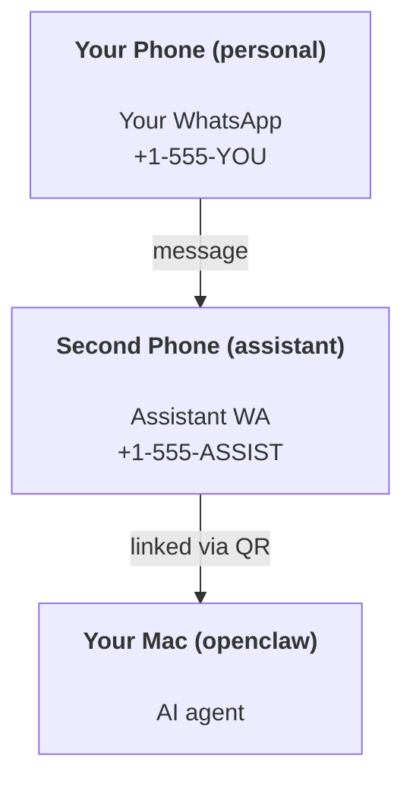

---
read_when:
    - Een nieuwe assistentinstantie onboarden
    - Veiligheids- en toestemmingsimplicaties beoordelen
summary: End-to-endhandleiding voor het uitvoeren van OpenClaw als persoonlijke assistent met veiligheidswaarschuwingen
title: Persoonlijke assistent instellen
x-i18n:
    generated_at: "2026-06-27T18:22:21Z"
    model: gpt-5.5
    postprocess_version: locale-links-v1
    provider: openai
    source_hash: b0cd640872a2a60fd88d2dc3df6d038ef8574163430d8683ef9b67921b0c87f4
    source_path: start/openclaw.md
    workflow: 16
---

OpenClaw is een zelfgehoste gateway die Discord, Google Chat, iMessage, Matrix, Microsoft Teams, Signal, Slack, Telegram, WhatsApp, Zalo en meer verbindt met AI-agenten. Deze gids behandelt de installatie voor een "persoonlijke assistent": een speciaal WhatsApp-nummer dat zich gedraagt als je altijd beschikbare AI-assistent.

## ⚠️ Veiligheid eerst

Je plaatst een agent in een positie om:

- opdrachten op je machine uit te voeren (afhankelijk van je toolbeleid)
- bestanden in je werkruimte te lezen/schrijven
- berichten terug te sturen via WhatsApp/Telegram/Discord/Mattermost en andere meegeleverde kanalen

Begin conservatief:

- Stel altijd `channels.whatsapp.allowFrom` in (draai dit nooit open voor de hele wereld op je persoonlijke Mac).
- Gebruik een speciaal WhatsApp-nummer voor de assistent.
- Heartbeats staan nu standaard op elke 30 minuten. Schakel dit uit totdat je de installatie vertrouwt door `agents.defaults.heartbeat.every: "0m"` in te stellen.

## Vereisten

- OpenClaw geïnstalleerd en onboarded - zie [Aan de slag](/nl/start/getting-started) als je dit nog niet hebt gedaan
- Een tweede telefoonnummer (SIM/eSIM/prepaid) voor de assistent

## De installatie met twee telefoons (aanbevolen)

Je wilt dit:



Als je je persoonlijke WhatsApp aan OpenClaw koppelt, wordt elk bericht aan jou "agentinvoer". Dat is zelden wat je wilt.

## Snelstart in 5 minuten

1. Koppel WhatsApp Web (toont QR; scan met de assistenttelefoon):

```bash
openclaw channels login
```

2. Start de Gateway (laat deze draaien):

```bash
openclaw gateway --port 18789
```

3. Zet een minimale configuratie in `~/.openclaw/openclaw.json`:

```json5
{
  gateway: { mode: "local" },
  channels: { whatsapp: { allowFrom: ["+15555550123"] } },
}
```

Stuur nu een bericht naar het assistentnummer vanaf je toegestane telefoon.

Wanneer onboarding is voltooid, opent OpenClaw automatisch het dashboard en toont het een schone link (zonder token). Als het dashboard om authenticatie vraagt, plak je het geconfigureerde gedeelde geheim in de instellingen van Control UI. Onboarding gebruikt standaard een token (`gateway.auth.token`), maar wachtwoordauthenticatie werkt ook als je `gateway.auth.mode` hebt gewijzigd naar `password`. Later opnieuw openen: `openclaw dashboard`.

## Geef de agent een werkruimte (AGENTS)

OpenClaw leest bedieningsinstructies en "geheugen" uit de werkruimtemap.

Standaard gebruikt OpenClaw `~/.openclaw/workspace` als agentwerkruimte en maakt die automatisch aan (plus de startbestanden `AGENTS.md`, `SOUL.md`, `TOOLS.md`, `IDENTITY.md`, `USER.md`, `HEARTBEAT.md`) bij setup/eerste agentrun. `BOOTSTRAP.md` wordt alleen gemaakt wanneer de werkruimte helemaal nieuw is (het hoort niet terug te komen nadat je het hebt verwijderd). `MEMORY.md` is optioneel (wordt niet automatisch aangemaakt); wanneer het aanwezig is, wordt het geladen voor normale sessies. Subagentsessies injecteren alleen `AGENTS.md` en `TOOLS.md`.

<Tip>
Behandel deze map als het geheugen van OpenClaw en maak er een git-repo van (idealiter privé), zodat je `AGENTS.md` en geheugenbestanden worden geback-upt. Als git is geïnstalleerd, worden gloednieuwe werkruimtes automatisch geïnitialiseerd.
</Tip>

```bash
openclaw setup
```

Volledige werkruimte-indeling + back-upgids: [Agentwerkruimte](/nl/concepts/agent-workspace)
Geheugenworkflow: [Geheugen](/nl/concepts/memory)

Optioneel: kies een andere werkruimte met `agents.defaults.workspace` (ondersteunt `~`).

```json5
{
  agents: {
    defaults: {
      workspace: "~/.openclaw/workspace",
    },
  },
}
```

Als je al je eigen werkruimtebestanden vanuit een repo levert, kun je het aanmaken van bootstrapbestanden volledig uitschakelen:

```json5
{
  agents: {
    defaults: {
      skipBootstrap: true,
    },
  },
}
```

## De configuratie die er "een assistent" van maakt

OpenClaw heeft standaard een goede assistentconfiguratie, maar meestal wil je dit afstemmen:

- persona/instructies in [`SOUL.md`](/nl/concepts/soul)
- standaardinstellingen voor denken (indien gewenst)
- Heartbeats (zodra je het vertrouwt)

Voorbeeld:

```json5
{
  logging: { level: "info" },
  agents: {
    defaults: {
      model: { primary: "anthropic/claude-opus-4-6" },
      workspace: "~/.openclaw/workspace",
      thinkingDefault: "high",
      timeoutSeconds: 1800,
      // Start with 0; enable later.
      heartbeat: { every: "0m" },
    },
    list: [
      {
        id: "main",
        default: true,
        groupChat: {
          mentionPatterns: ["@openclaw", "openclaw"],
        },
      },
    ],
  },
  channels: {
    whatsapp: {
      allowFrom: ["+15555550123"],
      groups: {
        "*": { requireMention: true },
      },
    },
  },
  session: {
    scope: "per-sender",
    resetTriggers: ["/new", "/reset"],
    reset: {
      mode: "daily",
      atHour: 4,
      idleMinutes: 10080,
    },
  },
}
```

## Sessies en geheugen

- Sessiebestanden: `~/.openclaw/agents/<agentId>/sessions/{{SessionId}}.jsonl`
- Sessiemetadata (tokengebruik, laatste route, enzovoort): `~/.openclaw/agents/<agentId>/sessions/sessions.json` (legacy: `~/.openclaw/sessions/sessions.json`)
- `/new` of `/reset` start een nieuwe sessie voor die chat (configureerbaar via `resetTriggers`). Als dit alleen wordt verzonden, bevestigt OpenClaw de reset zonder het model aan te roepen.
- `/compact [instructions]` compacteert de sessiecontext en rapporteert het resterende contextbudget.

## Heartbeats (proactieve modus)

Standaard voert OpenClaw elke 30 minuten een Heartbeat uit met de prompt:
`Read HEARTBEAT.md if it exists (workspace context). Follow it strictly. Do not infer or repeat old tasks from prior chats. If nothing needs attention, reply HEARTBEAT_OK.`
Stel `agents.defaults.heartbeat.every: "0m"` in om dit uit te schakelen.

- Als `HEARTBEAT.md` bestaat maar feitelijk leeg is (alleen lege regels, Markdown-/HTML-opmerkingen, Markdown-koppen zoals `# Heading`, fence-markeringen of lege checklist-stubs), slaat OpenClaw de Heartbeat-run over om API-aanroepen te besparen.
- Als het bestand ontbreekt, draait de Heartbeat nog steeds en beslist het model wat er moet gebeuren.
- Als de agent antwoordt met `HEARTBEAT_OK` (optioneel met korte opvulling; zie `agents.defaults.heartbeat.ackMaxChars`), onderdrukt OpenClaw uitgaande levering voor die Heartbeat.
- Standaard is Heartbeat-levering aan DM-achtige doelen `user:<id>` toegestaan. Stel `agents.defaults.heartbeat.directPolicy: "block"` in om levering aan directe doelen te onderdrukken terwijl Heartbeat-runs actief blijven.
- Heartbeats draaien volledige agentbeurten - kortere intervallen verbruiken meer tokens.

```json5
{
  agents: {
    defaults: {
      heartbeat: { every: "30m" },
    },
  },
}
```

## Media in en uit

Inkomende bijlagen (afbeeldingen/audio/documenten) kunnen via templates aan je opdracht worden aangeboden:

- `{{MediaPath}}` (lokaal tijdelijk bestandspad)
- `{{MediaUrl}}` (pseudo-URL)
- `{{Transcript}}` (als audiotranscriptie is ingeschakeld)

Uitgaande bijlagen van de agent gebruiken gestructureerde mediavelden op de berichttool of antwoordpayload, zoals `media`, `mediaUrl`, `mediaUrls`, `path` of `filePath`. Voorbeeldargumenten voor de berichttool:

```json
{
  "message": "Here's the screenshot.",
  "mediaUrl": "https://example.com/screenshot.png"
}
```

OpenClaw verzendt gestructureerde media naast de tekst. Legacy uiteindelijke assistentantwoorden kunnen nog steeds worden genormaliseerd voor compatibiliteit, maar tooluitvoer, browseruitvoer, streamingblokken en berichtacties parseren tekst niet als bijlageopdrachten.

Gedrag voor lokale paden volgt hetzelfde vertrouwensmodel voor bestandslezen als de agent:

- Als `tools.fs.workspaceOnly` `true` is, blijven uitgaande lokale mediapaden beperkt tot de tijdelijke root van OpenClaw, de mediacache, agentwerkruimtepaden en door de sandbox gegenereerde bestanden.
- Als `tools.fs.workspaceOnly` `false` is, kunnen uitgaande lokale media host-lokale bestanden gebruiken die de agent al mag lezen.
- Lokale paden kunnen absoluut, werkruimte-relatief of home-relatief met `~/` zijn.
- Host-lokale verzendingen staan nog steeds alleen media en veilige documenttypen toe (afbeeldingen, audio, video, PDF, Office-documenten en gevalideerde tekstdocumenten zoals Markdown/MD, TXT, JSON, YAML en YML). Dit is een uitbreiding van de bestaande vertrouwensgrens voor host-lezen, geen geheimmenscanner: als de agent een host-lokaal `secret.txt` of `config.json` kan lezen, kan hij dat bestand bijvoegen wanneer de extensie- en inhoudsvalidatie overeenkomen.

Dat betekent dat gegenereerde afbeeldingen/bestanden buiten de werkruimte nu kunnen worden verzonden wanneer je fs-beleid die leesacties al toestaat, terwijl willekeurige host-lokale tekstextensies geblokkeerd blijven. Houd gevoelige bestanden buiten het voor de agent leesbare bestandssysteem, of houd `tools.fs.workspaceOnly=true` aan voor strengere lokale-padverzendingen.

## Operationele checklist

```bash
openclaw status          # local status (creds, sessions, queued events)
openclaw status --all    # full diagnosis (read-only, pasteable)
openclaw status --deep   # asks the gateway for a live health probe with channel probes when supported
openclaw health --json   # gateway health snapshot (WS; default can return a fresh cached snapshot)
```

Logs staan onder `/tmp/openclaw/` (standaard: `openclaw-YYYY-MM-DD.log`).

## Volgende stappen

- WebChat: [WebChat](/nl/web/webchat)
- Gateway-beheer: [Gateway-runbook](/nl/gateway)
- Cron + wakeups: [Cron-taken](/nl/automation/cron-jobs)
- macOS-menubalkcompanion: [OpenClaw macOS-app](/nl/platforms/macos)
- iOS Node-app: [iOS-app](/nl/platforms/ios)
- Android Node-app: [Android-app](/nl/platforms/android)
- Windows-hub: [Windows](/nl/platforms/windows)
- Linux-status: [Linux-app](/nl/platforms/linux)
- Beveiliging: [Beveiliging](/nl/gateway/security)

## Gerelateerd

- [Aan de slag](/nl/start/getting-started)
- [Setup](/nl/start/setup)
- [Kanalenoverzicht](/nl/channels)
