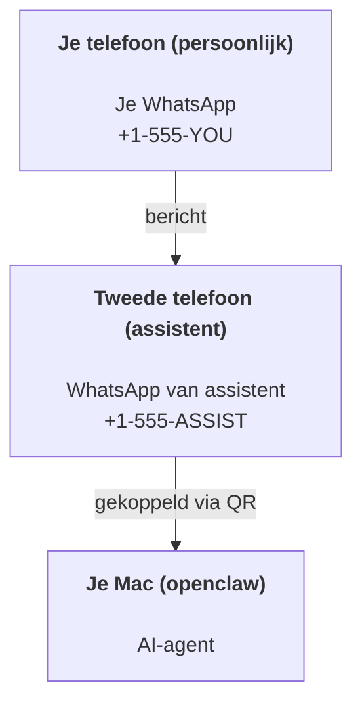

---
read_when:
    - Een nieuwe assistentinstantie onboarden
    - Gevolgen voor veiligheid en machtigingen beoordelen
summary: End-to-endhandleiding voor het gebruik van OpenClaw als persoonlijke assistent met veiligheidswaarschuwingen
title: Installatie van persoonlijke assistent
x-i18n:
    generated_at: "2026-07-16T16:27:06Z"
    model: gpt-5.6
    postprocess_version: locale-links-v1
    prompt_version: 32
    provider: openai
    source_hash: e8c34e31314f55647059fd600935330110add27b338a675bc0ce1529bebb207d
    source_path: start/openclaw.md
    workflow: 16
---

OpenClaw is een zelfgehoste Gateway die Discord, Google Chat, iMessage, Matrix, Microsoft Teams, Signal, Slack, Telegram, WhatsApp, Zalo en meer verbindt met AI-agents. Deze handleiding behandelt de configuratie als 'persoonlijke assistent': een speciaal WhatsApp-nummer dat zich gedraagt als je altijd beschikbare AI-assistent.

## Veiligheid voorop

Als je een agent toegang geeft tot een kanaal, kan deze opdrachten uitvoeren op je machine (afhankelijk van je toolbeleid), bestanden in je werkruimte lezen en schrijven en berichten verzenden via elk verbonden kanaal. Begin voorzichtig:

- Stel altijd `channels.whatsapp.allowFrom` in (stel je persoonlijke Mac nooit open voor de hele wereld).
- Gebruik een speciaal WhatsApp-nummer voor de assistent.
- Heartbeats worden standaard elke 30 minuten uitgevoerd. Schakel ze uit totdat je de configuratie vertrouwt door `agents.defaults.heartbeat.every: "0m"` in te stellen.

## Vereisten

- OpenClaw geïnstalleerd en de onboarding voltooid — zie [Aan de slag](/nl/start/getting-started) als je dit nog niet hebt gedaan
- Een tweede telefoonnummer (simkaart/eSIM/prepaid) voor de assistent

## De configuratie met twee telefoons (aanbevolen)

Dit is wat je wilt:



Als je je persoonlijke WhatsApp aan OpenClaw koppelt, wordt elk bericht aan jou 'agentinvoer'. Dat is zelden wat je wilt.

## Snelstart in 5 minuten

1. Koppel WhatsApp Web (toont een QR-code; scan deze met de telefoon van de assistent):

```bash
openclaw channels login
```

2. Start de Gateway (laat deze actief):

```bash
openclaw gateway --port 18789
```

3. Plaats een minimale configuratie in `~/.openclaw/openclaw.json`:

```json5
{
  gateway: { mode: "local" },
  channels: { whatsapp: { allowFrom: ["+15555550123"] } },
}
```

Stuur nu vanaf je telefoon op de toelatingslijst een bericht naar het nummer van de assistent.

Wanneer de onboarding is voltooid, opent OpenClaw automatisch het dashboard en toont het een overzichtelijke link (zonder token). Als het dashboard om authenticatie vraagt, plak je het geconfigureerde gedeelde geheim in de instellingen van de Control UI. Onboarding gebruikt standaard een token (`gateway.auth.token`), maar wachtwoordauthenticatie werkt ook als je `gateway.auth.mode` hebt gewijzigd in `password`. Later opnieuw openen: `openclaw dashboard`.

## Geef de agent een werkruimte (AGENTS)

OpenClaw leest bedieningsinstructies en 'geheugen' uit de werkruimtemap.

OpenClaw gebruikt standaard `~/.openclaw/workspace` als werkruimte van de agent en maakt deze (plus de eerste `AGENTS.md`, `SOUL.md`, `TOOLS.md`, `IDENTITY.md`, `USER.md`, `HEARTBEAT.md`) automatisch aan tijdens de onboarding of wanneer de agent voor het eerst wordt uitgevoerd. `BOOTSTRAP.md` wordt alleen voor een gloednieuwe werkruimte aangemaakt en hoort niet terug te komen nadat je het hebt verwijderd. `MEMORY.md` is optioneel en wordt nooit automatisch aangemaakt; als het aanwezig is, wordt het voor normale sessies geladen. Subagentsessies injecteren alleen `AGENTS.md` en `TOOLS.md`.

<Tip>
Behandel deze map als het geheugen van OpenClaw en maak er een git-repository van (bij voorkeur privé), zodat er een back-up van je `AGENTS.md` en geheugenbestanden wordt gemaakt. Als git is geïnstalleerd, worden gloednieuwe werkruimten automatisch geïnitialiseerd met `git init`.
</Tip>

Om de werkruimte- en configuratiemappen aan te maken zonder de volledige onboardingwizard uit te voeren:

```bash
openclaw setup --baseline
```

(Alleen `openclaw setup` is een alias voor `openclaw onboard` en voert de volledige interactieve wizard uit.)

Volledige indeling van de werkruimte en back-uphandleiding: [Agentwerkruimte](/nl/concepts/agent-workspace)
Geheugenworkflow: [Geheugen](/nl/concepts/memory)

Optioneel: kies een andere werkruimte met `agents.defaults.workspace` (ondersteunt `~`).

```json5
{
  agents: {
    defaults: {
      workspace: "~/.openclaw/workspace",
    },
  },
}
```

Als je al je eigen werkruimtebestanden vanuit een repository levert, kun je het aanmaken van bootstrapbestanden volledig uitschakelen:

```json5
{
  agents: {
    defaults: {
      skipBootstrap: true,
    },
  },
}
```

## De configuratie die er 'een assistent' van maakt

OpenClaw gebruikt standaard een goede assistentconfiguratie, maar doorgaans wil je het volgende aanpassen:

- persona/instructies in [`SOUL.md`](/nl/concepts/soul)
- standaardinstellingen voor denkwerk (indien gewenst)
- heartbeats (zodra je het systeem vertrouwt)

Voorbeeld:

```json5
{
  logging: { level: "info" },
  agents: {
    defaults: {
      model: { primary: "anthropic/claude-opus-4-8" },
      workspace: "~/.openclaw/workspace",
      thinkingDefault: "high",
      timeoutSeconds: 1800,
      // Begin met 0; schakel dit later in.
      heartbeat: { every: "0m" },
    },
    list: [
      {
        id: "main",
        default: true,
        groupChat: {
          mentionPatterns: ["@openclaw", "openclaw"],
        },
      },
    ],
  },
  channels: {
    whatsapp: {
      allowFrom: ["+15555550123"],
      groups: {
        "*": { requireMention: true },
      },
    },
  },
  session: {
    scope: "per-sender",
    resetTriggers: ["/new", "/reset"],
    reset: {
      mode: "daily",
      atHour: 4,
      idleMinutes: 10080,
    },
  },
}
```

## Sessies en geheugen

- Sessierijen, transcriptrijen en metagegevens (tokengebruik, laatste route enzovoort): `~/.openclaw/agents/<agentId>/agent/openclaw-agent.sqlite`
- Oudere/gearchiveerde transcriptartefacten: `~/.openclaw/agents/<agentId>/sessions/`
- Migratiebron voor oudere rijen: `~/.openclaw/agents/<agentId>/sessions/sessions.json`
- `/new` of `/reset` start een nieuwe sessie voor die chat (configureerbaar via `session.resetTriggers`). Als dit afzonderlijk wordt verzonden, bevestigt OpenClaw de reset zonder het model aan te roepen.
- `/compact [instructions]` comprimeert de sessiecontext en meldt het resterende contextbudget.

## Heartbeats (proactieve modus)

OpenClaw voert standaard elke 30 minuten een Heartbeat uit met de prompt:
`Read HEARTBEAT.md if it exists (workspace context). Follow it strictly. Do not infer or repeat old tasks from prior chats. If nothing needs attention, reply HEARTBEAT_OK.`
Stel `agents.defaults.heartbeat.every: "0m"` in om dit uit te schakelen.

- Als `HEARTBEAT.md` bestaat maar feitelijk leeg is (alleen lege regels, Markdown-/HTML-opmerkingen, Markdown-koppen zoals `# Heading`, fence-markeringen of lege controlelijstitems), slaat OpenClaw de Heartbeat-uitvoering over om API-aanroepen te besparen.
- Als het bestand ontbreekt, wordt de Heartbeat nog steeds uitgevoerd en bepaalt het model wat het moet doen.
- Als de agent antwoordt met `HEARTBEAT_OK` (eventueel met een korte opvulling; zie `agents.defaults.heartbeat.ackMaxChars`), onderdrukt OpenClaw de uitgaande bezorging voor die Heartbeat.
- De bezorging van Heartbeats aan DM-achtige `user:<id>`-doelen is standaard toegestaan. Stel `agents.defaults.heartbeat.directPolicy: "block"` in om bezorging aan directe doelen te onderdrukken terwijl de Heartbeat-uitvoeringen actief blijven.
- Heartbeats voeren volledige agentbeurten uit — kortere intervallen verbruiken meer tokens.

```json5
{
  agents: {
    defaults: {
      heartbeat: { every: "30m" },
    },
  },
}
```

## Inkomende en uitgaande media

Inkomende bijlagen (afbeeldingen/audio/documenten) kunnen via sjablonen aan je opdracht beschikbaar worden gesteld:

- `{{MediaPath}}` (pad naar lokaal tijdelijk bestand)
- `{{MediaUrl}}` (pseudo-URL)
- `{{Transcript}}` (als audiotranscriptie is ingeschakeld)

Uitgaande bijlagen van de agent gebruiken gestructureerde mediavelden in de berichttool of antwoordpayload, zoals `media`, `mediaUrl`, `mediaUrls`, `path` of `filePath`. Voorbeeldargumenten voor de berichttool:

```json
{
  "message": "Hier is de schermafbeelding.",
  "mediaUrl": "https://example.com/screenshot.png"
}
```

OpenClaw verzendt gestructureerde media samen met de tekst. Oudere definitieve assistentantwoorden kunnen nog steeds voor compatibiliteit worden genormaliseerd, maar tooluitvoer, browseruitvoer, streamingblokken en berichtacties interpreteren tekst niet als opdrachten voor bijlagen.

Het gedrag van lokale paden volgt hetzelfde vertrouwensmodel voor het lezen van bestanden als de agent:

- Als `tools.fs.workspaceOnly` `true` is, blijven uitgaande lokale mediapaden beperkt tot de tijdelijke hoofdmap van OpenClaw, de mediacache, paden in de agentwerkruimte en door de sandbox gegenereerde bestanden.
- Als `tools.fs.workspaceOnly` `false` is, kunnen uitgaande lokale media bestanden op de host gebruiken die de agent al mag lezen.
- Lokale paden kunnen absoluut, relatief aan de werkruimte of relatief aan de thuismap met `~/` zijn.
- Verzending vanaf de lokale host staat nog steeds alleen media en veilige documenttypen toe (afbeeldingen, audio, video, PDF, Office-documenten en gevalideerde tekstdocumenten zoals Markdown/MD, TXT, JSON, YAML en YML). Dit is een uitbreiding van de bestaande vertrouwensgrens voor het lezen vanaf de host, geen scanner voor geheimen: als de agent een lokaal `secret.txt`- of `config.json`-bestand op de host kan lezen, kan de agent dat bestand bijvoegen wanneer de extensie- en inhoudsvalidatie overeenkomen.

Bewaar gevoelige bestanden buiten het bestandssysteem dat de agent kan lezen, of behoud `tools.fs.workspaceOnly: true` voor strengere verzending via lokale paden.

## Controlelijst voor beheer

```bash
openclaw status          # lokale status (referenties, sessies, gebeurtenissen in de wachtrij)
openclaw status --all    # volledige diagnose (alleen-lezen, geschikt om te plakken)
openclaw status --deep   # kanalen controleren (WhatsApp Web + Telegram + Discord + Slack + Signal)
openclaw health --json   # momentopname van Gateway-status via de WS-verbinding
```

Logboeken staan onder `/tmp/openclaw/` (standaard: `openclaw-YYYY-MM-DD.log`).

## Volgende stappen

- WebChat: [WebChat](/nl/web/webchat)
- Gateway-beheer: [Gateway-draaiboek](/nl/gateway)
- Cron + weksignalen: [Cron-taken](/nl/automation/cron-jobs)
- macOS-menubalkapp: [OpenClaw-app voor macOS](/nl/platforms/macos)
- iOS-Node-app: [iOS-app](/nl/platforms/ios)
- Android-Node-app: [Android-app](/nl/platforms/android)
- Windows Hub: [Windows](/nl/platforms/windows)
- Linux-status: [Linux-app](/nl/platforms/linux)
- Beveiliging: [Beveiliging](/nl/gateway/security)

## Gerelateerd

- [Aan de slag](/nl/start/getting-started)
- [Configuratie](/nl/start/setup)
- [Overzicht van kanalen](/nl/channels)
