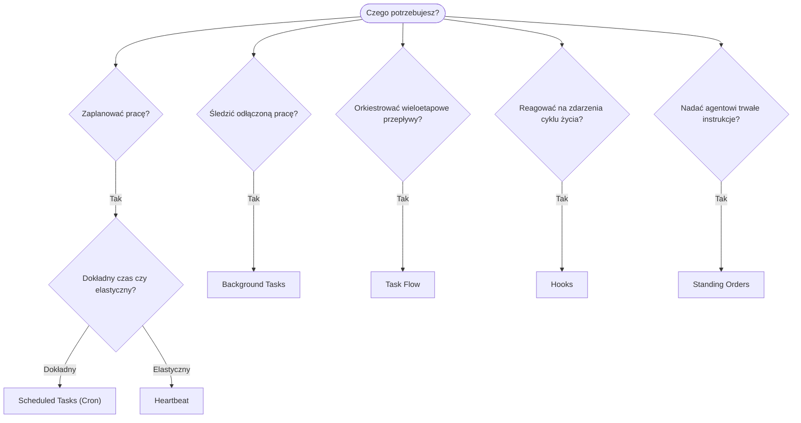

---
read_when:
    - Decydowanie, jak zautomatyzować pracę z OpenClaw
    - Wybór między Heartbeat, Cron, hookami i stałymi poleceniami
    - Szukasz właściwego punktu wejścia do automatyzacji
summary: 'Przegląd mechanizmów automatyzacji: zadania, Cron, hooki, stałe polecenia i TaskFlow'
title: Automatyzacja i zadania
x-i18n:
    generated_at: "2026-04-24T08:57:18Z"
    model: gpt-5.4
    provider: openai
    source_hash: 1b4615cc05a6d0ef7c92f44072d11a2541bc5e17b7acb88dc27ddf0c36b2dcab
    source_path: automation/index.md
    workflow: 15
---

OpenClaw uruchamia pracę w tle za pomocą zadań, zaplanowanych zadań, hooków zdarzeń i stałych instrukcji. Ta strona pomaga wybrać właściwy mechanizm i zrozumieć, jak do siebie pasują.

## Szybki przewodnik decyzyjny

| Przypadek użycia                         | Zalecane               | Dlaczego                                        |
| ---------------------------------------- | ---------------------- | ------------------------------------------------ |
| Wysyłanie codziennego raportu dokładnie o 9:00 | Scheduled Tasks (Cron) | Dokładne wyczucie czasu, izolowane wykonanie     |
| Przypomnij mi za 20 minut                | Scheduled Tasks (Cron) | Jednorazowe uruchomienie z precyzyjnym czasem (`--at`) |
| Uruchamianie cotygodniowej dogłębnej analizy | Scheduled Tasks (Cron) | Samodzielne zadanie, może używać innego modelu   |
| Sprawdzanie skrzynki odbiorczej co 30 min | Heartbeat              | Łączy się z innymi sprawdzeniami, świadome kontekstu |
| Monitorowanie kalendarza pod kątem nadchodzących wydarzeń | Heartbeat              | Naturalne dopasowanie do okresowej obserwacji    |
| Sprawdzanie statusu subagenta lub uruchomienia ACP | Background Tasks       | Rejestr zadań śledzi całą odłączoną pracę         |
| Audyt tego, co zostało uruchomione i kiedy | Background Tasks       | `openclaw tasks list` i `openclaw tasks audit`   |
| Wieloetapowe badanie, a potem podsumowanie | Task Flow              | Trwała orkiestracja ze śledzeniem rewizji        |
| Uruchamianie skryptu przy resetowaniu sesji | Hooks                  | Oparte na zdarzeniach, uruchamiane przy zdarzeniach cyklu życia |
| Wykonywanie kodu przy każdym wywołaniu narzędzia | Hooks                  | Hooki mogą filtrować według typu zdarzenia       |
| Zawsze sprawdzaj zgodność przed odpowiedzią | Standing Orders        | Automatycznie wstrzykiwane do każdej sesji       |

### Scheduled Tasks (Cron) vs Heartbeat

| Wymiar          | Scheduled Tasks (Cron)             | Heartbeat                            |
| ---------------- | ---------------------------------- | ------------------------------------ |
| Czas             | Dokładny (wyrażenia cron, jednorazowo) | Przybliżony (domyślnie co 30 min)     |
| Kontekst sesji   | Świeży (izolowany) lub współdzielony | Pełny kontekst głównej sesji         |
| Rekordy zadań    | Zawsze tworzone                    | Nigdy nie są tworzone                |
| Dostarczanie     | Kanał, webhook lub bez wyjścia     | Inline w głównej sesji               |
| Najlepsze do     | Raportów, przypomnień, zadań w tle | Sprawdzania skrzynki, kalendarza, powiadomień |

Użyj Scheduled Tasks (Cron), gdy potrzebujesz precyzyjnego wyczucia czasu lub izolowanego wykonania. Użyj Heartbeat, gdy praca korzysta z pełnego kontekstu sesji, a przybliżony czas jest wystarczający.

## Podstawowe pojęcia

### Zaplanowane zadania (cron)

Cron to wbudowany w Gateway harmonogram do precyzyjnego planowania czasu. Utrwala zadania, wybudza agenta we właściwym momencie i może dostarczać wynik do kanału czatu lub punktu końcowego Webhook. Obsługuje jednorazowe przypomnienia, wyrażenia cykliczne i przychodzące wyzwalacze webhooków.

Zobacz [Scheduled Tasks](/pl/automation/cron-jobs).

### Zadania

Rejestr zadań w tle śledzi całą odłączoną pracę: uruchomienia ACP, uruchamianie subagentów, izolowane wykonania cron i operacje CLI. Zadania to rekordy, a nie harmonogramy. Użyj `openclaw tasks list` i `openclaw tasks audit`, aby je sprawdzać.

Zobacz [Background Tasks](/pl/automation/tasks).

### Task Flow

Task Flow to warstwa orkiestracji przepływów ponad zadaniami w tle. Zarządza trwałymi wieloetapowymi przepływami z zarządzanymi i lustrzanymi trybami synchronizacji, śledzeniem rewizji oraz `openclaw tasks flow list|show|cancel` do inspekcji.

Zobacz [Task Flow](/pl/automation/taskflow).

### Stałe polecenia

Stałe polecenia dają agentowi stałe uprawnienie operacyjne dla określonych programów. Znajdują się w plikach obszaru roboczego (zwykle `AGENTS.md`) i są wstrzykiwane do każdej sesji. Łącz je z cron do egzekwowania opartego na czasie.

Zobacz [Standing Orders](/pl/automation/standing-orders).

### Hooki

Hooki to skrypty sterowane zdarzeniami, wyzwalane przez zdarzenia cyklu życia agenta (`/new`, `/reset`, `/stop`), Compaction sesji, uruchomienie gateway, przepływ wiadomości i wywołania narzędzi. Hooki są automatycznie wykrywane z katalogów i można nimi zarządzać za pomocą `openclaw hooks`.

Zobacz [Hooks](/pl/automation/hooks).

### Heartbeat

Heartbeat to okresowa tura głównej sesji (domyślnie co 30 minut). Łączy wiele sprawdzeń (skrzynka odbiorcza, kalendarz, powiadomienia) w jednej turze agenta z pełnym kontekstem sesji. Tury Heartbeat nie tworzą rekordów zadań. Użyj `HEARTBEAT.md` dla małej listy kontrolnej albo bloku `tasks:`, jeśli chcesz sprawdzeń okresowych tylko wtedy, gdy przypada termin, wewnątrz samego heartbeat. Puste pliki heartbeat są pomijane jako `empty-heartbeat-file`; tryb zadań tylko-po-terminie jest pomijany jako `no-tasks-due`.

Zobacz [Heartbeat](/pl/gateway/heartbeat).

## Jak to działa razem

- **Cron** obsługuje precyzyjne harmonogramy (codzienne raporty, cotygodniowe przeglądy) i jednorazowe przypomnienia. Wszystkie wykonania cron tworzą rekordy zadań.
- **Heartbeat** obsługuje rutynowe monitorowanie (skrzynka odbiorcza, kalendarz, powiadomienia) w jednej łączonej turze co 30 minut.
- **Hooks** reagują na określone zdarzenia (wywołania narzędzi, resetowanie sesji, compaction) za pomocą niestandardowych skryptów.
- **Standing Orders** dają agentowi trwały kontekst i granice uprawnień.
- **Task Flow** koordynuje wieloetapowe przepływy ponad pojedynczymi zadaniami.
- **Tasks** automatycznie śledzą całą odłączoną pracę, dzięki czemu możesz ją sprawdzać i audytować.

## Powiązane

- [Scheduled Tasks](/pl/automation/cron-jobs) — precyzyjne harmonogramowanie i jednorazowe przypomnienia
- [Background Tasks](/pl/automation/tasks) — rejestr zadań dla całej odłączonej pracy
- [Task Flow](/pl/automation/taskflow) — trwała orkiestracja wieloetapowych przepływów
- [Hooks](/pl/automation/hooks) — skrypty cyklu życia sterowane zdarzeniami
- [Standing Orders](/pl/automation/standing-orders) — trwałe instrukcje agenta
- [Heartbeat](/pl/gateway/heartbeat) — okresowe tury głównej sesji
- [Configuration Reference](/pl/gateway/configuration-reference) — wszystkie klucze konfiguracji
