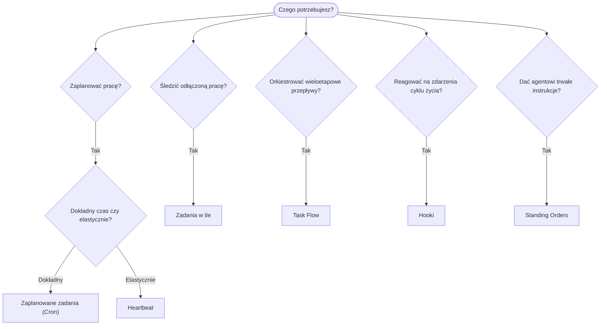

---
read_when:
    - Gdy decydujesz, jak zautomatyzować pracę z OpenClaw
    - Gdy wybierasz między heartbeat, cron, hookami i standing orders
    - Gdy szukasz odpowiedniego punktu wejścia do automatyzacji
summary: 'Przegląd mechanizmów automatyzacji: zadania, cron, hooki, standing orders i Task Flow'
title: Automatyzacja i zadania
x-i18n:
    generated_at: "2026-04-05T13:42:27Z"
    model: gpt-5.4
    provider: openai
    source_hash: 13cd05dcd2f38737f7bb19243ad1136978bfd727006fd65226daa3590f823afe
    source_path: automation/index.md
    workflow: 15
---

# Automatyzacja i zadania

OpenClaw uruchamia pracę w tle za pomocą zadań, zaplanowanych zadań, hooków zdarzeń i stałych instrukcji. Ta strona pomaga wybrać odpowiedni mechanizm i zrozumieć, jak są ze sobą powiązane.

## Szybki przewodnik decyzyjny

| Przypadek użycia                         | Zalecane               | Dlaczego                                        |
| ---------------------------------------- | ---------------------- | ------------------------------------------------ |
| Wysyłaj codzienny raport dokładnie o 9:00 | Zaplanowane zadania (Cron) | Dokładny czas, odizolowane wykonanie             |
| Przypomnij mi za 20 minut                | Zaplanowane zadania (Cron) | Jednorazowe z precyzyjnym czasem (`--at`)        |
| Uruchamiaj cotygodniową dogłębną analizę | Zaplanowane zadania (Cron) | Samodzielne zadanie, może używać innego modelu   |
| Sprawdzaj skrzynkę odbiorczą co 30 min   | Heartbeat              | Grupuje się z innymi sprawdzeniami, świadome kontekstu |
| Monitoruj kalendarz pod kątem nadchodzących wydarzeń | Heartbeat | Naturalne dopasowanie do okresowej kontroli      |
| Sprawdzaj stan subagenta lub przebiegu ACP | Zadania w tle        | Rejestr zadań śledzi całą odłączoną pracę        |
| Audytuj, co zostało uruchomione i kiedy  | Zadania w tle          | `openclaw tasks list` i `openclaw tasks audit`   |
| Wieloetapowe badanie, a potem podsumowanie | Task Flow            | Trwała orkiestracja ze śledzeniem wersji         |
| Uruchom skrypt przy resecie sesji        | Hooki                  | Sterowane zdarzeniami, uruchamiane przy zdarzeniach cyklu życia |
| Wykonuj kod przy każdym wywołaniu narzędzia | Hooki                | Hooki mogą filtrować według typu zdarzenia       |
| Zawsze sprawdzaj zgodność przed odpowiedzią | Standing Orders      | Automatycznie wstrzykiwane do każdej sesji       |

### Zaplanowane zadania (Cron) a Heartbeat

| Wymiar          | Zaplanowane zadania (Cron)          | Heartbeat                            |
| --------------- | ----------------------------------- | ------------------------------------ |
| Czas            | Dokładny (wyrażenia cron, jednorazowe) | Przybliżony (domyślnie co 30 min) |
| Kontekst sesji  | Świeży (odizolowany) lub współdzielony | Pełny kontekst głównej sesji      |
| Rekordy zadań   | Tworzone zawsze                     | Nigdy nie są tworzone                |
| Dostarczanie    | Kanał, webhook lub po cichu         | Bezpośrednio w głównej sesji         |
| Najlepsze do    | Raportów, przypomnień, zadań w tle  | Sprawdzania skrzynki, kalendarza, powiadomień |

Używaj zaplanowanych zadań (Cron), gdy potrzebujesz precyzyjnego czasu lub odizolowanego wykonania. Używaj Heartbeat, gdy zadanie korzysta z pełnego kontekstu sesji i przybliżony czas jest wystarczający.

## Podstawowe pojęcia

### Zaplanowane zadania (cron)

Cron to wbudowany harmonogram Gateway służący do precyzyjnego planowania czasu. Utrwala zadania, wybudza agenta we właściwym momencie i może dostarczać wynik do kanału czatu lub punktu końcowego webhooka. Obsługuje jednorazowe przypomnienia, wyrażenia cykliczne i przychodzące wyzwalacze webhooków.

Zobacz [Scheduled Tasks](/automation/cron-jobs).

### Zadania

Rejestr zadań w tle śledzi całą odłączoną pracę: przebiegi ACP, uruchomienia subagentów, odizolowane wykonania cron i operacje CLI. Zadania to rekordy, a nie harmonogramy. Użyj `openclaw tasks list` i `openclaw tasks audit`, aby je sprawdzać.

Zobacz [Background Tasks](/automation/tasks).

### Task Flow

Task Flow to warstwa orkiestracji przepływów ponad zadaniami w tle. Zarządza trwałymi wieloetapowymi przepływami z zarządzanymi i lustrzanymi trybami synchronizacji, śledzeniem wersji oraz `openclaw tasks flow list|show|cancel` do ich sprawdzania.

Zobacz [Task Flow](/automation/taskflow).

### Standing Orders

Standing Orders przyznają agentowi stałe uprawnienia operacyjne dla zdefiniowanych programów. Znajdują się w plikach przestrzeni roboczej (zwykle `AGENTS.md`) i są wstrzykiwane do każdej sesji. Połącz je z cron, aby wymuszać działania zależne od czasu.

Zobacz [Standing Orders](/automation/standing-orders).

### Hooki

Hooki to skrypty sterowane zdarzeniami, wyzwalane przez zdarzenia cyklu życia agenta (`/new`, `/reset`, `/stop`), kompaktowanie sesji, uruchamianie gateway, przepływ wiadomości i wywołania narzędzi. Hooki są automatycznie wykrywane z katalogów i można nimi zarządzać za pomocą `openclaw hooks`.

Zobacz [Hooks](/automation/hooks).

### Heartbeat

Heartbeat to okresowy obrót głównej sesji (domyślnie co 30 minut). Grupuje wiele kontroli (skrzynka odbiorcza, kalendarz, powiadomienia) w jednym obrocie agenta z pełnym kontekstem sesji. Obroty Heartbeat nie tworzą rekordów zadań. Używaj `HEARTBEAT.md` dla krótkiej listy kontrolnej albo bloku `tasks:`, gdy chcesz wykonywać tylko okresowe kontrole z terminem w samym heartbeat. Puste pliki heartbeat są pomijane jako `empty-heartbeat-file`; tryb zadań tylko-z-terminem jest pomijany jako `no-tasks-due`.

Zobacz [Heartbeat](/gateway/heartbeat).

## Jak to działa razem

- **Cron** obsługuje precyzyjne harmonogramy (codzienne raporty, cotygodniowe przeglądy) i jednorazowe przypomnienia. Wszystkie wykonania cron tworzą rekordy zadań.
- **Heartbeat** obsługuje rutynowe monitorowanie (skrzynka odbiorcza, kalendarz, powiadomienia) w jednym zgrupowanym obrocie co 30 minut.
- **Hooki** reagują na określone zdarzenia (wywołania narzędzi, resety sesji, kompaktowanie) za pomocą niestandardowych skryptów.
- **Standing Orders** zapewniają agentowi trwały kontekst i granice uprawnień.
- **Task Flow** koordynuje wieloetapowe przepływy ponad pojedynczymi zadaniami.
- **Zadania** automatycznie śledzą całą odłączoną pracę, aby można ją było sprawdzać i audytować.

## Powiązane

- [Scheduled Tasks](/automation/cron-jobs) — precyzyjne harmonogramowanie i jednorazowe przypomnienia
- [Background Tasks](/automation/tasks) — rejestr zadań dla całej odłączonej pracy
- [Task Flow](/automation/taskflow) — trwała orkiestracja wieloetapowych przepływów
- [Hooks](/automation/hooks) — skrypty cyklu życia sterowane zdarzeniami
- [Standing Orders](/automation/standing-orders) — trwałe instrukcje agenta
- [Heartbeat](/gateway/heartbeat) — okresowe obroty głównej sesji
- [Configuration Reference](/gateway/configuration-reference) — wszystkie klucze konfiguracji
