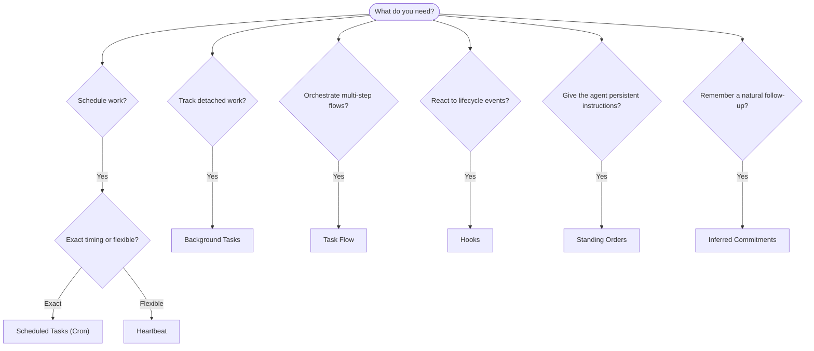

OpenClaw wykonuje pracę w tle za pomocą zadań, zaplanowanych zadań, wywnioskowanych
zobowiązań, hooków zdarzeń i stałych instrukcji. Ta strona pomoże wybrać
odpowiedni mechanizm.

## Krótki przewodnik wyboru

| Przypadek użycia                                          | Zalecany mechanizm       | Dlaczego                                                |
| --------------------------------------------------------- | ------------------------ | ------------------------------------------------------- |
| Wysyłanie codziennego raportu punktualnie o 9:00          | Zaplanowane zadania (Cron) | Dokładny czas, izolowane wykonanie                     |
| Przypomnienie za 20 minut                                 | Zaplanowane zadania (Cron) | Jednorazowe wykonanie o precyzyjnej porze (`--at`)     |
| Cotygodniowa pogłębiona analiza                           | Zaplanowane zadania (Cron) | Samodzielne zadanie, może używać innego modelu         |
| Sprawdzanie skrzynki odbiorczej co 30 minut               | Heartbeat                | Grupowanie z innymi kontrolami, uwzględnianie kontekstu |
| Monitorowanie kalendarza pod kątem nadchodzących wydarzeń | Heartbeat                | Naturalne rozwiązanie do okresowego monitorowania       |
| Kontakt po wspomnianej rozmowie kwalifikacyjnej           | Wywnioskowane zobowiązania | Dalszy kontakt przypominający pamięć, bez żądania przypomnienia o dokładnej porze |
| Dyskretne sprawdzenie samopoczucia na podstawie kontekstu użytkownika | Wywnioskowane zobowiązania | Ograniczenie do tego samego agenta i kanału |
| Sprawdzanie stanu subagenta lub uruchomienia ACP           | Zadania w tle            | Rejestr zadań śledzi wszystkie odłączone prace           |
| Audyt wykonanych działań i czasu ich wykonania             | Zadania w tle            | `openclaw tasks list` i `openclaw tasks audit`           |
| Wieloetapowe badanie zakończone podsumowaniem              | Przepływ zadań           | Trwała orkiestracja ze śledzeniem wersji                 |
| Uruchamianie skryptu po zresetowaniu sesji                 | Hooki                    | Działanie sterowane zdarzeniami cyklu życia              |
| Wykonywanie kodu przy każdym wywołaniu narzędzia           | Hooki Pluginu            | Hooki wewnątrz procesu mogą przechwytywać wywołania narzędzi |
| Sprawdzanie zgodności przed każdą odpowiedzią              | Stałe polecenia          | Automatyczne wstrzykiwanie do każdej sesji               |

### Zaplanowane zadania (Cron) a Heartbeat

| Wymiar           | Zaplanowane zadania (Cron)          | Heartbeat                                  |
| ---------------- | ----------------------------------- | ------------------------------------------ |
| Czas             | Dokładny (wyrażenia cron, jednorazowo) | Przybliżony (domyślnie co 30 minut)      |
| Kontekst sesji   | Nowy (izolowany) lub współdzielony  | Pełny kontekst sesji głównej               |
| Rekordy zadań    | Zawsze tworzone                     | Nigdy nietworzone                          |
| Dostarczanie     | Kanał, webhook lub bez powiadomienia | Bezpośrednio w sesji głównej              |
| Najlepsze do     | Raportów, przypomnień i zadań w tle | Sprawdzania skrzynki, kalendarza i powiadomień |

Używaj zaplanowanych zadań (Cron), gdy potrzebujesz precyzyjnego czasu lub izolowanego wykonania. Używaj Heartbeat, gdy praca korzysta z pełnego kontekstu sesji i wystarczy przybliżony czas wykonania.

## Podstawowe pojęcia

### Zaplanowane zadania (Cron)

Cron to wbudowany w Gateway harmonogram zapewniający precyzyjne wykonywanie zadań. Trwale przechowuje zadania, aktywuje agenta we właściwym czasie i może dostarczać wyniki do kanału czatu lub punktu końcowego webhooka. Obsługuje jednorazowe przypomnienia, cykliczne wyrażenia i wyzwalacze przychodzących webhooków.

Zobacz [Zaplanowane zadania](/pl/automation/cron-jobs).

### Zadania

Rejestr zadań w tle śledzi wszystkie odłączone prace: uruchomienia ACP, tworzenie subagentów, izolowane wykonania Cron i operacje CLI. Zadania są rekordami, a nie harmonogramami. Do ich sprawdzania używaj poleceń `openclaw tasks list` i `openclaw tasks audit`.

Zobacz [Zadania w tle](/pl/automation/tasks).

### Wywnioskowane zobowiązania

Zobowiązania to opcjonalne, krótkotrwałe wspomnienia o konieczności dalszego kontaktu. OpenClaw wywnioskuje je
ze zwykłych rozmów, ogranicza do tego samego agenta i kanału oraz
dostarcza zaplanowane sprawdzenia za pośrednictwem Heartbeat. Przypomnienia, o które użytkownik poprosił na konkretną porę, nadal
należą do Cron.

Zobacz [Wywnioskowane zobowiązania](/pl/concepts/commitments).

### Przepływ zadań

Przepływ zadań to warstwa orkiestracji przepływów działająca nad zadaniami w tle. Zarządza trwałymi, wieloetapowymi przepływami z zarządzanymi i lustrzanymi trybami synchronizacji, śledzeniem wersji oraz poleceniami `openclaw tasks flow list|show|cancel` służącymi do ich sprawdzania.

Zobacz [Przepływ zadań](/pl/automation/taskflow).

### Stałe polecenia

Stałe polecenia przyznają agentowi trwałe uprawnienia operacyjne w ramach określonych programów. Znajdują się w plikach przestrzeni roboczej (zwykle `AGENTS.md`) i są wstrzykiwane do każdej sesji. Połącz je z Cron, aby wymuszać działania zależne od czasu.

Zobacz [Stałe polecenia](/pl/automation/standing-orders).

### Hooki

Wewnętrzne hooki to skrypty sterowane zdarzeniami, uruchamiane przez zdarzenia cyklu życia agenta
(`/new`, `/reset`, `/stop`), Compaction sesji, uruchomienie Gateway i przepływ
wiadomości. Są wykrywane w katalogach hooków i zarządzane za pomocą
`openclaw hooks`. Do przechwytywania wywołań narzędzi wewnątrz procesu używaj
[hooków Pluginu](/pl/plugins/hooks).

Zobacz [Hooki](/pl/automation/hooks).

### Heartbeat

Heartbeat to okresowa tura sesji głównej (domyślnie co 30 minut). Grupuje wiele kontroli (skrzynki odbiorczej, kalendarza i powiadomień) w jednej turze agenta z pełnym kontekstem sesji. Tury Heartbeat nie tworzą rekordów zadań ani nie przedłużają okresu świeżości przed dziennym resetem sesji lub resetem z powodu bezczynności. Użyj pliku `HEARTBEAT.md` jako krótkiej listy kontrolnej albo bloku `tasks:`, jeśli w samym Heartbeat chcesz wykonywać tylko okresowe kontrole, których termin już nadszedł. Puste pliki Heartbeat powodują pominięcie z kodem `empty-heartbeat-file`, a tryb zadań wykonywanych wyłącznie w terminie — z kodem `no-tasks-due`. Heartbeat jest odraczany, gdy praca Cron jest aktywna lub oczekuje w kolejce, a opcja `heartbeat.skipWhenBusy` może również odroczyć agenta, gdy powiązany z kluczem sesji subagent tego samego agenta lub jego zagnieżdżone ścieżki są zajęte.

Zobacz [Heartbeat](/pl/gateway/heartbeat).

## Jak współpracują

- **Cron** obsługuje precyzyjne harmonogramy (codzienne raporty, cotygodniowe przeglądy) i jednorazowe przypomnienia. Wszystkie wykonania Cron tworzą rekordy zadań.
- **Heartbeat** obsługuje rutynowe monitorowanie (skrzynki odbiorczej, kalendarza i powiadomień) w jednej zbiorczej turze co 30 minut.
- **Hooki** reagują na konkretne zdarzenia (resetowanie sesji, Compaction, przepływ wiadomości) za pomocą niestandardowych skryptów. Hooki Pluginu obejmują wywołania narzędzi.
- **Stałe polecenia** zapewniają agentowi trwały kontekst i granice uprawnień.
- **Przepływ zadań** koordynuje wieloetapowe przepływy ponad pojedynczymi zadaniami.
- **Zadania** automatycznie śledzą wszystkie odłączone prace, umożliwiając ich sprawdzanie i audytowanie.

## Powiązane

- [Zaplanowane zadania](/pl/automation/cron-jobs) — precyzyjne planowanie i jednorazowe przypomnienia
- [Wywnioskowane zobowiązania](/pl/concepts/commitments) — dalsze kontakty przypominające działanie pamięci
- [Zadania w tle](/pl/automation/tasks) — rejestr wszystkich odłączonych prac
- [Przepływ zadań](/pl/automation/taskflow) — trwała orkiestracja wieloetapowych przepływów
- [Hooki](/pl/automation/hooks) — sterowane zdarzeniami skrypty cyklu życia
- [Hooki Pluginu](/pl/plugins/hooks) — działające wewnątrz procesu hooki narzędzi, promptów, wiadomości i cyklu życia
- [Stałe polecenia](/pl/automation/standing-orders) — trwałe instrukcje agenta
- [Heartbeat](/pl/gateway/heartbeat) — okresowe tury sesji głównej
- [Dokumentacja konfiguracji](/pl/gateway/configuration-reference) — wszystkie klucze konfiguracji
