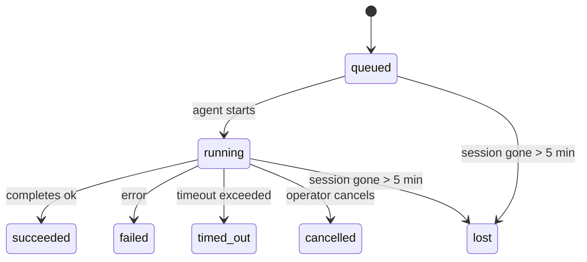

---
read_when:
    - Sprawdzanie trwających lub niedawno ukończonych prac w tle
    - Debugowanie niepowodzeń dostarczania dla odłączonych uruchomień agentów
    - Zrozumienie relacji między uruchomieniami w tle a sesjami, Cron i Heartbeat
sidebarTitle: Background tasks
summary: Śledzenie zadań w tle dla uruchomień ACP, subagentów, izolowanych zadań Cron i operacji CLI
title: Zadania w tle
x-i18n:
    generated_at: "2026-05-10T19:21:13Z"
    model: gpt-5.5
    provider: openai
    source_hash: 5764a89634f90181d826ff3990ec8dac9538239074934d30fd446c1eb4564869
    source_path: automation/tasks.md
    workflow: 16
---

<Note>
Szukasz planowania? Zobacz [Automatyzacja i zadania](/pl/automation), aby wybrać właściwy mechanizm. Ta strona jest dziennikiem aktywności dla pracy w tle, a nie harmonogramem.
</Note>

Zadania w tle śledzą pracę wykonywaną **poza główną sesją konwersacji**: uruchomienia ACP, tworzenie subagentów, izolowane wykonania zadań Cron oraz operacje inicjowane przez CLI.

Zadania **nie** zastępują sesji, zadań Cron ani Heartbeat - są **dziennikiem aktywności**, który zapisuje, jaka odłączona praca została wykonana, kiedy i czy zakończyła się powodzeniem.

<Note>
Nie każde uruchomienie agenta tworzy zadanie. Tury Heartbeat i zwykły czat interaktywny tego nie robią. Wszystkie wykonania Cron, uruchomienia ACP, uruchomienia subagentów i polecenia agenta CLI to robią.
</Note>

## TL;DR

- Zadania to **rekordy**, nie harmonogramy - Cron i Heartbeat decydują, _kiedy_ praca jest uruchamiana, a zadania śledzą, _co się stało_.
- ACP, subagenci, wszystkie zadania Cron i operacje CLI tworzą zadania. Tury Heartbeat tego nie robią.
- Każde zadanie przechodzi przez `queued → running → terminal` (succeeded, failed, timed_out, cancelled albo lost).
- Zadania Cron pozostają aktywne, dopóki środowisko wykonawcze Cron nadal posiada zadanie; jeśli
  stan środowiska wykonawczego w pamięci zniknął, utrzymanie zadań najpierw sprawdza trwałą historię
  uruchomień Cron, zanim oznaczy zadanie jako lost.
- Ukończenie jest sterowane wypychaniem: odłączona praca może powiadomić bezpośrednio lub wybudzić
  sesję/Heartbeat zlecającego po zakończeniu, więc pętle odpytywania statusu mają
  zwykle niewłaściwy kształt.
- Izolowane uruchomienia Cron i ukończenia subagentów podejmują najlepszą możliwą próbę wyczyszczenia śledzonych kart przeglądarki/procesów dla swojej sesji podrzędnej przed końcowym księgowaniem czyszczenia.
- Izolowane dostarczanie Cron tłumi nieaktualne pośrednie odpowiedzi nadrzędne, gdy praca potomnych subagentów nadal się opróżnia, i preferuje końcowy wynik potomny, jeśli nadejdzie przed dostarczeniem.
- Powiadomienia o ukończeniu są dostarczane bezpośrednio do kanału albo kolejkowane do następnego Heartbeat.
- `openclaw tasks list` pokazuje wszystkie zadania; `openclaw tasks audit` ujawnia problemy.
- Rekordy końcowe są przechowywane przez 7 dni, a następnie automatycznie usuwane.

## Szybki start

<Tabs>
  <Tab title="Lista i filtrowanie">
    ```bash
    # List all tasks (newest first)
    openclaw tasks list

    # Filter by runtime or status
    openclaw tasks list --runtime acp
    openclaw tasks list --status running
    ```

  </Tab>
  <Tab title="Inspekcja">
    ```bash
    # Show details for a specific task (by ID, run ID, or session key)
    openclaw tasks show <lookup>
    ```
  </Tab>
  <Tab title="Anulowanie i powiadomienia">
    ```bash
    # Cancel a running task (kills the child session)
    openclaw tasks cancel <lookup>

    # Change notification policy for a task
    openclaw tasks notify <lookup> state_changes
    ```

  </Tab>
  <Tab title="Audyt i utrzymanie">
    ```bash
    # Run a health audit
    openclaw tasks audit

    # Preview or apply maintenance
    openclaw tasks maintenance
    openclaw tasks maintenance --apply
    ```

  </Tab>
  <Tab title="Przepływ zadań">
    ```bash
    # Inspect TaskFlow state
    openclaw tasks flow list
    openclaw tasks flow show <lookup>
    openclaw tasks flow cancel <lookup>
    ```
  </Tab>
</Tabs>

## Co tworzy zadanie

| Źródło                 | Typ środowiska wykonawczego | Kiedy tworzony jest rekord zadania                      | Domyślna polityka powiadomień |
| ---------------------- | ------------ | ------------------------------------------------------ | --------------------- |
| Uruchomienia ACP w tle | `acp`        | Tworzenie podrzędnej sesji ACP                         | `done_only`           |
| Orkiestracja subagentów | `subagent`   | Tworzenie subagenta przez `sessions_spawn`             | `done_only`           |
| Zadania Cron (wszystkie typy) | `cron`       | Każde wykonanie Cron (w sesji głównej i izolowane)     | `silent`              |
| Operacje CLI           | `cli`        | Polecenia `openclaw agent`, które przechodzą przez Gateway | `silent`              |
| Zadania multimedialne agenta | `cli`        | Uruchomienia `music_generate`/`video_generate` oparte na sesji | `silent`              |

<AccordionGroup>
  <Accordion title="Domyślne powiadomienia dla Cron i multimediów">
    Zadania Cron w sesji głównej domyślnie używają polityki powiadomień `silent` - tworzą rekordy do śledzenia, ale nie generują powiadomień. Izolowane zadania Cron także domyślnie używają `silent`, ale są bardziej widoczne, ponieważ działają we własnej sesji.

    Uruchomienia `music_generate` i `video_generate` oparte na sesji także używają polityki powiadomień `silent`. Nadal tworzą rekordy zadań, ale ukończenie jest przekazywane z powrotem do oryginalnej sesji agenta jako wewnętrzne wybudzenie, aby agent mógł sam napisać wiadomość uzupełniającą i dołączyć ukończone multimedia. Ukończenia w grupach/kanałach są zgodne ze zwykłą polityką widocznych odpowiedzi, więc agent używa narzędzia wiadomości, gdy wymaga tego dostarczanie źródłowe. Jeśli agent ukończenia nie dostarczy dowodu dostarczenia przez narzędzie wiadomości w trasie wyłącznie narzędziowej, OpenClaw wysyła zapasowe ukończenie bezpośrednio do oryginalnego kanału, zamiast pozostawiać multimedia prywatne.

  </Accordion>
  <Accordion title="Zabezpieczenie współbieżnego video_generate">
    Gdy zadanie `video_generate` oparte na sesji jest nadal aktywne, narzędzie działa również jako zabezpieczenie: powtórne wywołania `video_generate` w tej samej sesji zwracają status aktywnego zadania zamiast uruchamiać drugie współbieżne generowanie. Użyj `action: "status"`, gdy chcesz jawnie sprawdzić postęp/status od strony agenta.
  </Accordion>
  <Accordion title="Co nie tworzy zadań">
    - Tury Heartbeat - sesja główna; zobacz [Heartbeat](/pl/gateway/heartbeat)
    - Zwykłe interaktywne tury czatu
    - Bezpośrednie odpowiedzi `/command`

  </Accordion>
</AccordionGroup>

## Cykl życia zadania



| Status      | Co oznacza                                                               |
| ----------- | -------------------------------------------------------------------------- |
| `queued`    | Utworzone, oczekuje na uruchomienie agenta                                |
| `running`   | Tura agenta jest aktywnie wykonywana                                      |
| `succeeded` | Zakończone powodzeniem                                                     |
| `failed`    | Zakończone błędem                                                          |
| `timed_out` | Przekroczono skonfigurowany limit czasu                                   |
| `cancelled` | Zatrzymane przez operatora za pomocą `openclaw tasks cancel`              |
| `lost`      | Środowisko wykonawcze utraciło autorytatywny stan zaplecza po 5-minutowym okresie karencji |

Przejścia następują automatycznie - gdy powiązane uruchomienie agenta się kończy, status zadania jest aktualizowany odpowiednio do wyniku.

Ukończenie uruchomienia agenta jest autorytatywne dla aktywnych rekordów zadań. Pomyślne odłączone uruchomienie finalizuje jako `succeeded`, zwykłe błędy uruchomienia finalizują jako `failed`, a wyniki przekroczenia limitu czasu lub przerwania finalizują jako `timed_out`. Jeśli operator już anulował zadanie albo środowisko wykonawcze już zapisało silniejszy stan końcowy, taki jak `failed`, `timed_out` lub `lost`, późniejszy sygnał sukcesu nie obniża tego statusu końcowego.

`lost` uwzględnia środowisko wykonawcze:

- Zadania ACP: zniknęły metadane zaplecza podrzędnej sesji ACP.
- Zadania subagentów: podrzędna sesja zaplecza zniknęła z magazynu agenta docelowego.
- Zadania Cron: środowisko wykonawcze Cron nie śledzi już zadania jako aktywnego, a trwała
  historia uruchomień Cron nie pokazuje wyniku końcowego dla tego uruchomienia. Audyt CLI
  offline nie traktuje własnego pustego stanu Cron w procesie jako autorytetu.
- Zadania CLI: zadania z identyfikatorem uruchomienia/identyfikatorem źródła używają aktywnego kontekstu uruchomienia, więc
  zalegające wiersze sesji podrzędnych lub sesji czatu nie utrzymują ich przy życiu po
  zniknięciu uruchomienia należącego do Gateway. Starsze zadania CLI bez tożsamości uruchomienia nadal
  wracają do sesji podrzędnej. Uruchomienia `openclaw agent` wspierane przez Gateway także finalizują
  na podstawie swojego wyniku uruchomienia, więc ukończone uruchomienia nie pozostają aktywne, aż proces sprzątający
  oznaczy je jako `lost`.

## Dostarczanie i powiadomienia

Gdy zadanie osiąga stan końcowy, OpenClaw powiadamia użytkownika. Istnieją dwie ścieżki dostarczania:

**Dostarczanie bezpośrednie** - jeśli zadanie ma docelowy kanał (`requesterOrigin`), wiadomość o ukończeniu trafia prosto do tego kanału (Telegram, Discord, Slack itd.). Ukończenia zadań grupowych i kanałowych są zamiast tego kierowane przez sesję zlecającego, aby agent nadrzędny mógł napisać widoczną odpowiedź. W przypadku ukończeń subagentów OpenClaw zachowuje także powiązane routowanie wątku/tematu, gdy jest dostępne, i może uzupełnić brakujące `to` / konto na podstawie zapisanej trasy sesji zlecającego (`lastChannel` / `lastTo` / `lastAccountId`), zanim zrezygnuje z dostarczania bezpośredniego.

**Dostarczanie kolejkowane w sesji** - jeśli dostarczanie bezpośrednie się nie powiedzie lub nie ustawiono źródła, aktualizacja jest kolejkowana jako zdarzenie systemowe w sesji zlecającego i pojawia się przy następnym Heartbeat.

<Tip>
Ukończenie zadania wyzwala natychmiastowe wybudzenie Heartbeat, więc szybko widzisz wynik - nie musisz czekać na następny zaplanowany takt Heartbeat.
</Tip>

Oznacza to, że zwykły przepływ pracy opiera się na wypychaniu: uruchom odłączoną pracę raz, a następnie pozwól środowisku wykonawczemu wybudzić Cię lub powiadomić po ukończeniu. Odpytuj stan zadania tylko wtedy, gdy potrzebujesz debugowania, interwencji lub jawnego audytu.

### Polityki powiadomień

Kontroluj, ile informacji otrzymujesz o każdym zadaniu:

| Polityka             | Co jest dostarczane                                                    |
| --------------------- | ----------------------------------------------------------------------- |
| `done_only` (domyślna) | Tylko stan końcowy (succeeded, failed itd.) - **to jest wartość domyślna** |
| `state_changes`       | Każde przejście stanu i aktualizacja postępu                            |
| `silent`              | Nic                                                                     |

Zmień politykę, gdy zadanie jest uruchomione:

```bash
openclaw tasks notify <lookup> state_changes
```

## Dokumentacja CLI

<AccordionGroup>
  <Accordion title="tasks list">
    ```bash
    openclaw tasks list [--runtime <acp|subagent|cron|cli>] [--status <status>] [--json]
    ```

    Kolumny wyjścia: identyfikator zadania, rodzaj, status, dostarczanie, identyfikator uruchomienia, sesja podrzędna, podsumowanie.

  </Accordion>
  <Accordion title="tasks show">
    ```bash
    openclaw tasks show <lookup>
    ```

    Token wyszukiwania przyjmuje identyfikator zadania, identyfikator uruchomienia lub klucz sesji. Pokazuje pełny rekord, w tym czasy, stan dostarczania, błąd i podsumowanie końcowe.

  </Accordion>
  <Accordion title="tasks cancel">
    ```bash
    openclaw tasks cancel <lookup>
    ```

    W przypadku zadań ACP i subagentów zabija to sesję podrzędną. W przypadku zadań śledzonych przez CLI anulowanie jest zapisywane w rejestrze zadań (nie ma osobnego uchwytu podrzędnego środowiska wykonawczego). Status przechodzi na `cancelled`, a powiadomienie o dostarczeniu jest wysyłane, gdy ma zastosowanie.

  </Accordion>
  <Accordion title="tasks notify">
    ```bash
    openclaw tasks notify <lookup> <done_only|state_changes|silent>
    ```
  </Accordion>
  <Accordion title="tasks audit">
    ```bash
    openclaw tasks audit [--json]
    ```

    Ujawnia problemy operacyjne. Ustalenia pojawiają się również w `openclaw status`, gdy wykryte zostaną problemy.

    | Ustalenie                  | Ważność    | Wyzwalacz                                                                                                      |
    | ------------------------- | ---------- | ------------------------------------------------------------------------------------------------------------ |
    | `stale_queued`            | warn       | W kolejce od ponad 10 minut                                                                                   |
    | `stale_running`           | error      | Działa od ponad 30 minut                                                                                      |
    | `lost`                    | warn/error | Własność zadania obsługiwanego przez runtime zniknęła; zachowane utracone zadania ostrzegają do `cleanupAfter`, potem stają się błędami |
    | `delivery_failed`         | warn       | Dostarczenie nie powiodło się, a polityka powiadamiania nie jest `silent`                                     |
    | `missing_cleanup`         | warn       | Zadanie terminalne bez znacznika czasu czyszczenia                                                            |
    | `inconsistent_timestamps` | warn       | Naruszenie osi czasu (na przykład zakończono przed rozpoczęciem)                                              |

  </Accordion>
  <Accordion title="tasks maintenance">
    ```bash
    openclaw tasks maintenance [--json]
    openclaw tasks maintenance --apply [--json]
    ```

    Użyj tego, aby podejrzeć lub zastosować uzgadnianie, oznaczanie czyszczenia i przycinanie dla zadań, stanu Task Flow oraz przestarzałych wierszy rejestru sesji uruchomień cron.

    Uzgadnianie uwzględnia runtime:

    - Zadania ACP/subagent sprawdzają swoją bazową sesję podrzędną.
    - Zadania subagent, których sesja podrzędna ma nagrobek odzyskiwania po restarcie, są oznaczane jako utracone zamiast traktowania ich jako możliwe do odzyskania sesje bazowe.
    - Zadania cron sprawdzają, czy runtime cron nadal jest właścicielem zadania, następnie odzyskują status terminalny z utrwalonych dzienników uruchomień cron/stanu zadania, zanim awaryjnie przejdą do `lost`. Tylko proces Gateway jest autorytatywny dla zestawu aktywnych zadań cron w pamięci; audyt CLI offline używa trwałej historii, ale nie oznacza zadania cron jako utraconego wyłącznie dlatego, że ten lokalny Set jest pusty.
    - Zadania CLI z tożsamością uruchomienia sprawdzają właścicielski aktywny kontekst uruchomienia, a nie tylko wiersze sesji podrzędnej lub sesji czatu.

    Czyszczenie po zakończeniu także uwzględnia runtime:

    - Zakończenie subagent podejmuje najlepszą próbę zamknięcia śledzonych kart przeglądarki/procesów dla sesji podrzędnej, zanim czyszczenie ogłoszeń będzie kontynuowane.
    - Zakończenie izolowanego cron podejmuje najlepszą próbę zamknięcia śledzonych kart przeglądarki/procesów dla sesji cron, zanim uruchomienie zostanie w pełni rozebrane.
    - Dostarczanie izolowanego cron w razie potrzeby czeka na dalsze działania potomnego subagent i tłumi przestarzały tekst potwierdzenia rodzica zamiast go ogłaszać.
    - Dostarczanie zakończenia subagent preferuje najnowszy widoczny tekst asystenta; jeśli jest pusty, używa awaryjnie oczyszczonego najnowszego tekstu tool/toolResult, a uruchomienia wywołań narzędzi zakończone wyłącznie przekroczeniem limitu czasu mogą zostać zwinięte do krótkiego podsumowania częściowego postępu. Terminalne nieudane uruchomienia ogłaszają status niepowodzenia bez ponownego odtwarzania przechwyconego tekstu odpowiedzi.
    - Niepowodzenia czyszczenia nie maskują rzeczywistego wyniku zadania.

    Podczas stosowania konserwacji OpenClaw usuwa także przestarzałe wiersze rejestru sesji `cron:<jobId>:run:<uuid>` starsze niż 7 dni, zachowując wiersze aktualnie działających zadań cron i pozostawiając wiersze sesji innych niż cron bez zmian.

  </Accordion>
  <Accordion title="tasks flow list | show | cancel">
    ```bash
    openclaw tasks flow list [--status <status>] [--json]
    openclaw tasks flow show <lookup> [--json]
    openclaw tasks flow cancel <lookup>
    ```

    Użyj ich, gdy interesuje Cię orkiestrujący Task Flow, a nie pojedynczy rekord zadania w tle.

  </Accordion>
</AccordionGroup>

## Tablica zadań czatu (`/tasks`)

Użyj `/tasks` w dowolnej sesji czatu, aby zobaczyć zadania w tle powiązane z tą sesją. Tablica pokazuje aktywne i niedawno zakończone zadania z runtime, statusem, czasem oraz szczegółami postępu lub błędu.

Gdy bieżąca sesja nie ma widocznych powiązanych zadań, `/tasks` przełącza się awaryjnie na lokalne dla agenta liczniki zadań, aby nadal pokazać przegląd bez ujawniania szczegółów innych sesji.

Pełny rejestr operatorski znajdziesz w CLI: `openclaw tasks list`.

## Integracja statusu (obciążenie zadaniami)

`openclaw status` zawiera szybkie podsumowanie zadań:

```
Tasks: 3 queued · 2 running · 1 issues
```

Podsumowanie raportuje:

- **aktywne** - liczba `queued` + `running`
- **niepowodzenia** - liczba `failed` + `timed_out` + `lost`
- **wedługRuntime** - podział według `acp`, `subagent`, `cron`, `cli`

Zarówno `/status`, jak i narzędzie `session_status` używają migawki zadań uwzględniającej czyszczenie: preferowane są aktywne zadania, przestarzałe zakończone wiersze są ukrywane, a ostatnie niepowodzenia pojawiają się tylko wtedy, gdy nie ma już aktywnej pracy. Dzięki temu karta statusu skupia się na tym, co liczy się teraz.

## Przechowywanie i konserwacja

### Gdzie znajdują się zadania

Rekordy zadań są utrwalane w SQLite pod adresem:

```
$OPENCLAW_STATE_DIR/tasks/runs.sqlite
```

Rejestr ładuje się do pamięci przy starcie Gateway i synchronizuje zapisy z SQLite, aby zapewnić trwałość między restartami.
Gateway utrzymuje dziennik zapisu z wyprzedzeniem SQLite w ograniczonym rozmiarze, używając domyślnego progu
autocheckpoint SQLite oraz okresowych i wykonywanych przy zamykaniu punktów kontrolnych `TRUNCATE`.

### Automatyczna konserwacja

Proces czyszczący działa co **60 sekund** i obsługuje cztery rzeczy:

<Steps>
  <Step title="Reconciliation">
    Sprawdza, czy aktywne zadania nadal mają autorytatywne wsparcie runtime. Zadania ACP/subagent używają stanu sesji podrzędnej, zadania cron używają własności aktywnego zadania, a zadania CLI z tożsamością uruchomienia używają właścicielskiego kontekstu uruchomienia. Jeśli ten stan wsparcia zniknie na ponad 5 minut, zadanie jest oznaczane jako `lost`.
  </Step>
  <Step title="ACP session repair">
    Zamyka terminalne lub osierocone jednorazowe sesje ACP należące do rodzica, a przestarzałe terminalne lub osierocone trwałe sesje ACP zamyka tylko wtedy, gdy nie pozostaje aktywne powiązanie konwersacji.
  </Step>
  <Step title="Cleanup stamping">
    Ustawia znacznik czasu `cleanupAfter` na zadaniach terminalnych (endedAt + 7 dni). W okresie przechowywania utracone zadania nadal pojawiają się w audycie jako ostrzeżenia; po wygaśnięciu `cleanupAfter` albo gdy brakuje metadanych czyszczenia, są błędami.
  </Step>
  <Step title="Pruning">
    Usuwa rekordy po ich dacie `cleanupAfter`.
  </Step>
</Steps>

<Note>
**Przechowywanie:** rekordy zadań terminalnych są przechowywane przez **7 dni**, a następnie automatycznie przycinane. Konfiguracja nie jest potrzebna.
</Note>

## Jak zadania odnoszą się do innych systemów

<AccordionGroup>
  <Accordion title="Tasks and Task Flow">
    [Task Flow](/pl/automation/taskflow) to warstwa orkiestracji przepływów ponad zadaniami w tle. Pojedynczy przepływ może koordynować wiele zadań w czasie swojego życia, używając zarządzanych lub lustrzanych trybów synchronizacji. Użyj `openclaw tasks`, aby sprawdzać pojedyncze rekordy zadań, oraz `openclaw tasks flow`, aby sprawdzać orkiestrujący przepływ.

    Szczegóły znajdziesz w [Task Flow](/pl/automation/taskflow).

  </Accordion>
  <Accordion title="Tasks and cron">
    **Definicja** zadania cron znajduje się w `~/.openclaw/cron/jobs.json`; stan wykonania runtime znajduje się obok niej w `~/.openclaw/cron/jobs-state.json`. **Każde** wykonanie cron tworzy rekord zadania - zarówno w sesji głównej, jak i izolowanej. Zadania cron sesji głównej domyślnie używają polityki powiadamiania `silent`, więc są śledzone bez generowania powiadomień.

    Zobacz [Zadania Cron](/pl/automation/cron-jobs).

  </Accordion>
  <Accordion title="Tasks and heartbeat">
    Uruchomienia Heartbeat są turami sesji głównej - nie tworzą rekordów zadań. Gdy zadanie się zakończy, może wyzwolić wybudzenie Heartbeat, aby wynik był widoczny natychmiast.

    Zobacz [Heartbeat](/pl/gateway/heartbeat).

  </Accordion>
  <Accordion title="Tasks and sessions">
    Zadanie może odwoływać się do `childSessionKey` (gdzie działa praca) oraz `requesterSessionKey` (kto ją rozpoczął). Sesje są kontekstem konwersacji; zadania to śledzenie aktywności nad nimi.
  </Accordion>
  <Accordion title="Tasks and agent runs">
    `runId` zadania łączy je z uruchomieniem agenta wykonującym pracę. Zdarzenia cyklu życia agenta (start, koniec, błąd) automatycznie aktualizują status zadania - nie musisz ręcznie zarządzać cyklem życia.
  </Accordion>
</AccordionGroup>

## Powiązane

- [Automatyzacja i zadania](/pl/automation) - wszystkie mechanizmy automatyzacji w skrócie
- [CLI: Zadania](/pl/cli/tasks) - dokumentacja poleceń CLI
- [Heartbeat](/pl/gateway/heartbeat) - okresowe tury sesji głównej
- [Zaplanowane zadania](/pl/automation/cron-jobs) - planowanie pracy w tle
- [Task Flow](/pl/automation/taskflow) - orkiestracja przepływów nad zadaniami
