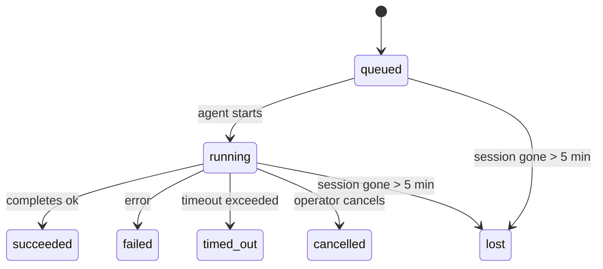

---
read_when:
    - Sprawdzanie zadań w tle będących w toku lub niedawno ukończonych
    - Debugowanie niepowodzeń dostarczania dla odłączonych uruchomień agentów
    - Zrozumienie, jak uruchomienia w tle odnoszą się do sesji, Cron i Heartbeat
summary: Śledzenie zadań w tle dla uruchomień ACP, podagentów, izolowanych zadań Cron i operacji CLI
title: Zadania w tle
x-i18n:
    generated_at: "2026-04-24T08:57:25Z"
    model: gpt-5.4
    provider: openai
    source_hash: 10f16268ab5cce8c3dfd26c54d8d913c0ac0f9bfb4856ed1bb28b085ddb78528
    source_path: automation/tasks.md
    workflow: 15
---

> **Szukasz planowania?** Zobacz [Automatyzacja i zadania](/pl/automation), aby wybrać odpowiedni mechanizm. Ta strona dotyczy **śledzenia** pracy w tle, a nie jej planowania.

Zadania w tle śledzą pracę, która jest wykonywana **poza główną sesją konwersacji**:
uruchomienia ACP, tworzenie podagentów, izolowane wykonania zadań Cron oraz operacje inicjowane przez CLI.

Zadania **nie** zastępują sesji, zadań Cron ani Heartbeat — są **rejestrem aktywności**, który zapisuje, jaka odłączona praca miała miejsce, kiedy się odbyła i czy zakończyła się powodzeniem.

<Note>
Nie każde uruchomienie agenta tworzy zadanie. Tury Heartbeat i zwykły interaktywny czat tego nie robią. Wszystkie wykonania Cron, uruchomienia ACP, uruchomienia podagentów i polecenia agentów w CLI tworzą zadania.
</Note>

## TL;DR

- Zadania to **rekordy**, a nie harmonogramy — Cron i Heartbeat decydują, _kiedy_ praca jest uruchamiana, a zadania śledzą, _co się wydarzyło_.
- ACP, podagenci, wszystkie zadania Cron i operacje CLI tworzą zadania. Tury Heartbeat nie.
- Każde zadanie przechodzi przez `queued → running → terminal` (succeeded, failed, timed_out, cancelled lub lost).
- Zadania Cron pozostają aktywne, dopóki środowisko uruchomieniowe Cron nadal jest właścicielem zadania; zadania CLI oparte na czacie pozostają aktywne tylko tak długo, jak aktywny jest ich kontekst uruchomienia.
- Zakończenie jest sterowane zdarzeniami push: odłączona praca może powiadomić bezpośrednio lub wybudzić
  sesję żądającą/Heartbeat po zakończeniu, więc pętle odpytywania stanu
  zazwyczaj nie są właściwym rozwiązaniem.
- Izolowane uruchomienia Cron i zakończenia podagentów w miarę możliwości czyszczą śledzone karty/procesy przeglądarki dla swojej sesji podrzędnej przed ostatecznym rozliczeniem czyszczenia.
- Dostarczanie z izolowanego Cron pomija nieaktualne tymczasowe odpowiedzi nadrzędne, gdy
  praca potomna podagentów nadal się opróżnia, i preferuje końcowe dane wyjściowe
  potomka, jeśli dotrą przed dostarczeniem.
- Powiadomienia o zakończeniu są dostarczane bezpośrednio do kanału lub kolejkowane do następnego Heartbeat.
- `openclaw tasks list` pokazuje wszystkie zadania; `openclaw tasks audit` wskazuje problemy.
- Rekordy końcowe są przechowywane przez 7 dni, a następnie automatycznie usuwane.

## Szybki start

```bash
# List all tasks (newest first)
openclaw tasks list

# Filter by runtime or status
openclaw tasks list --runtime acp
openclaw tasks list --status running

# Show details for a specific task (by ID, run ID, or session key)
openclaw tasks show <lookup>

# Cancel a running task (kills the child session)
openclaw tasks cancel <lookup>

# Change notification policy for a task
openclaw tasks notify <lookup> state_changes

# Run a health audit
openclaw tasks audit

# Preview or apply maintenance
openclaw tasks maintenance
openclaw tasks maintenance --apply

# Inspect TaskFlow state
openclaw tasks flow list
openclaw tasks flow show <lookup>
openclaw tasks flow cancel <lookup>
```

## Co tworzy zadanie

| Źródło                 | Typ środowiska uruchomieniowego | Kiedy tworzony jest rekord zadania                     | Domyślna polityka powiadomień |
| ---------------------- | -------------------------------- | ------------------------------------------------------ | ----------------------------- |
| Uruchomienia ACP w tle | `acp`                            | Tworzenie podrzędnej sesji ACP                         | `done_only`                   |
| Orkiestracja podagentów | `subagent`                      | Tworzenie podagenta przez `sessions_spawn`             | `done_only`                   |
| Zadania Cron (wszystkie typy) | `cron`                   | Każde wykonanie Cron (w sesji głównej i izolowane)     | `silent`                      |
| Operacje CLI           | `cli`                            | Polecenia `openclaw agent` uruchamiane przez Gateway   | `silent`                      |
| Zadania multimedialne agenta | `cli`                      | Uruchomienia `video_generate` oparte na sesji          | `silent`                      |

Zadania Cron w sesji głównej domyślnie używają polityki powiadomień `silent` — tworzą rekordy do śledzenia, ale nie generują powiadomień. Izolowane zadania Cron również domyślnie używają `silent`, ale są bardziej widoczne, ponieważ działają we własnej sesji.

Uruchomienia `video_generate` oparte na sesji również używają domyślnie polityki powiadomień `silent`. Nadal tworzą rekordy zadań, ale zakończenie jest przekazywane z powrotem do oryginalnej sesji agenta jako wewnętrzne wybudzenie, aby agent mógł sam napisać wiadomość uzupełniającą i dołączyć gotowy film. Jeśli włączysz `tools.media.asyncCompletion.directSend`, asynchroniczne zakończenia `music_generate` i `video_generate` najpierw próbują bezpośredniego dostarczenia do kanału, a dopiero potem wracają do ścieżki wybudzenia sesji żądającej.

Gdy zadanie `video_generate` oparte na sesji jest nadal aktywne, narzędzie działa również jako zabezpieczenie: powtórzone wywołania `video_generate` w tej samej sesji zwracają stan aktywnego zadania zamiast uruchamiać drugie równoległe generowanie. Użyj `action: "status"`, jeśli chcesz jawnie sprawdzić postęp/status po stronie agenta.

**Czego nie tworzy zadań:**

- Tury Heartbeat — sesja główna; zobacz [Heartbeat](/pl/gateway/heartbeat)
- Zwykłe interaktywne tury czatu
- Bezpośrednie odpowiedzi `/command`

## Cykl życia zadania



| Status      | Co oznacza                                                                |
| ----------- | ------------------------------------------------------------------------- |
| `queued`    | Utworzone, oczekuje na uruchomienie przez agenta                          |
| `running`   | Tura agenta jest aktywnie wykonywana                                      |
| `succeeded` | Zakończone pomyślnie                                                      |
| `failed`    | Zakończone z błędem                                                       |
| `timed_out` | Przekroczono skonfigurowany limit czasu                                   |
| `cancelled` | Zatrzymane przez operatora za pomocą `openclaw tasks cancel`              |
| `lost`      | Środowisko uruchomieniowe utraciło autorytatywny stan bazowy po 5 minutach okresu karencji |

Przejścia zachodzą automatycznie — gdy powiązane uruchomienie agenta się kończy, status zadania jest odpowiednio aktualizowany.

`lost` jest zależne od środowiska uruchomieniowego:

- Zadania ACP: zniknęły metadane podrzędnej sesji ACP.
- Zadania podagentów: podrzędna sesja zniknęła z magazynu docelowego agenta.
- Zadania Cron: środowisko uruchomieniowe Cron nie śledzi już zadania jako aktywnego.
- Zadania CLI: izolowane zadania sesji podrzędnych używają sesji podrzędnej; zadania CLI oparte na czacie używają zamiast tego aktywnego kontekstu uruchomienia, więc utrzymujące się wiersze sesji kanału/grupy/wiadomości bezpośrednich nie podtrzymują ich aktywności.

## Dostarczanie i powiadomienia

Gdy zadanie osiąga stan końcowy, OpenClaw Cię powiadamia. Istnieją dwie ścieżki dostarczania:

**Dostarczanie bezpośrednie** — jeśli zadanie ma docelowy kanał (`requesterOrigin`), wiadomość o zakończeniu trafia bezpośrednio do tego kanału (Telegram, Discord, Slack itp.). W przypadku zakończeń podagentów OpenClaw zachowuje również powiązane kierowanie do wątku/tematu, gdy jest dostępne, i może uzupełnić brakujące `to` / konto ze zapisanej trasy sesji żądającej (`lastChannel` / `lastTo` / `lastAccountId`), zanim zrezygnuje z bezpośredniego dostarczania.

**Dostarczanie kolejkowane w sesji** — jeśli dostarczanie bezpośrednie się nie powiedzie lub nie ustawiono źródła, aktualizacja jest kolejkowana jako zdarzenie systemowe w sesji żądającej i pojawia się przy następnym Heartbeat.

<Tip>
Zakończenie zadania natychmiast wywołuje wybudzenie Heartbeat, dzięki czemu szybko widzisz wynik — nie musisz czekać na następny zaplanowany takt Heartbeat.
</Tip>

Oznacza to, że typowy przepływ pracy jest oparty na push: uruchamiasz odłączoną pracę tylko raz, a następnie
pozwalasz środowisku uruchomieniowemu wybudzić Cię lub powiadomić po zakończeniu. Odpytuj stan zadania tylko wtedy, gdy
potrzebujesz debugowania, interwencji lub jawnego audytu.

### Polityki powiadomień

Kontroluj, ile informacji otrzymujesz o każdym zadaniu:

| Polityka              | Co jest dostarczane                                                       |
| --------------------- | ------------------------------------------------------------------------- |
| `done_only` (domyślna) | Tylko stan końcowy (succeeded, failed itd.) — **to jest wartość domyślna** |
| `state_changes`       | Każda zmiana stanu i aktualizacja postępu                                 |
| `silent`              | Nic                                                                       |

Zmień politykę podczas działania zadania:

```bash
openclaw tasks notify <lookup> state_changes
```

## Dokumentacja CLI

### `tasks list`

```bash
openclaw tasks list [--runtime <acp|subagent|cron|cli>] [--status <status>] [--json]
```

Kolumny wyjściowe: ID zadania, rodzaj, status, dostarczanie, ID uruchomienia, sesja podrzędna, podsumowanie.

### `tasks show`

```bash
openclaw tasks show <lookup>
```

Token wyszukiwania akceptuje ID zadania, ID uruchomienia lub klucz sesji. Pokazuje pełny rekord, w tym czasy, stan dostarczania, błąd i końcowe podsumowanie.

### `tasks cancel`

```bash
openclaw tasks cancel <lookup>
```

W przypadku zadań ACP i podagentów powoduje to zakończenie sesji podrzędnej. W przypadku zadań śledzonych przez CLI anulowanie jest rejestrowane w rejestrze zadań (nie ma osobnego uchwytu do podrzędnego środowiska uruchomieniowego). Status przechodzi do `cancelled`, a jeśli ma to zastosowanie, wysyłane jest powiadomienie o dostarczeniu.

### `tasks notify`

```bash
openclaw tasks notify <lookup> <done_only|state_changes|silent>
```

### `tasks audit`

```bash
openclaw tasks audit [--json]
```

Wskazuje problemy operacyjne. Ustalenia pojawiają się również w `openclaw status`, gdy wykryto problemy.

| Ustalenie                 | Ważność | Wyzwalacz                                             |
| ------------------------- | ------- | ----------------------------------------------------- |
| `stale_queued`            | warn    | W stanie queued przez ponad 10 minut                  |
| `stale_running`           | error   | W stanie running przez ponad 30 minut                 |
| `lost`                    | error   | Zniknęła własność zadania oparta na środowisku uruchomieniowym |
| `delivery_failed`         | warn    | Dostarczanie nie powiodło się, a polityka powiadomień nie jest `silent` |
| `missing_cleanup`         | warn    | Zadanie końcowe bez znacznika czasu czyszczenia       |
| `inconsistent_timestamps` | warn    | Naruszenie osi czasu (na przykład zakończono przed rozpoczęciem) |

### `tasks maintenance`

```bash
openclaw tasks maintenance [--json]
openclaw tasks maintenance --apply [--json]
```

Użyj tego, aby podejrzeć lub zastosować uzgadnianie, oznaczanie czyszczenia i przycinanie dla
zadań oraz stanu Task Flow.

Uzgadnianie jest zależne od środowiska uruchomieniowego:

- Zadania ACP/podagentów sprawdzają swoją bazową sesję podrzędną.
- Zadania Cron sprawdzają, czy środowisko uruchomieniowe Cron nadal jest właścicielem zadania.
- Zadania CLI oparte na czacie sprawdzają aktywny kontekst uruchomienia będący właścicielem, a nie tylko wiersz sesji czatu.

Czyszczenie po zakończeniu jest również zależne od środowiska uruchomieniowego:

- Zakończenie podagenta w miarę możliwości zamyka śledzone karty/procesy przeglądarki dla sesji podrzędnej przed dalszym czyszczeniem związanym z ogłoszeniem zakończenia.
- Zakończenie izolowanego Cron w miarę możliwości zamyka śledzone karty/procesy przeglądarki dla sesji Cron, zanim uruchomienie zostanie całkowicie zakończone.
- Dostarczanie z izolowanego Cron w razie potrzeby czeka na dalsze działania potomnych podagentów
  i pomija nieaktualny tekst potwierdzenia nadrzędnego zamiast go ogłaszać.
- Dostarczanie po zakończeniu podagenta preferuje najnowszy widoczny tekst asystenta; jeśli jest pusty, przechodzi do oczyszczonego najnowszego tekstu tool/toolResult, a uruchomienia z wywołaniami narzędzi zakończone wyłącznie limitem czasu mogą zostać zredukowane do krótkiego podsumowania częściowego postępu. Końcowe nieudane uruchomienia ogłaszają status niepowodzenia bez odtwarzania przechwyconego tekstu odpowiedzi.
- Błędy czyszczenia nie maskują rzeczywistego wyniku zadania.

### `tasks flow list|show|cancel`

```bash
openclaw tasks flow list [--status <status>] [--json]
openclaw tasks flow show <lookup> [--json]
openclaw tasks flow cancel <lookup>
```

Używaj tych poleceń, gdy interesuje Cię orkiestrujący Task Flow,
a nie pojedynczy rekord zadania w tle.

## Tablica zadań na czacie (`/tasks`)

Użyj `/tasks` w dowolnej sesji czatu, aby zobaczyć zadania w tle powiązane z tą sesją. Tablica pokazuje
aktywne i niedawno ukończone zadania wraz ze środowiskiem uruchomieniowym, statusem, czasem oraz szczegółami postępu lub błędu.

Gdy bieżąca sesja nie ma widocznych powiązanych zadań, `/tasks` przechodzi do lokalnych dla agenta liczników zadań,
dzięki czemu nadal otrzymujesz przegląd bez ujawniania szczegółów innych sesji.

Aby zobaczyć pełny rejestr operatora, użyj CLI: `openclaw tasks list`.

## Integracja ze statusem (obciążenie zadaniami)

`openclaw status` zawiera szybkie podsumowanie zadań:

```
Tasks: 3 queued · 2 running · 1 issues
```

Podsumowanie raportuje:

- **active** — liczba `queued` + `running`
- **failures** — liczba `failed` + `timed_out` + `lost`
- **byRuntime** — podział według `acp`, `subagent`, `cron`, `cli`

Zarówno `/status`, jak i narzędzie `session_status` używają migawki zadań uwzględniającej czyszczenie: aktywne zadania są
preferowane, nieaktualne ukończone wiersze są ukrywane, a ostatnie niepowodzenia są pokazywane tylko wtedy, gdy nie pozostała
żadna aktywna praca. Dzięki temu karta stanu skupia się na tym, co jest ważne w danej chwili.

## Przechowywanie i konserwacja

### Gdzie są przechowywane zadania

Rekordy zadań są trwale zapisywane w SQLite pod adresem:

```
$OPENCLAW_STATE_DIR/tasks/runs.sqlite
```

Rejestr jest ładowany do pamięci przy uruchamianiu Gateway i synchronizuje zapisy do SQLite, aby zapewnić trwałość po ponownym uruchomieniu.

### Automatyczna konserwacja

Proces czyszczący działa co **60 sekund** i obsługuje trzy rzeczy:

1. **Uzgadnianie** — sprawdza, czy aktywne zadania nadal mają autorytatywne zaplecze w środowisku uruchomieniowym. Zadania ACP/podagentów używają stanu sesji podrzędnej, zadania Cron używają własności aktywnego zadania, a zadania CLI oparte na czacie używają kontekstu uruchomienia będącego właścicielem. Jeśli ten stan bazowy zniknie na dłużej niż 5 minut, zadanie zostaje oznaczone jako `lost`.
2. **Oznaczanie czyszczenia** — ustawia znacznik czasu `cleanupAfter` dla zadań końcowych (`endedAt + 7 days`).
3. **Przycinanie** — usuwa rekordy po dacie `cleanupAfter`.

**Przechowywanie**: rekordy końcowe zadań są przechowywane przez **7 dni**, a następnie automatycznie usuwane. Nie jest wymagana żadna konfiguracja.

## Jak zadania odnoszą się do innych systemów

### Zadania i Task Flow

[Task Flow](/pl/automation/taskflow) to warstwa orkiestracji przepływu ponad zadaniami w tle. Pojedynczy przepływ może w czasie swojego działania koordynować wiele zadań, używając zarządzanych lub lustrzanych trybów synchronizacji. Użyj `openclaw tasks`, aby sprawdzić pojedyncze rekordy zadań, oraz `openclaw tasks flow`, aby sprawdzić orkiestrujący przepływ.

Szczegóły znajdziesz w [Task Flow](/pl/automation/taskflow).

### Zadania i Cron

**Definicja** zadania Cron znajduje się w `~/.openclaw/cron/jobs.json`; stan wykonania w środowisku uruchomieniowym znajduje się obok niego w `~/.openclaw/cron/jobs-state.json`. **Każde** wykonanie Cron tworzy rekord zadania — zarówno w sesji głównej, jak i izolowane. Zadania Cron w sesji głównej domyślnie używają polityki powiadomień `silent`, dzięki czemu są śledzone bez generowania powiadomień.

Zobacz [Zadania Cron](/pl/automation/cron-jobs).

### Zadania i Heartbeat

Uruchomienia Heartbeat to tury sesji głównej — nie tworzą rekordów zadań. Po zakończeniu zadania może ono wywołać wybudzenie Heartbeat, dzięki czemu szybko zobaczysz wynik.

Zobacz [Heartbeat](/pl/gateway/heartbeat).

### Zadania i sesje

Zadanie może odwoływać się do `childSessionKey` (gdzie wykonywana jest praca) oraz `requesterSessionKey` (kto ją uruchomił). Sesje to kontekst konwersacji; zadania to warstwa śledzenia aktywności ponad nim.

### Zadania i uruchomienia agentów

`runId` zadania łączy się z uruchomieniem agenta wykonującym pracę. Zdarzenia cyklu życia agenta (start, koniec, błąd) automatycznie aktualizują status zadania — nie musisz ręcznie zarządzać cyklem życia.

## Powiązane

- [Automatyzacja i zadania](/pl/automation) — wszystkie mechanizmy automatyzacji w skrócie
- [Task Flow](/pl/automation/taskflow) — orkiestracja przepływu ponad zadaniami
- [Zaplanowane zadania](/pl/automation/cron-jobs) — planowanie pracy w tle
- [Heartbeat](/pl/gateway/heartbeat) — okresowe tury sesji głównej
- [CLI: Zadania](/pl/cli/tasks) — dokumentacja poleceń CLI
