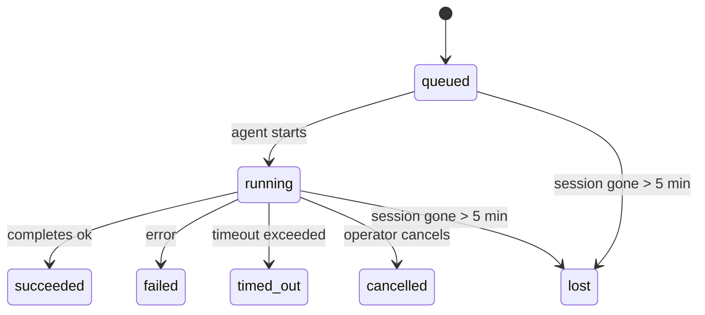

---
read_when:
    - Sprawdzanie zadań w tle będących w toku lub niedawno zakończonych
    - Debugowanie niepowodzeń dostarczania dla odłączonych uruchomień agenta
    - Zrozumienie, jak uruchomienia w tle odnoszą się do sesji, Cron i Heartbeat
summary: Śledzenie zadań w tle dla uruchomień ACP, podagentów, izolowanych zadań Cron i operacji CLI
title: Zadania w tle
x-i18n:
    generated_at: "2026-04-21T09:51:53Z"
    model: gpt-5.4
    provider: openai
    source_hash: ba5511b1c421bdf505fc7d34f09e453ac44e85213fcb0f082078fa957aa91fe7
    source_path: automation/tasks.md
    workflow: 15
---

# Zadania w tle

> **Szukasz harmonogramowania?** Zobacz [Automatyzacja i zadania](/pl/automation), aby wybrać właściwy mechanizm. Ta strona dotyczy **śledzenia** pracy w tle, a nie jej harmonogramowania.

Zadania w tle śledzą pracę wykonywaną **poza główną sesją rozmowy**:
uruchomienia ACP, uruchomienia podagentów, wykonywanie izolowanych zadań Cron i operacje inicjowane przez CLI.

Zadania **nie** zastępują sesji, zadań Cron ani Heartbeat — są **rejestrem aktywności**, który zapisuje, jaka odłączona praca została wykonana, kiedy i czy zakończyła się powodzeniem.

<Note>
Nie każde uruchomienie agenta tworzy zadanie. Tury Heartbeat i zwykły interaktywny czat tego nie robią. Wszystkie wykonania Cron, uruchomienia ACP, uruchomienia podagentów i polecenia agenta w CLI tworzą zadania.
</Note>

## TL;DR

- Zadania to **rekordy**, a nie harmonogramy — Cron i Heartbeat decydują, _kiedy_ praca ma się uruchomić, a zadania śledzą, _co się wydarzyło_.
- ACP, podagenci, wszystkie zadania Cron i operacje CLI tworzą zadania. Tury Heartbeat tego nie robią.
- Każde zadanie przechodzi przez `queued → running → terminal` (`succeeded`, `failed`, `timed_out`, `cancelled` albo `lost`).
- Zadania Cron pozostają aktywne, dopóki środowisko uruchomieniowe Cron nadal jest właścicielem zadania; zadania CLI oparte na czacie pozostają aktywne tylko wtedy, gdy ich kontekst uruchomienia będący właścicielem nadal jest aktywny.
- Zakończenie jest sterowane wypychaniem: odłączona praca może powiadomić bezpośrednio lub wybudzić sesję żądającą/Heartbeat po zakończeniu, więc pętle sondujące status zwykle nie są właściwym podejściem.
- Izolowane uruchomienia Cron i zakończenia podagentów w miarę możliwości czyszczą śledzone karty/przetwarzania przeglądarki dla ich sesji potomnej przed końcowym księgowaniem czyszczenia.
- Dostarczanie izolowanego Cron tłumi nieaktualne pośrednie odpowiedzi nadrzędne, gdy praca potomnych podagentów nadal się opróżnia, i preferuje końcowe dane wyjściowe potomka, jeśli dotrą przed dostarczeniem.
- Powiadomienia o zakończeniu są dostarczane bezpośrednio do kanału lub kolejkowane na następny Heartbeat.
- `openclaw tasks list` pokazuje wszystkie zadania; `openclaw tasks audit` ujawnia problemy.
- Rekordy terminalne są przechowywane przez 7 dni, a następnie automatycznie usuwane.

## Szybki start

```bash
# Wyświetl wszystkie zadania (od najnowszych)
openclaw tasks list

# Filtruj według środowiska uruchomieniowego lub statusu
openclaw tasks list --runtime acp
openclaw tasks list --status running

# Pokaż szczegóły konkretnego zadania (według ID, ID uruchomienia lub klucza sesji)
openclaw tasks show <lookup>

# Anuluj uruchomione zadanie (zabija sesję potomną)
openclaw tasks cancel <lookup>

# Zmień zasady powiadamiania dla zadania
openclaw tasks notify <lookup> state_changes

# Uruchom audyt kondycji
openclaw tasks audit

# Wyświetl podgląd lub zastosuj konserwację
openclaw tasks maintenance
openclaw tasks maintenance --apply

# Sprawdź stan TaskFlow
openclaw tasks flow list
openclaw tasks flow show <lookup>
openclaw tasks flow cancel <lookup>
```

## Co tworzy zadanie

| Źródło                 | Typ środowiska uruchomieniowego | Kiedy tworzony jest rekord zadania                     | Domyślna polityka powiadomień |
| ---------------------- | -------------------------------- | ------------------------------------------------------ | ----------------------------- |
| Uruchomienia ACP w tle | `acp`                            | Uruchomienie potomnej sesji ACP                        | `done_only`                   |
| Orkiestracja podagentów | `subagent`                      | Uruchomienie podagenta przez `sessions_spawn`          | `done_only`                   |
| Zadania Cron (wszystkie typy) | `cron`                  | Każde wykonanie Cron (sesja główna i izolowana)        | `silent`                      |
| Operacje CLI           | `cli`                            | Polecenia `openclaw agent` uruchamiane przez Gateway   | `silent`                      |
| Zadania mediów agenta  | `cli`                            | Uruchomienia `video_generate` oparte na sesji          | `silent`                      |

Zadania Cron w sesji głównej domyślnie używają polityki powiadomień `silent` — tworzą rekordy do śledzenia, ale nie generują powiadomień. Izolowane zadania Cron również domyślnie używają `silent`, ale są bardziej widoczne, ponieważ działają we własnej sesji.

Uruchomienia `video_generate` oparte na sesji również używają domyślnie polityki powiadomień `silent`. Nadal tworzą rekordy zadań, ale zakończenie jest przekazywane z powrotem do oryginalnej sesji agenta jako wewnętrzne wybudzenie, aby agent mógł sam napisać wiadomość uzupełniającą i dołączyć gotowe wideo. Jeśli włączysz `tools.media.asyncCompletion.directSend`, asynchroniczne zakończenia `music_generate` i `video_generate` najpierw próbują bezpośredniego dostarczenia do kanału, a dopiero potem wracają do ścieżki wybudzenia sesji żądającej.

Gdy zadanie `video_generate` oparte na sesji jest nadal aktywne, narzędzie działa również jako zabezpieczenie: powtórne wywołania `video_generate` w tej samej sesji zwracają status aktywnego zadania zamiast uruchamiać drugie równoległe generowanie. Użyj `action: "status"`, gdy chcesz uzyskać jawne wyszukanie postępu/statusu po stronie agenta.

**Co nie tworzy zadań:**

- Tury Heartbeat — sesja główna; zobacz [Heartbeat](/pl/gateway/heartbeat)
- Zwykłe interaktywne tury czatu
- Bezpośrednie odpowiedzi `/command`

## Cykl życia zadania



| Status      | Co oznacza                                                               |
| ----------- | ------------------------------------------------------------------------ |
| `queued`    | Utworzone, oczekuje na uruchomienie przez agenta                         |
| `running`   | Tura agenta jest aktywnie wykonywana                                     |
| `succeeded` | Zakończone pomyślnie                                                     |
| `failed`    | Zakończone błędem                                                        |
| `timed_out` | Przekroczono skonfigurowany limit czasu                                  |
| `cancelled` | Zatrzymane przez operatora za pomocą `openclaw tasks cancel`             |
| `lost`      | Środowisko uruchomieniowe utraciło autorytatywny stan zaplecza po 5-minutowym okresie karencji |

Przejścia zachodzą automatycznie — gdy powiązane uruchomienie agenta się kończy, status zadania jest aktualizowany odpowiednio do wyniku.

`lost` zależy od środowiska uruchomieniowego:

- Zadania ACP: zniknęły metadane potomnej sesji ACP w zapleczu.
- Zadania podagentów: potomna sesja zniknęła z docelowego magazynu agenta.
- Zadania Cron: środowisko uruchomieniowe Cron nie śledzi już zadania jako aktywnego.
- Zadania CLI: zadania izolowanej sesji potomnej używają sesji potomnej; zadania CLI oparte na czacie używają zamiast tego kontekstu aktywnego uruchomienia, więc pozostające wiersze sesji kanału/grupy/bezpośredniej nie utrzymują ich przy życiu.

## Dostarczanie i powiadomienia

Gdy zadanie osiąga stan terminalny, OpenClaw wysyła powiadomienie. Są dwie ścieżki dostarczania:

**Dostarczenie bezpośrednie** — jeśli zadanie ma docelowy kanał (`requesterOrigin`), wiadomość o zakończeniu trafia bezpośrednio do tego kanału (Telegram, Discord, Slack itd.). W przypadku zakończeń podagentów OpenClaw zachowuje również powiązane kierowanie wątkiem/tematem, gdy jest dostępne, i może uzupełnić brakujące `to` / konto ze ścieżki zapisanej w sesji żądającej (`lastChannel` / `lastTo` / `lastAccountId`) przed rezygnacją z bezpośredniego dostarczenia.

**Dostarczenie kolejkowane do sesji** — jeśli dostarczenie bezpośrednie się nie powiedzie lub nie ustawiono źródła, aktualizacja jest kolejkowana jako zdarzenie systemowe w sesji żądającego i pojawia się przy następnym Heartbeat.

<Tip>
Zakończenie zadania wywołuje natychmiastowe wybudzenie Heartbeat, dzięki czemu szybko widzisz wynik — nie musisz czekać na następny zaplanowany takt Heartbeat.
</Tip>

Oznacza to, że typowy przepływ pracy jest oparty na wypychaniu: uruchom odłączoną pracę raz, a następnie pozwól środowisku uruchomieniowemu wybudzić Cię lub powiadomić po zakończeniu. Sonduj stan zadania tylko wtedy, gdy potrzebujesz debugowania, interwencji lub jawnego audytu.

### Polityki powiadomień

Kontroluj, ile informacji otrzymujesz o każdym zadaniu:

| Polityka              | Co jest dostarczane                                                      |
| --------------------- | ------------------------------------------------------------------------ |
| `done_only` (domyślnie) | Tylko stan terminalny (`succeeded`, `failed` itd.) — **to jest domyślne ustawienie** |
| `state_changes`       | Każda zmiana stanu i każda aktualizacja postępu                          |
| `silent`              | Nic                                                                      |

Zmień politykę podczas działania zadania:

```bash
openclaw tasks notify <lookup> state_changes
```

## Dokumentacja CLI

### `tasks list`

```bash
openclaw tasks list [--runtime <acp|subagent|cron|cli>] [--status <status>] [--json]
```

Kolumny wyjściowe: ID zadania, rodzaj, status, dostarczenie, ID uruchomienia, sesja potomna, podsumowanie.

### `tasks show`

```bash
openclaw tasks show <lookup>
```

Token wyszukiwania akceptuje ID zadania, ID uruchomienia lub klucz sesji. Pokazuje pełny rekord, w tym czasy, stan dostarczenia, błąd i końcowe podsumowanie.

### `tasks cancel`

```bash
openclaw tasks cancel <lookup>
```

W przypadku zadań ACP i podagentów powoduje to zakończenie sesji potomnej. W przypadku zadań śledzonych przez CLI anulowanie jest rejestrowane w rejestrze zadań (nie ma osobnego uchwytu środowiska uruchomieniowego potomka). Status przechodzi na `cancelled`, a gdy ma to zastosowanie, wysyłane jest powiadomienie o dostarczeniu.

### `tasks notify`

```bash
openclaw tasks notify <lookup> <done_only|state_changes|silent>
```

### `tasks audit`

```bash
openclaw tasks audit [--json]
```

Ujawnia problemy operacyjne. Wyniki pojawiają się również w `openclaw status`, gdy wykryte zostaną problemy.

| Wynik                     | Ważność | Wyzwalacz                                           |
| ------------------------- | ------- | --------------------------------------------------- |
| `stale_queued`            | warn    | W kolejce dłużej niż 10 minut                       |
| `stale_running`           | error   | Działa dłużej niż 30 minut                          |
| `lost`                    | error   | Zniknęła własność zadania oparta na środowisku uruchomieniowym |
| `delivery_failed`         | warn    | Dostarczenie nie powiodło się, a polityka powiadomień nie jest `silent` |
| `missing_cleanup`         | warn    | Zadanie terminalne bez znacznika czasu czyszczenia  |
| `inconsistent_timestamps` | warn    | Naruszenie osi czasu (na przykład zakończono przed rozpoczęciem) |

### `tasks maintenance`

```bash
openclaw tasks maintenance [--json]
openclaw tasks maintenance --apply [--json]
```

Użyj tego, aby wyświetlić podgląd lub zastosować uzgadnianie, oznaczanie czyszczenia i usuwanie przestarzałych danych dla zadań oraz stanu Task Flow.

Uzgadnianie zależy od środowiska uruchomieniowego:

- Zadania ACP/podagentów sprawdzają swoją potomną sesję zaplecza.
- Zadania Cron sprawdzają, czy środowisko uruchomieniowe Cron nadal jest właścicielem zadania.
- Zadania CLI oparte na czacie sprawdzają kontekst aktywnego uruchomienia będący właścicielem, a nie tylko wiersz sesji czatu.

Czyszczenie po zakończeniu również zależy od środowiska uruchomieniowego:

- Zakończenie podagenta w miarę możliwości zamyka śledzone karty/procesy przeglądarki dla sesji potomnej, zanim będzie kontynuowane ogłaszanie czyszczenia.
- Zakończenie izolowanego Cron w miarę możliwości zamyka śledzone karty/procesy przeglądarki dla sesji Cron, zanim uruchomienie zostanie całkowicie zakończone.
- Dostarczanie izolowanego Cron w razie potrzeby czeka na dalsze działania potomnych podagentów i tłumi nieaktualny tekst potwierdzenia nadrzędnego zamiast go ogłaszać.
- Dostarczanie zakończenia podagenta preferuje najnowszy widoczny tekst asystenta; jeśli jest pusty, wraca do oczyszczonego najnowszego tekstu `tool`/`toolResult`, a uruchomienia wyłącznie wywołania narzędzia zakończone timeoutem mogą zostać zredukowane do krótkiego podsumowania częściowego postępu.
- Błędy czyszczenia nie maskują rzeczywistego wyniku zadania.

### `tasks flow list|show|cancel`

```bash
openclaw tasks flow list [--status <status>] [--json]
openclaw tasks flow show <lookup> [--json]
openclaw tasks flow cancel <lookup>
```

Używaj tych poleceń, gdy interesuje Cię orkiestrujący TaskFlow, a nie pojedynczy rekord zadania w tle.

## Tablica zadań czatu (`/tasks`)

Użyj `/tasks` w dowolnej sesji czatu, aby zobaczyć zadania w tle powiązane z tą sesją. Tablica pokazuje
aktywne i niedawno zakończone zadania wraz ze środowiskiem uruchomieniowym, statusem, czasem oraz szczegółami postępu lub błędu.

Gdy bieżąca sesja nie ma widocznych powiązanych zadań, `/tasks` przełącza się na lokalne dla agenta liczniki zadań,
dzięki czemu nadal otrzymujesz przegląd bez ujawniania szczegółów innych sesji.

Aby zobaczyć pełny rejestr operatora, użyj CLI: `openclaw tasks list`.

## Integracja statusu (obciążenie zadaniami)

`openclaw status` zawiera podsumowanie zadań widoczne na pierwszy rzut oka:

```
Tasks: 3 queued · 2 running · 1 issues
```

Podsumowanie raportuje:

- **active** — liczba `queued` + `running`
- **failures** — liczba `failed` + `timed_out` + `lost`
- **byRuntime** — podział według `acp`, `subagent`, `cron`, `cli`

Zarówno `/status`, jak i narzędzie `session_status` używają migawki zadań uwzględniającej czyszczenie: aktywne zadania są preferowane,
nieaktualne ukończone wiersze są ukrywane, a niedawne błędy są pokazywane tylko wtedy, gdy nie pozostała żadna aktywna praca.
Dzięki temu karta statusu skupia się na tym, co ma znaczenie w danej chwili.

## Przechowywanie i konserwacja

### Gdzie znajdują się zadania

Rekordy zadań są trwale przechowywane w SQLite pod adresem:

```
$OPENCLAW_STATE_DIR/tasks/runs.sqlite
```

Rejestr jest ładowany do pamięci przy uruchomieniu Gateway i synchronizuje zapisy do SQLite, aby zapewnić trwałość po restartach.

### Automatyczna konserwacja

Mechanizm czyszczący uruchamia się co **60 sekund** i obsługuje trzy rzeczy:

1. **Uzgadnianie** — sprawdza, czy aktywne zadania nadal mają autorytatywne zaplecze środowiska uruchomieniowego. Zadania ACP/podagentów używają stanu sesji potomnej, zadania Cron używają własności aktywnego zadania, a zadania CLI oparte na czacie używają kontekstu uruchomienia będącego właścicielem. Jeśli ten stan zaplecza zniknie na dłużej niż 5 minut, zadanie jest oznaczane jako `lost`.
2. **Oznaczanie czyszczenia** — ustawia znacznik czasu `cleanupAfter` dla zadań terminalnych (`endedAt` + 7 dni).
3. **Usuwanie przestarzałych danych** — usuwa rekordy po dacie `cleanupAfter`.

**Retencja**: rekordy zadań terminalnych są przechowywane przez **7 dni**, a następnie automatycznie usuwane. Nie jest wymagana żadna konfiguracja.

## Jak zadania odnoszą się do innych systemów

### Zadania i Task Flow

[Task Flow](/pl/automation/taskflow) to warstwa orkiestracji przepływów ponad zadaniami w tle. Pojedynczy przepływ może w trakcie swojego cyklu życia koordynować wiele zadań przy użyciu zarządzanych lub lustrzanych trybów synchronizacji. Użyj `openclaw tasks`, aby sprawdzić poszczególne rekordy zadań, oraz `openclaw tasks flow`, aby sprawdzić przepływ orkiestrujący.

Szczegóły znajdziesz w [Task Flow](/pl/automation/taskflow).

### Zadania i Cron

**Definicja** zadania Cron znajduje się w `~/.openclaw/cron/jobs.json`; stan wykonania środowiska uruchomieniowego znajduje się obok niej w `~/.openclaw/cron/jobs-state.json`. **Każde** wykonanie Cron tworzy rekord zadania — zarówno w sesji głównej, jak i w trybie izolowanym. Zadania Cron w sesji głównej domyślnie używają polityki powiadomień `silent`, dzięki czemu są śledzone bez generowania powiadomień.

Zobacz [Zadania Cron](/pl/automation/cron-jobs).

### Zadania i Heartbeat

Uruchomienia Heartbeat to tury sesji głównej — nie tworzą rekordów zadań. Gdy zadanie się zakończy, może wywołać wybudzenie Heartbeat, aby szybko pokazać wynik.

Zobacz [Heartbeat](/pl/gateway/heartbeat).

### Zadania i sesje

Zadanie może odwoływać się do `childSessionKey` (gdzie wykonywana jest praca) oraz `requesterSessionKey` (kto ją uruchomił). Sesje to kontekst rozmowy; zadania to śledzenie aktywności ponad tym kontekstem.

### Zadania i uruchomienia agenta

`runId` zadania wskazuje na uruchomienie agenta wykonujące pracę. Zdarzenia cyklu życia agenta (start, koniec, błąd) automatycznie aktualizują status zadania — nie musisz ręcznie zarządzać cyklem życia.

## Powiązane

- [Automatyzacja i zadania](/pl/automation) — przegląd wszystkich mechanizmów automatyzacji
- [Task Flow](/pl/automation/taskflow) — orkiestracja przepływów ponad zadaniami
- [Zaplanowane zadania](/pl/automation/cron-jobs) — harmonogramowanie pracy w tle
- [Heartbeat](/pl/gateway/heartbeat) — okresowe tury sesji głównej
- [CLI: Tasks](/cli/index#tasks) — dokumentacja poleceń CLI
