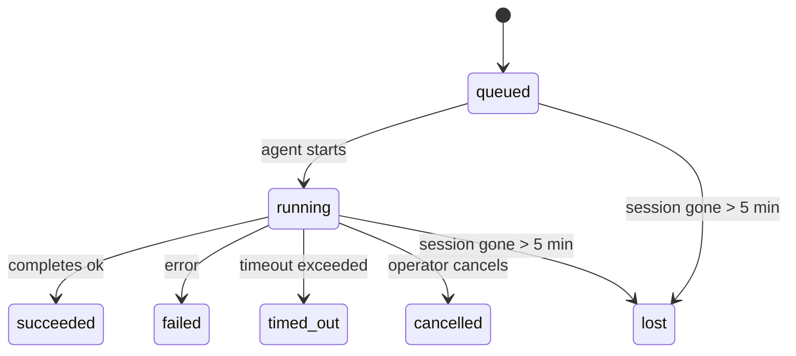

---
read_when:
    - Sprawdzanie trwających lub niedawno ukończonych prac w tle
    - Debugowanie niepowodzeń dostarczania w odłączonych uruchomieniach agenta
    - Jak uruchomienia w tle wiążą się z sesjami, Cron i Heartbeat
sidebarTitle: Background tasks
summary: Śledzenie zadań w tle dla uruchomień ACP, subagentów, izolowanych zadań Cron i operacji CLI
title: Zadania w tle
x-i18n:
    generated_at: "2026-05-05T06:16:15Z"
    model: gpt-5.5
    provider: openai
    source_hash: bafd959feaf2e220820ec56bf1ef144207d05757418e9971ebf427844cf30c46
    source_path: automation/tasks.md
    workflow: 16
---

<Note>
Szukasz planowania? Zobacz [Automatyzacja i zadania](/pl/automation), aby wybrać właściwy mechanizm. Ta strona jest rejestrem aktywności dla pracy w tle, a nie harmonogramem.
</Note>

Zadania w tle śledzą pracę wykonywaną **poza główną sesją konwersacji**: uruchomienia ACP, uruchomienia subagentów, izolowane wykonania zadań Cron oraz operacje inicjowane przez CLI.

Zadania **nie** zastępują sesji, zadań Cron ani Heartbeat — są **rejestrem aktywności**, który zapisuje, jaka odłączona praca została wykonana, kiedy i czy zakończyła się powodzeniem.

<Note>
Nie każde uruchomienie agenta tworzy zadanie. Tury Heartbeat i zwykły czat interaktywny tego nie robią. Wszystkie wykonania Cron, uruchomienia ACP, uruchomienia subagentów i polecenia agenta CLI tak.
</Note>

## TL;DR

- Zadania są **rekordami**, a nie harmonogramami — Cron i Heartbeat decydują, _kiedy_ praca jest uruchamiana, a zadania śledzą, _co się stało_.
- ACP, subagenty, wszystkie zadania Cron i operacje CLI tworzą zadania. Tury Heartbeat nie.
- Każde zadanie przechodzi przez `queued → running → terminal` (succeeded, failed, timed_out, cancelled lub lost).
- Zadania Cron pozostają aktywne, dopóki środowisko wykonawcze Cron nadal jest właścicielem zadania; jeśli
  stan środowiska wykonawczego w pamięci zniknął, utrzymanie zadań najpierw sprawdza trwałą historię
  uruchomień Cron, zanim oznaczy zadanie jako utracone.
- Ukończenie jest sterowane wypychaniem: odłączona praca może powiadomić bezpośrednio albo wybudzić
  sesję/Heartbeat zgłaszającego po zakończeniu, więc pętle odpytywania statusu
  zwykle mają niewłaściwy kształt.
- Izolowane uruchomienia Cron i ukończenia subagentów w trybie najlepszych starań czyszczą śledzone karty/procesy przeglądarki dla swojej sesji potomnej przed końcowym księgowaniem sprzątania.
- Izolowane dostarczanie Cron tłumi nieaktualne tymczasowe odpowiedzi nadrzędne, gdy praca potomnych subagentów nadal się opróżnia, i preferuje końcowe wyjście potomne, gdy nadejdzie przed dostarczeniem.
- Powiadomienia o ukończeniu są dostarczane bezpośrednio do kanału albo kolejkowane do następnego Heartbeat.
- `openclaw tasks list` pokazuje wszystkie zadania; `openclaw tasks audit` ujawnia problemy.
- Rekordy końcowe są przechowywane przez 7 dni, a następnie automatycznie usuwane.

## Szybki start

<Tabs>
  <Tab title="List and filter">
    ```bash
    # List all tasks (newest first)
    openclaw tasks list

    # Filter by runtime or status
    openclaw tasks list --runtime acp
    openclaw tasks list --status running
    ```

  </Tab>
  <Tab title="Inspect">
    ```bash
    # Show details for a specific task (by ID, run ID, or session key)
    openclaw tasks show <lookup>
    ```
  </Tab>
  <Tab title="Cancel and notify">
    ```bash
    # Cancel a running task (kills the child session)
    openclaw tasks cancel <lookup>

    # Change notification policy for a task
    openclaw tasks notify <lookup> state_changes
    ```

  </Tab>
  <Tab title="Audit and maintenance">
    ```bash
    # Run a health audit
    openclaw tasks audit

    # Preview or apply maintenance
    openclaw tasks maintenance
    openclaw tasks maintenance --apply
    ```

  </Tab>
  <Tab title="Task flow">
    ```bash
    # Inspect TaskFlow state
    openclaw tasks flow list
    openclaw tasks flow show <lookup>
    openclaw tasks flow cancel <lookup>
    ```
  </Tab>
</Tabs>

## Co tworzy zadanie

| Źródło                 | Typ środowiska wykonawczego | Kiedy tworzony jest rekord zadania                     | Domyślna polityka powiadomień |
| ---------------------- | ------------ | ------------------------------------------------------ | --------------------- |
| Uruchomienia ACP w tle | `acp`        | Uruchomienie potomnej sesji ACP                        | `done_only`           |
| Orkiestracja subagentów | `subagent`   | Uruchomienie subagenta przez `sessions_spawn`          | `done_only`           |
| Zadania Cron (wszystkie typy) | `cron`       | Każde wykonanie Cron (w sesji głównej i izolowane)     | `silent`              |
| Operacje CLI           | `cli`        | Polecenia `openclaw agent`, które działają przez Gateway | `silent`              |
| Zadania multimedialne agenta | `cli`        | Uruchomienia `music_generate`/`video_generate` oparte na sesji | `silent`              |

<AccordionGroup>
  <Accordion title="Notify defaults for cron and media">
    Zadania Cron w sesji głównej domyślnie używają polityki powiadomień `silent` — tworzą rekordy do śledzenia, ale nie generują powiadomień. Izolowane zadania Cron również domyślnie używają `silent`, ale są bardziej widoczne, ponieważ działają we własnej sesji.

    Uruchomienia `music_generate` i `video_generate` oparte na sesji również używają polityki powiadomień `silent`. Nadal tworzą rekordy zadań, ale ukończenie jest przekazywane z powrotem do pierwotnej sesji agenta jako wewnętrzne wybudzenie, aby agent mógł sam napisać wiadomość uzupełniającą i dołączyć gotowe media. Ukończenia w grupach/kanałach podążają za zwykłą polityką widocznych odpowiedzi, więc agent używa narzędzia wiadomości, gdy wymaga tego dostarczenie źródłowe. Jeśli agent ukończenia nie wygeneruje dowodu dostarczenia przez narzędzie wiadomości w trasie tylko z narzędziami, OpenClaw wysyła rezerwowe ukończenie bezpośrednio do pierwotnego kanału zamiast pozostawiać media prywatne.

  </Accordion>
  <Accordion title="Concurrent video_generate guardrail">
    Gdy zadanie `video_generate` oparte na sesji jest nadal aktywne, narzędzie działa również jako zabezpieczenie: powtarzane wywołania `video_generate` w tej samej sesji zwracają status aktywnego zadania zamiast rozpoczynać drugie współbieżne generowanie. Użyj `action: "status"`, gdy chcesz jawnie sprawdzić postęp/status po stronie agenta.
  </Accordion>
  <Accordion title="What does not create tasks">
    - Tury Heartbeat — sesja główna; zobacz [Heartbeat](/pl/gateway/heartbeat)
    - Zwykłe interaktywne tury czatu
    - Bezpośrednie odpowiedzi `/command`

  </Accordion>
</AccordionGroup>

## Cykl życia zadania



| Status      | Co oznacza                                                                 |
| ----------- | -------------------------------------------------------------------------- |
| `queued`    | Utworzone, czeka na uruchomienie agenta                                    |
| `running`   | Tura agenta jest aktywnie wykonywana                                       |
| `succeeded` | Ukończone pomyślnie                                                        |
| `failed`    | Ukończone z błędem                                                         |
| `timed_out` | Przekroczono skonfigurowany limit czasu                                    |
| `cancelled` | Zatrzymane przez operatora za pomocą `openclaw tasks cancel`               |
| `lost`      | Środowisko wykonawcze utraciło autorytatywny stan zaplecza po 5-minutowym okresie karencji |

Przejścia zachodzą automatycznie — gdy powiązane uruchomienie agenta się kończy, status zadania jest aktualizowany odpowiednio do wyniku.

Ukończenie uruchomienia agenta jest autorytatywne dla aktywnych rekordów zadań. Pomyślne odłączone uruchomienie finalizuje się jako `succeeded`, zwykłe błędy uruchomienia finalizują się jako `failed`, a wyniki przekroczenia limitu czasu lub przerwania finalizują się jako `timed_out`. Jeśli operator już anulował zadanie albo środowisko wykonawcze już zapisało silniejszy stan końcowy, taki jak `failed`, `timed_out` lub `lost`, późniejszy sygnał sukcesu nie obniża tego statusu końcowego.

`lost` uwzględnia środowisko wykonawcze:

- Zadania ACP: metadane potomnej sesji ACP zaplecza zniknęły.
- Zadania subagentów: potomna sesja zaplecza zniknęła z docelowego magazynu agenta.
- Zadania Cron: środowisko wykonawcze Cron nie śledzi już zadania jako aktywnego, a trwała
  historia uruchomień Cron nie pokazuje końcowego wyniku dla tego uruchomienia. Audyt CLI
  offline nie traktuje własnego pustego stanu środowiska wykonawczego Cron w procesie jako autorytetu.
- Zadania CLI: izolowane zadania sesji potomnych używają sesji potomnej; zadania CLI
  oparte na czacie używają zamiast tego kontekstu uruchomienia na żywo, więc utrzymujące się
  wiersze sesji kanału/grupy/bezpośredniej nie utrzymują ich przy życiu. Uruchomienia
  `openclaw agent` oparte na Gateway również finalizują się na podstawie wyniku uruchomienia, więc ukończone uruchomienia
  nie pozostają aktywne, dopóki zamiatacz nie oznaczy ich jako `lost`.

## Dostarczanie i powiadomienia

Gdy zadanie osiąga stan końcowy, OpenClaw Cię powiadamia. Istnieją dwie ścieżki dostarczania:

**Dostarczanie bezpośrednie** — jeśli zadanie ma cel kanału (`requesterOrigin`), wiadomość o ukończeniu trafia prosto do tego kanału (Telegram, Discord, Slack itd.). W przypadku ukończeń subagentów OpenClaw zachowuje również powiązane trasowanie wątku/tematu, gdy jest dostępne, i może uzupełnić brakujące `to` / konto na podstawie zapisanej trasy sesji zgłaszającego (`lastChannel` / `lastTo` / `lastAccountId`), zanim zrezygnuje z dostarczania bezpośredniego.

**Dostarczanie kolejkowane w sesji** — jeśli dostarczanie bezpośrednie się nie powiedzie albo nie ustawiono źródła, aktualizacja jest kolejkowana jako zdarzenie systemowe w sesji zgłaszającego i pojawia się przy następnym Heartbeat.

<Tip>
Ukończenie zadania wyzwala natychmiastowe wybudzenie Heartbeat, więc szybko zobaczysz wynik — nie musisz czekać na następny zaplanowany takt Heartbeat.
</Tip>

Oznacza to, że zwykły przepływ pracy jest oparty na wypychaniu: uruchom odłączoną pracę raz, a następnie pozwól środowisku wykonawczemu wybudzić Cię albo powiadomić po ukończeniu. Odpytuj stan zadania tylko wtedy, gdy potrzebujesz debugowania, interwencji lub jawnego audytu.

### Polityki powiadomień

Kontroluj, ile informacji otrzymujesz o każdym zadaniu:

| Polityka              | Co jest dostarczane                                                   |
| --------------------- | ----------------------------------------------------------------------- |
| `done_only` (domyślna) | Tylko stan końcowy (succeeded, failed itd.) — **to jest domyślne** |
| `state_changes`       | Każde przejście stanu i aktualizacja postępu                            |
| `silent`              | Nic                                                                    |

Zmień politykę, gdy zadanie jest uruchomione:

```bash
openclaw tasks notify <lookup> state_changes
```

## Dokumentacja CLI

<AccordionGroup>
  <Accordion title="tasks list">
    ```bash
    openclaw tasks list [--runtime <acp|subagent|cron|cli>] [--status <status>] [--json]
    ```

    Kolumny wyjściowe: ID zadania, Rodzaj, Status, Dostarczanie, ID uruchomienia, Sesja potomna, Podsumowanie.

  </Accordion>
  <Accordion title="tasks show">
    ```bash
    openclaw tasks show <lookup>
    ```

    Token wyszukiwania akceptuje ID zadania, ID uruchomienia lub klucz sesji. Pokazuje pełny rekord, w tym czas, stan dostarczenia, błąd i podsumowanie końcowe.

  </Accordion>
  <Accordion title="tasks cancel">
    ```bash
    openclaw tasks cancel <lookup>
    ```

    W przypadku zadań ACP i subagentów zabija to sesję potomną. W przypadku zadań śledzonych przez CLI anulowanie jest zapisywane w rejestrze zadań (nie ma osobnego uchwytu potomnego środowiska wykonawczego). Status przechodzi na `cancelled`, a powiadomienie o dostarczeniu jest wysyłane, gdy ma zastosowanie.

  </Accordion>
  <Accordion title="tasks notify">
    ```bash
    openclaw tasks notify <lookup> <done_only|state_changes|silent>
    ```
  </Accordion>
  <Accordion title="tasks audit">
    ```bash
    openclaw tasks audit [--json]
    ```

    Ujawnia problemy operacyjne. Ustalenia pojawiają się również w `openclaw status`, gdy wykryto problemy.

    | Wykrycie                  | Waga       | Wyzwalacz                                                                                                                     |
    | ------------------------- | ---------- | ----------------------------------------------------------------------------------------------------------------------------- |
    | `stale_queued`            | ostrzeżenie | W kolejce przez ponad 10 minut                                                                                                |
    | `stale_running`           | błąd       | Uruchomione przez ponad 30 minut                                                                                              |
    | `lost`                    | ostrzeżenie/błąd | Własność zadania oparta na środowisku wykonawczym zniknęła; zachowane utracone zadania zgłaszają ostrzeżenie do `cleanupAfter`, a potem stają się błędami |
    | `delivery_failed`         | ostrzeżenie | Dostarczenie nie powiodło się, a zasada powiadamiania nie ma wartości `silent`                                                |
    | `missing_cleanup`         | ostrzeżenie | Końcowe zadanie bez znacznika czasu czyszczenia                                                                               |
    | `inconsistent_timestamps` | ostrzeżenie | Naruszenie osi czasu (na przykład zakończenie przed rozpoczęciem)                                                             |

  </Accordion>
  <Accordion title="tasks maintenance">
    ```bash
    openclaw tasks maintenance [--json]
    openclaw tasks maintenance --apply [--json]
    ```

    Użyj tego, aby podejrzeć lub zastosować uzgadnianie, nadawanie znaczników czyszczenia oraz przycinanie dla zadań i stanu Task Flow.

    Uzgadnianie uwzględnia środowisko wykonawcze:

    - Zadania ACP/podagenta sprawdzają swoją wspierającą sesję podrzędną.
    - Zadania podagentów, których sesja podrzędna ma znacznik odzyskiwania po restarcie, są oznaczane jako utracone, zamiast być traktowane jako możliwe do odzyskania sesje wspierające.
    - Zadania cron sprawdzają, czy środowisko wykonawcze cron nadal jest właścicielem zadania, a następnie odzyskują status końcowy z utrwalonych dzienników uruchomień cron/stanu zadania, zanim awaryjnie przejdą do `lost`. Tylko proces Gateway jest autorytatywny dla utrzymywanego w pamięci zestawu aktywnych zadań cron; audyt CLI offline używa trwałej historii, ale nie oznacza zadania cron jako utraconego wyłącznie dlatego, że ten lokalny Set jest pusty.
    - Zadania CLI wspierane przez czat sprawdzają właścicielski kontekst aktywnego uruchomienia, a nie tylko wiersz sesji czatu.

    Czyszczenie po ukończeniu także uwzględnia środowisko wykonawcze:

    - Ukończenie podagenta podejmuje najlepszą możliwą próbę zamknięcia śledzonych kart/procesów przeglądarki dla sesji podrzędnej, zanim czyszczenie ogłoszenia będzie kontynuowane.
    - Ukończenie izolowanego cron podejmuje najlepszą możliwą próbę zamknięcia śledzonych kart/procesów przeglądarki dla sesji cron, zanim uruchomienie zostanie w pełni wygaszone.
    - Dostarczenie izolowanego cron w razie potrzeby czeka na dalsze działanie potomnego podagenta i wycisza nieaktualny tekst potwierdzenia rodzica zamiast go ogłaszać.
    - Dostarczenie ukończenia podagenta preferuje najnowszy widoczny tekst asystenta; jeśli jest pusty, przechodzi awaryjnie do oczyszczonego najnowszego tekstu narzędzia/toolResult, a uruchomienia wywołań narzędzi zakończone wyłącznie przekroczeniem czasu mogą zostać zwinięte do krótkiego podsumowania częściowego postępu. Końcowe nieudane uruchomienia ogłaszają status niepowodzenia bez odtwarzania przechwyconego tekstu odpowiedzi.
    - Niepowodzenia czyszczenia nie maskują rzeczywistego wyniku zadania.

  </Accordion>
  <Accordion title="tasks flow list | show | cancel">
    ```bash
    openclaw tasks flow list [--status <status>] [--json]
    openclaw tasks flow show <lookup> [--json]
    openclaw tasks flow cancel <lookup>
    ```

    Użyj ich, gdy istotny jest orkiestrujący Task Flow, a nie pojedynczy rekord zadania w tle.

  </Accordion>
</AccordionGroup>

## Tablica zadań czatu (`/tasks`)

Użyj `/tasks` w dowolnej sesji czatu, aby zobaczyć zadania w tle powiązane z tą sesją. Tablica pokazuje aktywne i niedawno ukończone zadania wraz ze środowiskiem wykonawczym, statusem, czasami oraz szczegółami postępu lub błędu.

Gdy bieżąca sesja nie ma widocznych powiązanych zadań, `/tasks` awaryjnie używa lokalnych dla agenta liczników zadań, aby nadal dać ogólny obraz bez ujawniania szczegółów innych sesji.

Aby zobaczyć pełny rejestr operatora, użyj CLI: `openclaw tasks list`.

## Integracja statusu (obciążenie zadaniami)

`openclaw status` zawiera szybkie podsumowanie zadań:

```
Tasks: 3 queued · 2 running · 1 issues
```

Podsumowanie raportuje:

- **active** — liczba `queued` + `running`
- **failures** — liczba `failed` + `timed_out` + `lost`
- **byRuntime** — podział według `acp`, `subagent`, `cron`, `cli`

Zarówno `/status`, jak i narzędzie `session_status` używają migawki zadań uwzględniającej czyszczenie: aktywne zadania mają pierwszeństwo, nieaktualne ukończone wiersze są ukrywane, a ostatnie niepowodzenia pojawiają się tylko wtedy, gdy nie ma już aktywnej pracy. Dzięki temu karta statusu skupia się na tym, co jest istotne teraz.

## Przechowywanie i konserwacja

### Gdzie znajdują się zadania

Rekordy zadań są utrwalane w SQLite pod ścieżką:

```
$OPENCLAW_STATE_DIR/tasks/runs.sqlite
```

Rejestr jest ładowany do pamięci przy starcie Gateway i synchronizuje zapisy do SQLite, aby zapewnić trwałość między restartami.
Gateway utrzymuje dziennik wyprzedzającego zapisu SQLite w ograniczonym rozmiarze, używając domyślnego progu
autocheckpoint SQLite oraz okresowych i wykonywanych przy zamknięciu punktów kontrolnych `TRUNCATE`.

### Automatyczna konserwacja

Mechanizm czyszczenia uruchamia się co **60 sekund** i obsługuje cztery rzeczy:

<Steps>
  <Step title="Uzgadnianie">
    Sprawdza, czy aktywne zadania nadal mają autorytatywne wsparcie środowiska wykonawczego. Zadania ACP/podagenta używają stanu sesji podrzędnej, zadania cron używają własności aktywnego zadania, a zadania CLI wspierane przez czat używają właścicielskiego kontekstu uruchomienia. Jeśli ten stan wspierający zniknie na ponad 5 minut, zadanie jest oznaczane jako `lost`.
  </Step>
  <Step title="Naprawa sesji ACP">
    Zamyka końcowe lub osierocone jednorazowe sesje ACP należące do rodzica, a także zamyka nieaktualne końcowe lub osierocone trwałe sesje ACP tylko wtedy, gdy nie pozostaje aktywne powiązanie rozmowy.
  </Step>
  <Step title="Nadawanie znaczników czyszczenia">
    Ustawia znacznik czasu `cleanupAfter` na zadaniach końcowych (endedAt + 7 dni). W okresie retencji utracone zadania nadal pojawiają się w audycie jako ostrzeżenia; po wygaśnięciu `cleanupAfter` albo gdy brakuje metadanych czyszczenia, są błędami.
  </Step>
  <Step title="Przycinanie">
    Usuwa rekordy po ich dacie `cleanupAfter`.
  </Step>
</Steps>

<Note>
**Retencja:** rekordy zadań końcowych są przechowywane przez **7 dni**, a następnie automatycznie przycinane. Konfiguracja nie jest wymagana.
</Note>

## Jak zadania odnoszą się do innych systemów

<AccordionGroup>
  <Accordion title="Zadania i Task Flow">
    [Task Flow](/pl/automation/taskflow) to warstwa orkiestracji przepływów ponad zadaniami w tle. Pojedynczy przepływ może koordynować wiele zadań w trakcie swojego życia, używając zarządzanych lub lustrzanych trybów synchronizacji. Użyj `openclaw tasks`, aby sprawdzić poszczególne rekordy zadań, oraz `openclaw tasks flow`, aby sprawdzić orkiestrujący przepływ.

    Zobacz [Task Flow](/pl/automation/taskflow), aby poznać szczegóły.

  </Accordion>
  <Accordion title="Zadania i cron">
    **Definicja** zadania cron znajduje się w `~/.openclaw/cron/jobs.json`; stan wykonania w czasie działania znajduje się obok niej w `~/.openclaw/cron/jobs-state.json`. **Każde** wykonanie cron tworzy rekord zadania — zarówno w sesji głównej, jak i izolowane. Zadania cron w sesji głównej domyślnie używają zasady powiadamiania `silent`, więc są śledzone bez generowania powiadomień.

    Zobacz [Zadania Cron](/pl/automation/cron-jobs).

  </Accordion>
  <Accordion title="Zadania i Heartbeat">
    Uruchomienia Heartbeat są turami sesji głównej — nie tworzą rekordów zadań. Gdy zadanie się ukończy, może wyzwolić wybudzenie Heartbeat, aby wynik był widoczny od razu.

    Zobacz [Heartbeat](/pl/gateway/heartbeat).

  </Accordion>
  <Accordion title="Zadania i sesje">
    Zadanie może odwoływać się do `childSessionKey` (gdzie wykonywana jest praca) i `requesterSessionKey` (kto je uruchomił). Sesje są kontekstem rozmowy; zadania są warstwą śledzenia aktywności ponad tym.
  </Accordion>
  <Accordion title="Zadania i uruchomienia agentów">
    `runId` zadania łączy je z uruchomieniem agenta wykonującym pracę. Zdarzenia cyklu życia agenta (start, koniec, błąd) automatycznie aktualizują status zadania — nie trzeba ręcznie zarządzać cyklem życia.
  </Accordion>
</AccordionGroup>

## Powiązane

- [Automatyzacja i zadania](/pl/automation) — wszystkie mechanizmy automatyzacji w skrócie
- [CLI: Zadania](/pl/cli/tasks) — opis poleceń CLI
- [Heartbeat](/pl/gateway/heartbeat) — okresowe tury sesji głównej
- [Zaplanowane zadania](/pl/automation/cron-jobs) — planowanie pracy w tle
- [Task Flow](/pl/automation/taskflow) — orkiestracja przepływów ponad zadaniami
