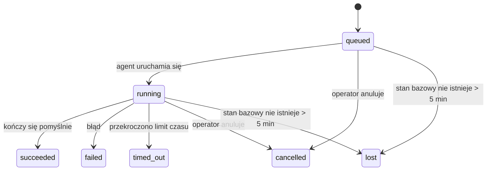

---
read_when:
    - Sprawdzanie trwających lub niedawno zakończonych zadań w tle
    - Debugowanie błędów dostarczania dla odłączonych uruchomień agenta
    - Zrozumienie, jak zadania w tle są powiązane z sesjami, Cron i Heartbeat
sidebarTitle: Background tasks
summary: Śledzenie zadań w tle dla uruchomień ACP, subagentów, wykonań Cron i operacji CLI
title: Zadania w tle
x-i18n:
    generated_at: "2026-07-12T14:47:16Z"
    model: gpt-5.6
    postprocess_version: locale-links-v1
    provider: openai
    source_hash: 0a945e8103c5df5a64785f326a9d0b08784ac32a2ca6fa3d4c399d75fc54be2b
    source_path: automation/tasks.md
    workflow: 16
---

<Note>
Szukasz harmonogramowania? Zobacz [Automatyzację](/pl/automation), aby wybrać odpowiedni mechanizm. Ta strona jest rejestrem aktywności zadań wykonywanych w tle, a nie harmonogramem.
</Note>

Zadania w tle śledzą pracę wykonywaną **poza główną sesją konwersacji**: uruchomienia ACP, tworzenie subagentów, wykonania zadań cron oraz operacje inicjowane z poziomu CLI.

Zadania **nie** zastępują sesji, zadań cron ani Heartbeat — są **rejestrem aktywności**, który zapisuje, jakie odłączone zadania wykonano, kiedy to nastąpiło i czy zakończyły się powodzeniem.

<Note>
Nie każde uruchomienie agenta tworzy zadanie. Przebiegi Heartbeat i zwykłe interaktywne konwersacje go nie tworzą. Tworzą je wszystkie wykonania cron, uruchomienia ACP, uruchomienia subagentów oraz polecenia agenta CLI wysyłane przez Gateway.
</Note>

## W skrócie

- Zadania są **rekordami**, a nie harmonogramami — cron i Heartbeat określają, _kiedy_ wykonywana jest praca, a zadania śledzą, _co się wydarzyło_.
- ACP, subagenci, wszystkie zadania cron i operacje CLI tworzą zadania. Przebiegi Heartbeat ich nie tworzą.
- Każde zadanie przechodzi przez stany `queued → running → terminal` (succeeded, failed, timed_out, cancelled lub lost).
- Zadania cron pozostają aktywne, dopóki środowisko wykonawcze cron nadal zarządza zadaniem; jeśli stan środowiska wykonawczego w pamięci zniknie, mechanizm konserwacji zadań najpierw sprawdza trwałą historię uruchomień cron, zanim oznaczy zadanie jako utracone.
- Zakończenie jest obsługiwane przez powiadomienia push: odłączone zadanie może powiadomić bezpośrednio albo wybudzić sesję żądającą lub Heartbeat po zakończeniu, dlatego pętle odpytywania o stan są zwykle niewłaściwym rozwiązaniem.
- Izolowane uruchomienia cron i zakończenia subagentów podejmują, w miarę możliwości, próbę zamknięcia śledzonych kart przeglądarki i procesów ich sesji podrzędnej przed końcowym uporządkowaniem rejestru.
- Dostarczanie wyników izolowanego cron pomija nieaktualne pośrednie odpowiedzi rodzica, gdy zadania potomnych subagentów nadal się kończą, i preferuje końcowy wynik potomka, jeśli nadejdzie on przed dostarczeniem.
- Powiadomienia o zakończeniu są dostarczane bezpośrednio do kanału lub umieszczane w kolejce do następnego Heartbeat.
- `openclaw tasks list` wyświetla wszystkie zadania; `openclaw tasks audit` ujawnia problemy.
- Rekordy końcowe są przechowywane przez 7 dni (rekordy `lost` przez 24 godziny), a następnie automatycznie usuwane.

## Szybki start

<Tabs>
  <Tab title="Wyświetlanie i filtrowanie">
    ```bash
    # Wyświetl wszystkie zadania (od najnowszych)
    openclaw tasks list

    # Filtruj według środowiska wykonawczego lub stanu
    openclaw tasks list --runtime acp
    openclaw tasks list --status running
    ```

  </Tab>
  <Tab title="Sprawdzanie">
    ```bash
    # Wyświetl szczegóły konkretnego zadania (według identyfikatora zadania, identyfikatora uruchomienia lub klucza sesji)
    openclaw tasks show <lookup>
    ```
  </Tab>
  <Tab title="Anulowanie i powiadamianie">
    ```bash
    # Anuluj uruchomione zadanie (kończy sesję podrzędną)
    openclaw tasks cancel <lookup>

    # Zmień zasady powiadamiania dla zadania
    openclaw tasks notify <lookup> state_changes
    ```

  </Tab>
  <Tab title="Audyt i konserwacja">
    ```bash
    # Uruchom audyt kondycji
    openclaw tasks audit

    # Wyświetl podgląd konserwacji lub ją zastosuj
    openclaw tasks maintenance
    openclaw tasks maintenance --apply
    ```

  </Tab>
  <Tab title="Przepływ zadań">
    ```bash
    # Sprawdź stan TaskFlow
    openclaw tasks flow list
    openclaw tasks flow show <lookup>
    openclaw tasks flow cancel <lookup>
    ```
  </Tab>
</Tabs>

## Co tworzy zadanie

| Źródło                    | Typ środowiska wykonawczego | Kiedy tworzony jest rekord zadania                                     | Domyślne zasady powiadamiania |
| ------------------------- | --------------------------- | ---------------------------------------------------------------------- | ---------------------------- |
| Uruchomienia ACP w tle    | `acp`                       | Utworzenie podrzędnej sesji ACP                                        | `done_only`                  |
| Orkiestracja subagentów   | `subagent`                  | Utworzenie subagenta za pomocą `sessions_spawn`                         | `done_only`                  |
| Zadania cron (każdy typ)  | `cron`                      | Każde wykonanie cron (w sesji głównej i izolowane)                      | `silent`                     |
| Operacje CLI              | `cli`                       | Polecenia `openclaw agent` wykonywane za pośrednictwem Gateway          | `silent`                     |
| Zadania multimedialne agenta | `cli`                    | Uruchomienia `image_generate`/`music_generate`/`video_generate` oparte na sesji | `silent`              |

<AccordionGroup>
  <Accordion title="Domyślne powiadomienia dla cron i multimediów">
    Zadania cron (w sesji głównej i izolowane) używają zasad powiadamiania `silent` — tworzą rekordy na potrzeby śledzenia, ale nie generują własnych powiadomień o zadaniach; cron zarządza własną ścieżką dostarczania.

    Oparte na sesji uruchomienia `image_generate`, `music_generate` i `video_generate` również używają zasad powiadamiania `silent`. Nadal tworzą rekordy zadań, ale informacja o zakończeniu jest przekazywana z powrotem do pierwotnej sesji agenta jako wewnętrzne wybudzenie, dzięki czemu agent może napisać kolejną wiadomość i samodzielnie dołączyć gotowe multimedia. Agent żądający postępuje zgodnie ze swoją standardową umową dotyczącą widocznych odpowiedzi: automatyczna odpowiedź końcowa, jeśli jest skonfigurowana, albo `message(action="send")` wraz z `NO_REPLY`, gdy sesja wymaga odpowiedzi za pomocą narzędzia wiadomości. Jeśli sesja żądająca nie jest już aktywna lub jej aktywne wybudzenie nie powiedzie się, a agent obsługujący zakończenie pominie część lub wszystkie wygenerowane multimedia, OpenClaw wysyła idempotentną bezpośrednią wiadomość awaryjną zawierającą wyłącznie brakujące multimedia do pierwotnego celu kanału.

  </Accordion>
  <Accordion title="Zabezpieczenie przed równoczesnym generowaniem multimediów">
    Gdy oparte na sesji zadanie generowania multimediów jest nadal aktywne, `image_generate`, `music_generate` i `video_generate` chronią przed przypadkowymi ponowieniami: powtórzenie wywołania dla tego samego polecenia lub żądania zwraca stan odpowiadającego mu aktywnego zadania zamiast uruchamiać duplikat, natomiast inne polecenie może uruchomić własne zadanie. Użyj `action: "status"`, jeśli chcesz jawnie sprawdzić postęp lub stan po stronie agenta.
  </Accordion>
  <Accordion title="Co nie tworzy zadań">
    - Przebiegi Heartbeat — w sesji głównej; zobacz [Heartbeat](/pl/gateway/heartbeat)
    - Zwykłe interaktywne konwersacje
    - Bezpośrednie odpowiedzi na `/command`

  </Accordion>
</AccordionGroup>

## Cykl życia zadania



| Stan        | Znaczenie                                                                    |
| ----------- | ---------------------------------------------------------------------------- |
| `queued`    | Utworzone, oczekuje na uruchomienie agenta                                   |
| `running`   | Przebieg agenta jest aktywnie wykonywany                                      |
| `succeeded` | Zakończone pomyślnie                                                         |
| `failed`    | Zakończone błędem                                                            |
| `timed_out` | Przekroczono skonfigurowany limit czasu                                       |
| `cancelled` | Zatrzymane przez operatora za pomocą `openclaw tasks cancel` lub uruchomienie zostało przerwane |
| `lost`      | Środowisko wykonawcze utraciło autorytatywny stan bazowy po 5-minutowym okresie karencji |

Przejścia następują automatycznie — zdarzenia cyklu życia uruchomienia agenta (początek, koniec, błąd) aktualizują stan zadania; nie zarządza się nim ręcznie.

Zakończenie uruchomienia agenta jest rozstrzygające dla aktywnych rekordów zadań. Pomyślne odłączone uruchomienie kończy się stanem `succeeded`, zwykłe błędy uruchomienia stanem `failed`, przekroczenia limitu czasu stanem `timed_out`, a anulowanie lub przerwanie stanem `cancelled`. Gdy zadanie osiągnie stan końcowy, późniejsze sygnały cyklu życia nie zmieniają go na mniej priorytetowy — zadanie anulowane przez operatora lub mające już stan `failed`/`timed_out`/`lost` zachowuje ten stan, nawet jeśli później nadejdzie sygnał powodzenia.

Stan `lost` uwzględnia środowisko wykonawcze:

- Zadania ACP: tylko aktywny przebieg ACP w procesie Gateway potwierdza, że uruchomienie nadal trwa; same utrwalone metadane sesji tego nie potwierdzają. Audyt CLI w trybie offline pozostaje zachowawczy i nigdy nie odzyskuje zadań ACP.
- Zadania subagentów: bazowa sesja podrzędna zniknęła z magazynu agenta docelowego lub zawiera znacznik odzyskiwania po ponownym uruchomieniu.
- Zadania cron: środowisko wykonawcze cron nie śledzi już zadania jako aktywnego, a trwała historia uruchomień cron nie zawiera końcowego wyniku tego uruchomienia. Audyt CLI w trybie offline nie uznaje własnego pustego stanu środowiska wykonawczego cron w procesie za źródło rozstrzygające.
- Zadania CLI: zadania z identyfikatorem uruchomienia lub źródła korzystają z aktywnego kontekstu uruchomienia, dlatego pozostałe rekordy sesji podrzędnej lub sesji konwersacji nie utrzymują ich jako aktywnych po zniknięciu uruchomienia zarządzanego przez Gateway. Starsze zadania CLI bez tożsamości uruchomienia nadal używają awaryjnie sesji podrzędnej. Uruchomienia `openclaw agent` obsługiwane przez Gateway również kończą się na podstawie wyniku uruchomienia, więc ukończone uruchomienia nie pozostają aktywne do czasu oznaczenia ich przez mechanizm czyszczący jako `lost`.

## Dostarczanie i powiadomienia

Gdy zadanie osiąga stan końcowy, OpenClaw wysyła powiadomienie. Dostępne są dwie ścieżki dostarczania:

**Dostarczanie bezpośrednie** — jeśli zadanie ma cel kanału (`requesterOrigin`), wiadomość o zakończeniu trafia bezpośrednio do tego kanału (Discord, Slack, Telegram itp.). Zakończenia zadań grupowych i kanałowych są natomiast kierowane przez sesję żądającą, aby agent nadrzędny mógł napisać widoczną odpowiedź. W przypadku zakończeń subagentów OpenClaw zachowuje również powiązane trasowanie wątku lub tematu, gdy jest dostępne, i może uzupełnić brakujące `to` lub konto na podstawie zapisanej trasy sesji żądającej (`lastChannel` / `lastTo` / `lastAccountId`), zanim zrezygnuje z dostarczania bezpośredniego.

**Dostarczanie w kolejce sesji** — jeśli dostarczanie bezpośrednie nie powiedzie się lub nie ustawiono źródła, aktualizacja trafia do kolejki jako zdarzenie systemowe w sesji żądającej i pojawia się przy następnym Heartbeat.

<Tip>
Zakończenia zadań umieszczone w kolejce sesji wywołują natychmiastowe wybudzenie Heartbeat, dzięki czemu wynik pojawia się szybko — nie trzeba czekać na następny zaplanowany przebieg Heartbeat.
</Tip>

Oznacza to, że typowy przepływ pracy opiera się na powiadomieniach push: uruchom odłączone zadanie raz, a następnie pozwól środowisku wykonawczemu wybudzić sesję lub powiadomić Cię po zakończeniu. Odpytuj o stan zadania tylko wtedy, gdy potrzebujesz debugowania, interwencji lub jawnego audytu.

### Zasady powiadamiania

Określ, ile informacji chcesz otrzymywać o każdym zadaniu:

| Zasada                | Co jest dostarczane                                      |
| --------------------- | -------------------------------------------------------- |
| `done_only` (domyślna) | Tylko stan końcowy (succeeded, failed itd.)             |
| `state_changes`       | Każde przejście stanu i aktualizacja postępu             |
| `silent`              | Brak powiadomień (domyślnie dla zadań cron, CLI i multimedialnych) |

Zmień zasady podczas wykonywania zadania:

```bash
openclaw tasks notify <lookup> state_changes
```

## Dokumentacja CLI

<AccordionGroup>
  <Accordion title="tasks list">
    ```bash
    openclaw tasks list [--runtime <acp|subagent|cron|cli>] [--status <status>] [--json]
    ```

    Kolumny wyjściowe: Zadanie, Rodzaj, Stan, Dostarczanie, Uruchomienie, Sesja podrzędna, Podsumowanie. Samo `openclaw tasks` działa tak samo jak `openclaw tasks list`.

  </Accordion>
  <Accordion title="tasks show">
    ```bash
    openclaw tasks show <lookup> [--json]
    ```

    Token wyszukiwania przyjmuje identyfikator zadania, identyfikator uruchomienia lub klucz sesji. Wyświetla pełny rekord, w tym informacje o czasie, stanie dostarczania, błędzie i podsumowaniu końcowym.

  </Accordion>
  <Accordion title="tasks cancel">
    ```bash
    openclaw tasks cancel <lookup>
    ```

    W przypadku zadań ACP i subagentów powoduje to zakończenie sesji podrzędnej; anulowania ACP i cron są kierowane przez działający Gateway (`tasks.cancel`). W przypadku zadań śledzonych przez CLI anulowanie jest rejestrowane w rejestrze zadań (nie istnieje oddzielny uchwyt podrzędnego środowiska wykonawczego). Stan zmienia się na `cancelled`, a odpowiednie powiadomienie o dostarczeniu jest wysyłane, jeśli ma zastosowanie.

  </Accordion>
  <Accordion title="tasks notify">
    ```bash
    openclaw tasks notify <lookup> <done_only|state_changes|silent>
    ```
  </Accordion>
  <Accordion title="tasks audit">
    ```bash
    openclaw tasks audit [--severity <warn|error>] [--code <name>] [--limit <n>] [--json]
    ```

    Ujawnia problemy operacyjne dotyczące zadań **oraz** TaskFlow w jednym raporcie. Wykryte problemy pojawiają się również w `openclaw status`.

    Ustalenia dotyczące zadań:

    | Ustalenie                 | Poziom     | Warunek wyzwalający                                                                                                       |
    | ------------------------- | ---------- | ------------------------------------------------------------------------------------------------------------------------- |
    | `stale_queued`            | ostrzeżenie | W kolejce przez ponad 10 minut                                                                                            |
    | `stale_running`           | błąd       | Uruchomione przez ponad 30 minut                                                                                          |
    | `lost`                    | ostrzeżenie/błąd | Zniknęło powiązanie zadania ze środowiskiem wykonawczym; zachowane utracone zadania generują ostrzeżenia do `cleanupAfter`, a następnie stają się błędami |
    | `delivery_failed`         | ostrzeżenie | Dostarczenie nie powiodło się, a zasada powiadamiania nie ma wartości `silent`                                            |
    | `missing_cleanup`         | ostrzeżenie | Zadanie końcowe bez znacznika czasu czyszczenia                                                                           |
    | `inconsistent_timestamps` | ostrzeżenie | Naruszenie chronologii (na przykład zakończenie przed rozpoczęciem)                                                       |

    Ustalenia TaskFlow:

    | Ustalenie              | Poziom     | Warunek wyzwalający                                                        |
    | ---------------------- | ---------- | -------------------------------------------------------------------------- |
    | `restore_failed`       | błąd       | Przywrócenie rejestru przepływów z SQLite nie powiodło się                  |
    | `stale_running`        | błąd       | Uruchomiony przepływ nie poczynił postępu przez ponad 30 minut              |
    | `stale_waiting`        | ostrzeżenie | Oczekujący przepływ nie poczynił postępu przez ponad 30 minut               |
    | `stale_blocked`        | ostrzeżenie | Zablokowany przepływ nie poczynił postępu przez ponad 30 minut              |
    | `cancel_stuck`         | ostrzeżenie | Anulowanie zażądano ponad 5 minut temu, brak aktywnych zadań podrzędnych, a przepływ nadal nie jest zakończony |
    | `missing_linked_tasks` | ostrzeżenie/błąd | Nieaktualny zarządzany przepływ bez powiązanych zadań ani stanu oczekiwania |
    | `blocked_task_missing` | ostrzeżenie | Zablokowany przepływ wskazuje identyfikator zadania, które już nie istnieje |

  </Accordion>
  <Accordion title="tasks maintenance">
    ```bash
    openclaw tasks maintenance [--json]
    openclaw tasks maintenance --apply [--json]
    ```

    Użyj tego polecenia, aby wyświetlić podgląd lub zastosować uzgadnianie, nadawanie znaczników czasu czyszczenia oraz usuwanie zadań, stanu TaskFlow i nieaktualnych wierszy rejestru sesji uruchomień Cron.

    Uzgadnianie uwzględnia środowisko wykonawcze:

    - Zadania ACP wymagają aktywnej tury wykonywanej w procesie Gateway; zadania podagentów sprawdzają swoją bazową sesję podrzędną.
    - Zadania podagentów, których sesja podrzędna ma znacznik odzyskiwania po ponownym uruchomieniu, są oznaczane jako utracone zamiast traktowania ich sesji bazowych jako możliwych do odzyskania.
    - Zadania Cron sprawdzają, czy środowisko wykonawcze Cron nadal jest właścicielem zadania, a następnie odzyskują stan końcowy z zapisanych dzienników uruchomień Cron lub stanu zadania, zanim użyją awaryjnie stanu `lost`. Jedynie proces Gateway jest źródłem prawdy dla przechowywanego w pamięci zestawu aktywnych zadań Cron; audyt CLI w trybie offline korzysta z trwałej historii, ale nie oznacza zadania Cron jako utraconego wyłącznie dlatego, że ten lokalny zestaw jest pusty.
    - Zadania CLI z tożsamością uruchomienia sprawdzają aktywny kontekst uruchomienia będący ich właścicielem, a nie tylko wiersze sesji podrzędnej lub sesji czatu.

    Czyszczenie po zakończeniu również uwzględnia środowisko wykonawcze:

    - Po zakończeniu podagenta system podejmuje próbę zamknięcia śledzonych kart i procesów przeglądarki dla sesji podrzędnej, zanim będzie kontynuowane czyszczenie związane z ogłoszeniem.
    - Po zakończeniu izolowanego uruchomienia Cron system podejmuje próbę zamknięcia śledzonych kart i procesów przeglądarki dla sesji Cron, zanim uruchomienie zostanie całkowicie zamknięte.
    - Dostarczanie wyników izolowanego uruchomienia Cron w razie potrzeby oczekuje na dalsze działania podagentów potomnych i pomija nieaktualny tekst potwierdzenia elementu nadrzędnego zamiast go ogłaszać.
    - Dostarczanie wyniku ukończenia podagenta używa wyłącznie najnowszego widocznego tekstu asystenta z sesji podrzędnej. Dane wyjściowe narzędzia ani `toolResult` nie są używane jako tekst wyniku sesji podrzędnej. Zakończone niepowodzeniem uruchomienia końcowe ogłaszają stan niepowodzenia bez ponownego odtwarzania przechwyconego tekstu odpowiedzi.
    - Błędy czyszczenia nie przesłaniają rzeczywistego wyniku zadania.

    Podczas stosowania konserwacji OpenClaw usuwa również nieaktualne wiersze rejestru sesji `cron:<jobId>:run:<runId>` starsze niż 7 dni, zachowując wiersze aktualnie uruchomionych zadań Cron i pozostawiając bez zmian wiersze sesji niezwiązanych z Cron.

  </Accordion>
  <Accordion title="tasks flow list | show | cancel">
    ```bash
    openclaw tasks flow list [--status <status>] [--json]
    openclaw tasks flow show <lookup> [--json]
    openclaw tasks flow cancel <lookup>
    ```

    Token wyszukiwania przepływu przyjmuje identyfikator przepływu lub klucz właściciela. Używaj tych poleceń, gdy interesuje Cię koordynujący [przepływ zadań](/pl/automation/taskflow), a nie pojedynczy rekord zadania w tle.

  </Accordion>
</AccordionGroup>

## Tablica zadań czatu (`/tasks`)

Użyj `/tasks` w dowolnej sesji czatu, aby wyświetlić zadania w tle powiązane z tą sesją. Tablica pokazuje maksymalnie pięć aktywnych i niedawno ukończonych zadań wraz ze środowiskiem wykonawczym, stanem, informacjami o czasie oraz szczegółami postępu lub błędu.

Gdy bieżąca sesja nie ma widocznych powiązanych zadań, `/tasks` wyświetla zamiast tego liczbę lokalnych zadań agenta, dzięki czemu nadal otrzymujesz przegląd bez ujawniania szczegółów innych sesji.

Aby wyświetlić pełny rejestr operatora, użyj CLI: `openclaw tasks list`.

### Interfejs sterowania

Internetowy interfejs sterowania zawiera na pasku bocznym stronę **Zadania** z aktywnymi i niedawnymi zadaniami w tle aktualizowanymi na żywo. Użyj jej, aby sprawdzać postęp, otwierać powiązane sesje, odświeżać rejestr albo anulować zadania znajdujące się w kolejce i uruchomione.

Panele czatu zawierają również zwijany pasek **Zadania w tle**, ograniczony do agenta danego panelu: uruchomione zadania i podagentów z kontrolką zatrzymania, sekcję ukończonych zadań oraz odnośniki Wyświetl transkrypcję prowadzące do sesji podrzędnej każdego zadania. Otwórz go za pomocą przełącznika aktywności w nagłówku panelu lub pływającego przycisku aktywności w czacie z jednym panelem.

## Integracja ze stanem (obciążenie zadaniami)

`openclaw status` zawiera zwięzły wiersz zadań:

```
Zadania    2 aktywne · 1 w kolejce · 1 uruchomione · 1 problem · audyt bez zastrzeżeń · 6 śledzonych
```

Podsumowanie zlicza aktywne prace (`queued` + `running`), niepowodzenia (`failed` + `timed_out` + `lost`), ustalenia audytu i łączną liczbę śledzonych rekordów; dane JSON zawierają również podział liczby zadań według środowiska wykonawczego (`acp`, `subagent`, `cron`, `cli`).

Zarówno `/status`, jak i narzędzie `session_status` używają migawki zadań uwzględniającej czyszczenie: preferowane są aktywne zadania, wygasłe wiersze są ukrywane, a zadania końcowe pojawiają się tylko przez krótki okres po zakończeniu (5 minut), przy czym po ustaniu aktywnych prac wyróżniane są niepowodzenia. Dzięki temu karta stanu koncentruje się na tym, co jest ważne w danej chwili.

## Przechowywanie i konserwacja

### Miejsce przechowywania zadań

Rekordy zadań i stan dostarczania są trwale przechowywane we współdzielonej bazie danych stanu SQLite OpenClaw:

```
~/.openclaw/state/openclaw.sqlite   (tabele: task_runs, task_delivery_state, flow_runs)
```

Ustaw `OPENCLAW_STATE_DIR`, aby przenieść cały katalog główny stanu (domyślnie `~/.openclaw`) w inne miejsce; ścieżka współdzielonej bazy danych zostanie przeniesiona razem z nim.

Rejestr jest wczytywany do pamięci przy pierwszym użyciu, a każdy zapis jest utrwalany w SQLite, dzięki czemu rekordy zachowują się po ponownym uruchomieniu Gateway. Wzrost WAL pozostaje ograniczony dzięki domyślnemu progowi automatycznych punktów kontrolnych SQLite oraz okresowym punktom kontrolnym `PASSIVE`; zamykanie i jawne punkty kontrolne konserwacji używają trybu `TRUNCATE`, dzięki czemu zwykłe zamknięcia odzyskują miejsce WAL bez zmuszania procesu czyszczącego w tle do oczekiwania na aktywnych czytelników.

Starsze magazyny pomocnicze z poprzednich instalacji (`tasks/runs.sqlite`, `flows/registry.sqlite`) są importowane do współdzielonej bazy danych przez `openclaw doctor`.

### Automatyczna konserwacja

Proces czyszczący uruchamia się co **60 sekund** (pierwszy przebieg około 5 sekund po uruchomieniu Gateway) i wykonuje cztery czynności:

<Steps>
  <Step title="Reconciliation">
    Sprawdza, czy aktywne zadania nadal mają wiarygodne powiązanie ze środowiskiem wykonawczym. Zadania ACP wymagają aktywnej tury wykonywanej w procesie, zadania podagentów korzystają ze stanu sesji podrzędnej, zadania Cron korzystają z własności aktywnego zadania i trwałej historii uruchomień, a zadania CLI z tożsamością uruchomienia korzystają z kontekstu uruchomienia będącego ich właścicielem. Jeśli stan bazowy nie istnieje przez ponad 5 minut (30 minut w przypadku natywnych zadań podagentów bez sesji podrzędnej), zadanie jest oznaczane jako `lost`.
  </Step>
  <Step title="ACP session repair">
    Zamyka zakończone lub osierocone jednorazowe sesje ACP należące do elementu nadrzędnego, a także zamyka nieaktualne zakończone lub osierocone trwałe sesje ACP tylko wtedy, gdy nie istnieje już żadne aktywne powiązanie z konwersacją.
  </Step>
  <Step title="Cleanup stamping">
    Ustawia znacznik czasu `cleanupAfter` dla zadań końcowych (czas zakończenia + okres przechowywania). W okresie przechowywania utracone zadania nadal pojawiają się w audycie jako ostrzeżenia; po upływie `cleanupAfter` lub w przypadku braku metadanych czyszczenia stają się błędami.
  </Step>
  <Step title="Pruning">
    Usuwa rekordy po upływie ich daty `cleanupAfter`.
  </Step>
</Steps>

<Note>
**Przechowywanie:** rekordy zakończonych zadań są przechowywane przez **7 dni** (rekordy `lost` przez **24 godziny**), a następnie automatycznie usuwane. Konfiguracja nie jest wymagana.
</Note>

## Powiązania zadań z innymi systemami

<AccordionGroup>
  <Accordion title="Tasks and Task Flow">
    [Task Flow](/pl/automation/taskflow) jest warstwą koordynacji przepływów ponad zadaniami w tle. Pojedynczy przepływ może w czasie swojego działania koordynować wiele zadań przy użyciu zarządzanych lub lustrzanych trybów synchronizacji. Użyj `openclaw tasks`, aby sprawdzać poszczególne rekordy zadań, oraz `openclaw tasks flow`, aby sprawdzać koordynujący przepływ.

  </Accordion>
  <Accordion title="Tasks and cron">
    Definicje zadań Cron, stan wykonania i historia uruchomień znajdują się we współdzielonej bazie danych stanu SQLite OpenClaw. **Każde** wykonanie Cron tworzy rekord zadania — zarówno w sesji głównej, jak i izolowanej — z zasadą powiadamiania `silent`, dzięki czemu uruchomienia Cron są śledzone bez generowania własnych powiadomień o zadaniach.

    Zobacz [Zadania Cron](/pl/automation/cron-jobs).

  </Accordion>
  <Accordion title="Tasks and heartbeat">
    Uruchomienia Heartbeat są turami sesji głównej — nie tworzą rekordów zadań. Gdy zadanie zostanie ukończone, może wywołać wybudzenie Heartbeat, aby wynik został szybko wyświetlony.

    Zobacz [Heartbeat](/pl/gateway/heartbeat).

  </Accordion>
  <Accordion title="Tasks and sessions">
    Zadanie może odwoływać się do `childSessionKey` (miejsca wykonywania pracy) i `requesterSessionKey` (podmiotu, który je uruchomił). Jego `agentId` identyfikuje agenta wykonującego pracę, natomiast pola żądającego i właściciela zachowują kontekst uruchomienia i sterowania. Sesje są kontekstem konwersacji, a zadania stanowią dodatkową warstwę śledzenia aktywności.
  </Accordion>
  <Accordion title="Tasks and agent runs">
    Wartość `runId` zadania wskazuje uruchomienie agenta wykonujące pracę. Zdarzenia cyklu życia agenta (rozpoczęcie, zakończenie, błąd) automatycznie aktualizują stan zadania — nie trzeba ręcznie zarządzać cyklem życia.
  </Accordion>
</AccordionGroup>

## Powiązane materiały

- [Automatyzacja](/pl/automation) — przegląd wszystkich mechanizmów automatyzacji
- [CLI: Zadania](/pl/cli/tasks) — dokumentacja poleceń CLI
- [Heartbeat](/pl/gateway/heartbeat) — okresowe tury sesji głównej
- [Zaplanowane zadania](/pl/automation/cron-jobs) — planowanie pracy w tle
- [Task Flow](/pl/automation/taskflow) — koordynacja przepływów ponad zadaniami
