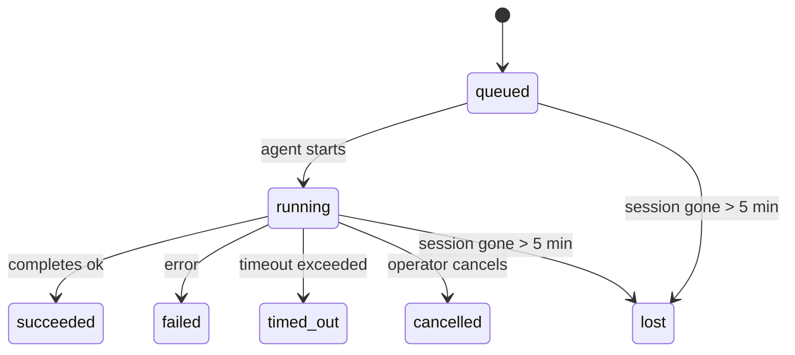

---
read_when:
    - Sprawdzanie trwających lub niedawno ukończonych prac w tle
    - Debugowanie niepowodzeń dostarczania dla odłączonych uruchomień agenta
    - Zrozumienie, jak uruchomienia w tle wiążą się z sesjami, Cron i Heartbeat
sidebarTitle: Background tasks
summary: Śledzenie zadań w tle dla uruchomień ACP, subagentów, izolowanych zadań Cron i operacji CLI
title: Zadania w tle
x-i18n:
    generated_at: "2026-04-30T16:27:49Z"
    model: gpt-5.5
    provider: openai
    source_hash: 999653c9360323d5135e33193c76458cba8c288227de46a6217f1ccbed2a6d34
    source_path: automation/tasks.md
    workflow: 16
---

<Note>
Szukasz harmonogramowania? Zobacz [Automatyzacja i zadania](/pl/automation), aby wybrać właściwy mechanizm. Ta strona jest dziennikiem aktywności pracy w tle, a nie harmonogramem.
</Note>

Zadania w tle śledzą pracę wykonywaną **poza główną sesją konwersacji**: uruchomienia ACP, uruchomienia subagentów, izolowane wykonania zadań cron oraz operacje inicjowane przez CLI.

Zadania **nie** zastępują sesji, zadań cron ani Heartbeat — są **dziennikiem aktywności**, który zapisuje, jaka odłączona praca została wykonana, kiedy i czy zakończyła się powodzeniem.

<Note>
Nie każde uruchomienie agenta tworzy zadanie. Tury Heartbeat i zwykły czat interaktywny tego nie robią. Robią to wszystkie wykonania cron, uruchomienia ACP, uruchomienia subagentów oraz polecenia agenta CLI.
</Note>

## TL;DR

- Zadania są **rekordami**, nie harmonogramami — cron i Heartbeat decydują, _kiedy_ praca działa, zadania śledzą, _co się wydarzyło_.
- ACP, subagenci, wszystkie zadania cron oraz operacje CLI tworzą zadania. Tury Heartbeat tego nie robią.
- Każde zadanie przechodzi przez `queued → running → terminal` (succeeded, failed, timed_out, cancelled albo lost).
- Zadania cron pozostają aktywne, dopóki środowisko wykonawcze cron nadal jest właścicielem zadania; jeśli
  stan środowiska wykonawczego w pamięci zniknął, konserwacja zadań najpierw sprawdza trwałą historię
  uruchomień cron, zanim oznaczy zadanie jako utracone.
- Ukończenie jest sterowane wypychaniem: odłączona praca może powiadomić bezpośrednio albo wybudzić
  sesję żądającą/Heartbeat po zakończeniu, więc pętle odpytywania statusu mają
  zwykle niewłaściwy kształt.
- Izolowane uruchomienia cron i ukończenia subagentów w trybie best-effort czyszczą śledzone karty przeglądarki/procesy dla swojej sesji podrzędnej przed końcowym księgowaniem czyszczenia.
- Dostarczanie izolowanego cron tłumi przestarzałe pośrednie odpowiedzi nadrzędne, gdy praca potomnego subagenta wciąż się opróżnia, i preferuje końcowe wyjście potomne, gdy dotrze przed dostarczeniem.
- Powiadomienia o ukończeniu są dostarczane bezpośrednio do kanału albo kolejkowane do następnego Heartbeat.
- `openclaw tasks list` pokazuje wszystkie zadania; `openclaw tasks audit` ujawnia problemy.
- Rekordy końcowe są przechowywane przez 7 dni, a potem automatycznie usuwane.

## Szybki start

<Tabs>
  <Tab title="Lista i filtrowanie">
    ```bash
    # List all tasks (newest first)
    openclaw tasks list

    # Filter by runtime or status
    openclaw tasks list --runtime acp
    openclaw tasks list --status running
    ```

  </Tab>
  <Tab title="Inspekcja">
    ```bash
    # Show details for a specific task (by ID, run ID, or session key)
    openclaw tasks show <lookup>
    ```
  </Tab>
  <Tab title="Anulowanie i powiadamianie">
    ```bash
    # Cancel a running task (kills the child session)
    openclaw tasks cancel <lookup>

    # Change notification policy for a task
    openclaw tasks notify <lookup> state_changes
    ```

  </Tab>
  <Tab title="Audyt i konserwacja">
    ```bash
    # Run a health audit
    openclaw tasks audit

    # Preview or apply maintenance
    openclaw tasks maintenance
    openclaw tasks maintenance --apply
    ```

  </Tab>
  <Tab title="Przepływ zadań">
    ```bash
    # Inspect TaskFlow state
    openclaw tasks flow list
    openclaw tasks flow show <lookup>
    openclaw tasks flow cancel <lookup>
    ```
  </Tab>
</Tabs>

## Co tworzy zadanie

| Źródło                 | Typ środowiska wykonawczego | Kiedy tworzony jest rekord zadania                       | Domyślna polityka powiadomień |
| ---------------------- | ------------ | ------------------------------------------------------ | --------------------- |
| Uruchomienia ACP w tle | `acp`        | Uruchomienie podrzędnej sesji ACP                       | `done_only`           |
| Orkiestracja subagentów | `subagent`   | Uruchomienie subagenta przez `sessions_spawn`           | `done_only`           |
| Zadania Cron (wszystkie typy) | `cron`       | Każde wykonanie cron (w głównej sesji i izolowane)      | `silent`              |
| Operacje CLI           | `cli`        | Polecenia `openclaw agent`, które działają przez Gateway | `silent`              |
| Zadania multimedialne agenta | `cli`        | Uruchomienia `video_generate` oparte na sesji           | `silent`              |

<AccordionGroup>
  <Accordion title="Domyślne powiadomienia dla cron i multimediów">
    Zadania cron w głównej sesji domyślnie używają polityki powiadomień `silent` — tworzą rekordy do śledzenia, ale nie generują powiadomień. Izolowane zadania cron również domyślnie używają `silent`, ale są bardziej widoczne, ponieważ działają we własnej sesji.

    Uruchomienia `video_generate` oparte na sesji również używają polityki powiadomień `silent`. Nadal tworzą rekordy zadań, ale ukończenie jest przekazywane z powrotem do pierwotnej sesji agenta jako wewnętrzne wybudzenie, aby agent mógł sam napisać wiadomość uzupełniającą i dołączyć gotowe wideo. Jeśli włączysz `tools.media.asyncCompletion.directSend`, asynchroniczne ukończenia `music_generate` i `video_generate` najpierw próbują bezpośredniego dostarczenia do kanału, zanim wrócą do ścieżki wybudzenia sesji żądającej.

  </Accordion>
  <Accordion title="Zabezpieczenie współbieżnego video_generate">
    Gdy zadanie `video_generate` oparte na sesji jest nadal aktywne, narzędzie działa także jako zabezpieczenie: powtórzone wywołania `video_generate` w tej samej sesji zwracają status aktywnego zadania zamiast uruchamiać drugą współbieżną generację. Użyj `action: "status"`, gdy potrzebujesz jawnego sprawdzenia postępu/statusu po stronie agenta.
  </Accordion>
  <Accordion title="Co nie tworzy zadań">
    - Tury Heartbeat — główna sesja; zobacz [Heartbeat](/pl/gateway/heartbeat)
    - Zwykłe interaktywne tury czatu
    - Bezpośrednie odpowiedzi `/command`

  </Accordion>
</AccordionGroup>

## Cykl życia zadania



| Status      | Co oznacza                                                               |
| ----------- | -------------------------------------------------------------------------- |
| `queued`    | Utworzone, czeka na uruchomienie agenta                                  |
| `running`   | Tura agenta jest aktywnie wykonywana                                      |
| `succeeded` | Ukończone pomyślnie                                                       |
| `failed`    | Ukończone z błędem                                                        |
| `timed_out` | Przekroczyło skonfigurowany limit czasu                                  |
| `cancelled` | Zatrzymane przez operatora przez `openclaw tasks cancel`                  |
| `lost`      | Środowisko wykonawcze utraciło autorytatywny stan wspierający po 5-minutowym okresie karencji |

Przejścia zachodzą automatycznie — gdy powiązane uruchomienie agenta się kończy, status zadania aktualizuje się odpowiednio.

Ukończenie uruchomienia agenta jest autorytatywne dla aktywnych rekordów zadań. Udane odłączone uruchomienie finalizuje się jako `succeeded`, zwykłe błędy uruchomienia finalizują się jako `failed`, a wyniki limitu czasu lub przerwania finalizują się jako `timed_out`. Jeśli operator wcześniej anulował zadanie albo środowisko wykonawcze zapisało już silniejszy stan końcowy, taki jak `failed`, `timed_out` albo `lost`, późniejszy sygnał sukcesu nie obniża tego statusu końcowego.

`lost` uwzględnia środowisko wykonawcze:

- Zadania ACP: metadane podrzędnej sesji ACP zniknęły.
- Zadania subagentów: podrzędna sesja zniknęła z docelowego magazynu agentów.
- Zadania Cron: środowisko wykonawcze cron nie śledzi już zadania jako aktywnego, a trwała
  historia uruchomień cron nie pokazuje końcowego wyniku dla tego uruchomienia. Audyt offline CLI
  nie traktuje własnego pustego stanu środowiska wykonawczego cron w procesie jako autorytatywnego.
- Zadania CLI: izolowane zadania sesji podrzędnej używają sesji podrzędnej; zadania CLI
  oparte na czacie używają zamiast tego aktywnego kontekstu uruchomienia, więc zalegające
  wiersze sesji kanału/grupy/bezpośredniej nie utrzymują ich przy życiu. Uruchomienia
  `openclaw agent` oparte na Gateway także finalizują się na podstawie wyniku uruchomienia, więc ukończone uruchomienia
  nie pozostają aktywne, dopóki proces czyszczący nie oznaczy ich jako `lost`.

## Dostarczanie i powiadomienia

Gdy zadanie osiąga stan końcowy, OpenClaw Cię powiadamia. Istnieją dwie ścieżki dostarczania:

**Dostarczanie bezpośrednie** — jeśli zadanie ma docelowy kanał (`requesterOrigin`), wiadomość o ukończeniu trafia bezpośrednio do tego kanału (Telegram, Discord, Slack itd.). Dla ukończeń subagentów OpenClaw zachowuje również powiązane kierowanie wątku/tematu, gdy jest dostępne, i może uzupełnić brakujące `to` / konto z zapisanej trasy sesji żądającej (`lastChannel` / `lastTo` / `lastAccountId`), zanim zrezygnuje z dostarczania bezpośredniego.

**Dostarczanie kolejkowane w sesji** — jeśli dostarczanie bezpośrednie się nie powiedzie albo nie ustawiono źródła, aktualizacja jest kolejkowana jako zdarzenie systemowe w sesji żądającego i pojawia się przy następnym Heartbeat.

<Tip>
Ukończenie zadania wyzwala natychmiastowe wybudzenie Heartbeat, więc szybko zobaczysz wynik — nie musisz czekać na następny zaplanowany takt Heartbeat.
</Tip>

Oznacza to, że zwykły przepływ pracy jest oparty na wypychaniu: uruchom odłączoną pracę raz, a potem pozwól środowisku wykonawczemu wybudzić Cię lub powiadomić o ukończeniu. Odpytuj stan zadania tylko wtedy, gdy potrzebujesz debugowania, interwencji albo jawnego audytu.

### Polityki powiadomień

Kontroluj, ile informacji otrzymujesz o każdym zadaniu:

| Polityka                | Co jest dostarczane                                                    |
| --------------------- | ----------------------------------------------------------------------- |
| `done_only` (domyślna) | Tylko stan końcowy (succeeded, failed itd.) — **to jest wartość domyślna** |
| `state_changes`       | Każde przejście stanu i aktualizacja postępu                            |
| `silent`              | Nic                                                                    |

Zmień politykę, gdy zadanie działa:

```bash
openclaw tasks notify <lookup> state_changes
```

## Dokumentacja CLI

<AccordionGroup>
  <Accordion title="tasks list">
    ```bash
    openclaw tasks list [--runtime <acp|subagent|cron|cli>] [--status <status>] [--json]
    ```

    Kolumny wyjścia: ID zadania, Rodzaj, Status, Dostarczanie, ID uruchomienia, Sesja podrzędna, Podsumowanie.

  </Accordion>
  <Accordion title="tasks show">
    ```bash
    openclaw tasks show <lookup>
    ```

    Token wyszukiwania akceptuje ID zadania, ID uruchomienia albo klucz sesji. Pokazuje pełny rekord, w tym czas, stan dostarczania, błąd i podsumowanie końcowe.

  </Accordion>
  <Accordion title="tasks cancel">
    ```bash
    openclaw tasks cancel <lookup>
    ```

    Dla zadań ACP i subagentów zabija to sesję podrzędną. Dla zadań śledzonych przez CLI anulowanie jest zapisywane w rejestrze zadań (nie ma osobnego uchwytu podrzędnego środowiska wykonawczego). Status przechodzi na `cancelled`, a powiadomienie o dostarczeniu jest wysyłane, gdy ma zastosowanie.

  </Accordion>
  <Accordion title="tasks notify">
    ```bash
    openclaw tasks notify <lookup> <done_only|state_changes|silent>
    ```
  </Accordion>
  <Accordion title="tasks audit">
    ```bash
    openclaw tasks audit [--json]
    ```

    Ujawnia problemy operacyjne. Ustalenia pojawiają się także w `openclaw status`, gdy wykryto problemy.

    | Ustalenie                 | Ważność    | Wyzwalacz                                                                                                    |
    | ------------------------- | ---------- | ------------------------------------------------------------------------------------------------------------ |
    | `stale_queued`            | ostrzeżenie | W kolejce przez ponad 10 minut                                                                               |
    | `stale_running`           | błąd       | Uruchomione przez ponad 30 minut                                                                             |
    | `lost`                    | ostrzeżenie/błąd | Własność zadania wspieranego przez runtime zniknęła; zachowane utracone zadania ostrzegają do `cleanupAfter`, potem stają się błędami |
    | `delivery_failed`         | ostrzeżenie | Dostarczenie nie powiodło się, a zasada powiadamiania nie jest `silent`                                      |
    | `missing_cleanup`         | ostrzeżenie | Zadanie terminalne bez znacznika czasu czyszczenia                                                           |
    | `inconsistent_timestamps` | ostrzeżenie | Naruszenie osi czasu (na przykład zakończono przed rozpoczęciem)                                             |

  </Accordion>
  <Accordion title="konserwacja zadań">
    ```bash
    openclaw tasks maintenance [--json]
    openclaw tasks maintenance --apply [--json]
    ```

    Użyj tego, aby podejrzeć lub zastosować uzgadnianie, stemplowanie czyszczenia i przycinanie dla zadań oraz stanu Task Flow.

    Uzgadnianie jest świadome runtime:

    - Zadania ACP/subagent sprawdzają swoją nadrzędną sesję podrzędną.
    - Zadania subagent, których sesja podrzędna ma nagrobek odzyskiwania po restarcie, są oznaczane jako utracone zamiast traktowania ich jako możliwe do odzyskania sesje nadrzędne.
    - Zadania Cron sprawdzają, czy runtime cron nadal jest właścicielem zadania, następnie odzyskują status terminalny z utrwalonych dzienników uruchomień cron/stanu zadania, zanim ostatecznie przejdą do `lost`. Tylko proces Gateway jest autorytatywny dla zestawu aktywnych zadań cron w pamięci; audyt CLI offline używa trwałej historii, ale nie oznacza zadania cron jako utraconego wyłącznie dlatego, że ten lokalny Set jest pusty.
    - Zadania CLI oparte na czacie sprawdzają właścicielski kontekst aktywnego uruchomienia, a nie tylko wiersz sesji czatu.

    Czyszczenie po zakończeniu również jest świadome runtime:

    - Zakończenie subagent na zasadzie najlepszych starań zamyka śledzone karty/procesy przeglądarki dla sesji podrzędnej, zanim czyszczenie ogłoszenia będzie kontynuowane.
    - Zakończenie izolowanego cron na zasadzie najlepszych starań zamyka śledzone karty/procesy przeglądarki dla sesji cron, zanim uruchomienie zostanie całkowicie rozebrane.
    - Dostarczanie izolowanego cron w razie potrzeby czeka na dalsze działania potomnego subagent i tłumi nieaktualny tekst potwierdzenia rodzica zamiast go ogłaszać.
    - Dostarczanie zakończenia subagent preferuje najnowszy widoczny tekst asystenta; jeśli jest pusty, przechodzi do oczyszczonego najnowszego tekstu narzędzia/toolResult, a uruchomienia wywołań narzędzi zakończone wyłącznie limitem czasu mogą zostać zwinięte do krótkiego podsumowania częściowego postępu. Terminalne nieudane uruchomienia ogłaszają status niepowodzenia bez ponownego odtwarzania przechwyconego tekstu odpowiedzi.
    - Niepowodzenia czyszczenia nie przesłaniają rzeczywistego wyniku zadania.

  </Accordion>
  <Accordion title="lista | pokazanie | anulowanie przepływu zadań">
    ```bash
    openclaw tasks flow list [--status <status>] [--json]
    openclaw tasks flow show <lookup> [--json]
    openclaw tasks flow cancel <lookup>
    ```

    Użyj ich, gdy zależy Ci na orkiestrującym Task Flow, a nie na jednym konkretnym rekordzie zadania w tle.

  </Accordion>
</AccordionGroup>

## Tablica zadań czatu (`/tasks`)

Użyj `/tasks` w dowolnej sesji czatu, aby zobaczyć zadania w tle połączone z tą sesją. Tablica pokazuje aktywne i niedawno ukończone zadania z runtime, statusem, czasem oraz szczegółami postępu lub błędu.

Gdy bieżąca sesja nie ma widocznych połączonych zadań, `/tasks` przechodzi do lokalnych dla agenta liczników zadań, aby nadal zapewnić przegląd bez ujawniania szczegółów innych sesji.

Aby zobaczyć pełny rejestr operatora, użyj CLI: `openclaw tasks list`.

## Integracja statusu (obciążenie zadaniami)

`openclaw status` zawiera szybkie podsumowanie zadań:

```
Tasks: 3 queued · 2 running · 1 issues
```

Podsumowanie raportuje:

- **aktywne** — liczba `queued` + `running`
- **niepowodzenia** — liczba `failed` + `timed_out` + `lost`
- **wedługRuntime** — podział według `acp`, `subagent`, `cron`, `cli`

Zarówno `/status`, jak i narzędzie `session_status` używają migawki zadań świadomej czyszczenia: preferowane są aktywne zadania, nieaktualne ukończone wiersze są ukrywane, a ostatnie niepowodzenia pojawiają się tylko wtedy, gdy nie pozostaje żadna aktywna praca. Dzięki temu karta statusu koncentruje się na tym, co ważne teraz.

## Przechowywanie i konserwacja

### Gdzie znajdują się zadania

Rekordy zadań są utrwalane w SQLite pod adresem:

```
$OPENCLAW_STATE_DIR/tasks/runs.sqlite
```

Rejestr ładuje się do pamięci przy starcie Gateway i synchronizuje zapisy do SQLite, aby zapewnić trwałość między restartami.
Gateway ogranicza dziennik zapisu z wyprzedzeniem SQLite, używając domyślnego progu
autocheckpoint SQLite oraz okresowych i wykonywanych przy zamykaniu punktów kontrolnych `TRUNCATE`.

### Automatyczna konserwacja

Proces sprzątający uruchamia się co **60 sekund** i obsługuje cztery rzeczy:

<Steps>
  <Step title="Uzgadnianie">
    Sprawdza, czy aktywne zadania nadal mają autorytatywne wsparcie runtime. Zadania ACP/subagent używają stanu sesji podrzędnej, zadania cron używają własności aktywnego zadania, a zadania CLI oparte na czacie używają właścicielskiego kontekstu uruchomienia. Jeśli ten stan wsparcia zniknie na więcej niż 5 minut, zadanie zostaje oznaczone jako `lost`.
  </Step>
  <Step title="Naprawa sesji ACP">
    Zamyka terminalne lub osierocone jednorazowe sesje ACP należące do rodzica oraz zamyka nieaktualne terminalne lub osierocone trwałe sesje ACP tylko wtedy, gdy nie pozostaje aktywne powiązanie rozmowy.
  </Step>
  <Step title="Stemplowanie czyszczenia">
    Ustawia znacznik czasu `cleanupAfter` na zadaniach terminalnych (endedAt + 7 dni). Podczas przechowywania utracone zadania nadal pojawiają się w audycie jako ostrzeżenia; po wygaśnięciu `cleanupAfter` albo gdy brakuje metadanych czyszczenia, są błędami.
  </Step>
  <Step title="Przycinanie">
    Usuwa rekordy po ich dacie `cleanupAfter`.
  </Step>
</Steps>

<Note>
**Przechowywanie:** rekordy zadań terminalnych są przechowywane przez **7 dni**, a następnie automatycznie przycinane. Konfiguracja nie jest potrzebna.
</Note>

## Jak zadania odnoszą się do innych systemów

<AccordionGroup>
  <Accordion title="Zadania i Task Flow">
    [Task Flow](/pl/automation/taskflow) to warstwa orkiestracji przepływów ponad zadaniami w tle. Pojedynczy przepływ może koordynować wiele zadań w trakcie swojego życia, używając trybów synchronizacji zarządzanej lub lustrzanej. Użyj `openclaw tasks`, aby sprawdzić poszczególne rekordy zadań, oraz `openclaw tasks flow`, aby sprawdzić orkiestrujący przepływ.

    Zobacz [Task Flow](/pl/automation/taskflow), aby poznać szczegóły.

  </Accordion>
  <Accordion title="Zadania i cron">
    **Definicja** zadania cron znajduje się w `~/.openclaw/cron/jobs.json`; stan wykonania runtime znajduje się obok niej w `~/.openclaw/cron/jobs-state.json`. **Każde** wykonanie cron tworzy rekord zadania — zarówno w sesji głównej, jak i izolowane. Zadania cron w sesji głównej domyślnie używają zasady powiadamiania `silent`, więc są śledzone bez generowania powiadomień.

    Zobacz [Zadania Cron](/pl/automation/cron-jobs).

  </Accordion>
  <Accordion title="Zadania i heartbeat">
    Uruchomienia Heartbeat są turami w sesji głównej — nie tworzą rekordów zadań. Gdy zadanie się zakończy, może wyzwolić wybudzenie Heartbeat, aby wynik był szybko widoczny.

    Zobacz [Heartbeat](/pl/gateway/heartbeat).

  </Accordion>
  <Accordion title="Zadania i sesje">
    Zadanie może odwoływać się do `childSessionKey` (gdzie działa praca) i `requesterSessionKey` (kto ją uruchomił). Sesje są kontekstem rozmowy; zadania są śledzeniem aktywności na tej warstwie.
  </Accordion>
  <Accordion title="Zadania i uruchomienia agenta">
    `runId` zadania łączy się z uruchomieniem agenta wykonującym pracę. Zdarzenia cyklu życia agenta (start, koniec, błąd) automatycznie aktualizują status zadania — nie musisz ręcznie zarządzać cyklem życia.
  </Accordion>
</AccordionGroup>

## Powiązane

- [Automatyzacja i zadania](/pl/automation) — wszystkie mechanizmy automatyzacji w skrócie
- [CLI: Zadania](/pl/cli/tasks) — dokumentacja poleceń CLI
- [Heartbeat](/pl/gateway/heartbeat) — okresowe tury w sesji głównej
- [Zaplanowane zadania](/pl/automation/cron-jobs) — planowanie pracy w tle
- [Task Flow](/pl/automation/taskflow) — orkiestracja przepływów ponad zadaniami
