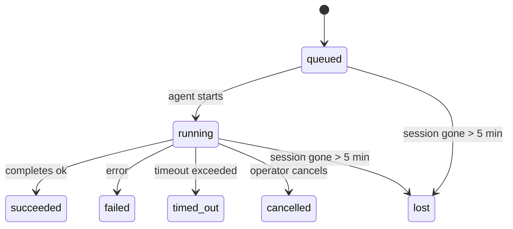

---
read_when:
    - Sprawdzanie trwającej lub niedawno zakończonej pracy w tle
    - Debugowanie niepowodzeń dostarczania dla odłączonych uruchomień agenta
    - Jak uruchomienia w tle są powiązane z sesjami, Cron i Heartbeat
sidebarTitle: Background tasks
summary: Śledzenie zadań w tle dla uruchomień ACP, subagentów, izolowanych zadań Cron i operacji CLI
title: Zadania w tle
x-i18n:
    generated_at: "2026-04-30T09:35:51Z"
    model: gpt-5.5
    provider: openai
    source_hash: 4bbf74f3aeea532738b56b83cd2e1a0a3734bfd453da6636b8be985a28ccc027
    source_path: automation/tasks.md
    workflow: 16
---

<Note>
Szukasz harmonogramowania? Zobacz [Automatyzacja i zadania](/pl/automation), aby wybrać właściwy mechanizm. Ta strona jest dziennikiem aktywności dla pracy w tle, a nie harmonogramem.
</Note>

Zadania w tle śledzą pracę uruchamianą **poza główną sesją konwersacji**: przebiegi ACP, uruchomienia subagentów, izolowane wykonania zadań cron oraz operacje inicjowane przez CLI.

Zadania **nie** zastępują sesji, zadań cron ani Heartbeat — są **dziennikiem aktywności**, który rejestruje, jaka odłączona praca została wykonana, kiedy i czy zakończyła się powodzeniem.

<Note>
Nie każde uruchomienie agenta tworzy zadanie. Tury Heartbeat i normalny czat interaktywny tego nie robią. Wszystkie wykonania cron, uruchomienia ACP, uruchomienia subagentów i polecenia agenta z CLI tak.
</Note>

## TL;DR

- Zadania są **rekordami**, a nie harmonogramami — cron i Heartbeat decydują, _kiedy_ praca jest uruchamiana, a zadania śledzą, _co się stało_.
- ACP, subagenci, wszystkie zadania cron i operacje CLI tworzą zadania. Tury Heartbeat nie.
- Każde zadanie przechodzi przez `queued → running → terminal` (succeeded, failed, timed_out, cancelled albo lost).
- Zadania cron pozostają aktywne, dopóki środowisko wykonawcze cron nadal jest właścicielem zadania; jeśli
  stan środowiska wykonawczego w pamięci zniknął, konserwacja zadań najpierw sprawdza trwałą historię uruchomień cron,
  zanim oznaczy zadanie jako lost.
- Ukończenie jest sterowane wypychaniem: odłączona praca może powiadomić bezpośrednio lub wybudzić
  sesję/Heartbeat żądającego po zakończeniu, więc pętle odpytywania statusu
  zwykle mają niewłaściwy kształt.
- Izolowane uruchomienia cron i ukończenia subagentów dokładają najlepszych starań, aby wyczyścić śledzone karty/procesy przeglądarki dla swojej sesji podrzędnej przed końcowym księgowaniem czyszczenia.
- Izolowane dostarczanie cron tłumi nieaktualne tymczasowe odpowiedzi nadrzędne, gdy praca potomnych subagentów nadal jest opróżniana, i preferuje końcowe wyjście potomne, jeśli dotrze przed dostarczeniem.
- Powiadomienia o ukończeniu są dostarczane bezpośrednio do kanału albo kolejkowane do następnego Heartbeat.
- `openclaw tasks list` pokazuje wszystkie zadania; `openclaw tasks audit` ujawnia problemy.
- Rekordy terminalne są przechowywane przez 7 dni, a następnie automatycznie przycinane.

## Szybki start

<Tabs>
  <Tab title="Lista i filtrowanie">
    ```bash
    # List all tasks (newest first)
    openclaw tasks list

    # Filter by runtime or status
    openclaw tasks list --runtime acp
    openclaw tasks list --status running
    ```

  </Tab>
  <Tab title="Inspekcja">
    ```bash
    # Show details for a specific task (by ID, run ID, or session key)
    openclaw tasks show <lookup>
    ```
  </Tab>
  <Tab title="Anulowanie i powiadomienie">
    ```bash
    # Cancel a running task (kills the child session)
    openclaw tasks cancel <lookup>

    # Change notification policy for a task
    openclaw tasks notify <lookup> state_changes
    ```

  </Tab>
  <Tab title="Audyt i konserwacja">
    ```bash
    # Run a health audit
    openclaw tasks audit

    # Preview or apply maintenance
    openclaw tasks maintenance
    openclaw tasks maintenance --apply
    ```

  </Tab>
  <Tab title="Przepływ zadań">
    ```bash
    # Inspect TaskFlow state
    openclaw tasks flow list
    openclaw tasks flow show <lookup>
    openclaw tasks flow cancel <lookup>
    ```
  </Tab>
</Tabs>

## Co tworzy zadanie

| Źródło                 | Typ środowiska wykonawczego | Kiedy tworzony jest rekord zadania                         | Domyślna polityka powiadomień |
| ---------------------- | ------------ | ------------------------------------------------------ | --------------------- |
| Przebiegi ACP w tle    | `acp`        | Uruchomienie podrzędnej sesji ACP                           | `done_only`           |
| Orkiestracja subagentów | `subagent`   | Uruchomienie subagenta przez `sessions_spawn`               | `done_only`           |
| Zadania Cron (wszystkie typy) | `cron`       | Każde wykonanie cron (w sesji głównej i izolowane)       | `silent`              |
| Operacje CLI         | `cli`        | Polecenia `openclaw agent`, które działają przez Gateway | `silent`              |
| Zadania multimedialne agenta       | `cli`        | Przebiegi `video_generate` wspierane sesją                   | `silent`              |

<AccordionGroup>
  <Accordion title="Domyślne powiadomienia dla cron i multimediów">
    Zadania cron w sesji głównej domyślnie używają polityki powiadomień `silent` — tworzą rekordy do śledzenia, ale nie generują powiadomień. Izolowane zadania cron również domyślnie używają `silent`, ale są bardziej widoczne, ponieważ działają we własnej sesji.

    Przebiegi `video_generate` wspierane sesją również używają polityki powiadomień `silent`. Nadal tworzą rekordy zadań, ale ukończenie jest przekazywane z powrotem do pierwotnej sesji agenta jako wewnętrzne wybudzenie, aby agent mógł sam napisać wiadomość uzupełniającą i dołączyć ukończone wideo. Jeśli włączysz `tools.media.asyncCompletion.directSend`, asynchroniczne ukończenia `music_generate` i `video_generate` najpierw próbują bezpośredniego dostarczenia do kanału, zanim wrócą do ścieżki wybudzenia sesji żądającego.

  </Accordion>
  <Accordion title="Ograniczenie bezpieczeństwa dla współbieżnego video_generate">
    Gdy zadanie `video_generate` wspierane sesją nadal jest aktywne, narzędzie działa też jako ograniczenie bezpieczeństwa: powtórzone wywołania `video_generate` w tej samej sesji zwracają status aktywnego zadania zamiast rozpoczynać drugie współbieżne generowanie. Użyj `action: "status"`, gdy chcesz jawnie pobrać postęp/status od strony agenta.
  </Accordion>
  <Accordion title="Co nie tworzy zadań">
    - Tury Heartbeat — w sesji głównej; zobacz [Heartbeat](/pl/gateway/heartbeat)
    - Normalne tury czatu interaktywnego
    - Bezpośrednie odpowiedzi `/command`

  </Accordion>
</AccordionGroup>

## Cykl życia zadania



| Status      | Co to oznacza                                                              |
| ----------- | -------------------------------------------------------------------------- |
| `queued`    | Utworzone, oczekuje na uruchomienie agenta                                    |
| `running`   | Tura agenta jest aktywnie wykonywana                                           |
| `succeeded` | Ukończone pomyślnie                                                     |
| `failed`    | Ukończone z błędem                                                    |
| `timed_out` | Przekroczono skonfigurowany limit czasu                                            |
| `cancelled` | Zatrzymane przez operatora za pomocą `openclaw tasks cancel`                        |
| `lost`      | Środowisko wykonawcze utraciło autorytatywny stan zaplecza po 5-minutowym okresie karencji |

Przejścia zachodzą automatycznie — gdy powiązane uruchomienie agenta się kończy, status zadania jest aktualizowany, aby to odzwierciedlić.

Ukończenie uruchomienia agenta jest autorytatywne dla aktywnych rekordów zadań. Pomyślny odłączony przebieg finalizuje się jako `succeeded`, zwykłe błędy przebiegu finalizują się jako `failed`, a wyniki limitu czasu lub przerwania finalizują się jako `timed_out`. Jeśli operator już anulował zadanie albo środowisko wykonawcze już zapisało silniejszy stan terminalny, taki jak `failed`, `timed_out` lub `lost`, późniejszy sygnał sukcesu nie obniża tego statusu terminalnego.

`lost` uwzględnia środowisko wykonawcze:

- Zadania ACP: zniknęły metadane podrzędnej sesji ACP stanowiące zaplecze.
- Zadania subagentów: podrzędna sesja stanowiąca zaplecze zniknęła z docelowego magazynu agenta.
- Zadania cron: środowisko wykonawcze cron nie śledzi już zadania jako aktywnego, a trwała
  historia uruchomień cron nie pokazuje terminalnego wyniku dla tego przebiegu. Offline'owy audyt CLI
  nie traktuje własnego pustego stanu środowiska wykonawczego cron w procesie jako autorytatywnego.
- Zadania CLI: izolowane zadania sesji podrzędnej używają sesji podrzędnej; zadania CLI
  wspierane czatem używają zamiast tego kontekstu przebiegu na żywo, więc pozostające wiersze
  sesji kanału/grupy/bezpośredniej nie utrzymują ich przy życiu. Przebiegi `openclaw agent`
  wspierane przez Gateway również finalizują się na podstawie wyniku przebiegu, więc ukończone przebiegi
  nie pozostają aktywne, dopóki sweeper nie oznaczy ich jako `lost`.

## Dostarczanie i powiadomienia

Gdy zadanie osiągnie stan terminalny, OpenClaw Cię powiadamia. Istnieją dwie ścieżki dostarczania:

**Dostarczanie bezpośrednie** — jeśli zadanie ma cel kanału (`requesterOrigin`), wiadomość o ukończeniu trafia prosto do tego kanału (Telegram, Discord, Slack itd.). W przypadku ukończeń subagentów OpenClaw zachowuje też powiązane trasowanie wątku/tematu, gdy jest dostępne, i może uzupełnić brakujące `to` / konto na podstawie zapisanej trasy sesji żądającego (`lastChannel` / `lastTo` / `lastAccountId`), zanim zrezygnuje z bezpośredniego dostarczania.

**Dostarczanie kolejkowane w sesji** — jeśli bezpośrednie dostarczanie się nie powiedzie albo nie ustawiono origin, aktualizacja jest kolejkowana jako zdarzenie systemowe w sesji żądającego i pojawia się przy następnym Heartbeat.

<Tip>
Ukończenie zadania wyzwala natychmiastowe wybudzenie Heartbeat, więc szybko widzisz wynik — nie musisz czekać na następny zaplanowany takt Heartbeat.
</Tip>

Oznacza to, że typowy przepływ pracy jest oparty na wypychaniu: raz uruchom odłączoną pracę, a potem pozwól środowisku wykonawczemu wybudzić Cię lub powiadomić po ukończeniu. Odpytuj stan zadania tylko wtedy, gdy potrzebujesz debugowania, interwencji lub jawnego audytu.

### Polityki powiadomień

Kontroluj, ile słyszysz o każdym zadaniu:

| Polityka                | Co jest dostarczane                                                       |
| --------------------- | ----------------------------------------------------------------------- |
| `done_only` (domyślna) | Tylko stan terminalny (succeeded, failed itd.) — **to jest ustawienie domyślne** |
| `state_changes`       | Każde przejście stanu i aktualizacja postępu                              |
| `silent`              | Nic                                                          |

Zmień politykę, gdy zadanie działa:

```bash
openclaw tasks notify <lookup> state_changes
```

## Referencja CLI

<AccordionGroup>
  <Accordion title="tasks list">
    ```bash
    openclaw tasks list [--runtime <acp|subagent|cron|cli>] [--status <status>] [--json]
    ```

    Kolumny wyjściowe: ID zadania, rodzaj, status, dostarczanie, ID przebiegu, sesja podrzędna, podsumowanie.

  </Accordion>
  <Accordion title="tasks show">
    ```bash
    openclaw tasks show <lookup>
    ```

    Token wyszukiwania przyjmuje ID zadania, ID przebiegu albo klucz sesji. Pokazuje pełny rekord, w tym czas, stan dostarczania, błąd i podsumowanie terminalne.

  </Accordion>
  <Accordion title="tasks cancel">
    ```bash
    openclaw tasks cancel <lookup>
    ```

    W przypadku zadań ACP i subagentów zabija to sesję podrzędną. W przypadku zadań śledzonych przez CLI anulowanie jest zapisywane w rejestrze zadań (nie ma osobnego uchwytu podrzędnego środowiska wykonawczego). Status przechodzi na `cancelled`, a powiadomienie o dostarczeniu jest wysyłane, gdy ma zastosowanie.

  </Accordion>
  <Accordion title="tasks notify">
    ```bash
    openclaw tasks notify <lookup> <done_only|state_changes|silent>
    ```
  </Accordion>
  <Accordion title="tasks audit">
    ```bash
    openclaw tasks audit [--json]
    ```

    Ujawnia problemy operacyjne. Ustalenia pojawiają się też w `openclaw status`, gdy wykryto problemy.

    | Ustalenie                 | Ważność          | Wyzwalacz                                                                                                                       |
    | ------------------------- | ---------------- | -------------------------------------------------------------------------------------------------------------------------------- |
    | `stale_queued`            | ostrzeżenie      | W kolejce od ponad 10 minut                                                                                                      |
    | `stale_running`           | błąd             | Uruchomione od ponad 30 minut                                                                                                    |
    | `lost`                    | ostrzeżenie/błąd | Własność zadania wspieranego przez środowisko wykonawcze zniknęła; zachowane utracone zadania ostrzegają do `cleanupAfter`, potem stają się błędami |
    | `delivery_failed`         | ostrzeżenie      | Dostarczenie nie powiodło się, a polityka powiadamiania nie ma wartości `silent`                                                 |
    | `missing_cleanup`         | ostrzeżenie      | Zadanie terminalne bez znacznika czasu czyszczenia                                                                               |
    | `inconsistent_timestamps` | ostrzeżenie      | Naruszenie osi czasu (na przykład zakończone przed rozpoczęciem)                                                                 |

  </Accordion>
  <Accordion title="utrzymanie zadań">
    ```bash
    openclaw tasks maintenance [--json]
    openclaw tasks maintenance --apply [--json]
    ```

    Użyj tego, aby podejrzeć lub zastosować uzgadnianie, oznaczanie czasu czyszczenia i przycinanie zadań oraz stanu Task Flow.

    Uzgadnianie jest świadome środowiska wykonawczego:

    - Zadania ACP/subagent sprawdzają swoją bazową sesję podrzędną.
    - Zadania Cron sprawdzają, czy środowisko wykonawcze cron nadal jest właścicielem zadania, następnie odtwarzają status terminalny z utrwalonych dzienników uruchomień cron/stanu zadania, zanim awaryjnie przejdą do `lost`. Tylko proces Gateway jest autorytatywny dla przechowywanego w pamięci zestawu aktywnych zadań cron; audyt CLI offline używa trwałej historii, ale nie oznacza zadania cron jako utraconego wyłącznie dlatego, że ten lokalny Set jest pusty.
    - Zadania CLI oparte na czacie sprawdzają własny kontekst aktywnego uruchomienia, a nie tylko wiersz sesji czatu.

    Czyszczenie po ukończeniu również jest świadome środowiska wykonawczego:

    - Ukończenie subagent w miarę możliwości zamyka śledzone karty przeglądarki/procesy dla sesji podrzędnej, zanim czyszczenie ogłoszenia będzie kontynuowane.
    - Ukończenie izolowanego cron w miarę możliwości zamyka śledzone karty przeglądarki/procesy dla sesji cron, zanim uruchomienie zostanie w pełni zakończone.
    - Dostarczanie izolowanego cron w razie potrzeby czeka na dalsze działania potomnego subagent i tłumi nieaktualny tekst potwierdzenia rodzica zamiast go ogłaszać.
    - Dostarczanie ukończenia subagent preferuje najnowszy widoczny tekst asystenta; jeśli jest pusty, awaryjnie używa oczyszczonego najnowszego tekstu tool/toolResult, a uruchomienia wywołań narzędzi zakończone wyłącznie przekroczeniem limitu czasu mogą zostać zwinięte do krótkiego podsumowania częściowego postępu. Terminalne nieudane uruchomienia ogłaszają status niepowodzenia bez ponownego odtwarzania przechwyconego tekstu odpowiedzi.
    - Niepowodzenia czyszczenia nie maskują rzeczywistego wyniku zadania.

  </Accordion>
  <Accordion title="tasks flow list | show | cancel">
    ```bash
    openclaw tasks flow list [--status <status>] [--json]
    openclaw tasks flow show <lookup> [--json]
    openclaw tasks flow cancel <lookup>
    ```

    Użyj tych poleceń, gdy interesuje Cię orkiestrujący Task Flow, a nie pojedynczy rekord zadania w tle.

  </Accordion>
</AccordionGroup>

## Tablica zadań czatu (`/tasks`)

Użyj `/tasks` w dowolnej sesji czatu, aby zobaczyć zadania w tle powiązane z tą sesją. Tablica pokazuje aktywne i niedawno ukończone zadania wraz ze środowiskiem wykonawczym, statusem, czasem oraz szczegółami postępu lub błędu.

Gdy bieżąca sesja nie ma widocznych powiązanych zadań, `/tasks` awaryjnie pokazuje lokalne dla agenta liczniki zadań, aby nadal dać przegląd bez ujawniania szczegółów innych sesji.

Pełny dziennik operatora znajdziesz w CLI: `openclaw tasks list`.

## Integracja statusu (obciążenie zadaniami)

`openclaw status` zawiera skrótowe podsumowanie zadań:

```
Tasks: 3 queued · 2 running · 1 issues
```

Podsumowanie raportuje:

- **active** — liczba `queued` + `running`
- **failures** — liczba `failed` + `timed_out` + `lost`
- **byRuntime** — podział według `acp`, `subagent`, `cron`, `cli`

Zarówno `/status`, jak i narzędzie `session_status` używają migawki zadań świadomej czyszczenia: preferowane są aktywne zadania, nieaktualne ukończone wiersze są ukrywane, a ostatnie niepowodzenia pojawiają się tylko wtedy, gdy nie pozostaje żadna aktywna praca. Dzięki temu karta statusu skupia się na tym, co ma znaczenie teraz.

## Przechowywanie i utrzymanie

### Gdzie znajdują się zadania

Rekordy zadań są utrwalane w SQLite w:

```
$OPENCLAW_STATE_DIR/tasks/runs.sqlite
```

Rejestr jest ładowany do pamięci przy starcie Gateway i synchronizuje zapisy z SQLite, aby zapewnić trwałość między restartami.
Gateway utrzymuje dziennik zapisu z wyprzedzeniem SQLite w ograniczonym rozmiarze, używając domyślnego progu automatycznego punktu kontrolnego SQLite oraz okresowych i wykonywanych przy zamykaniu punktów kontrolnych `TRUNCATE`.

### Automatyczne utrzymanie

Proces sprzątający uruchamia się co **60 sekund** i obsługuje cztery rzeczy:

<Steps>
  <Step title="Uzgadnianie">
    Sprawdza, czy aktywne zadania nadal mają autorytatywne wsparcie środowiska wykonawczego. Zadania ACP/subagent używają stanu sesji podrzędnej, zadania cron używają własności aktywnego zadania, a zadania CLI oparte na czacie używają własnego kontekstu uruchomienia. Jeśli ten stan wsparcia zniknie na ponad 5 minut, zadanie zostaje oznaczone jako `lost`.
  </Step>
  <Step title="Naprawa sesji ACP">
    Zamyka terminalne lub osierocone jednorazowe sesje ACP należące do rodzica oraz zamyka nieaktualne terminalne lub osierocone trwałe sesje ACP tylko wtedy, gdy nie pozostaje żadne aktywne powiązanie konwersacji.
  </Step>
  <Step title="Oznaczanie czasu czyszczenia">
    Ustawia znacznik czasu `cleanupAfter` na zadaniach terminalnych (endedAt + 7 dni). W czasie retencji utracone zadania nadal pojawiają się w audycie jako ostrzeżenia; po wygaśnięciu `cleanupAfter` lub gdy brakuje metadanych czyszczenia, są błędami.
  </Step>
  <Step title="Przycinanie">
    Usuwa rekordy po ich dacie `cleanupAfter`.
  </Step>
</Steps>

<Note>
**Retencja:** rekordy zadań terminalnych są przechowywane przez **7 dni**, a następnie automatycznie przycinane. Konfiguracja nie jest wymagana.
</Note>

## Jak zadania odnoszą się do innych systemów

<AccordionGroup>
  <Accordion title="Zadania i Task Flow">
    [Task Flow](/pl/automation/taskflow) to warstwa orkiestracji przepływu nad zadaniami w tle. Pojedynczy przepływ może koordynować wiele zadań w trakcie swojego życia, używając zarządzanych lub lustrzanych trybów synchronizacji. Użyj `openclaw tasks`, aby sprawdzać pojedyncze rekordy zadań, oraz `openclaw tasks flow`, aby sprawdzać orkiestrujący przepływ.

    Szczegóły znajdziesz w [Task Flow](/pl/automation/taskflow).

  </Accordion>
  <Accordion title="Zadania i cron">
    **Definicja** zadania cron znajduje się w `~/.openclaw/cron/jobs.json`; stan wykonania środowiska wykonawczego znajduje się obok w `~/.openclaw/cron/jobs-state.json`. **Każde** wykonanie cron tworzy rekord zadania — zarówno w sesji głównej, jak i izolowanej. Zadania cron w sesji głównej domyślnie używają polityki powiadamiania `silent`, dzięki czemu są śledzone bez generowania powiadomień.

    Zobacz [Zadania Cron](/pl/automation/cron-jobs).

  </Accordion>
  <Accordion title="Zadania i Heartbeat">
    Uruchomienia Heartbeat są turami sesji głównej — nie tworzą rekordów zadań. Gdy zadanie się zakończy, może wyzwolić wybudzenie Heartbeat, aby wynik był widoczny natychmiast.

    Zobacz [Heartbeat](/pl/gateway/heartbeat).

  </Accordion>
  <Accordion title="Zadania i sesje">
    Zadanie może odwoływać się do `childSessionKey` (gdzie wykonywana jest praca) i `requesterSessionKey` (kto je rozpoczął). Sesje są kontekstem konwersacji; zadania to śledzenie aktywności nałożone na ten kontekst.
  </Accordion>
  <Accordion title="Zadania i uruchomienia agenta">
    `runId` zadania łączy je z uruchomieniem agenta wykonującym pracę. Zdarzenia cyklu życia agenta (start, koniec, błąd) automatycznie aktualizują status zadania — nie trzeba zarządzać cyklem życia ręcznie.
  </Accordion>
</AccordionGroup>

## Powiązane

- [Automatyzacja i zadania](/pl/automation) — wszystkie mechanizmy automatyzacji w skrócie
- [CLI: Zadania](/pl/cli/tasks) — dokumentacja poleceń CLI
- [Heartbeat](/pl/gateway/heartbeat) — okresowe tury sesji głównej
- [Zaplanowane zadania](/pl/automation/cron-jobs) — planowanie pracy w tle
- [Task Flow](/pl/automation/taskflow) — orkiestracja przepływu nad zadaniami
