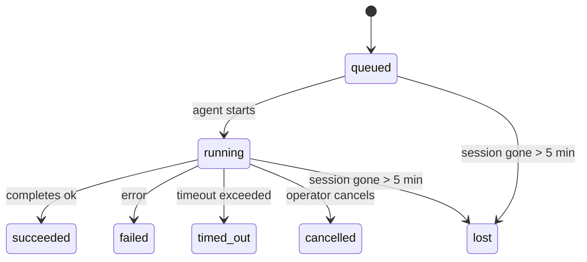

---
read_when:
    - Sprawdzasz trwające lub niedawno zakończone prace w tle
    - Debugujesz błędy dostarczania dla odłączonych uruchomień agenta
    - Chcesz zrozumieć, jak uruchomienia w tle odnoszą się do sesji, cron i heartbeat
summary: Śledzenie zadań w tle dla uruchomień ACP, podagentów, izolowanych zadań cron i operacji CLI
title: Zadania w tle
x-i18n:
    generated_at: "2026-04-05T13:43:00Z"
    model: gpt-5.4
    provider: openai
    source_hash: 6c95ccf4388d07e60a7bb68746b161793f4bb5ff2ba3d5ce9e51f2225dab2c4d
    source_path: automation/tasks.md
    workflow: 15
---

# Zadania w tle

> **Szukasz harmonogramowania?** Zobacz [Automatyzacja i zadania](/automation), aby wybrać właściwy mechanizm. Ta strona dotyczy **śledzenia** pracy w tle, a nie jej harmonogramowania.

Zadania w tle śledzą pracę wykonywaną **poza główną sesją rozmowy**:
uruchomienia ACP, uruchomienia podagentów, wykonania izolowanych zadań cron oraz operacje uruchamiane z poziomu CLI.

Zadania **nie** zastępują sesji, zadań cron ani heartbeat — są **rejestrem aktywności**, który zapisuje, jaka odłączona praca miała miejsce, kiedy się odbyła i czy zakończyła się powodzeniem.

<Note>
Nie każde uruchomienie agenta tworzy zadanie. Tury heartbeat i zwykły interaktywny czat tego nie robią. Wszystkie wykonania cron, uruchomienia ACP, uruchomienia podagentów i polecenia agenta w CLI tworzą zadania.
</Note>

## TL;DR

- Zadania to **rekordy**, a nie planery — cron i heartbeat decydują, _kiedy_ praca jest uruchamiana, a zadania śledzą, _co się wydarzyło_.
- ACP, podagenci, wszystkie zadania cron i operacje CLI tworzą zadania. Tury heartbeat tego nie robią.
- Każde zadanie przechodzi przez `queued → running → terminal` (`succeeded`, `failed`, `timed_out`, `cancelled` lub `lost`).
- Zadania cron pozostają aktywne, dopóki środowisko uruchomieniowe cron nadal jest właścicielem zadania; zadania CLI oparte na czacie pozostają aktywne tylko tak długo, jak aktywny jest ich kontekst uruchomienia.
- Zakończenie jest obsługiwane przez wypychanie: odłączona praca może powiadomić bezpośrednio lub wybudzić sesję żądającą/heartbeat po zakończeniu, więc pętle odpytywania stanu są zwykle niewłaściwym wzorcem.
- Izolowane uruchomienia cron i zakończenia podagentów w miarę możliwości czyszczą śledzone karty/procesy przeglądarki dla swojej sesji podrzędnej przed końcowym porządkowaniem.
- Dostarczanie izolowanych uruchomień cron tłumi nieaktualne pośrednie odpowiedzi nadrzędne, gdy praca potomnych podagentów nadal się opróżnia, i preferuje końcowe dane wyjściowe potomka, jeśli dotrą przed dostarczeniem.
- Powiadomienia o zakończeniu są dostarczane bezpośrednio do kanału lub kolejkowane do następnego heartbeat.
- `openclaw tasks list` pokazuje wszystkie zadania; `openclaw tasks audit` wykrywa problemy.
- Rekordy terminalne są przechowywane przez 7 dni, a następnie automatycznie usuwane.

## Szybki start

```bash
# Wyświetl wszystkie zadania (od najnowszych)
openclaw tasks list

# Filtruj według środowiska uruchomieniowego lub statusu
openclaw tasks list --runtime acp
openclaw tasks list --status running

# Pokaż szczegóły określonego zadania (według ID, ID uruchomienia lub klucza sesji)
openclaw tasks show <lookup>

# Anuluj uruchomione zadanie (zabija sesję podrzędną)
openclaw tasks cancel <lookup>

# Zmień politykę powiadomień dla zadania
openclaw tasks notify <lookup> state_changes

# Uruchom audyt kondycji
openclaw tasks audit

# Wyświetl podgląd lub zastosuj konserwację
openclaw tasks maintenance
openclaw tasks maintenance --apply

# Sprawdź stan Task Flow
openclaw tasks flow list
openclaw tasks flow show <lookup>
openclaw tasks flow cancel <lookup>
```

## Co tworzy zadanie

| Źródło                 | Typ środowiska uruchomieniowego | Kiedy tworzony jest rekord zadania                     | Domyślna polityka powiadomień |
| ---------------------- | ------------------------------- | ------------------------------------------------------ | ----------------------------- |
| Uruchomienia ACP w tle | `acp`                           | Uruchomienie podrzędnej sesji ACP                      | `done_only`                   |
| Orkiestracja podagentów | `subagent`                     | Uruchomienie podagenta przez `sessions_spawn`          | `done_only`                   |
| Zadania cron (wszystkie typy) | `cron`                  | Każde wykonanie cron (w sesji głównej i izolowane)     | `silent`                      |
| Operacje CLI           | `cli`                           | Polecenia `openclaw agent` uruchamiane przez gateway   | `silent`                      |

Zadania cron w sesji głównej domyślnie używają polityki powiadomień `silent` — tworzą rekordy do śledzenia, ale nie generują powiadomień. Izolowane zadania cron również domyślnie używają `silent`, ale są bardziej widoczne, ponieważ działają we własnej sesji.

**Czego nie tworzy zadań:**

- Tury heartbeat — sesja główna; zobacz [Heartbeat](/gateway/heartbeat)
- Zwykłe interaktywne tury czatu
- Bezpośrednie odpowiedzi `/command`

## Cykl życia zadania



| Status      | Co oznacza                                                                |
| ----------- | ------------------------------------------------------------------------- |
| `queued`    | Utworzone, oczekuje na uruchomienie agenta                                |
| `running`   | Tura agenta jest aktywnie wykonywana                                      |
| `succeeded` | Zakończone pomyślnie                                                      |
| `failed`    | Zakończone błędem                                                         |
| `timed_out` | Przekroczono skonfigurowany limit czasu                                   |
| `cancelled` | Zatrzymane przez operatora za pomocą `openclaw tasks cancel`              |
| `lost`      | Środowisko uruchomieniowe utraciło autorytatywny stan zaplecza po 5-minutowym okresie karencji |

Przejścia następują automatycznie — gdy powiązane uruchomienie agenta się kończy, status zadania jest aktualizowany odpowiednio do wyniku.

`lost` uwzględnia typ środowiska uruchomieniowego:

- Zadania ACP: zniknęły metadane podrzędnej sesji ACP.
- Zadania podagentów: podrzędna sesja zniknęła z magazynu docelowego agenta.
- Zadania cron: środowisko uruchomieniowe cron nie śledzi już zadania jako aktywnego.
- Zadania CLI: izolowane zadania sesji podrzędnej używają sesji podrzędnej; zadania CLI oparte na czacie używają zamiast tego kontekstu aktywnego uruchomienia, więc pozostające wiersze sesji kanału/grupy/bezpośredniej nie utrzymują ich przy życiu.

## Dostarczanie i powiadomienia

Gdy zadanie osiągnie stan terminalny, OpenClaw wysyła powiadomienie. Istnieją dwie ścieżki dostarczania:

**Dostarczenie bezpośrednie** — jeśli zadanie ma cel kanału (`requesterOrigin`), komunikat o zakończeniu trafia bezpośrednio do tego kanału (Telegram, Discord, Slack itd.). W przypadku zakończeń podagentów OpenClaw zachowuje również powiązane kierowanie do wątku/tematu, jeśli jest dostępne, i może uzupełnić brakujące `to` / konto na podstawie zapisanej trasy sesji żądającej (`lastChannel` / `lastTo` / `lastAccountId`), zanim zrezygnuje z bezpośredniego dostarczenia.

**Dostarczenie kolejkowane do sesji** — jeśli bezpośrednie dostarczenie się nie powiedzie lub nie ustawiono źródła, aktualizacja jest kolejkowana jako zdarzenie systemowe w sesji żądającej i pojawia się przy następnym heartbeat.

<Tip>
Zakończenie zadania natychmiast wywołuje wybudzenie heartbeat, aby wynik był widoczny szybko — nie trzeba czekać na następny zaplanowany takt heartbeat.
</Tip>

Oznacza to, że typowy przepływ pracy opiera się na wypychaniu: uruchamiasz odłączoną pracę raz, a potem pozwalasz środowisku uruchomieniowemu wybudzić Cię lub powiadomić po zakończeniu. Odpytuj stan zadania tylko wtedy, gdy potrzebujesz debugowania, interwencji lub jawnego audytu.

### Polityki powiadomień

Kontrolują, ile informacji otrzymujesz o każdym zadaniu:

| Polityka              | Co jest dostarczane                                                      |
| --------------------- | ------------------------------------------------------------------------ |
| `done_only` (domyślna) | Tylko stan terminalny (`succeeded`, `failed` itd.) — **to jest ustawienie domyślne** |
| `state_changes`       | Każda zmiana stanu i aktualizacja postępu                                |
| `silent`              | Nic                                                                      |

Zmień politykę podczas działania zadania:

```bash
openclaw tasks notify <lookup> state_changes
```

## Dokumentacja CLI

### `tasks list`

```bash
openclaw tasks list [--runtime <acp|subagent|cron|cli>] [--status <status>] [--json]
```

Kolumny wyjściowe: ID zadania, typ, status, dostarczanie, ID uruchomienia, sesja podrzędna, podsumowanie.

### `tasks show`

```bash
openclaw tasks show <lookup>
```

Token wyszukiwania akceptuje ID zadania, ID uruchomienia lub klucz sesji. Pokazuje pełny rekord, w tym czasy, stan dostarczenia, błąd i podsumowanie terminalne.

### `tasks cancel`

```bash
openclaw tasks cancel <lookup>
```

W przypadku zadań ACP i podagentów powoduje to zakończenie sesji podrzędnej. Status przechodzi do `cancelled`, a powiadomienie o dostarczeniu zostaje wysłane.

### `tasks notify`

```bash
openclaw tasks notify <lookup> <done_only|state_changes|silent>
```

### `tasks audit`

```bash
openclaw tasks audit [--json]
```

Wykrywa problemy operacyjne. Ustalenia pojawiają się również w `openclaw status`, gdy zostaną wykryte problemy.

| Ustalenie                 | Ważność | Wyzwalacz                                            |
| ------------------------- | ------- | ---------------------------------------------------- |
| `stale_queued`            | warn    | W kolejce dłużej niż 10 minut                        |
| `stale_running`           | error   | Uruchomione dłużej niż 30 minut                      |
| `lost`                    | error   | Zniknęła własność zadania oparta na środowisku uruchomieniowym |
| `delivery_failed`         | warn    | Dostarczenie nie powiodło się, a polityka powiadomień nie jest `silent` |
| `missing_cleanup`         | warn    | Zadanie terminalne bez znacznika czasu czyszczenia   |
| `inconsistent_timestamps` | warn    | Naruszenie osi czasu (na przykład zakończone przed uruchomieniem) |

### `tasks maintenance`

```bash
openclaw tasks maintenance [--json]
openclaw tasks maintenance --apply [--json]
```

Użyj tego, aby wyświetlić podgląd lub zastosować uzgadnianie, oznaczanie czyszczenia i usuwanie dla zadań oraz stanu Task Flow.

Uzgadnianie uwzględnia typ środowiska uruchomieniowego:

- Zadania ACP/podagentów sprawdzają swoją podrzędną sesję zaplecza.
- Zadania cron sprawdzają, czy środowisko uruchomieniowe cron nadal jest właścicielem zadania.
- Zadania CLI oparte na czacie sprawdzają własny kontekst aktywnego uruchomienia, a nie tylko wiersz sesji czatu.

Czyszczenie po zakończeniu również uwzględnia typ środowiska uruchomieniowego:

- Zakończenie podagenta w miarę możliwości zamyka śledzone karty/procesy przeglądarki dla sesji podrzędnej, zanim będzie kontynuowane czyszczenie po ogłoszeniu.
- Zakończenie izolowanego zadania cron w miarę możliwości zamyka śledzone karty/procesy przeglądarki dla sesji cron, zanim uruchomienie zostanie całkowicie zakończone.
- Dostarczanie zakończenia izolowanego zadania cron czeka w razie potrzeby na dalsze działania potomnych podagentów i tłumi nieaktualny tekst potwierdzenia nadrzędnego zamiast go ogłaszać.
- Dostarczanie zakończenia podagenta preferuje najnowszy widoczny tekst asystenta; jeśli jest pusty, przechodzi do oczyszczonego najnowszego tekstu `tool`/`toolResult`, a uruchomienia wywołań narzędzi ograniczone tylko do limitu czasu mogą zostać zwinięte do krótkiego podsumowania częściowego postępu.
- Błędy czyszczenia nie maskują rzeczywistego wyniku zadania.

### `tasks flow list|show|cancel`

```bash
openclaw tasks flow list [--status <status>] [--json]
openclaw tasks flow show <lookup> [--json]
openclaw tasks flow cancel <lookup>
```

Używaj tych poleceń, gdy interesuje Cię orkiestrujący Task Flow, a nie pojedynczy rekord zadania w tle.

## Tablica zadań na czacie (`/tasks`)

Użyj `/tasks` w dowolnej sesji czatu, aby zobaczyć zadania w tle powiązane z tą sesją. Tablica pokazuje aktywne i niedawno zakończone zadania wraz ze środowiskiem uruchomieniowym, statusem, czasem oraz szczegółami postępu lub błędów.

Gdy bieżąca sesja nie ma widocznych powiązanych zadań, `/tasks` przechodzi na lokalne dla agenta liczniki zadań, dzięki czemu nadal otrzymujesz przegląd bez ujawniania szczegółów innych sesji.

Aby zobaczyć pełny rejestr operatora, użyj CLI: `openclaw tasks list`.

## Integracja ze statusem (presja zadań)

`openclaw status` zawiera zbiorcze podsumowanie zadań:

```
Tasks: 3 queued · 2 running · 1 issues
```

Podsumowanie raportuje:

- **active** — liczba `queued` + `running`
- **failures** — liczba `failed` + `timed_out` + `lost`
- **byRuntime** — podział na `acp`, `subagent`, `cron`, `cli`

Zarówno `/status`, jak i narzędzie `session_status` używają migawki zadań uwzględniającej czyszczenie: aktywne zadania są preferowane, nieaktualne zakończone wiersze są ukrywane, a niedawne błędy pojawiają się tylko wtedy, gdy nie pozostała żadna aktywna praca. Dzięki temu karta statusu skupia się na tym, co jest najważniejsze w danym momencie.

## Przechowywanie i konserwacja

### Gdzie znajdują się zadania

Rekordy zadań są trwale przechowywane w SQLite pod adresem:

```
$OPENCLAW_STATE_DIR/tasks/runs.sqlite
```

Rejestr jest ładowany do pamięci przy uruchamianiu gateway i synchronizuje zapisy do SQLite, aby zapewnić trwałość po ponownym uruchomieniu.

### Automatyczna konserwacja

Co **60 sekund** działa proces czyszczący, który obsługuje trzy rzeczy:

1. **Uzgadnianie** — sprawdza, czy aktywne zadania nadal mają autorytatywne zaplecze środowiska uruchomieniowego. Zadania ACP/podagentów używają stanu sesji podrzędnej, zadania cron używają własności aktywnego zadania, a zadania CLI oparte na czacie używają własnego kontekstu uruchomienia. Jeśli ten stan zaplecza zniknie na dłużej niż 5 minut, zadanie zostanie oznaczone jako `lost`.
2. **Oznaczanie czyszczenia** — ustawia znacznik czasu `cleanupAfter` dla zadań terminalnych (`endedAt + 7 days`).
3. **Usuwanie** — usuwa rekordy po przekroczeniu daty `cleanupAfter`.

**Retencja**: rekordy zadań terminalnych są przechowywane przez **7 dni**, a następnie automatycznie usuwane. Nie jest wymagana żadna konfiguracja.

## Jak zadania odnoszą się do innych systemów

### Zadania i Task Flow

[Task Flow](/automation/taskflow) to warstwa orkiestracji przepływu ponad zadaniami w tle. Pojedynczy przepływ może w czasie swojego działania koordynować wiele zadań, używając trybów synchronizacji zarządzanej lub lustrzanej. Użyj `openclaw tasks`, aby sprawdzić pojedyncze rekordy zadań, oraz `openclaw tasks flow`, aby sprawdzić orkiestrujący przepływ.

Szczegóły znajdziesz w [Task Flow](/automation/taskflow).

### Zadania i cron

**Definicja** zadania cron znajduje się w `~/.openclaw/cron/jobs.json`. **Każde** wykonanie cron tworzy rekord zadania — zarówno w sesji głównej, jak i izolowane. Zadania cron w sesji głównej domyślnie używają polityki powiadomień `silent`, dzięki czemu są śledzone bez generowania powiadomień.

Zobacz [Zadania cron](/automation/cron-jobs).

### Zadania i heartbeat

Uruchomienia heartbeat to tury sesji głównej — nie tworzą rekordów zadań. Gdy zadanie się zakończy, może wywołać wybudzenie heartbeat, aby wynik był szybko widoczny.

Zobacz [Heartbeat](/gateway/heartbeat).

### Zadania i sesje

Zadanie może odwoływać się do `childSessionKey` (gdzie wykonywana jest praca) oraz `requesterSessionKey` (kto ją uruchomił). Sesje są kontekstem rozmowy; zadania to warstwa śledzenia aktywności ponad nimi.

### Zadania i uruchomienia agentów

Pole `runId` zadania łączy je z uruchomieniem agenta wykonującym pracę. Zdarzenia cyklu życia agenta (start, koniec, błąd) automatycznie aktualizują status zadania — nie trzeba ręcznie zarządzać cyklem życia.

## Powiązane

- [Automatyzacja i zadania](/automation) — wszystkie mechanizmy automatyzacji w skrócie
- [Task Flow](/automation/taskflow) — orkiestracja przepływu ponad zadaniami
- [Zaplanowane zadania](/automation/cron-jobs) — harmonogramowanie pracy w tle
- [Heartbeat](/gateway/heartbeat) — okresowe tury sesji głównej
- [CLI: Zadania](/cli/index#tasks) — dokumentacja poleceń CLI
