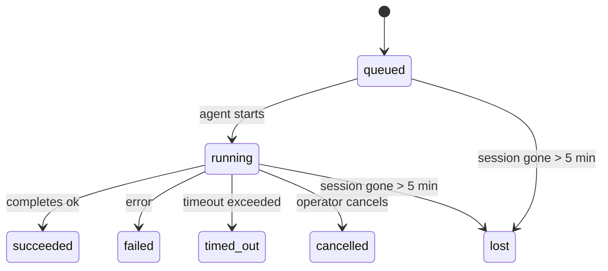

---
read_when:
    - Sprawdzanie zadań w tle będących w toku lub niedawno ukończonych
    - Debugowanie niepowodzeń dostarczania dla odłączonych uruchomień agentów
    - Zrozumienie, jak uruchomienia w tle wiążą się z sesjami, Cron i Heartbeat
sidebarTitle: Background tasks
summary: Śledzenie zadań w tle dla uruchomień ACP, subagentów, izolowanych zadań Cron i operacji CLI
title: Zadania w tle
x-i18n:
    generated_at: "2026-05-06T09:02:30Z"
    model: gpt-5.5
    provider: openai
    source_hash: 055e16b4f53dbd089cc72eea7fe80bdaee5451dc56fa6e88a742f98e566bb57a
    source_path: automation/tasks.md
    workflow: 16
---

<Note>
Szukasz harmonogramowania? Zobacz [Automatyzacja i zadania](/pl/automation), aby wybrać właściwy mechanizm. Ta strona jest rejestrem aktywności dla pracy w tle, a nie harmonogramem.
</Note>

Zadania w tle śledzą pracę uruchamianą **poza główną sesją konwersacji**: uruchomienia ACP, tworzenie subagentów, izolowane wykonania zadań cron oraz operacje inicjowane przez CLI.

Zadania **nie** zastępują sesji, zadań cron ani Heartbeat - są **rejestrem aktywności**, który zapisuje, jaka odłączona praca została wykonana, kiedy i czy zakończyła się powodzeniem.

<Note>
Nie każde uruchomienie agenta tworzy zadanie. Tury Heartbeat i zwykły czat interaktywny tego nie robią. Wszystkie wykonania cron, uruchomienia ACP, uruchomienia subagentów i polecenia agenta CLI tworzą zadania.
</Note>

## TL;DR

- Zadania są **rekordami**, nie harmonogramami - cron i Heartbeat decydują, _kiedy_ praca jest uruchamiana, a zadania śledzą, _co się wydarzyło_.
- ACP, subagenci, wszystkie zadania cron i operacje CLI tworzą zadania. Tury Heartbeat nie.
- Każde zadanie przechodzi przez `queued → running → terminal` (succeeded, failed, timed_out, cancelled lub lost).
- Zadania cron pozostają aktywne, dopóki runtime cron nadal posiada zadanie; jeśli
  stan runtime w pamięci zniknie, konserwacja zadań najpierw sprawdza trwałą historię
  uruchomień cron, zanim oznaczy zadanie jako lost.
- Ukończenie jest sterowane zdarzeniami push: odłączona praca może powiadomić bezpośrednio albo wybudzić
  sesję żądającą/Heartbeat po zakończeniu, więc pętle odpytywania statusu
  zwykle są niewłaściwym wzorcem.
- Izolowane uruchomienia cron i ukończenia subagentów w miarę możliwości czyszczą śledzone karty przeglądarki/procesy dla swojej sesji podrzędnej przed końcowym księgowaniem sprzątania.
- Izolowane dostarczanie cron tłumi nieaktualne tymczasowe odpowiedzi nadrzędne, gdy praca potomnego subagenta nadal się opróżnia, i preferuje końcowe wyjście potomne, jeśli dotrze przed dostarczeniem.
- Powiadomienia o ukończeniu są dostarczane bezpośrednio do kanału albo kolejkowane do następnego Heartbeat.
- `openclaw tasks list` pokazuje wszystkie zadania; `openclaw tasks audit` ujawnia problemy.
- Rekordy terminalne są przechowywane przez 7 dni, a następnie automatycznie usuwane.

## Szybki start

<Tabs>
  <Tab title="Lista i filtrowanie">
    ```bash
    # List all tasks (newest first)
    openclaw tasks list

    # Filter by runtime or status
    openclaw tasks list --runtime acp
    openclaw tasks list --status running
    ```

  </Tab>
  <Tab title="Inspekcja">
    ```bash
    # Show details for a specific task (by ID, run ID, or session key)
    openclaw tasks show <lookup>
    ```
  </Tab>
  <Tab title="Anulowanie i powiadamianie">
    ```bash
    # Cancel a running task (kills the child session)
    openclaw tasks cancel <lookup>

    # Change notification policy for a task
    openclaw tasks notify <lookup> state_changes
    ```

  </Tab>
  <Tab title="Audyt i konserwacja">
    ```bash
    # Run a health audit
    openclaw tasks audit

    # Preview or apply maintenance
    openclaw tasks maintenance
    openclaw tasks maintenance --apply
    ```

  </Tab>
  <Tab title="Przepływ zadania">
    ```bash
    # Inspect TaskFlow state
    openclaw tasks flow list
    openclaw tasks flow show <lookup>
    openclaw tasks flow cancel <lookup>
    ```
  </Tab>
</Tabs>

## Co tworzy zadanie

| Źródło                 | Typ runtime | Kiedy tworzony jest rekord zadania                     | Domyślna polityka powiadomień |
| ---------------------- | ------------ | ------------------------------------------------------ | --------------------- |
| Uruchomienia ACP w tle | `acp`        | Tworzenie podrzędnej sesji ACP                         | `done_only`           |
| Orkiestracja subagentów | `subagent`   | Tworzenie subagenta przez `sessions_spawn`             | `done_only`           |
| Zadania cron (wszystkich typów) | `cron`       | Każde wykonanie cron (w sesji głównej i izolowane)     | `silent`              |
| Operacje CLI           | `cli`        | Polecenia `openclaw agent`, które przechodzą przez Gateway | `silent`              |
| Zadania multimedialne agenta | `cli`        | Uruchomienia `music_generate`/`video_generate` oparte na sesji | `silent`              |

<AccordionGroup>
  <Accordion title="Domyślne powiadomienia dla cron i multimediów">
    Zadania cron w sesji głównej domyślnie używają polityki powiadomień `silent` - tworzą rekordy do śledzenia, ale nie generują powiadomień. Izolowane zadania cron również domyślnie używają `silent`, ale są bardziej widoczne, ponieważ działają we własnej sesji.

    Uruchomienia `music_generate` i `video_generate` oparte na sesji również używają polityki powiadomień `silent`. Nadal tworzą rekordy zadań, ale ukończenie jest przekazywane z powrotem do oryginalnej sesji agenta jako wewnętrzne wybudzenie, aby agent mógł sam napisać wiadomość uzupełniającą i dołączyć gotowe multimedia. Ukończenia w grupie/kanale stosują normalną politykę widocznej odpowiedzi, więc agent używa narzędzia wiadomości, gdy wymaga tego dostarczenie źródłowe. Jeśli agent ukończenia nie wytworzy dowodu dostarczenia przez narzędzie wiadomości w trasie wyłącznie narzędziowej, OpenClaw wysyła awaryjne powiadomienie o ukończeniu bezpośrednio do oryginalnego kanału zamiast pozostawiać multimedia prywatne.

  </Accordion>
  <Accordion title="Zabezpieczenie współbieżnego video_generate">
    Gdy zadanie `video_generate` oparte na sesji jest nadal aktywne, narzędzie działa też jako zabezpieczenie: powtarzane wywołania `video_generate` w tej samej sesji zwracają status aktywnego zadania zamiast rozpoczynać drugie współbieżne generowanie. Użyj `action: "status"`, gdy chcesz jawnie sprawdzić postęp/status po stronie agenta.
  </Accordion>
  <Accordion title="Co nie tworzy zadań">
    - Tury Heartbeat - sesja główna; zobacz [Heartbeat](/pl/gateway/heartbeat)
    - Zwykłe interaktywne tury czatu
    - Bezpośrednie odpowiedzi `/command`

  </Accordion>
</AccordionGroup>

## Cykl życia zadania



| Status      | Co oznacza                                                                 |
| ----------- | -------------------------------------------------------------------------- |
| `queued`    | Utworzone, czeka na uruchomienie agenta                                    |
| `running`   | Tura agenta jest aktywnie wykonywana                                       |
| `succeeded` | Ukończone pomyślnie                                                        |
| `failed`    | Ukończone z błędem                                                         |
| `timed_out` | Przekroczono skonfigurowany limit czasu                                    |
| `cancelled` | Zatrzymane przez operatora za pomocą `openclaw tasks cancel`               |
| `lost`      | Runtime utracił autorytatywny stan zaplecza po 5-minutowym okresie karencji |

Przejścia zachodzą automatycznie - gdy powiązane uruchomienie agenta się kończy, status zadania jest aktualizowany odpowiednio do wyniku.

Ukończenie uruchomienia agenta jest autorytatywne dla aktywnych rekordów zadań. Pomyślne odłączone uruchomienie finalizuje się jako `succeeded`, zwykłe błędy uruchomienia finalizują się jako `failed`, a wyniki limitu czasu lub przerwania finalizują się jako `timed_out`. Jeśli operator już anulował zadanie albo runtime już zapisał silniejszy stan terminalny, taki jak `failed`, `timed_out` lub `lost`, późniejszy sygnał powodzenia nie obniża tego statusu terminalnego.

`lost` uwzględnia runtime:

- Zadania ACP: metadane podrzędnej sesji ACP zaplecza zniknęły.
- Zadania subagentów: podrzędna sesja zaplecza zniknęła z magazynu agenta docelowego.
- Zadania cron: runtime cron nie śledzi już zadania jako aktywnego, a trwała
  historia uruchomień cron nie pokazuje terminalnego wyniku dla tego uruchomienia. Audyt CLI
  offline nie traktuje własnego pustego stanu runtime cron w procesie jako autorytetu.
- Zadania CLI: izolowane zadania sesji podrzędnej używają sesji podrzędnej; zadania CLI oparte na czacie
  używają zamiast tego aktywnego kontekstu uruchomienia, więc zalegające
  wiersze sesji kanału/grupy/bezpośredniej nie utrzymują ich przy życiu. Uruchomienia
  `openclaw agent` oparte na Gateway również finalizują się na podstawie wyniku uruchomienia, więc ukończone uruchomienia
  nie pozostają aktywne, dopóki sprzątacz nie oznaczy ich jako `lost`.

## Dostarczanie i powiadomienia

Gdy zadanie osiąga stan terminalny, OpenClaw powiadamia Cię. Istnieją dwie ścieżki dostarczania:

**Dostarczanie bezpośrednie** - jeśli zadanie ma cel kanału (`requesterOrigin`), wiadomość o ukończeniu trafia prosto do tego kanału (Telegram, Discord, Slack itd.). Dla ukończeń subagentów OpenClaw zachowuje również powiązane trasowanie wątku/tematu, gdy jest dostępne, i może uzupełnić brakujące `to` / konto z zapisanej trasy sesji żądającej (`lastChannel` / `lastTo` / `lastAccountId`), zanim zrezygnuje z dostarczania bezpośredniego.

**Dostarczanie kolejkowane w sesji** - jeśli dostarczenie bezpośrednie się nie powiedzie albo nie ustawiono źródła, aktualizacja jest kolejkowana jako zdarzenie systemowe w sesji żądającego i pojawia się przy następnym Heartbeat.

<Tip>
Ukończenie zadania wyzwala natychmiastowe wybudzenie Heartbeat, więc szybko zobaczysz wynik - nie musisz czekać na następny zaplanowany takt Heartbeat.
</Tip>

Oznacza to, że zwykły przepływ pracy jest oparty na push: uruchom odłączoną pracę raz, a następnie pozwól runtime wybudzić Cię lub powiadomić po ukończeniu. Odpytuj stan zadania tylko wtedy, gdy potrzebujesz debugowania, interwencji albo jawnego audytu.

### Polityki powiadomień

Kontroluj, ile informacji otrzymujesz o każdym zadaniu:

| Polityka              | Co jest dostarczane                                                   |
| --------------------- | ----------------------------------------------------------------------- |
| `done_only` (domyślna) | Tylko stan terminalny (succeeded, failed itd.) - **to jest wartość domyślna** |
| `state_changes`       | Każde przejście stanu i aktualizacja postępu                            |
| `silent`              | Nic                                                                     |

Zmień politykę, gdy zadanie jest uruchomione:

```bash
openclaw tasks notify <lookup> state_changes
```

## Dokumentacja CLI

<AccordionGroup>
  <Accordion title="tasks list">
    ```bash
    openclaw tasks list [--runtime <acp|subagent|cron|cli>] [--status <status>] [--json]
    ```

    Kolumny wyjścia: ID zadania, rodzaj, status, dostarczanie, ID uruchomienia, sesja podrzędna, podsumowanie.

  </Accordion>
  <Accordion title="tasks show">
    ```bash
    openclaw tasks show <lookup>
    ```

    Token wyszukiwania przyjmuje ID zadania, ID uruchomienia lub klucz sesji. Pokazuje pełny rekord, w tym czasy, stan dostarczania, błąd i podsumowanie terminalne.

  </Accordion>
  <Accordion title="tasks cancel">
    ```bash
    openclaw tasks cancel <lookup>
    ```

    Dla zadań ACP i subagentów zabija to sesję podrzędną. Dla zadań śledzonych przez CLI anulowanie jest zapisywane w rejestrze zadań (nie ma osobnego uchwytu runtime podrzędnego). Status przechodzi na `cancelled`, a powiadomienie o dostarczeniu jest wysyłane, gdy ma zastosowanie.

  </Accordion>
  <Accordion title="tasks notify">
    ```bash
    openclaw tasks notify <lookup> <done_only|state_changes|silent>
    ```
  </Accordion>
  <Accordion title="tasks audit">
    ```bash
    openclaw tasks audit [--json]
    ```

    Ujawnia problemy operacyjne. Wyniki pojawiają się również w `openclaw status`, gdy wykryto problemy.

    | Ustalenie                 | Ważność    | Wyzwalacz                                                                                                                    |
    | ------------------------- | ---------- | ---------------------------------------------------------------------------------------------------------------------------- |
    | `stale_queued`            | ostrzeżenie | W kolejce przez ponad 10 minut                                                                                               |
    | `stale_running`           | błąd       | Działa przez ponad 30 minut                                                                                                  |
    | `lost`                    | ostrzeżenie/błąd | Własność zadania obsługiwanego przez środowisko uruchomieniowe zniknęła; zachowane utracone zadania ostrzegają do `cleanupAfter`, a następnie stają się błędami |
    | `delivery_failed`         | ostrzeżenie | Dostarczenie nie powiodło się, a polityka powiadamiania nie jest ustawiona na `silent`                                      |
    | `missing_cleanup`         | ostrzeżenie | Zadanie terminalne bez znacznika czasu czyszczenia                                                                            |
    | `inconsistent_timestamps` | ostrzeżenie | Naruszenie osi czasu (na przykład zakończono przed rozpoczęciem)                                                            |

  </Accordion>
  <Accordion title="tasks maintenance">
    ```bash
    openclaw tasks maintenance [--json]
    openclaw tasks maintenance --apply [--json]
    ```

    Użyj tego, aby podejrzeć lub zastosować uzgadnianie, oznaczanie czyszczenia oraz przycinanie dla zadań i stanu Task Flow.

    Uzgadnianie uwzględnia środowisko uruchomieniowe:

    - Zadania ACP/subagent sprawdzają swoją bazową sesję podrzędną.
    - Zadania subagent, których sesja podrzędna ma nagrobek odzyskiwania po restarcie, są oznaczane jako utracone zamiast traktowania ich jako możliwe do odzyskania sesje bazowe.
    - Zadania Cron sprawdzają, czy środowisko uruchomieniowe Cron nadal jest właścicielem zadania, a następnie odzyskują status terminalny z utrwalonych dzienników uruchomień Cron/stanu zadania przed przejściem awaryjnym do `lost`. Tylko proces Gateway jest autorytatywny dla zestawu aktywnych zadań Cron w pamięci; audyt CLI offline używa trwałej historii, ale nie oznacza zadania Cron jako utraconego wyłącznie dlatego, że ten lokalny Set jest pusty.
    - Zadania CLI oparte na czacie sprawdzają właścicielski kontekst uruchomienia na żywo, a nie tylko wiersz sesji czatu.

    Czyszczenie po ukończeniu również uwzględnia środowisko uruchomieniowe:

    - Ukończenie subagent podejmuje najlepszą próbę zamknięcia śledzonych kart/procesów przeglądarki dla sesji podrzędnej, zanim czyszczenie ogłoszenia będzie kontynuowane.
    - Ukończenie izolowanego Cron podejmuje najlepszą próbę zamknięcia śledzonych kart/procesów przeglądarki dla sesji Cron, zanim uruchomienie zostanie w pełni zakończone.
    - Dostarczenie izolowanego Cron w razie potrzeby czeka na następczą odpowiedź potomnego subagent i tłumi przestarzały tekst potwierdzenia nadrzędnego zamiast go ogłaszać.
    - Dostarczenie ukończenia subagent preferuje najnowszy widoczny tekst asystenta; jeśli jest pusty, przechodzi awaryjnie do oczyszczonego najnowszego tekstu tool/toolResult, a uruchomienia wywołań narzędzi zakończone wyłącznie limitem czasu mogą zostać zwinięte do krótkiego podsumowania częściowego postępu. Terminalne nieudane uruchomienia ogłaszają status niepowodzenia bez ponownego odtwarzania przechwyconego tekstu odpowiedzi.
    - Niepowodzenia czyszczenia nie maskują rzeczywistego wyniku zadania.

  </Accordion>
  <Accordion title="tasks flow list | show | cancel">
    ```bash
    openclaw tasks flow list [--status <status>] [--json]
    openclaw tasks flow show <lookup> [--json]
    openclaw tasks flow cancel <lookup>
    ```

    Użyj tych poleceń, gdy interesuje Cię orkiestrujący Task Flow, a nie pojedynczy rekord zadania w tle.

  </Accordion>
</AccordionGroup>

## Tablica zadań czatu (`/tasks`)

Użyj `/tasks` w dowolnej sesji czatu, aby zobaczyć zadania w tle powiązane z tą sesją. Tablica pokazuje aktywne i niedawno ukończone zadania wraz ze środowiskiem uruchomieniowym, statusem, czasami oraz postępem lub szczegółami błędu.

Gdy bieżąca sesja nie ma widocznych powiązanych zadań, `/tasks` przechodzi awaryjnie do lokalnych dla agenta liczników zadań, aby nadal zapewnić przegląd bez ujawniania szczegółów innych sesji.

Aby zobaczyć pełny dziennik operatora, użyj CLI: `openclaw tasks list`.

## Integracja statusu (presja zadań)

`openclaw status` zawiera skrócone podsumowanie zadań:

```
Tasks: 3 queued · 2 running · 1 issues
```

Podsumowanie raportuje:

- **active** - liczba `queued` + `running`
- **failures** - liczba `failed` + `timed_out` + `lost`
- **byRuntime** - podział według `acp`, `subagent`, `cron`, `cli`

Zarówno `/status`, jak i narzędzie `session_status` używają migawki zadań świadomej czyszczenia: aktywne zadania mają pierwszeństwo, przestarzałe ukończone wiersze są ukrywane, a niedawne niepowodzenia są pokazywane tylko wtedy, gdy nie pozostaje żadna aktywna praca. Dzięki temu karta statusu skupia się na tym, co ważne w danej chwili.

## Przechowywanie i konserwacja

### Gdzie znajdują się zadania

Rekordy zadań są utrwalane w SQLite pod adresem:

```
$OPENCLAW_STATE_DIR/tasks/runs.sqlite
```

Rejestr ładuje się do pamięci przy starcie Gateway i synchronizuje zapisy do SQLite, aby zapewnić trwałość po restartach.
Gateway utrzymuje dziennik zapisu z wyprzedzeniem SQLite w ograniczonym rozmiarze, używając domyślnego progu autocheckpoint SQLite oraz okresowych i wykonywanych przy zamykaniu punktów kontrolnych `TRUNCATE`.

### Automatyczna konserwacja

Proces czyszczący uruchamia się co **60 sekund** i obsługuje cztery rzeczy:

<Steps>
  <Step title="Uzgadnianie">
    Sprawdza, czy aktywne zadania nadal mają autorytatywne wsparcie środowiska uruchomieniowego. Zadania ACP/subagent używają stanu sesji podrzędnej, zadania Cron używają własności aktywnego zadania, a zadania CLI oparte na czacie używają właścicielskiego kontekstu uruchomienia. Jeśli ten stan bazowy zniknie na ponad 5 minut, zadanie zostaje oznaczone jako `lost`.
  </Step>
  <Step title="Naprawa sesji ACP">
    Zamyka terminalne lub osierocone jednorazowe sesje ACP będące własnością sesji nadrzędnej, a przestarzałe terminalne lub osierocone trwałe sesje ACP zamyka tylko wtedy, gdy nie pozostaje żadne aktywne powiązanie rozmowy.
  </Step>
  <Step title="Oznaczanie czyszczenia">
    Ustawia znacznik czasu `cleanupAfter` na zadaniach terminalnych (endedAt + 7 dni). W okresie retencji utracone zadania nadal pojawiają się w audycie jako ostrzeżenia; po wygaśnięciu `cleanupAfter` albo gdy brakuje metadanych czyszczenia, są błędami.
  </Step>
  <Step title="Przycinanie">
    Usuwa rekordy po ich dacie `cleanupAfter`.
  </Step>
</Steps>

<Note>
**Retencja:** rekordy zadań terminalnych są przechowywane przez **7 dni**, a następnie automatycznie przycinane. Konfiguracja nie jest wymagana.
</Note>

## Jak zadania odnoszą się do innych systemów

<AccordionGroup>
  <Accordion title="Zadania i Task Flow">
    [Task Flow](/pl/automation/taskflow) to warstwa orkiestracji przepływu nad zadaniami w tle. Pojedynczy przepływ może koordynować wiele zadań w swoim cyklu życia, używając zarządzanych lub lustrzanych trybów synchronizacji. Użyj `openclaw tasks`, aby sprawdzać pojedyncze rekordy zadań, oraz `openclaw tasks flow`, aby sprawdzać orkiestrujący przepływ.

    Szczegóły znajdziesz w [Task Flow](/pl/automation/taskflow).

  </Accordion>
  <Accordion title="Zadania i cron">
    **Definicja** zadania Cron znajduje się w `~/.openclaw/cron/jobs.json`; stan wykonania środowiska uruchomieniowego znajduje się obok niej w `~/.openclaw/cron/jobs-state.json`. **Każde** wykonanie Cron tworzy rekord zadania - zarówno głównej sesji, jak i izolowane. Zadania Cron głównej sesji domyślnie używają polityki powiadamiania `silent`, więc są śledzone bez generowania powiadomień.

    Zobacz [Zadania Cron](/pl/automation/cron-jobs).

  </Accordion>
  <Accordion title="Zadania i heartbeat">
    Uruchomienia Heartbeat są turami głównej sesji - nie tworzą rekordów zadań. Gdy zadanie się zakończy, może wyzwolić wybudzenie Heartbeat, aby wynik był widoczny od razu.

    Zobacz [Heartbeat](/pl/gateway/heartbeat).

  </Accordion>
  <Accordion title="Zadania i sesje">
    Zadanie może odwoływać się do `childSessionKey` (gdzie działa praca) oraz `requesterSessionKey` (kto je rozpoczął). Sesje są kontekstem rozmowy; zadania to śledzenie aktywności nad nimi.
  </Accordion>
  <Accordion title="Zadania i uruchomienia agentów">
    `runId` zadania łączy z uruchomieniem agenta wykonującego pracę. Zdarzenia cyklu życia agenta (start, koniec, błąd) automatycznie aktualizują status zadania - nie trzeba zarządzać cyklem życia ręcznie.
  </Accordion>
</AccordionGroup>

## Powiązane

- [Automatyzacja i zadania](/pl/automation) - wszystkie mechanizmy automatyzacji w skrócie
- [CLI: Zadania](/pl/cli/tasks) - dokumentacja poleceń CLI
- [Heartbeat](/pl/gateway/heartbeat) - okresowe tury głównej sesji
- [Zaplanowane zadania](/pl/automation/cron-jobs) - planowanie pracy w tle
- [Task Flow](/pl/automation/taskflow) - orkiestracja przepływu nad zadaniami
