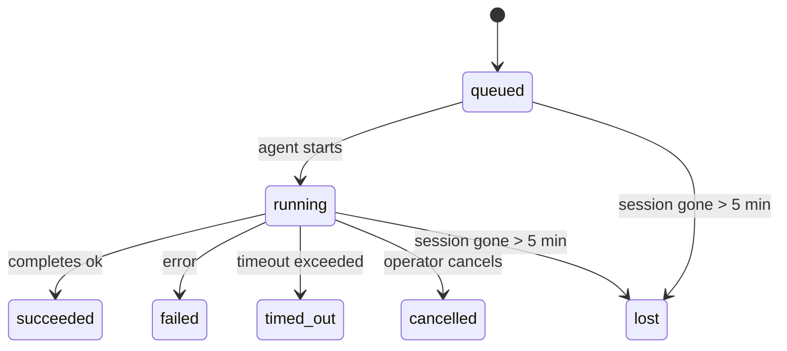

---
read_when:
    - Sprawdzanie trwającej lub niedawno ukończonej pracy w tle
    - Debugowanie niepowodzeń dostarczania dla odłączonych uruchomień agenta
    - Zrozumienie tego, jak uruchomienia w tle są powiązane z sesjami, Cron i Heartbeat
sidebarTitle: Background tasks
summary: Śledzenie zadań w tle dla uruchomień ACP, subagentów, izolowanych zadań Cron i operacji CLI
title: Zadania w tle
x-i18n:
    generated_at: "2026-05-12T00:56:22Z"
    model: gpt-5.5
    provider: openai
    source_hash: 31cbf09df48bab0686a1350f91aefffffef899c86704bb97b68320fc47e78021
    source_path: automation/tasks.md
    workflow: 16
---

<Note>
Szukasz planowania? Zobacz [Automation](/pl/automation), aby wybrać właściwy mechanizm. Ta strona jest rejestrem aktywności dla pracy w tle, a nie harmonogramem.
</Note>

Zadania w tle śledzą pracę uruchamianą **poza główną sesją konwersacji**: uruchomienia ACP, tworzenie subagentów, izolowane wykonania zadań cron oraz operacje inicjowane przez CLI.

Zadania **nie** zastępują sesji, zadań cron ani heartbeatów - są **rejestrem aktywności**, który zapisuje, jaka odłączona praca została wykonana, kiedy i czy zakończyła się powodzeniem.

<Note>
Nie każde uruchomienie agenta tworzy zadanie. Zwroty heartbeat i zwykły czat interaktywny tego nie robią. Robią to wszystkie wykonania cron, uruchomienia ACP, uruchomienia subagentów i polecenia agenta CLI.
</Note>

## TL;DR

- Zadania są **rekordami**, a nie harmonogramami - cron i Heartbeat decydują, _kiedy_ praca jest uruchamiana, zadania śledzą _co się stało_.
- ACP, subagenci, wszystkie zadania cron i operacje CLI tworzą zadania. Zwroty Heartbeat tego nie robią.
- Każde zadanie przechodzi przez `queued → running → terminal` (succeeded, failed, timed_out, cancelled lub lost).
- Zadania cron pozostają aktywne, dopóki środowisko wykonawcze cron nadal jest właścicielem zadania; jeśli
  stan środowiska wykonawczego w pamięci zniknął, konserwacja zadań najpierw sprawdza trwałą historię
  uruchomień cron, zanim oznaczy zadanie jako utracone.
- Ukończenie jest sterowane wypychaniem: odłączona praca może powiadomić bezpośrednio albo wybudzić
  sesję/Heartbeat żądającego po zakończeniu, więc pętle odpytywania statusu
  zwykle mają niewłaściwy kształt.
- Izolowane uruchomienia cron i ukończenia subagentów czyszczą w miarę możliwości śledzone karty/procesy przeglądarki dla swojej sesji podrzędnej przed końcowym księgowaniem czyszczenia.
- Izolowane dostarczanie cron tłumi nieaktualne tymczasowe odpowiedzi nadrzędne, gdy praca subagentów potomnych nadal się kończy, i preferuje końcowe dane wyjściowe potomka, jeśli dotrą przed dostarczeniem.
- Powiadomienia o ukończeniu są dostarczane bezpośrednio do kanału albo kolejkowane do następnego Heartbeat.
- `openclaw tasks list` pokazuje wszystkie zadania; `openclaw tasks audit` ujawnia problemy.
- Rekordy terminalne są przechowywane przez 7 dni, a potem automatycznie usuwane.

## Szybki start

<Tabs>
  <Tab title="List and filter">
    ```bash
    # List all tasks (newest first)
    openclaw tasks list

    # Filter by runtime or status
    openclaw tasks list --runtime acp
    openclaw tasks list --status running
    ```

  </Tab>
  <Tab title="Inspect">
    ```bash
    # Show details for a specific task (by ID, run ID, or session key)
    openclaw tasks show <lookup>
    ```
  </Tab>
  <Tab title="Cancel and notify">
    ```bash
    # Cancel a running task (kills the child session)
    openclaw tasks cancel <lookup>

    # Change notification policy for a task
    openclaw tasks notify <lookup> state_changes
    ```

  </Tab>
  <Tab title="Audit and maintenance">
    ```bash
    # Run a health audit
    openclaw tasks audit

    # Preview or apply maintenance
    openclaw tasks maintenance
    openclaw tasks maintenance --apply
    ```

  </Tab>
  <Tab title="Task flow">
    ```bash
    # Inspect TaskFlow state
    openclaw tasks flow list
    openclaw tasks flow show <lookup>
    openclaw tasks flow cancel <lookup>
    ```
  </Tab>
</Tabs>

## Co tworzy zadanie

| Źródło                 | Typ środowiska wykonawczego | Kiedy tworzony jest rekord zadania                         | Domyślna polityka powiadomień |
| ---------------------- | ------------ | ------------------------------------------------------ | --------------------- |
| Uruchomienia ACP w tle    | `acp`        | Utworzenie podrzędnej sesji ACP                           | `done_only`           |
| Orkiestracja subagentów | `subagent`   | Utworzenie subagenta przez `sessions_spawn`               | `done_only`           |
| Zadania cron (wszystkie typy)  | `cron`       | Każde wykonanie cron (w sesji głównej i izolowane)       | `silent`              |
| Operacje CLI         | `cli`        | Polecenia `openclaw agent`, które działają przez Gateway | `silent`              |
| Zadania multimedialne agenta       | `cli`        | Uruchomienia `music_generate`/`video_generate` oparte na sesji  | `silent`              |

<AccordionGroup>
  <Accordion title="Notify defaults for cron and media">
    Zadania cron w sesji głównej domyślnie używają polityki powiadomień `silent` - tworzą rekordy do śledzenia, ale nie generują powiadomień. Izolowane zadania cron również domyślnie używają `silent`, ale są bardziej widoczne, ponieważ działają we własnej sesji.

    Uruchomienia `music_generate` i `video_generate` oparte na sesji również używają polityki powiadomień `silent`. Nadal tworzą rekordy zadań, ale ukończenie jest przekazywane z powrotem do oryginalnej sesji agenta jako wewnętrzne wybudzenie, aby agent mógł sam napisać wiadomość uzupełniającą i dołączyć gotowe media. Ukończenia grupowe/kanałowe stosują normalną politykę widocznej odpowiedzi, więc agent używa narzędzia wiadomości, gdy wymaga tego dostarczenie źródłowe. Jeśli agent ukończenia nie wygeneruje dowodu dostarczenia narzędziem wiadomości w trasie tylko narzędziowej, OpenClaw wysyła zastępcze ukończenie bezpośrednio do oryginalnego kanału zamiast pozostawić media prywatne.

  </Accordion>
  <Accordion title="Concurrent video_generate guardrail">
    Gdy zadanie `video_generate` oparte na sesji nadal jest aktywne, narzędzie działa także jako mechanizm ochronny: powtórne wywołania `video_generate` w tej samej sesji zwracają status aktywnego zadania zamiast rozpoczynać drugie równoległe generowanie. Użyj `action: "status"`, gdy chcesz jawnie sprawdzić postęp/status od strony agenta.
  </Accordion>
  <Accordion title="What does not create tasks">
    - Zwroty Heartbeat - sesja główna; zobacz [Heartbeat](/pl/gateway/heartbeat)
    - Zwykłe zwroty czatu interaktywnego
    - Bezpośrednie odpowiedzi `/command`

  </Accordion>
</AccordionGroup>

## Cykl życia zadania



| Status      | Znaczenie                                                              |
| ----------- | -------------------------------------------------------------------------- |
| `queued`    | Utworzone, oczekuje na uruchomienie agenta                                    |
| `running`   | Zwrot agenta jest aktywnie wykonywany                                           |
| `succeeded` | Zakończono pomyślnie                                                     |
| `failed`    | Zakończono z błędem                                                    |
| `timed_out` | Przekroczono skonfigurowany limit czasu                                            |
| `cancelled` | Zatrzymane przez operatora przez `openclaw tasks cancel`                        |
| `lost`      | Środowisko wykonawcze utraciło autorytatywny stan bazowy po 5-minutowym okresie karencji |

Przejścia zachodzą automatycznie - gdy powiązane uruchomienie agenta się kończy, status zadania jest aktualizowany odpowiednio.

Ukończenie uruchomienia agenta jest autorytatywne dla aktywnych rekordów zadań. Pomyślne odłączone uruchomienie finalizuje się jako `succeeded`, zwykłe błędy uruchomienia finalizują się jako `failed`, a wyniki przekroczenia limitu czasu lub przerwania finalizują się jako `timed_out`. Jeśli operator już anulował zadanie albo środowisko wykonawcze już zapisało silniejszy stan terminalny, taki jak `failed`, `timed_out` lub `lost`, późniejszy sygnał powodzenia nie obniża tego statusu terminalnego.

`lost` uwzględnia środowisko wykonawcze:

- Zadania ACP: zniknęły metadane bazowej podrzędnej sesji ACP.
- Zadania subagentów: bazowa sesja podrzędna zniknęła z docelowego magazynu agenta.
- Zadania cron: środowisko wykonawcze cron nie śledzi już zadania jako aktywnego, a trwała
  historia uruchomień cron nie pokazuje terminalnego wyniku dla tego uruchomienia. Audyt CLI
  offline nie traktuje własnego pustego stanu środowiska cron w procesie jako autorytatywnego.
- Zadania CLI: zadania z identyfikatorem uruchomienia/identyfikatorem źródła używają aktywnego kontekstu uruchomienia, więc
  zalegające wiersze sesji podrzędnej lub sesji czatu nie utrzymują ich przy życiu po zniknięciu
  uruchomienia należącego do Gateway. Starsze zadania CLI bez tożsamości uruchomienia nadal wracają
  do sesji podrzędnej. Uruchomienia `openclaw agent` oparte na Gateway również finalizują się
  na podstawie wyniku uruchomienia, więc ukończone uruchomienia nie pozostają aktywne, dopóki proces porządkujący
  nie oznaczy ich jako `lost`.

## Dostarczanie i powiadomienia

Gdy zadanie osiąga stan terminalny, OpenClaw Cię powiadamia. Istnieją dwie ścieżki dostarczania:

**Dostarczanie bezpośrednie** - jeśli zadanie ma cel kanału (`requesterOrigin`), wiadomość o ukończeniu trafia prosto do tego kanału (Telegram, Discord, Slack itd.). Ukończenia zadań grupowych i kanałowych są zamiast tego kierowane przez sesję żądającego, aby agent nadrzędny mógł napisać widoczną odpowiedź. W przypadku ukończeń subagentów OpenClaw zachowuje również powiązane kierowanie wątku/tematu, gdy jest dostępne, i może uzupełnić brakujące `to` / konto z zapisanej trasy sesji żądającego (`lastChannel` / `lastTo` / `lastAccountId`), zanim zrezygnuje z dostarczania bezpośredniego.

**Dostarczanie kolejkowane w sesji** - jeśli dostarczanie bezpośrednie się nie powiedzie lub nie ustawiono źródła, aktualizacja jest kolejkowana jako zdarzenie systemowe w sesji żądającego i pojawia się przy następnym Heartbeat.

<Tip>
Ukończenie zadania wyzwala natychmiastowe wybudzenie Heartbeat, więc szybko zobaczysz wynik - nie musisz czekać na następny zaplanowany takt Heartbeat.
</Tip>

Oznacza to, że typowy przepływ pracy jest oparty na wypychaniu: uruchom odłączoną pracę raz, a następnie pozwól środowisku wykonawczemu wybudzić Cię lub powiadomić po ukończeniu. Odpytuj stan zadania tylko wtedy, gdy potrzebujesz debugowania, interwencji lub jawnego audytu.

### Polityki powiadomień

Kontroluj, ile informacji otrzymujesz o każdym zadaniu:

| Polityka                | Co jest dostarczane                                                       |
| --------------------- | ----------------------------------------------------------------------- |
| `done_only` (domyślna) | Tylko stan terminalny (succeeded, failed itd.) - **to jest wartość domyślna** |
| `state_changes`       | Każde przejście stanu i aktualizacja postępu                              |
| `silent`              | Nic                                                          |

Zmień politykę, gdy zadanie jest uruchomione:

```bash
openclaw tasks notify <lookup> state_changes
```

## Dokumentacja CLI

<AccordionGroup>
  <Accordion title="tasks list">
    ```bash
    openclaw tasks list [--runtime <acp|subagent|cron|cli>] [--status <status>] [--json]
    ```

    Kolumny danych wyjściowych: ID zadania, rodzaj, status, dostarczanie, ID uruchomienia, sesja podrzędna, podsumowanie.

  </Accordion>
  <Accordion title="tasks show">
    ```bash
    openclaw tasks show <lookup>
    ```

    Token wyszukiwania akceptuje ID zadania, ID uruchomienia lub klucz sesji. Pokazuje pełny rekord, w tym czas, stan dostarczania, błąd i podsumowanie terminalne.

  </Accordion>
  <Accordion title="tasks cancel">
    ```bash
    openclaw tasks cancel <lookup>
    ```

    W przypadku zadań ACP i subagentów zabija to sesję podrzędną. W przypadku zadań śledzonych przez CLI anulowanie jest zapisywane w rejestrze zadań (nie ma osobnego uchwytu środowiska podrzędnego). Status przechodzi na `cancelled`, a powiadomienie o dostarczeniu jest wysyłane, gdy ma zastosowanie.

  </Accordion>
  <Accordion title="tasks notify">
    ```bash
    openclaw tasks notify <lookup> <done_only|state_changes|silent>
    ```
  </Accordion>
  <Accordion title="tasks audit">
    ```bash
    openclaw tasks audit [--json]
    ```

    Ujawnia problemy operacyjne. Ustalenia pojawiają się również w `openclaw status`, gdy zostaną wykryte problemy.

    | Ustalenie                 | Ważność    | Wyzwalacz                                                                                                             |
    | ------------------------- | ---------- | --------------------------------------------------------------------------------------------------------------------- |
    | `stale_queued`            | warn       | W kolejce przez ponad 10 minut                                                                                        |
    | `stale_running`           | error      | Uruchomione przez ponad 30 minut                                                                                      |
    | `lost`                    | warn/error | Własność zadania wspierana przez środowisko wykonawcze zniknęła; zachowane utracone zadania ostrzegają do `cleanupAfter`, a następnie stają się błędami |
    | `delivery_failed`         | warn       | Dostarczenie nie powiodło się, a zasada powiadamiania nie ma wartości `silent`                                        |
    | `missing_cleanup`         | warn       | Zadanie terminalne bez znacznika czasu czyszczenia                                                                    |
    | `inconsistent_timestamps` | warn       | Naruszenie osi czasu (na przykład zakończone przed rozpoczęciem)                                                      |

  </Accordion>
  <Accordion title="konserwacja zadań">
    ```bash
    openclaw tasks maintenance [--json]
    openclaw tasks maintenance --apply [--json]
    ```

    Użyj tego, aby podejrzeć lub zastosować uzgadnianie, znakowanie czyszczenia i przycinanie dla zadań, stanu Task Flow oraz nieaktualnych wierszy rejestru sesji uruchomień cron.

    Uzgadnianie uwzględnia środowisko wykonawcze:

    - Zadania ACP/subagent sprawdzają swoją bazową sesję podrzędną.
    - Zadania subagent, których sesja podrzędna ma nagrobek odzyskiwania po restarcie, są oznaczane jako utracone zamiast traktowania ich jako możliwe do odzyskania sesje bazowe.
    - Zadania Cron sprawdzają, czy środowisko wykonawcze cron nadal jest właścicielem zadania, a następnie odzyskują status terminalny z utrwalonych dzienników uruchomień cron/stanu zadania przed powrotem do `lost`. Tylko proces Gateway jest autorytatywny dla przechowywanego w pamięci zbioru aktywnych zadań cron; audyt CLI offline używa trwałej historii, ale nie oznacza zadania cron jako utraconego wyłącznie dlatego, że ten lokalny Set jest pusty.
    - Zadania CLI z tożsamością uruchomienia sprawdzają należący do właściciela kontekst aktywnego uruchomienia, a nie tylko wiersze sesji podrzędnej lub sesji czatu.

    Czyszczenie po zakończeniu również uwzględnia środowisko wykonawcze:

    - Zakończenie subagent w trybie najlepszej próby zamyka śledzone karty/procesy przeglądarki dla sesji podrzędnej, zanim będzie kontynuowane czyszczenie ogłoszenia.
    - Zakończenie izolowanego cron w trybie najlepszej próby zamyka śledzone karty/procesy przeglądarki dla sesji cron, zanim uruchomienie zostanie w pełni zakończone.
    - Dostarczenie izolowanego cron w razie potrzeby oczekuje na dalsze działania potomnego subagent i tłumi nieaktualny tekst potwierdzenia nadrzędnego zamiast go ogłaszać.
    - Dostarczenie zakończenia subagent preferuje najnowszy widoczny tekst asystenta; jeśli jest pusty, wraca do oczyszczonego najnowszego tekstu narzędzia/toolResult, a uruchomienia wywołań narzędzi zakończone wyłącznie limitem czasu mogą zostać zredukowane do krótkiego podsumowania częściowego postępu. Terminalne nieudane uruchomienia ogłaszają status niepowodzenia bez ponownego odtwarzania przechwyconego tekstu odpowiedzi.
    - Niepowodzenia czyszczenia nie przesłaniają rzeczywistego wyniku zadania.

    Podczas stosowania konserwacji OpenClaw usuwa również nieaktualne wiersze rejestru sesji `cron:<jobId>:run:<uuid>` starsze niż 7 dni, zachowując wiersze dla aktualnie działających zadań cron i pozostawiając wiersze sesji innych niż cron bez zmian.

  </Accordion>
  <Accordion title="lista | pokaż | anuluj przepływ zadań">
    ```bash
    openclaw tasks flow list [--status <status>] [--json]
    openclaw tasks flow show <lookup> [--json]
    openclaw tasks flow cancel <lookup>
    ```

    Użyj ich, gdy zależy Ci na orkiestrującym Task Flow, a nie na pojedynczym rekordzie zadania w tle.

  </Accordion>
</AccordionGroup>

## Tablica zadań czatu (`/tasks`)

Użyj `/tasks` w dowolnej sesji czatu, aby zobaczyć zadania w tle powiązane z tą sesją. Tablica pokazuje aktywne i niedawno zakończone zadania wraz ze środowiskiem wykonawczym, statusem, czasem oraz szczegółami postępu lub błędu.

Gdy bieżąca sesja nie ma widocznych powiązanych zadań, `/tasks` przełącza się na lokalne dla agenta liczby zadań, aby nadal dać przegląd bez ujawniania szczegółów innych sesji.

Aby zobaczyć pełny rejestr operatora, użyj CLI: `openclaw tasks list`.

## Integracja statusu (obciążenie zadaniami)

`openclaw status` zawiera podsumowanie zadań w skrócie:

```
Tasks: 3 queued · 2 running · 1 issues
```

Podsumowanie raportuje:

- **active** - liczba `queued` + `running`
- **failures** - liczba `failed` + `timed_out` + `lost`
- **byRuntime** - podział według `acp`, `subagent`, `cron`, `cli`

Zarówno `/status`, jak i narzędzie `session_status` używają migawki zadań uwzględniającej czyszczenie: preferowane są aktywne zadania, nieaktualne zakończone wiersze są ukrywane, a ostatnie niepowodzenia pojawiają się tylko wtedy, gdy nie pozostała żadna aktywna praca. Dzięki temu karta statusu pozostaje skupiona na tym, co jest teraz istotne.

## Przechowywanie i konserwacja

### Gdzie znajdują się zadania

Rekordy zadań są utrwalane w SQLite pod adresem:

```
$OPENCLAW_STATE_DIR/tasks/runs.sqlite
```

Rejestr ładuje się do pamięci przy starcie gateway i synchronizuje zapisy do SQLite, aby zapewnić trwałość między restartami.
Gateway utrzymuje dziennik wyprzedzającego zapisu SQLite w ograniczonym rozmiarze, używając domyślnego progu
autocheckpoint SQLite oraz okresowych punktów kontrolnych `TRUNCATE` i punktów kontrolnych przy zamykaniu.

### Automatyczna konserwacja

Proces czyszczący działa co **60 sekund** i obsługuje cztery rzeczy:

<Steps>
  <Step title="Uzgadnianie">
    Sprawdza, czy aktywne zadania nadal mają autorytatywne wsparcie środowiska wykonawczego. Zadania ACP/subagent używają stanu sesji podrzędnej, zadania cron używają własności aktywnego zadania, a zadania CLI z tożsamością uruchomienia używają należącego do właściciela kontekstu uruchomienia. Jeśli ten stan bazowy zniknie na ponad 5 minut, zadanie zostanie oznaczone jako `lost`.
  </Step>
  <Step title="Naprawa sesji ACP">
    Zamyka terminalne lub osierocone jednorazowe sesje ACP należące do rodzica oraz zamyka nieaktualne terminalne lub osierocone trwałe sesje ACP tylko wtedy, gdy nie pozostaje żadne aktywne powiązanie konwersacji.
  </Step>
  <Step title="Znakowanie czyszczenia">
    Ustawia znacznik czasu `cleanupAfter` dla zadań terminalnych (endedAt + 7 dni). W okresie przechowywania utracone zadania nadal pojawiają się w audycie jako ostrzeżenia; po wygaśnięciu `cleanupAfter` lub gdy brakuje metadanych czyszczenia, są błędami.
  </Step>
  <Step title="Przycinanie">
    Usuwa rekordy po ich dacie `cleanupAfter`.
  </Step>
</Steps>

<Note>
**Przechowywanie:** rekordy zadań terminalnych są przechowywane przez **7 dni**, a następnie automatycznie przycinane. Konfiguracja nie jest potrzebna.
</Note>

## Jak zadania odnoszą się do innych systemów

<AccordionGroup>
  <Accordion title="Zadania i Task Flow">
    [Task Flow](/pl/automation/taskflow) to warstwa orkiestracji przepływu ponad zadaniami w tle. Pojedynczy przepływ może koordynować wiele zadań w trakcie swojego cyklu życia, używając trybów synchronizacji zarządzanej lub lustrzanej. Użyj `openclaw tasks`, aby sprawdzić pojedyncze rekordy zadań, oraz `openclaw tasks flow`, aby sprawdzić orkiestrujący przepływ.

    Szczegóły znajdziesz w [Task Flow](/pl/automation/taskflow).

  </Accordion>
  <Accordion title="Zadania i cron">
    **Definicja** zadania cron znajduje się w `~/.openclaw/cron/jobs.json`; stan wykonania w czasie działania znajduje się obok niej w `~/.openclaw/cron/jobs-state.json`. **Każde** wykonanie cron tworzy rekord zadania - zarówno w sesji głównej, jak i izolowanej. Zadania cron w sesji głównej domyślnie używają zasady powiadamiania `silent`, więc są śledzone bez generowania powiadomień.

    Zobacz [Zadania Cron](/pl/automation/cron-jobs).

  </Accordion>
  <Accordion title="Zadania i heartbeat">
    Uruchomienia Heartbeat są turami sesji głównej - nie tworzą rekordów zadań. Gdy zadanie się zakończy, może wyzwolić wybudzenie heartbeat, aby szybko pokazać wynik.

    Zobacz [Heartbeat](/pl/gateway/heartbeat).

  </Accordion>
  <Accordion title="Zadania i sesje">
    Zadanie może odwoływać się do `childSessionKey` (gdzie wykonywana jest praca) oraz `requesterSessionKey` (kto je uruchomił). Sesje są kontekstem konwersacji; zadania są śledzeniem aktywności na tej podstawie.
  </Accordion>
  <Accordion title="Zadania i uruchomienia agenta">
    `runId` zadania łączy je z uruchomieniem agenta wykonującym pracę. Zdarzenia cyklu życia agenta (start, koniec, błąd) automatycznie aktualizują status zadania - nie trzeba ręcznie zarządzać cyklem życia.
  </Accordion>
</AccordionGroup>

## Powiązane

- [Automatyzacja](/pl/automation) - wszystkie mechanizmy automatyzacji w skrócie
- [CLI: Zadania](/pl/cli/tasks) - dokumentacja poleceń CLI
- [Heartbeat](/pl/gateway/heartbeat) - okresowe tury sesji głównej
- [Zaplanowane zadania](/pl/automation/cron-jobs) - planowanie pracy w tle
- [Task Flow](/pl/automation/taskflow) - orkiestracja przepływu ponad zadaniami
