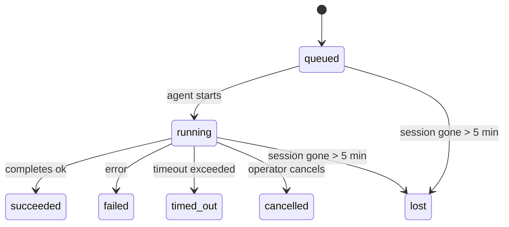

---
read_when:
    - Sprawdzanie prac w tle będących w toku lub niedawno ukończonych
    - Debugowanie niepowodzeń dostarczania dla odłączonych uruchomień agentów
    - Zrozumienie, jak uruchomienia w tle odnoszą się do sesji, cron i heartbeat
sidebarTitle: Background tasks
summary: Śledzenie zadań w tle dla uruchomień ACP, subagentów, izolowanych zadań Cron i operacji CLI
title: Zadania w tle
x-i18n:
    generated_at: "2026-06-27T17:09:15Z"
    model: gpt-5.5
    postprocess_version: locale-links-v1
    provider: openai
    source_hash: 4a630a52d0d6bfd387a37415dd63fc4bfbce23f99eaa8cb780c3d6f8913675fd
    source_path: automation/tasks.md
    workflow: 16
---

<Note>
Szukasz harmonogramowania? Zobacz [Automatyzacja](/pl/automation), aby wybrać właściwy mechanizm. Ta strona jest dziennikiem aktywności prac w tle, a nie harmonogramem.
</Note>

Zadania w tle śledzą pracę wykonywaną **poza główną sesją konwersacji**: uruchomienia ACP, tworzenie subagentów, izolowane wykonania zadań cron oraz operacje inicjowane z CLI.

Zadania **nie** zastępują sesji, zadań cron ani Heartbeat - są **dziennikiem aktywności**, który zapisuje, jaka odłączona praca została wykonana, kiedy oraz czy zakończyła się powodzeniem.

<Note>
Nie każde uruchomienie agenta tworzy zadanie. Tury Heartbeat i zwykły czat interaktywny tego nie robią. Wszystkie wykonania cron, uruchomienia ACP, uruchomienia subagentów i polecenia agenta z CLI tworzą zadania.
</Note>

## TL;DR

- Zadania są **rekordami**, a nie harmonogramami - cron i Heartbeat decydują, _kiedy_ praca jest uruchamiana, zadania śledzą _co się stało_.
- ACP, subagenci, wszystkie zadania cron i operacje CLI tworzą zadania. Tury Heartbeat tego nie robią.
- Każde zadanie przechodzi przez `queued → running → terminal` (succeeded, failed, timed_out, cancelled lub lost).
- Zadania Cron pozostają aktywne, dopóki środowisko wykonawcze cron nadal jest właścicielem zadania; jeśli
  stan środowiska wykonawczego w pamięci zniknie, konserwacja zadań najpierw sprawdza trwałą historię
  uruchomień cron, zanim oznaczy zadanie jako utracone.
- Ukończenie jest oparte na wypychaniu: odłączona praca może powiadomić bezpośrednio albo wybudzić
  sesję żądającą/Heartbeat po zakończeniu, więc pętle odpytywania statusu są
  zwykle niewłaściwym kształtem.
- Izolowane uruchomienia cron i ukończenia subagentów podejmują najlepszą możliwą próbę wyczyszczenia śledzonych kart przeglądarki/procesów dla swojej sesji podrzędnej przed końcowym księgowaniem czyszczenia.
- Izolowane dostarczanie cron tłumi nieaktualne tymczasowe odpowiedzi rodzica, gdy praca potomnych subagentów nadal się kończy, i preferuje końcowe wyjście potomka, jeśli dotrze przed dostarczeniem.
- Powiadomienia o ukończeniu są dostarczane bezpośrednio do kanału albo kolejkowane do następnego Heartbeat.
- `openclaw tasks list` pokazuje wszystkie zadania; `openclaw tasks audit` ujawnia problemy.
- Rekordy terminalne są przechowywane przez 7 dni, a następnie automatycznie usuwane.

## Szybki start

<Tabs>
  <Tab title="List and filter">
    ```bash
    # List all tasks (newest first)
    openclaw tasks list

    # Filter by runtime or status
    openclaw tasks list --runtime acp
    openclaw tasks list --status running
    ```

  </Tab>
  <Tab title="Inspect">
    ```bash
    # Show details for a specific task (by ID, run ID, or session key)
    openclaw tasks show <lookup>
    ```
  </Tab>
  <Tab title="Cancel and notify">
    ```bash
    # Cancel a running task (kills the child session)
    openclaw tasks cancel <lookup>

    # Change notification policy for a task
    openclaw tasks notify <lookup> state_changes
    ```

  </Tab>
  <Tab title="Audit and maintenance">
    ```bash
    # Run a health audit
    openclaw tasks audit

    # Preview or apply maintenance
    openclaw tasks maintenance
    openclaw tasks maintenance --apply
    ```

  </Tab>
  <Tab title="Task flow">
    ```bash
    # Inspect TaskFlow state
    openclaw tasks flow list
    openclaw tasks flow show <lookup>
    openclaw tasks flow cancel <lookup>
    ```
  </Tab>
</Tabs>

## Co tworzy zadanie

| Źródło                 | Typ środowiska wykonawczego | Kiedy tworzony jest rekord zadania                                      | Domyślna polityka powiadomień |
| ---------------------- | ------------ | ---------------------------------------------------------------------- | --------------------- |
| Uruchomienia ACP w tle | `acp`        | Utworzenie podrzędnej sesji ACP                                        | `done_only`           |
| Orkiestracja subagentów | `subagent`   | Utworzenie subagenta przez `sessions_spawn`                            | `done_only`           |
| Zadania Cron (wszystkie typy) | `cron`       | Każde wykonanie cron (w głównej sesji i izolowane)                     | `silent`              |
| Operacje CLI           | `cli`        | Polecenia `openclaw agent`, które działają przez Gateway               | `silent`              |
| Zadania multimedialne agenta | `cli`        | Uruchomienia `image_generate`/`music_generate`/`video_generate` oparte na sesji | `silent`              |

<AccordionGroup>
  <Accordion title="Notify defaults for cron and media">
    Zadania cron w głównej sesji domyślnie używają polityki powiadomień `silent` - tworzą rekordy do śledzenia, ale nie generują powiadomień. Izolowane zadania cron również domyślnie używają `silent`, ale są bardziej widoczne, ponieważ działają we własnej sesji.

    Uruchomienia `image_generate`, `music_generate` i `video_generate` oparte na sesji również używają polityki powiadomień `silent`. Nadal tworzą rekordy zadań, ale ukończenie jest przekazywane z powrotem do pierwotnej sesji agenta jako wewnętrzne wybudzenie, aby agent mógł sam napisać wiadomość uzupełniającą i dołączyć gotowe multimedia. Agent żądający przestrzega swojego zwykłego kontraktu widocznej odpowiedzi: automatyczna odpowiedź końcowa, gdy jest skonfigurowana, albo `message(action="send")` plus `NO_REPLY`, gdy sesja wymaga odpowiedzi przez narzędzie wiadomości. Jeśli sesja żądająca nie jest już aktywna albo jej aktywne wybudzenie się nie powiedzie, a agent ukończenia pominie część lub wszystkie wygenerowane multimedia, OpenClaw wysyła idempotentną bezpośrednią rezerwę zawierającą tylko brakujące multimedia do pierwotnego celu kanału.

  </Accordion>
  <Accordion title="Concurrent media-generation guardrail">
    Gdy zadanie generowania multimediów oparte na sesji jest nadal aktywne, narzędzia multimedialne działają także jako zabezpieczenia przed przypadkowymi ponowieniami. Powtarzane wywołania `image_generate` dla tego samego promptu zwracają status pasującego aktywnego zadania, natomiast odrębny prompt obrazu może uruchomić własne zadanie. Wywołania `music_generate` i `video_generate` nadal zwracają status aktywnego zadania dla tej sesji zamiast rozpoczynać drugie równoległe generowanie. Użyj `action: "status"`, gdy chcesz wykonać jawne sprawdzenie postępu/statusu po stronie agenta.
  </Accordion>
  <Accordion title="What does not create tasks">
    - Tury Heartbeat - w głównej sesji; zobacz [Heartbeat](/pl/gateway/heartbeat)
    - Zwykłe interaktywne tury czatu
    - Bezpośrednie odpowiedzi `/command`

  </Accordion>
</AccordionGroup>

## Cykl życia zadania



| Status      | Znaczenie                                                              |
| ----------- | -------------------------------------------------------------------------- |
| `queued`    | Utworzone, czeka na uruchomienie agenta                                    |
| `running`   | Tura agenta jest aktywnie wykonywana                                           |
| `succeeded` | Ukończone pomyślnie                                                     |
| `failed`    | Ukończone z błędem                                                    |
| `timed_out` | Przekroczono skonfigurowany limit czasu                                            |
| `cancelled` | Zatrzymane przez operatora za pomocą `openclaw tasks cancel`                        |
| `lost`      | Środowisko wykonawcze utraciło autorytatywny stan zaplecza po 5-minutowym okresie karencji |

Przejścia zachodzą automatycznie - gdy powiązane uruchomienie agenta się kończy, status zadania jest aktualizowany tak, aby mu odpowiadał.

Ukończenie uruchomienia agenta jest autorytatywne dla aktywnych rekordów zadań. Pomyślne odłączone uruchomienie finalizuje się jako `succeeded`, zwykłe błędy uruchomienia finalizują się jako `failed`, a wyniki przekroczenia czasu lub przerwania finalizują się jako `timed_out`. Jeśli operator już anulował zadanie albo środowisko wykonawcze już zapisało silniejszy stan terminalny, taki jak `failed`, `timed_out` lub `lost`, późniejszy sygnał powodzenia nie obniża tego statusu terminalnego.

`lost` uwzględnia środowisko wykonawcze:

- Zadania ACP: zniknęły metadane podrzędnej sesji ACP stanowiące zaplecze.
- Zadania subagentów: podrzędna sesja stanowiąca zaplecze zniknęła z docelowego magazynu agenta.
- Zadania Cron: środowisko wykonawcze cron nie śledzi już zadania jako aktywnego, a trwała
  historia uruchomień cron nie pokazuje terminalnego wyniku dla tego uruchomienia. Audyt CLI
  offline nie traktuje własnego pustego stanu środowiska wykonawczego cron w procesie jako autorytatywnego.
- Zadania CLI: zadania z identyfikatorem uruchomienia/identyfikatorem źródła używają aktywnego kontekstu uruchomienia, więc
  pozostające wiersze sesji podrzędnej lub sesji czatu nie utrzymują ich przy życiu po zniknięciu
  uruchomienia należącego do Gateway. Starsze zadania CLI bez tożsamości uruchomienia nadal
  wracają do sesji podrzędnej. Uruchomienia `openclaw agent` oparte na Gateway także finalizują się
  na podstawie wyniku uruchomienia, więc ukończone uruchomienia nie pozostają aktywne, dopóki proces sprzątający
  nie oznaczy ich jako `lost`.

## Dostarczanie i powiadomienia

Gdy zadanie osiągnie stan terminalny, OpenClaw Cię powiadomi. Istnieją dwie ścieżki dostarczania:

**Dostarczanie bezpośrednie** - jeśli zadanie ma cel kanału (`requesterOrigin`), wiadomość o ukończeniu trafia prosto do tego kanału (Telegram, Discord, Slack itd.). Ukończenia zadań grupowych i kanałowych są zamiast tego kierowane przez sesję żądającą, aby agent nadrzędny mógł napisać widoczną odpowiedź. Dla ukończeń subagentów OpenClaw zachowuje także powiązane routowanie wątku/tematu, gdy jest dostępne, i może uzupełnić brakujące `to` / konto z zapisanej trasy sesji żądającej (`lastChannel` / `lastTo` / `lastAccountId`), zanim zrezygnuje z dostarczania bezpośredniego.

**Dostarczanie kolejkowane w sesji** - jeśli dostarczanie bezpośrednie się nie powiedzie albo nie ustawiono źródła, aktualizacja jest kolejkowana jako zdarzenie systemowe w sesji żądającej i pojawia się przy następnym Heartbeat.

<Tip>
Ukończenie zadania wyzwala natychmiastowe wybudzenie Heartbeat, więc szybko zobaczysz wynik - nie musisz czekać na następny zaplanowany takt Heartbeat.
</Tip>

Oznacza to, że typowy przepływ pracy jest oparty na wypychaniu: uruchom odłączoną pracę raz, a następnie pozwól środowisku wykonawczemu wybudzić Cię albo powiadomić po ukończeniu. Odpytuj stan zadania tylko wtedy, gdy potrzebujesz debugowania, interwencji albo jawnego audytu.

### Polityki powiadomień

Kontroluj, ile informacji otrzymujesz o każdym zadaniu:

| Polityka                | Co jest dostarczane                                                       |
| --------------------- | ----------------------------------------------------------------------- |
| `done_only` (domyślna) | Tylko stan terminalny (succeeded, failed itd.) - **to jest wartość domyślna** |
| `state_changes`       | Każde przejście stanu i aktualizacja postępu                              |
| `silent`              | Nic                                                          |

Zmień politykę podczas działania zadania:

```bash
openclaw tasks notify <lookup> state_changes
```

## Dokumentacja CLI

<AccordionGroup>
  <Accordion title="tasks list">
    ```bash
    openclaw tasks list [--runtime <acp|subagent|cron|cli>] [--status <status>] [--json]
    ```

    Kolumny wyjścia: identyfikator zadania, rodzaj, status, dostarczanie, identyfikator uruchomienia, sesja podrzędna, podsumowanie.

  </Accordion>
  <Accordion title="tasks show">
    ```bash
    openclaw tasks show <lookup>
    ```

    Token wyszukiwania akceptuje identyfikator zadania, identyfikator uruchomienia albo klucz sesji. Pokazuje pełny rekord, w tym czas, stan dostarczania, błąd i podsumowanie terminalne.

  </Accordion>
  <Accordion title="tasks cancel">
    ```bash
    openclaw tasks cancel <lookup>
    ```

    W przypadku zadań ACP i subagentów zabija to sesję podrzędną. W przypadku zadań śledzonych przez CLI anulowanie jest zapisywane w rejestrze zadań (nie ma oddzielnego uchwytu podrzędnego środowiska wykonawczego). Status przechodzi na `cancelled`, a powiadomienie o dostarczeniu jest wysyłane, gdy ma to zastosowanie.

  </Accordion>
  <Accordion title="tasks notify">
    ```bash
    openclaw tasks notify <lookup> <done_only|state_changes|silent>
    ```
  </Accordion>
  <Accordion title="tasks audit">
    ```bash
    openclaw tasks audit [--json]
    ```

    Ujawnia problemy operacyjne. Ustalenia pojawiają się także w `openclaw status`, gdy wykryto problemy.

    | Ustalenie                 | Ważność    | Warunek                                                                                                                       |
    | ------------------------- | ---------- | ----------------------------------------------------------------------------------------------------------------------------- |
    | `stale_queued`            | warn       | W kolejce przez ponad 10 minut                                                                                                |
    | `stale_running`           | error      | Uruchomione przez ponad 30 minut                                                                                              |
    | `lost`                    | warn/error | Własność zadania obsługiwanego przez runtime zniknęła; zachowane utracone zadania ostrzegają do `cleanupAfter`, potem stają się błędami |
    | `delivery_failed`         | warn       | Dostarczenie nie powiodło się, a zasada powiadamiania nie ma wartości `silent`                                                |
    | `missing_cleanup`         | warn       | Zadanie końcowe bez znacznika czasu czyszczenia                                                                               |
    | `inconsistent_timestamps` | warn       | Naruszenie osi czasu (na przykład zakończone przed rozpoczęciem)                                                              |

  </Accordion>
  <Accordion title="tasks maintenance">
    ```bash
    openclaw tasks maintenance [--json]
    openclaw tasks maintenance --apply [--json]
    ```

    Użyj tego, aby podejrzeć lub zastosować uzgadnianie, oznaczanie czyszczenia oraz przycinanie zadań, stanu TaskFlow i nieaktualnych wierszy rejestru sesji uruchomień cron.

    Uzgadnianie uwzględnia runtime:

    - Zadania ACP/subagent sprawdzają swoją bazową sesję podrzędną.
    - Zadania subagent, których sesja podrzędna ma tombstone odzyskiwania po restarcie, są oznaczane jako utracone zamiast traktowania ich jako możliwych do odzyskania sesji bazowych.
    - Zadania Cron sprawdzają, czy runtime cron nadal jest właścicielem zadania, a następnie odzyskują stan końcowy z utrwalonych dzienników uruchomień cron/stanu zadania, zanim wrócą do `lost`. Tylko proces Gateway jest autorytatywny dla przechowywanego w pamięci zestawu aktywnych zadań cron; audyt CLI offline używa trwałej historii, ale nie oznacza zadania cron jako utraconego wyłącznie dlatego, że ten lokalny Set jest pusty.
    - Zadania CLI z tożsamością uruchomienia sprawdzają właścicielski kontekst aktywnego uruchomienia, a nie tylko wiersze sesji podrzędnej lub sesji czatu.

    Czyszczenie po zakończeniu również uwzględnia runtime:

    - Zakończenie subagent w trybie najlepszej próby zamyka śledzone karty/procesy przeglądarki dla sesji podrzędnej, zanim czyszczenie ogłoszenia będzie kontynuowane.
    - Zakończenie izolowanego cron w trybie najlepszej próby zamyka śledzone karty/procesy przeglądarki dla sesji cron, zanim uruchomienie zostanie w pełni zakończone.
    - Dostarczenie izolowanego cron w razie potrzeby czeka na dalsze działania potomnego subagent i pomija nieaktualny tekst potwierdzenia rodzica zamiast go ogłaszać.
    - Dostarczenie zakończenia subagent używa wyłącznie najnowszego widocznego tekstu asystenta dziecka. Dane wyjściowe tool/toolResult nie są promowane do tekstu wyniku dziecka. Końcowe nieudane uruchomienia ogłaszają stan niepowodzenia bez ponownego odtwarzania przechwyconego tekstu odpowiedzi.
    - Błędy czyszczenia nie maskują rzeczywistego wyniku zadania.

    Podczas stosowania konserwacji OpenClaw usuwa także nieaktualne wiersze rejestru sesji `cron:<jobId>:run:<uuid>` starsze niż 7 dni, zachowując wiersze aktualnie działających zadań cron i pozostawiając wiersze sesji innych niż cron bez zmian.

  </Accordion>
  <Accordion title="tasks flow list | show | cancel">
    ```bash
    openclaw tasks flow list [--status <status>] [--json]
    openclaw tasks flow show <lookup> [--json]
    openclaw tasks flow cancel <lookup>
    ```

    Użyj ich, gdy zależy Ci na orkiestrującym TaskFlow, a nie na jednym konkretnym rekordzie zadania w tle.

  </Accordion>
</AccordionGroup>

## Tablica zadań czatu (`/tasks`)

Użyj `/tasks` w dowolnej sesji czatu, aby zobaczyć zadania w tle powiązane z tą sesją. Tablica pokazuje aktywne i niedawno ukończone zadania wraz z runtime, stanem, czasem oraz postępem lub szczegółami błędu.

Gdy bieżąca sesja nie ma widocznych powiązanych zadań, `/tasks` wraca do lokalnych dla agenta liczników zadań, dzięki czemu nadal otrzymujesz przegląd bez ujawniania szczegółów innych sesji.

Aby zobaczyć pełną księgę operatora, użyj CLI: `openclaw tasks list`.

## Integracja stanu (presja zadań)

`openclaw status` zawiera szybkie podsumowanie zadań:

```
Tasks: 3 queued · 2 running · 1 issues
```

Podsumowanie raportuje:

- **active** - liczba `queued` + `running`
- **failures** - liczba `failed` + `timed_out` + `lost`
- **byRuntime** - podział według `acp`, `subagent`, `cron`, `cli`

Zarówno `/status`, jak i narzędzie `session_status` używają migawki zadań uwzględniającej czyszczenie: aktywne zadania mają pierwszeństwo, nieaktualne ukończone wiersze są ukrywane, a ostatnie niepowodzenia pojawiają się tylko wtedy, gdy nie ma już aktywnej pracy. Dzięki temu karta stanu skupia się na tym, co jest ważne teraz.

## Przechowywanie i konserwacja

### Gdzie znajdują się zadania

Rekordy zadań są utrwalane w SQLite pod adresem:

```
$OPENCLAW_STATE_DIR/tasks/runs.sqlite
```

Rejestr jest ładowany do pamięci przy starcie Gateway i synchronizuje zapisy do SQLite, aby zapewnić trwałość między restartami.
Gateway utrzymuje dziennik zapisu z wyprzedzeniem SQLite w ograniczonym rozmiarze, używając domyślnego progu
autocheckpoint SQLite oraz okresowych punktów kontrolnych `PASSIVE`. Zamknięcie i
jawne punkty kontrolne konserwacji nadal używają `TRUNCATE`, aby zwykłe zamknięcia mogły
odzyskać miejsce WAL bez zmuszania zamiatacza w tle do czekania na aktywnych czytelników.

### Automatyczna konserwacja

Zamiatacz uruchamia się co **60 sekund** i obsługuje cztery rzeczy:

<Steps>
  <Step title="Reconciliation">
    Sprawdza, czy aktywne zadania nadal mają autorytatywne oparcie w runtime. Zadania ACP/subagent używają stanu sesji podrzędnej, zadania cron używają własności aktywnego zadania, a zadania CLI z tożsamością uruchomienia używają właścicielskiego kontekstu uruchomienia. Jeśli ten stan bazowy zniknął na ponad 5 minut, zadanie jest oznaczane jako `lost`.
  </Step>
  <Step title="ACP session repair">
    Zamyka końcowe lub osierocone jednorazowe sesje ACP należące do rodzica oraz zamyka nieaktualne końcowe lub osierocone trwałe sesje ACP tylko wtedy, gdy nie pozostaje aktywne powiązanie konwersacji.
  </Step>
  <Step title="Cleanup stamping">
    Ustawia znacznik czasu `cleanupAfter` dla zadań końcowych (endedAt + 7 dni). W okresie przechowywania utracone zadania nadal pojawiają się w audycie jako ostrzeżenia; po wygaśnięciu `cleanupAfter` lub gdy brakuje metadanych czyszczenia, są błędami.
  </Step>
  <Step title="Pruning">
    Usuwa rekordy po ich dacie `cleanupAfter`.
  </Step>
</Steps>

<Note>
**Przechowywanie:** rekordy zadań końcowych są przechowywane przez **7 dni**, a potem automatycznie przycinane. Konfiguracja nie jest wymagana.
</Note>

## Jak zadania odnoszą się do innych systemów

<AccordionGroup>
  <Accordion title="Tasks and Task Flow">
    [TaskFlow](/pl/automation/taskflow) to warstwa orkiestracji przepływu nad zadaniami w tle. Pojedynczy przepływ może koordynować wiele zadań w czasie swojego życia, używając zarządzanych lub lustrzanych trybów synchronizacji. Użyj `openclaw tasks`, aby sprawdzić pojedyncze rekordy zadań, oraz `openclaw tasks flow`, aby sprawdzić orkiestrujący przepływ.

    Szczegóły znajdziesz w [TaskFlow](/pl/automation/taskflow).

  </Accordion>
  <Accordion title="Tasks and cron">
    Definicje zadań Cron, stan wykonania runtime i historia uruchomień znajdują się we współdzielonej bazie danych stanu SQLite OpenClaw. **Każde** wykonanie cron tworzy rekord zadania - zarówno w sesji głównej, jak i izolowanej. Zadania cron w sesji głównej domyślnie używają zasady powiadamiania `silent`, więc są śledzone bez generowania powiadomień.

    Zobacz [Zadania Cron](/pl/automation/cron-jobs).

  </Accordion>
  <Accordion title="Tasks and heartbeat">
    Uruchomienia Heartbeat są turami sesji głównej - nie tworzą rekordów zadań. Gdy zadanie zostanie ukończone, może wyzwolić wybudzenie Heartbeat, aby wynik był szybko widoczny.

    Zobacz [Heartbeat](/pl/gateway/heartbeat).

  </Accordion>
  <Accordion title="Tasks and sessions">
    Zadanie może odwoływać się do `childSessionKey` (gdzie wykonywana jest praca) i `requesterSessionKey` (kto je uruchomił). Jego `agentId` identyfikuje agenta wykonującego pracę, natomiast pola zgłaszającego i właściciela zachowują kontekst uruchomienia oraz kontroli. Sesje są kontekstem konwersacji; zadania to śledzenie aktywności nad nim.
  </Accordion>
  <Accordion title="Tasks and agent runs">
    `runId` zadania łączy je z uruchomieniem agenta wykonującym pracę. Zdarzenia cyklu życia agenta (start, koniec, błąd) automatycznie aktualizują stan zadania - nie musisz ręcznie zarządzać cyklem życia.
  </Accordion>
</AccordionGroup>

## Powiązane

- [Automatyzacja](/pl/automation) - wszystkie mechanizmy automatyzacji w skrócie
- [CLI: Zadania](/pl/cli/tasks) - dokumentacja poleceń CLI
- [Heartbeat](/pl/gateway/heartbeat) - okresowe tury sesji głównej
- [Zaplanowane zadania](/pl/automation/cron-jobs) - planowanie pracy w tle
- [TaskFlow](/pl/automation/taskflow) - orkiestracja przepływu nad zadaniami
