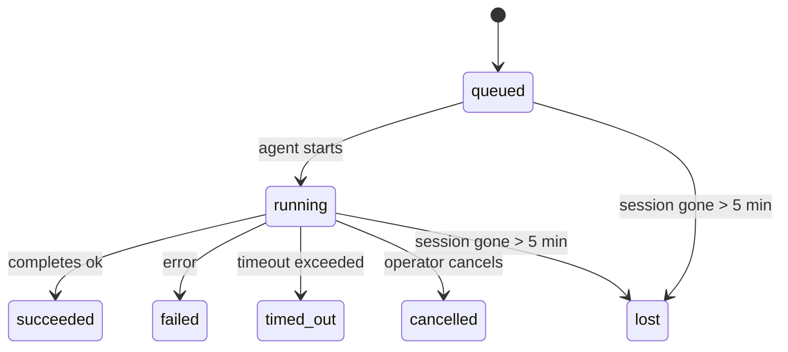

---
read_when:
    - Sprawdzanie zadań w tle będących w toku lub niedawno ukończonych
    - Debugowanie niepowodzeń dostarczania w odłączonych uruchomieniach agentów
    - Zrozumienie, jak uruchomienia w tle wiążą się z sesjami, Cron i Heartbeat
sidebarTitle: Background tasks
summary: Śledzenie zadań w tle dla uruchomień ACP, subagentów, izolowanych zadań Cron i operacji CLI
title: Zadania w tle
x-i18n:
    generated_at: "2026-05-07T13:13:14Z"
    model: gpt-5.5
    provider: openai
    source_hash: a91a04ef6142e488d2fbc459d2c663afb93816a58fe9f52e0a51420703ea2d4d
    source_path: automation/tasks.md
    workflow: 16
---

<Note>
Szukasz harmonogramowania? Zobacz [Automatyzacja i zadania](/pl/automation), aby wybrać właściwy mechanizm. Ta strona jest rejestrem aktywności dla pracy w tle, a nie harmonogramem.
</Note>

Zadania w tle śledzą pracę uruchamianą **poza główną sesją rozmowy**: uruchomienia ACP, tworzenie subagentów, izolowane wykonania zadań cron oraz operacje inicjowane z CLI.

Zadania **nie** zastępują sesji, zadań cron ani heartbeatów - są **rejestrem aktywności**, który zapisuje, jaka odłączona praca się wydarzyła, kiedy oraz czy zakończyła się powodzeniem.

<Note>
Nie każde uruchomienie agenta tworzy zadanie. Tury Heartbeat i zwykły czat interaktywny tego nie robią. Robią to wszystkie wykonania cron, uruchomienia ACP, uruchomienia subagentów i polecenia agenta z CLI.
</Note>

## TL;DR

- Zadania są **rekordami**, a nie harmonogramami - cron i Heartbeat decydują, _kiedy_ praca jest uruchamiana, zadania śledzą, _co się wydarzyło_.
- ACP, subagenci, wszystkie zadania cron i operacje CLI tworzą zadania. Tury Heartbeat tego nie robią.
- Każde zadanie przechodzi przez `queued → running → terminal` (succeeded, failed, timed_out, cancelled lub lost).
- Zadania cron pozostają aktywne, dopóki środowisko wykonawcze cron nadal jest właścicielem zadania; jeśli stan środowiska wykonawczego w pamięci zniknie, konserwacja zadań najpierw sprawdza trwałą historię uruchomień cron, zanim oznaczy zadanie jako lost.
- Ukończenie jest sterowane wypychaniem: odłączona praca może powiadomić bezpośrednio albo wybudzić sesję żądającą/Heartbeat po zakończeniu, więc pętle odpytywania statusu zwykle mają niewłaściwy kształt.
- Izolowane uruchomienia cron i ukończenia subagentów podejmują próbę wyczyszczenia śledzonych kart przeglądarki/procesów dla ich sesji podrzędnej przed końcowymi zapisami porządkowymi.
- Izolowane dostarczanie cron tłumi nieaktualne tymczasowe odpowiedzi rodzica, gdy praca potomnego subagenta nadal się kończy, i preferuje końcowe wyjście potomka, jeśli dotrze ono przed dostarczeniem.
- Powiadomienia o ukończeniu są dostarczane bezpośrednio do kanału albo kolejkowane do następnego Heartbeat.
- `openclaw tasks list` pokazuje wszystkie zadania; `openclaw tasks audit` ujawnia problemy.
- Rekordy terminalne są przechowywane przez 7 dni, a potem automatycznie usuwane.

## Szybki start

<Tabs>
  <Tab title="Lista i filtrowanie">
    ```bash
    # Lista wszystkich zadań (najnowsze jako pierwsze)
    openclaw tasks list

    # Filtrowanie według środowiska wykonawczego lub statusu
    openclaw tasks list --runtime acp
    openclaw tasks list --status running
    ```

  </Tab>
  <Tab title="Inspekcja">
    ```bash
    # Pokaż szczegóły konkretnego zadania (według ID, ID uruchomienia lub klucza sesji)
    openclaw tasks show <lookup>
    ```
  </Tab>
  <Tab title="Anulowanie i powiadamianie">
    ```bash
    # Anuluj uruchomione zadanie (zabija sesję podrzędną)
    openclaw tasks cancel <lookup>

    # Zmień politykę powiadomień dla zadania
    openclaw tasks notify <lookup> state_changes
    ```

  </Tab>
  <Tab title="Audyt i konserwacja">
    ```bash
    # Uruchom audyt kondycji
    openclaw tasks audit

    # Podejrzyj lub zastosuj konserwację
    openclaw tasks maintenance
    openclaw tasks maintenance --apply
    ```

  </Tab>
  <Tab title="Przepływ zadań">
    ```bash
    # Sprawdź stan TaskFlow
    openclaw tasks flow list
    openclaw tasks flow show <lookup>
    openclaw tasks flow cancel <lookup>
    ```
  </Tab>
</Tabs>

## Co tworzy zadanie

| Źródło                 | Typ środowiska wykonawczego | Kiedy tworzony jest rekord zadania                     | Domyślna polityka powiadomień |
| ---------------------- | ------------ | ------------------------------------------------------ | --------------------- |
| Uruchomienia ACP w tle | `acp`        | Utworzenie podrzędnej sesji ACP                        | `done_only`           |
| Orkiestracja subagentów | `subagent`   | Utworzenie subagenta przez `sessions_spawn`            | `done_only`           |
| Zadania cron (wszystkie typy) | `cron`       | Każde wykonanie cron (główna sesja i izolowane)        | `silent`              |
| Operacje CLI           | `cli`        | Polecenia `openclaw agent`, które działają przez Gateway | `silent`              |
| Zadania multimedialne agenta | `cli`        | Uruchomienia `music_generate`/`video_generate` wspierane sesją | `silent`              |

<AccordionGroup>
  <Accordion title="Domyślne powiadomienia dla cron i multimediów">
    Zadania cron w głównej sesji domyślnie używają polityki powiadomień `silent` - tworzą rekordy do śledzenia, ale nie generują powiadomień. Izolowane zadania cron również domyślnie używają `silent`, ale są bardziej widoczne, ponieważ działają we własnej sesji.

    Uruchomienia `music_generate` i `video_generate` wspierane sesją również używają polityki powiadomień `silent`. Nadal tworzą rekordy zadań, ale ukończenie jest przekazywane z powrotem do pierwotnej sesji agenta jako wewnętrzne wybudzenie, aby agent mógł sam napisać wiadomość uzupełniającą i dołączyć gotowe multimedia. Ukończenia w grupie/kanale stosują normalną politykę widocznej odpowiedzi, więc agent używa narzędzia wiadomości, gdy wymaga tego dostarczenie źródłowe. Jeśli agent ukończenia nie przedstawi dowodu dostarczenia narzędziem wiadomości w trasie wyłącznie narzędziowej, OpenClaw wysyła awaryjne ukończenie bezpośrednio do pierwotnego kanału, zamiast pozostawiać multimedia prywatne.

  </Accordion>
  <Accordion title="Zabezpieczenie współbieżnego video_generate">
    Gdy zadanie `video_generate` wspierane sesją nadal jest aktywne, narzędzie działa też jako zabezpieczenie: powtórzone wywołania `video_generate` w tej samej sesji zwracają status aktywnego zadania zamiast rozpoczynać drugie współbieżne generowanie. Użyj `action: "status"`, gdy chcesz jawnego sprawdzenia postępu/statusu po stronie agenta.
  </Accordion>
  <Accordion title="Co nie tworzy zadań">
    - Tury Heartbeat - główna sesja; zobacz [Heartbeat](/pl/gateway/heartbeat)
    - Zwykłe interaktywne tury czatu
    - Bezpośrednie odpowiedzi `/command`

  </Accordion>
</AccordionGroup>

## Cykl życia zadania



| Status      | Co oznacza                                                                |
| ----------- | -------------------------------------------------------------------------- |
| `queued`    | Utworzone, czeka na start agenta                                           |
| `running`   | Tura agenta jest aktywnie wykonywana                                       |
| `succeeded` | Ukończone pomyślnie                                                        |
| `failed`    | Ukończone z błędem                                                         |
| `timed_out` | Przekroczono skonfigurowany limit czasu                                    |
| `cancelled` | Zatrzymane przez operatora przez `openclaw tasks cancel`                   |
| `lost`      | Środowisko wykonawcze utraciło autorytatywny stan wspierający po 5-minutowym okresie karencji |

Przejścia zachodzą automatycznie - gdy powiązane uruchomienie agenta się kończy, status zadania aktualizuje się odpowiednio.

Ukończenie uruchomienia agenta jest autorytatywne dla aktywnych rekordów zadań. Udane odłączone uruchomienie finalizuje się jako `succeeded`, zwykłe błędy uruchomienia finalizują się jako `failed`, a wyniki limitu czasu lub przerwania finalizują się jako `timed_out`. Jeśli operator już anulował zadanie albo środowisko wykonawcze już zapisało silniejszy stan terminalny, taki jak `failed`, `timed_out` lub `lost`, późniejszy sygnał sukcesu nie obniża tego statusu terminalnego.

`lost` uwzględnia środowisko wykonawcze:

- Zadania ACP: metadane podrzędnej sesji ACP zniknęły.
- Zadania subagentów: podrzędna sesja zniknęła z magazynu agenta docelowego.
- Zadania cron: środowisko wykonawcze cron nie śledzi już zadania jako aktywnego, a trwała historia uruchomień cron nie pokazuje terminalnego wyniku dla tego uruchomienia. Audyt CLI offline nie traktuje własnego pustego stanu środowiska wykonawczego cron w procesie jako autorytetu.
- Zadania CLI: zadania z ID uruchomienia/ID źródła używają aktywnego kontekstu uruchomienia, więc zalegające wiersze sesji podrzędnej lub sesji czatu nie utrzymują ich przy życiu po zniknięciu uruchomienia należącego do Gateway. Starsze zadania CLI bez tożsamości uruchomienia nadal wracają do sesji podrzędnej. Uruchomienia `openclaw agent` wspierane przez Gateway również finalizują się na podstawie wyniku uruchomienia, więc ukończone uruchomienia nie pozostają aktywne, aż sprzątacz oznaczy je jako `lost`.

## Dostarczanie i powiadomienia

Gdy zadanie osiąga stan terminalny, OpenClaw powiadamia użytkownika. Istnieją dwie ścieżki dostarczania:

**Dostarczanie bezpośrednie** - jeśli zadanie ma cel kanału (`requesterOrigin`), wiadomość o ukończeniu trafia bezpośrednio do tego kanału (Telegram, Discord, Slack itd.). W przypadku ukończeń subagentów OpenClaw zachowuje także powiązane trasowanie wątku/tematu, gdy jest dostępne, i może uzupełnić brakujące `to` / konto z zapisanej trasy sesji żądającej (`lastChannel` / `lastTo` / `lastAccountId`) przed rezygnacją z dostarczania bezpośredniego.

**Dostarczanie kolejkowane w sesji** - jeśli dostarczanie bezpośrednie się nie powiedzie albo nie ustawiono źródła, aktualizacja jest kolejkowana jako zdarzenie systemowe w sesji żądającej i pojawia się przy następnym Heartbeat.

<Tip>
Ukończenie zadania wyzwala natychmiastowe wybudzenie Heartbeat, więc wynik zobaczysz szybko - nie musisz czekać na następny zaplanowany takt Heartbeat.
</Tip>

Oznacza to, że zwykły przepływ pracy jest oparty na wypychaniu: uruchamiasz odłączoną pracę raz, a potem pozwalasz środowisku wykonawczemu wybudzić cię lub powiadomić po ukończeniu. Odpytuj stan zadania tylko wtedy, gdy potrzebujesz debugowania, interwencji lub jawnego audytu.

### Polityki powiadomień

Kontroluj, ile informacji otrzymujesz o każdym zadaniu:

| Polityka              | Co jest dostarczane                                                     |
| --------------------- | ----------------------------------------------------------------------- |
| `done_only` (domyślna) | Tylko stan terminalny (succeeded, failed itd.) - **to jest domyślne** |
| `state_changes`       | Każde przejście stanu i aktualizacja postępu                            |
| `silent`              | Nic                                                                     |

Zmień politykę, gdy zadanie jest uruchomione:

```bash
openclaw tasks notify <lookup> state_changes
```

## Dokumentacja CLI

<AccordionGroup>
  <Accordion title="tasks list">
    ```bash
    openclaw tasks list [--runtime <acp|subagent|cron|cli>] [--status <status>] [--json]
    ```

    Kolumny wyjścia: ID zadania, Rodzaj, Status, Dostarczanie, ID uruchomienia, Sesja podrzędna, Podsumowanie.

  </Accordion>
  <Accordion title="tasks show">
    ```bash
    openclaw tasks show <lookup>
    ```

    Token wyszukiwania akceptuje ID zadania, ID uruchomienia lub klucz sesji. Pokazuje pełny rekord, w tym czas, stan dostarczania, błąd i podsumowanie terminalne.

  </Accordion>
  <Accordion title="tasks cancel">
    ```bash
    openclaw tasks cancel <lookup>
    ```

    W przypadku zadań ACP i subagentów zabija to sesję podrzędną. W przypadku zadań śledzonych przez CLI anulowanie jest zapisywane w rejestrze zadań (nie ma osobnego uchwytu podrzędnego środowiska wykonawczego). Status przechodzi na `cancelled`, a powiadomienie o dostarczeniu jest wysyłane, gdy ma zastosowanie.

  </Accordion>
  <Accordion title="tasks notify">
    ```bash
    openclaw tasks notify <lookup> <done_only|state_changes|silent>
    ```
  </Accordion>
  <Accordion title="tasks audit">
    ```bash
    openclaw tasks audit [--json]
    ```

    Ujawnia problemy operacyjne. Ustalenia pojawiają się także w `openclaw status`, gdy wykryto problemy.

    | Ustalenie                 | Ważność    | Wyzwalacz                                                                                                             |
    | ------------------------- | ---------- | --------------------------------------------------------------------------------------------------------------------- |
    | `stale_queued`            | warn       | W kolejce przez ponad 10 minut                                                                                        |
    | `stale_running`           | error      | Uruchomione przez ponad 30 minut                                                                                      |
    | `lost`                    | warn/error | Własność zadania oparta na środowisku wykonawczym zniknęła; zachowane utracone zadania ostrzegają do `cleanupAfter`, a potem stają się błędami |
    | `delivery_failed`         | warn       | Dostarczenie nie powiodło się, a zasada powiadamiania nie ma wartości `silent`                                        |
    | `missing_cleanup`         | warn       | Zadanie końcowe bez znacznika czasu czyszczenia                                                                       |
    | `inconsistent_timestamps` | warn       | Naruszenie osi czasu (na przykład zakończono przed rozpoczęciem)                                                      |

  </Accordion>
  <Accordion title="konserwacja zadań">
    ```bash
    openclaw tasks maintenance [--json]
    openclaw tasks maintenance --apply [--json]
    ```

    Użyj tego, aby podejrzeć lub zastosować uzgadnianie, oznaczanie czyszczenia i przycinanie zadań oraz stanu Task Flow.

    Uzgadnianie uwzględnia środowisko wykonawcze:

    - Zadania ACP/subagent sprawdzają swoją bazową sesję podrzędną.
    - Zadania subagent, których sesja podrzędna ma nagrobek odzyskiwania po restarcie, są oznaczane jako utracone, zamiast być traktowane jako możliwe do odzyskania sesje bazowe.
    - Zadania Cron sprawdzają, czy środowisko wykonawcze cron nadal jest właścicielem zadania, a następnie odzyskują stan końcowy z utrwalonych dzienników uruchomień cron/stanu zadania, zanim awaryjnie przejdą do `lost`. Tylko proces Gateway jest autorytatywny dla znajdującego się w pamięci zestawu aktywnych zadań cron; audyt CLI offline używa trwałej historii, ale nie oznacza zadania cron jako utraconego wyłącznie dlatego, że ten lokalny Set jest pusty.
    - Zadania CLI z tożsamością uruchomienia sprawdzają właścicielski kontekst aktywnego uruchomienia, a nie tylko wiersze sesji podrzędnej lub sesji czatu.

    Czyszczenie po ukończeniu również uwzględnia środowisko wykonawcze:

    - Ukończenie subagent w trybie best effort zamyka śledzone karty przeglądarki/procesy dla sesji podrzędnej, zanim czyszczenie ogłoszenia będzie kontynuowane.
    - Ukończenie izolowanego cron w trybie best effort zamyka śledzone karty przeglądarki/procesy dla sesji cron, zanim uruchomienie w pełni się zakończy.
    - Dostarczenie izolowanego cron w razie potrzeby oczekuje na dalsze działania potomnego subagent i tłumi nieaktualny tekst potwierdzenia rodzica, zamiast go ogłaszać.
    - Dostarczenie ukończenia subagent preferuje najnowszy widoczny tekst asystenta; jeśli jest pusty, awaryjnie używa oczyszczonego najnowszego tekstu tool/toolResult, a uruchomienia wywołań narzędzi zakończone wyłącznie przekroczeniem limitu czasu mogą zostać zwinięte do krótkiego podsumowania częściowego postępu. Końcowe nieudane uruchomienia ogłaszają stan niepowodzenia bez ponownego odtwarzania przechwyconego tekstu odpowiedzi.
    - Niepowodzenia czyszczenia nie maskują rzeczywistego wyniku zadania.

  </Accordion>
  <Accordion title="tasks flow list | show | cancel">
    ```bash
    openclaw tasks flow list [--status <status>] [--json]
    openclaw tasks flow show <lookup> [--json]
    openclaw tasks flow cancel <lookup>
    ```

    Użyj ich, gdy zależy Ci na orkiestrującym Task Flow, a nie na pojedynczym rekordzie zadania w tle.

  </Accordion>
</AccordionGroup>

## Tablica zadań czatu (`/tasks`)

Użyj `/tasks` w dowolnej sesji czatu, aby zobaczyć zadania w tle powiązane z tą sesją. Tablica pokazuje aktywne i niedawno ukończone zadania wraz ze środowiskiem wykonawczym, stanem, czasami oraz szczegółami postępu lub błędu.

Gdy bieżąca sesja nie ma widocznych powiązanych zadań, `/tasks` wraca do lokalnych dla agenta liczników zadań, aby nadal dać Ci przegląd bez ujawniania szczegółów innych sesji.

Aby zobaczyć pełną księgę operatora, użyj CLI: `openclaw tasks list`.

## Integracja stanu (obciążenie zadaniami)

`openclaw status` zawiera szybkie podsumowanie zadań:

```
Tasks: 3 queued · 2 running · 1 issues
```

Podsumowanie raportuje:

- **active** - liczba `queued` + `running`
- **failures** - liczba `failed` + `timed_out` + `lost`
- **byRuntime** - podział według `acp`, `subagent`, `cron`, `cli`

Zarówno `/status`, jak i narzędzie `session_status` używają migawki zadań świadomej czyszczenia: aktywne zadania mają pierwszeństwo, nieaktualne ukończone wiersze są ukrywane, a ostatnie niepowodzenia pojawiają się tylko wtedy, gdy nie pozostała żadna aktywna praca. Dzięki temu karta stanu skupia się na tym, co jest ważne teraz.

## Przechowywanie i konserwacja

### Gdzie znajdują się zadania

Rekordy zadań są utrwalane w SQLite pod adresem:

```
$OPENCLAW_STATE_DIR/tasks/runs.sqlite
```

Rejestr ładuje się do pamięci przy starcie gateway i synchronizuje zapisy do SQLite, aby zapewnić trwałość między restartami.
Gateway utrzymuje dziennik zapisu z wyprzedzeniem SQLite w ograniczonym rozmiarze, używając domyślnego progu autocheckpoint SQLite oraz okresowych i wykonywanych przy zamknięciu punktów kontrolnych `TRUNCATE`.

### Automatyczna konserwacja

Proces czyszczący uruchamia się co **60 sekund** i obsługuje cztery rzeczy:

<Steps>
  <Step title="Uzgadnianie">
    Sprawdza, czy aktywne zadania nadal mają autorytatywne bazowe środowisko wykonawcze. Zadania ACP/subagent używają stanu sesji podrzędnej, zadania cron używają własności aktywnego zadania, a zadania CLI z tożsamością uruchomienia używają właścicielskiego kontekstu uruchomienia. Jeśli ten stan bazowy zniknie na ponad 5 minut, zadanie jest oznaczane jako `lost`.
  </Step>
  <Step title="Naprawa sesji ACP">
    Zamyka końcowe lub osierocone jednorazowe sesje ACP należące do rodzica oraz zamyka nieaktualne końcowe lub osierocone trwałe sesje ACP tylko wtedy, gdy nie pozostaje żadne aktywne powiązanie konwersacji.
  </Step>
  <Step title="Oznaczanie czyszczenia">
    Ustawia znacznik czasu `cleanupAfter` na zadaniach końcowych (endedAt + 7 dni). Podczas retencji utracone zadania nadal pojawiają się w audycie jako ostrzeżenia; po wygaśnięciu `cleanupAfter` lub gdy brakuje metadanych czyszczenia, są błędami.
  </Step>
  <Step title="Przycinanie">
    Usuwa rekordy po ich dacie `cleanupAfter`.
  </Step>
</Steps>

<Note>
**Retencja:** końcowe rekordy zadań są przechowywane przez **7 dni**, a następnie automatycznie przycinane. Konfiguracja nie jest wymagana.
</Note>

## Jak zadania odnoszą się do innych systemów

<AccordionGroup>
  <Accordion title="Zadania i Task Flow">
    [Task Flow](/pl/automation/taskflow) to warstwa orkiestracji przepływów nad zadaniami w tle. Pojedynczy przepływ może koordynować wiele zadań w czasie swojego życia, używając zarządzanych lub lustrzanych trybów synchronizacji. Użyj `openclaw tasks`, aby sprawdzić pojedyncze rekordy zadań, oraz `openclaw tasks flow`, aby sprawdzić orkiestrujący przepływ.

    Zobacz [Task Flow](/pl/automation/taskflow), aby uzyskać szczegóły.

  </Accordion>
  <Accordion title="Zadania i cron">
    **Definicja** zadania cron znajduje się w `~/.openclaw/cron/jobs.json`; stan wykonania środowiska wykonawczego znajduje się obok niej w `~/.openclaw/cron/jobs-state.json`. **Każde** wykonanie cron tworzy rekord zadania - zarówno w sesji głównej, jak i izolowanej. Zadania cron sesji głównej domyślnie używają zasady powiadamiania `silent`, więc śledzą bez generowania powiadomień.

    Zobacz [Zadania Cron](/pl/automation/cron-jobs).

  </Accordion>
  <Accordion title="Zadania i heartbeat">
    Uruchomienia heartbeat są turami sesji głównej - nie tworzą rekordów zadań. Gdy zadanie się zakończy, może wyzwolić wybudzenie heartbeat, aby wynik pojawił się szybko.

    Zobacz [Heartbeat](/pl/gateway/heartbeat).

  </Accordion>
  <Accordion title="Zadania i sesje">
    Zadanie może odwoływać się do `childSessionKey` (gdzie praca jest wykonywana) oraz `requesterSessionKey` (kto je uruchomił). Sesje są kontekstem konwersacji; zadania są warstwą śledzenia aktywności ponad tym.
  </Accordion>
  <Accordion title="Zadania i uruchomienia agenta">
    `runId` zadania łączy się z uruchomieniem agenta wykonującym pracę. Zdarzenia cyklu życia agenta (start, koniec, błąd) automatycznie aktualizują stan zadania - nie musisz ręcznie zarządzać cyklem życia.
  </Accordion>
</AccordionGroup>

## Powiązane

- [Automatyzacja i zadania](/pl/automation) - wszystkie mechanizmy automatyzacji w skrócie
- [CLI: Zadania](/pl/cli/tasks) - dokumentacja poleceń CLI
- [Heartbeat](/pl/gateway/heartbeat) - okresowe tury sesji głównej
- [Zaplanowane zadania](/pl/automation/cron-jobs) - planowanie pracy w tle
- [Task Flow](/pl/automation/taskflow) - orkiestracja przepływów nad zadaniami
