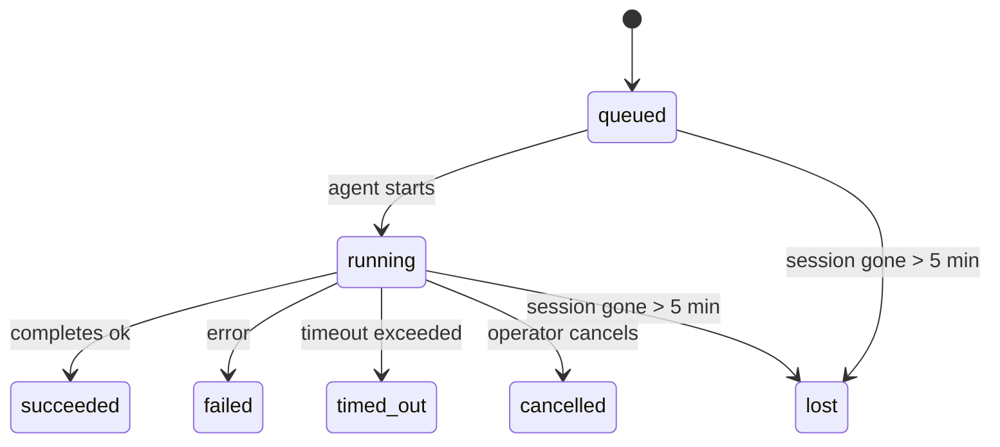

---
read_when:
    - Sprawdzanie zadań w tle będących w toku lub niedawno zakończonych
    - Debugowanie błędów dostarczania dla odłączonych uruchomień agentów
    - Zrozumienie, jak uruchomienia w tle odnoszą się do sesji, Cron i Heartbeat
sidebarTitle: Background tasks
summary: Śledzenie zadań w tle dla uruchomień ACP, subagentów, izolowanych zadań Cron i operacji CLI
title: Zadania w tle
x-i18n:
    generated_at: "2026-04-26T11:22:57Z"
    model: gpt-5.4
    provider: openai
    source_hash: 46952a378babdee9f43102bfa71dbd35b6ca7ecb142ffce3785eeb479e19d6b6
    source_path: automation/tasks.md
    workflow: 15
---

<Note>
Szukasz harmonogramowania? Zobacz [Automation & Tasks](/pl/automation), aby wybrać właściwy mechanizm. Ta strona dotyczy **śledzenia** pracy w tle, a nie jej harmonogramowania.
</Note>

Zadania w tle śledzą pracę wykonywaną **poza główną sesją rozmowy**: uruchomienia ACP, uruchomienia subagentów, izolowane wykonania zadań Cron oraz operacje inicjowane przez CLI.

Zadania **nie** zastępują sesji, zadań Cron ani Heartbeat — są **rejestrem aktywności**, który zapisuje, jaka odłączona praca miała miejsce, kiedy oraz czy zakończyła się powodzeniem.

<Note>
Nie każde uruchomienie agenta tworzy zadanie. Tury Heartbeat i zwykły interaktywny czat tego nie robią. Wszystkie wykonania Cron, uruchomienia ACP, uruchomienia subagentów i polecenia agenta CLI tworzą zadania.
</Note>

## W skrócie

- Zadania to **rekordy**, a nie planisty — Cron i Heartbeat decydują, _kiedy_ praca jest uruchamiana, a zadania śledzą, _co się wydarzyło_.
- ACP, subagenci, wszystkie zadania Cron i operacje CLI tworzą zadania. Tury Heartbeat nie.
- Każde zadanie przechodzi przez `queued → running → terminal` (`succeeded`, `failed`, `timed_out`, `cancelled` lub `lost`).
- Zadania Cron pozostają aktywne, dopóki środowisko uruchomieniowe Cron nadal zarządza zadaniem; jeśli stan środowiska w pamięci zniknie, utrzymanie zadań najpierw sprawdza trwałą historię uruchomień Cron, zanim oznaczy zadanie jako `lost`.
- Zakończenie jest sterowane zdarzeniowo: odłączona praca może powiadomić bezpośrednio lub wybudzić sesję żądającą/Heartbeat po zakończeniu, więc pętle odpytywania o stan zwykle nie są właściwym podejściem.
- Izolowane uruchomienia Cron i zakończenia subagentów w miarę możliwości czyszczą śledzone karty/procesy przeglądarki dla swojej sesji podrzędnej przed końcowym porządkowaniem.
- Dostarczanie izolowanego Cron pomija nieaktualne odpowiedzi pośrednie rodzica, gdy potomna praca subagenta nadal się opróżnia, i preferuje końcowe dane wyjściowe potomka, jeśli dotrą przed dostarczeniem.
- Powiadomienia o zakończeniu są dostarczane bezpośrednio do kanału lub kolejkowane do następnego Heartbeat.
- `openclaw tasks list` pokazuje wszystkie zadania; `openclaw tasks audit` ujawnia problemy.
- Rekordy końcowe są przechowywane przez 7 dni, a następnie automatycznie usuwane.

## Szybki start

<Tabs>
  <Tab title="Lista i filtrowanie">
    ```bash
    # List all tasks (newest first)
    openclaw tasks list

    # Filter by runtime or status
    openclaw tasks list --runtime acp
    openclaw tasks list --status running
    ```

  </Tab>
  <Tab title="Inspekcja">
    ```bash
    # Show details for a specific task (by ID, run ID, or session key)
    openclaw tasks show <lookup>
    ```
  </Tab>
  <Tab title="Anulowanie i powiadamianie">
    ```bash
    # Cancel a running task (kills the child session)
    openclaw tasks cancel <lookup>

    # Change notification policy for a task
    openclaw tasks notify <lookup> state_changes
    ```

  </Tab>
  <Tab title="Audyt i utrzymanie">
    ```bash
    # Run a health audit
    openclaw tasks audit

    # Preview or apply maintenance
    openclaw tasks maintenance
    openclaw tasks maintenance --apply
    ```

  </Tab>
  <Tab title="Przepływ zadań">
    ```bash
    # Inspect TaskFlow state
    openclaw tasks flow list
    openclaw tasks flow show <lookup>
    openclaw tasks flow cancel <lookup>
    ```
  </Tab>
</Tabs>

## Co tworzy zadanie

| Źródło                 | Typ środowiska uruchomieniowego | Kiedy tworzony jest rekord zadania                     | Domyślna polityka powiadomień |
| ---------------------- | -------------------------------- | ------------------------------------------------------ | ----------------------------- |
| Uruchomienia ACP w tle | `acp`                            | Uruchomienie podrzędnej sesji ACP                      | `done_only`                   |
| Orkiestracja subagenta | `subagent`                       | Uruchomienie subagenta przez `sessions_spawn`          | `done_only`                   |
| Zadania Cron (wszystkie typy) | `cron`                   | Każde wykonanie Cron (sesja główna i izolowane)        | `silent`                      |
| Operacje CLI           | `cli`                            | Polecenia `openclaw agent` uruchamiane przez Gateway   | `silent`                      |
| Zadania multimedialne agenta | `cli`                      | Uruchomienia `video_generate` powiązane z sesją        | `silent`                      |

<AccordionGroup>
  <Accordion title="Domyślne powiadomienia dla Cron i multimediów">
    Zadania Cron w sesji głównej domyślnie używają polityki powiadomień `silent` — tworzą rekordy do śledzenia, ale nie generują powiadomień. Izolowane zadania Cron również domyślnie używają `silent`, ale są bardziej widoczne, ponieważ działają we własnej sesji.

    Uruchomienia `video_generate` powiązane z sesją również używają domyślnie polityki powiadomień `silent`. Nadal tworzą rekordy zadań, ale zakończenie jest przekazywane z powrotem do oryginalnej sesji agenta jako wewnętrzne wybudzenie, aby agent mógł sam napisać wiadomość uzupełniającą i dołączyć gotowy film. Jeśli włączysz `tools.media.asyncCompletion.directSend`, asynchroniczne zakończenia `music_generate` i `video_generate` najpierw próbują bezpośredniego dostarczenia do kanału, a dopiero potem wracają do ścieżki wybudzenia sesji żądającej.

  </Accordion>
  <Accordion title="Zabezpieczenie przed współbieżnym video_generate">
    Gdy zadanie `video_generate` powiązane z sesją jest nadal aktywne, narzędzie działa też jako zabezpieczenie: powtarzane wywołania `video_generate` w tej samej sesji zwracają stan aktywnego zadania zamiast uruchamiać drugie równoległe generowanie. Użyj `action: "status"`, jeśli chcesz jawnego sprawdzenia postępu/stanu po stronie agenta.
  </Accordion>
  <Accordion title="Co nie tworzy zadań">
    - Tury Heartbeat — sesja główna; zobacz [Heartbeat](/pl/gateway/heartbeat)
    - Zwykłe tury interaktywnego czatu
    - Bezpośrednie odpowiedzi `/command`

  </Accordion>
</AccordionGroup>

## Cykl życia zadania



| Status      | Co oznacza                                                                |
| ----------- | ------------------------------------------------------------------------- |
| `queued`    | Utworzone, oczekuje na uruchomienie agenta                                |
| `running`   | Tura agenta jest aktywnie wykonywana                                      |
| `succeeded` | Zakończone pomyślnie                                                      |
| `failed`    | Zakończone z błędem                                                       |
| `timed_out` | Przekroczono skonfigurowany limit czasu                                   |
| `cancelled` | Zatrzymane przez operatora za pomocą `openclaw tasks cancel`              |
| `lost`      | Środowisko uruchomieniowe utraciło autorytatywny stan zaplecza po 5-minutowym okresie karencji |

Przejścia następują automatycznie — gdy powiązane uruchomienie agenta się kończy, stan zadania jest aktualizowany zgodnie z wynikiem.

Zakończenie uruchomienia agenta jest autorytatywne dla aktywnych rekordów zadań. Pomyślne odłączone uruchomienie jest finalizowane jako `succeeded`, zwykłe błędy uruchomienia jako `failed`, a skutki przekroczenia czasu lub przerwania jako `timed_out`. Jeśli operator wcześniej anulował zadanie albo środowisko uruchomieniowe zapisało już silniejszy stan końcowy, taki jak `failed`, `timed_out` lub `lost`, późniejszy sygnał powodzenia nie obniża tego końcowego stanu.

`lost` uwzględnia typ środowiska uruchomieniowego:

- Zadania ACP: zniknęły metadane podrzędnej sesji ACP.
- Zadania subagenta: podrzędna sesja zniknęła z magazynu docelowego agenta.
- Zadania Cron: środowisko uruchomieniowe Cron nie śledzi już zadania jako aktywnego, a trwała historia uruchomień Cron nie pokazuje końcowego wyniku dla tego uruchomienia. Audyt offline CLI nie traktuje własnego pustego stanu środowiska Cron w procesie jako autorytatywnego.
- Zadania CLI: zadania izolowanej sesji podrzędnej używają sesji podrzędnej; zadania CLI oparte na czacie używają zamiast tego kontekstu aktywnego uruchomienia, więc zalegające wiersze sesji kanału/grupy/bezpośredniej nie utrzymują ich przy życiu. Uruchomienia `openclaw agent` oparte na Gateway również finalizują się na podstawie wyniku uruchomienia, więc ukończone uruchomienia nie pozostają aktywne, dopóki mechanizm czyszczący nie oznaczy ich jako `lost`.

## Dostarczanie i powiadomienia

Gdy zadanie osiąga stan końcowy, OpenClaw Cię powiadamia. Istnieją dwie ścieżki dostarczenia:

**Dostarczenie bezpośrednie** — jeśli zadanie ma cel kanałowy (`requesterOrigin`), wiadomość o zakończeniu trafia bezpośrednio do tego kanału (Telegram, Discord, Slack itd.). W przypadku zakończeń subagentów OpenClaw zachowuje również powiązane kierowanie wątkiem/tematem, gdy jest dostępne, i może uzupełnić brakujące `to` / konto z zapisanej trasy sesji żądającej (`lastChannel` / `lastTo` / `lastAccountId`), zanim zrezygnuje z bezpośredniego dostarczenia.

**Dostarczenie kolejkowane do sesji** — jeśli dostarczenie bezpośrednie się nie powiedzie lub nie ustawiono źródła, aktualizacja jest kolejkowana jako zdarzenie systemowe w sesji żądającej i pojawia się przy następnym Heartbeat.

<Tip>
Zakończenie zadania wyzwala natychmiastowe wybudzenie Heartbeat, aby wynik był widoczny szybko — nie musisz czekać na następny zaplanowany tik Heartbeat.
</Tip>

Oznacza to, że typowy przepływ pracy jest oparty na wypychaniu: uruchamiasz odłączoną pracę raz, a następnie pozwalasz środowisku uruchomieniowemu wybudzić Cię lub powiadomić po zakończeniu. Odpytuj stan zadania tylko wtedy, gdy potrzebujesz debugowania, interwencji albo jawnego audytu.

### Polityki powiadomień

Kontrolują, ile informacji otrzymujesz o każdym zadaniu:

| Polityka             | Co jest dostarczane                                                      |
| -------------------- | ------------------------------------------------------------------------ |
| `done_only` (domyślna) | Tylko stan końcowy (`succeeded`, `failed` itp.) — **to jest wartość domyślna** |
| `state_changes`      | Każda zmiana stanu i aktualizacja postępu                                |
| `silent`             | Nic                                                                      |

Zmień politykę, gdy zadanie jest uruchomione:

```bash
openclaw tasks notify <lookup> state_changes
```

## Dokumentacja CLI

<AccordionGroup>
  <Accordion title="tasks list">
    ```bash
    openclaw tasks list [--runtime <acp|subagent|cron|cli>] [--status <status>] [--json]
    ```

    Kolumny wyjściowe: identyfikator zadania, typ, stan, dostarczanie, identyfikator uruchomienia, sesja podrzędna, podsumowanie.

  </Accordion>
  <Accordion title="tasks show">
    ```bash
    openclaw tasks show <lookup>
    ```

    Token wyszukiwania akceptuje identyfikator zadania, identyfikator uruchomienia lub klucz sesji. Pokazuje pełny rekord, w tym czasy, stan dostarczenia, błąd i końcowe podsumowanie.

  </Accordion>
  <Accordion title="tasks cancel">
    ```bash
    openclaw tasks cancel <lookup>
    ```

    W przypadku zadań ACP i subagentów powoduje to zakończenie podrzędnej sesji. W przypadku zadań śledzonych przez CLI anulowanie jest rejestrowane w rejestrze zadań (nie ma osobnego uchwytu podrzędnego środowiska uruchomieniowego). Stan przechodzi na `cancelled`, a w stosownych przypadkach wysyłane jest powiadomienie o dostarczeniu.

  </Accordion>
  <Accordion title="tasks notify">
    ```bash
    openclaw tasks notify <lookup> <done_only|state_changes|silent>
    ```
  </Accordion>
  <Accordion title="tasks audit">
    ```bash
    openclaw tasks audit [--json]
    ```

    Ujawnia problemy operacyjne. Ustalenia pojawiają się również w `openclaw status`, gdy problemy zostaną wykryte.

    | Ustalenie                 | Ważność    | Wyzwalacz                                                                                                    |
    | ------------------------- | ---------- | ------------------------------------------------------------------------------------------------------------ |
    | `stale_queued`            | ostrzeżenie | Kolejkowane dłużej niż 10 minut                                                                              |
    | `stale_running`           | błąd       | Uruchomione dłużej niż 30 minut                                                                              |
    | `lost`                    | ostrzeżenie/błąd | Zniknęło środowisko uruchomieniowe będące właścicielem zadania; zachowane utracone zadania dają ostrzeżenia do `cleanupAfter`, a potem stają się błędami |
    | `delivery_failed`         | ostrzeżenie | Dostarczenie nie powiodło się, a polityka powiadomień nie jest `silent`                                     |
    | `missing_cleanup`         | ostrzeżenie | Zadanie końcowe bez znacznika czasu czyszczenia                                                              |
    | `inconsistent_timestamps` | ostrzeżenie | Naruszenie osi czasu (na przykład zakończenie przed rozpoczęciem)                                            |

  </Accordion>
  <Accordion title="tasks maintenance">
    ```bash
    openclaw tasks maintenance [--json]
    openclaw tasks maintenance --apply [--json]
    ```

    Użyj tego, aby wyświetlić podgląd lub zastosować uzgadnianie, oznaczanie czyszczenia i usuwanie dla zadań oraz stanu TaskFlow.

    Uzgadnianie uwzględnia typ środowiska uruchomieniowego:

    - Zadania ACP/subagenta sprawdzają swoją podrzędną sesję zaplecza.
    - Zadania Cron sprawdzają, czy środowisko uruchomieniowe Cron nadal posiada zadanie, a następnie odzyskują stan końcowy z utrwalonych dzienników uruchomień Cron/stanu zadania, zanim wrócą do `lost`. Tylko proces Gateway jest autorytatywny dla znajdującego się w pamięci zbioru aktywnych zadań Cron; audyt offline CLI używa trwałej historii, ale nie oznacza zadania Cron jako utraconego wyłącznie dlatego, że ten lokalny `Set` jest pusty.
    - Zadania CLI oparte na czacie sprawdzają właścicielski kontekst aktywnego uruchomienia, a nie tylko wiersz sesji czatu.

    Czyszczenie po zakończeniu również uwzględnia typ środowiska uruchomieniowego:

    - Zakończenie subagenta w miarę możliwości zamyka śledzone karty/procesy przeglądarki dla sesji podrzędnej, zanim będzie kontynuowane czyszczenie ogłoszenia.
    - Zakończenie izolowanego Cron w miarę możliwości zamyka śledzone karty/procesy przeglądarki dla sesji Cron, zanim uruchomienie zostanie całkowicie zakończone.
    - Dostarczanie izolowanego Cron w razie potrzeby czeka na działania następcze potomnego subagenta i pomija nieaktualny tekst potwierdzenia rodzica zamiast go ogłaszać.
    - Dostarczanie zakończenia subagenta preferuje najnowszy widoczny tekst asystenta; jeśli jest pusty, wraca do oczyszczonego najnowszego tekstu `tool`/`toolResult`, a uruchomienia wywołania narzędzia zakończone wyłącznie przekroczeniem czasu mogą zostać zredukowane do krótkiego podsumowania częściowego postępu. Końcowe nieudane uruchomienia ogłaszają stan niepowodzenia bez odtwarzania przechwyconego tekstu odpowiedzi.
    - Błędy czyszczenia nie maskują rzeczywistego wyniku zadania.

  </Accordion>
  <Accordion title="tasks flow list | show | cancel">
    ```bash
    openclaw tasks flow list [--status <status>] [--json]
    openclaw tasks flow show <lookup> [--json]
    openclaw tasks flow cancel <lookup>
    ```

    Używaj ich, gdy interesuje Cię orchestrujący TaskFlow, a nie pojedynczy rekord zadania w tle.

  </Accordion>
</AccordionGroup>

## Tablica zadań czatu (`/tasks`)

Użyj `/tasks` w dowolnej sesji czatu, aby zobaczyć zadania w tle powiązane z tą sesją. Tablica pokazuje aktywne i niedawno zakończone zadania wraz ze środowiskiem uruchomieniowym, stanem, czasem oraz szczegółami postępu lub błędu.

Gdy bieżąca sesja nie ma widocznych powiązanych zadań, `/tasks` przechodzi do lokalnych dla agenta liczników zadań, dzięki czemu nadal otrzymujesz przegląd bez ujawniania szczegółów innych sesji.

Aby zobaczyć pełny rejestr operatora, użyj CLI: `openclaw tasks list`.

## Integracja stanu (obciążenie zadaniami)

`openclaw status` zawiera podsumowanie zadań widoczne na pierwszy rzut oka:

```
Tasks: 3 queued · 2 running · 1 issues
```

Podsumowanie raportuje:

- **active** — liczba `queued` + `running`
- **failures** — liczba `failed` + `timed_out` + `lost`
- **byRuntime** — podział na `acp`, `subagent`, `cron`, `cli`

Zarówno `/status`, jak i narzędzie `session_status` używają migawki zadań uwzględniającej czyszczenie: aktywne zadania są preferowane, nieaktualne zakończone wiersze są ukrywane, a niedawne błędy pojawiają się tylko wtedy, gdy nie ma już aktywnej pracy. Dzięki temu karta stanu skupia się na tym, co jest ważne teraz.

## Przechowywanie i utrzymanie

### Gdzie są przechowywane zadania

Rekordy zadań są trwale zapisywane w SQLite pod adresem:

```
$OPENCLAW_STATE_DIR/tasks/runs.sqlite
```

Rejestr jest ładowany do pamięci przy uruchomieniu Gateway i synchronizuje zapisy do SQLite, aby zapewnić trwałość między restartami.

### Automatyczne utrzymanie

Mechanizm czyszczący uruchamia się co **60 sekund** i obsługuje trzy rzeczy:

<Steps>
  <Step title="Uzgadnianie">
    Sprawdza, czy aktywne zadania nadal mają autorytatywne zaplecze środowiska uruchomieniowego. Zadania ACP/subagenta używają stanu sesji podrzędnej, zadania Cron używają własności aktywnego zadania, a zadania CLI oparte na czacie używają właścicielskiego kontekstu uruchomienia. Jeśli ten stan zaplecza zniknie na dłużej niż 5 minut, zadanie zostaje oznaczone jako `lost`.
  </Step>
  <Step title="Oznaczanie czyszczenia">
    Ustawia znacznik czasu `cleanupAfter` na zadaniach końcowych (`endedAt + 7 days`). W okresie retencji utracone zadania nadal pojawiają się w audycie jako ostrzeżenia; po wygaśnięciu `cleanupAfter` lub gdy brakuje metadanych czyszczenia, są błędami.
  </Step>
  <Step title="Usuwanie">
    Usuwa rekordy po przekroczeniu daty `cleanupAfter`.
  </Step>
</Steps>

<Note>
**Retencja:** rekordy zadań końcowych są przechowywane przez **7 dni**, a następnie automatycznie usuwane. Nie jest wymagana żadna konfiguracja.
</Note>

## Jak zadania odnoszą się do innych systemów

<AccordionGroup>
  <Accordion title="Zadania i TaskFlow">
    [TaskFlow](/pl/automation/taskflow) to warstwa orkiestracji przepływów ponad zadaniami w tle. Pojedynczy przepływ może w trakcie swojego życia koordynować wiele zadań przy użyciu zarządzanych lub lustrzanych trybów synchronizacji. Użyj `openclaw tasks`, aby sprawdzić pojedyncze rekordy zadań, oraz `openclaw tasks flow`, aby sprawdzić orchestrujący przepływ.

    Zobacz [TaskFlow](/pl/automation/taskflow), aby poznać szczegóły.

  </Accordion>
  <Accordion title="Zadania i Cron">
    **Definicja** zadania Cron znajduje się w `~/.openclaw/cron/jobs.json`; stan wykonania środowiska uruchomieniowego znajduje się obok w `~/.openclaw/cron/jobs-state.json`. **Każde** wykonanie Cron tworzy rekord zadania — zarówno w sesji głównej, jak i izolowane. Zadania Cron w sesji głównej domyślnie używają polityki powiadomień `silent`, dzięki czemu są śledzone bez generowania powiadomień.

    Zobacz [Cron Jobs](/pl/automation/cron-jobs).

  </Accordion>
  <Accordion title="Zadania i Heartbeat">
    Uruchomienia Heartbeat są turami sesji głównej — nie tworzą rekordów zadań. Gdy zadanie się kończy, może wywołać wybudzenie Heartbeat, aby wynik był widoczny szybko.

    Zobacz [Heartbeat](/pl/gateway/heartbeat).

  </Accordion>
  <Accordion title="Zadania i sesje">
    Zadanie może odwoływać się do `childSessionKey` (gdzie wykonywana jest praca) oraz `requesterSessionKey` (kto ją uruchomił). Sesje są kontekstem rozmowy; zadania są warstwą śledzenia aktywności ponad nimi.
  </Accordion>
  <Accordion title="Zadania i uruchomienia agenta">
    `runId` zadania wskazuje na uruchomienie agenta wykonujące pracę. Zdarzenia cyklu życia agenta (start, koniec, błąd) automatycznie aktualizują stan zadania — nie musisz zarządzać cyklem życia ręcznie.
  </Accordion>
</AccordionGroup>

## Powiązane

- [Automation & Tasks](/pl/automation) — wszystkie mechanizmy automatyzacji w skrócie
- [CLI: Tasks](/pl/cli/tasks) — dokumentacja poleceń CLI
- [Heartbeat](/pl/gateway/heartbeat) — okresowe tury sesji głównej
- [Scheduled Tasks](/pl/automation/cron-jobs) — harmonogramowanie pracy w tle
- [Task Flow](/pl/automation/taskflow) — orkiestracja przepływów ponad zadaniami
