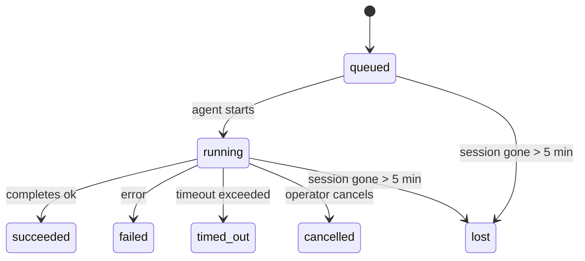

---
read_when:
    - Sprawdzanie prac w tle będących w toku lub niedawno ukończonych
    - Debugowanie niepowodzeń dostarczania w odłączonych uruchomieniach agenta
    - Zrozumienie relacji między uruchomieniami w tle, sesjami, Cron i Heartbeat
sidebarTitle: Background tasks
summary: Śledzenie zadań w tle dla uruchomień ACP, podagentów, izolowanych zadań Cron i operacji CLI
title: Zadania w tle
x-i18n:
    generated_at: "2026-05-05T01:44:33Z"
    model: gpt-5.5
    provider: openai
    source_hash: 60d6ea6178535b19b95d761b8e8b05a665234584ae69852fd21097988aa32991
    source_path: automation/tasks.md
    workflow: 16
---

<Note>
Szukasz harmonogramowania? Zobacz [Automatyzacja i zadania](/pl/automation), aby wybrać właściwy mechanizm. Ta strona jest rejestrem aktywności prac w tle, a nie harmonogramem.
</Note>

Zadania w tle śledzą pracę wykonywaną **poza główną sesją konwersacji**: uruchomienia ACP, tworzenie subagentów, izolowane wykonania zadań Cron oraz operacje inicjowane przez CLI.

Zadania **nie** zastępują sesji, zadań Cron ani Heartbeat — są **rejestrem aktywności**, który zapisuje, jaka odłączona praca została wykonana, kiedy i czy zakończyła się powodzeniem.

<Note>
Nie każde uruchomienie agenta tworzy zadanie. Tury Heartbeat i zwykły czat interaktywny tego nie robią. Wszystkie wykonania Cron, uruchomienia ACP, uruchomienia subagentów oraz polecenia agenta z CLI tworzą zadania.
</Note>

## TL;DR

- Zadania to **rekordy**, nie harmonogramy — Cron i Heartbeat decydują, _kiedy_ praca jest uruchamiana, a zadania śledzą, _co się wydarzyło_.
- ACP, subagenci, wszystkie zadania Cron oraz operacje CLI tworzą zadania. Tury Heartbeat tego nie robią.
- Każde zadanie przechodzi przez `queued → running → terminal` (succeeded, failed, timed_out, cancelled lub lost).
- Zadania Cron pozostają aktywne, dopóki środowisko uruchomieniowe Cron nadal jest właścicielem zadania; jeśli
  stan środowiska uruchomieniowego w pamięci zniknął, konserwacja zadań najpierw sprawdza trwałą historię
  uruchomień Cron, zanim oznaczy zadanie jako utracone.
- Ukończenie jest sterowane wypychaniem: odłączona praca może powiadomić bezpośrednio albo wybudzić
  sesję żądającą/Heartbeat po zakończeniu, więc pętle odpytywania statusu są
  zwykle niewłaściwym modelem.
- Izolowane uruchomienia Cron i ukończenia subagentów dokładają wszelkich starań, aby wyczyścić śledzone karty/procesy przeglądarki dla sesji podrzędnej przed końcowym księgowaniem czyszczenia.
- Izolowane dostarczanie Cron tłumi nieaktualne tymczasowe odpowiedzi nadrzędne, gdy praca potomnego subagenta nadal się kończy, i preferuje końcowe wyjście potomne, jeśli dotrze ono przed dostarczeniem.
- Powiadomienia o ukończeniu są dostarczane bezpośrednio do kanału albo kolejkowane do następnego Heartbeat.
- `openclaw tasks list` pokazuje wszystkie zadania; `openclaw tasks audit` ujawnia problemy.
- Rekordy terminalne są przechowywane przez 7 dni, a następnie automatycznie usuwane.

## Szybki start

<Tabs>
  <Tab title="List and filter">
    ```bash
    # List all tasks (newest first)
    openclaw tasks list

    # Filter by runtime or status
    openclaw tasks list --runtime acp
    openclaw tasks list --status running
    ```

  </Tab>
  <Tab title="Inspect">
    ```bash
    # Show details for a specific task (by ID, run ID, or session key)
    openclaw tasks show <lookup>
    ```
  </Tab>
  <Tab title="Cancel and notify">
    ```bash
    # Cancel a running task (kills the child session)
    openclaw tasks cancel <lookup>

    # Change notification policy for a task
    openclaw tasks notify <lookup> state_changes
    ```

  </Tab>
  <Tab title="Audit and maintenance">
    ```bash
    # Run a health audit
    openclaw tasks audit

    # Preview or apply maintenance
    openclaw tasks maintenance
    openclaw tasks maintenance --apply
    ```

  </Tab>
  <Tab title="Task flow">
    ```bash
    # Inspect TaskFlow state
    openclaw tasks flow list
    openclaw tasks flow show <lookup>
    openclaw tasks flow cancel <lookup>
    ```
  </Tab>
</Tabs>

## Co tworzy zadanie

| Źródło                 | Typ środowiska uruchomieniowego | Kiedy tworzony jest rekord zadania                       | Domyślna polityka powiadomień |
| ---------------------- | ------------ | ------------------------------------------------------ | --------------------- |
| Uruchomienia ACP w tle    | `acp`        | Tworzenie podrzędnej sesji ACP                           | `done_only`           |
| Orkiestracja subagentów | `subagent`   | Tworzenie subagenta przez `sessions_spawn`               | `done_only`           |
| Zadania Cron (wszystkie typy)  | `cron`       | Każde wykonanie Cron (w sesji głównej i izolowane)       | `silent`              |
| Operacje CLI         | `cli`        | Polecenia `openclaw agent` uruchamiane przez Gateway | `silent`              |
| Zadania multimedialne agenta       | `cli`        | Uruchomienia `music_generate`/`video_generate` wspierane sesją  | `silent`              |

<AccordionGroup>
  <Accordion title="Notify defaults for cron and media">
    Zadania Cron w sesji głównej domyślnie używają polityki powiadomień `silent` — tworzą rekordy do śledzenia, ale nie generują powiadomień. Izolowane zadania Cron również domyślnie używają `silent`, ale są bardziej widoczne, ponieważ działają we własnej sesji.

    Uruchomienia `music_generate` i `video_generate` wspierane sesją również używają polityki powiadomień `silent`. Nadal tworzą rekordy zadań, ale ukończenie jest przekazywane z powrotem do pierwotnej sesji agenta jako wewnętrzne wybudzenie, dzięki czemu agent może sam napisać wiadomość uzupełniającą i dołączyć gotowe multimedia. Ukończenia w grupie/kanale stosują normalną politykę widocznej odpowiedzi, więc agent używa narzędzia wiadomości, gdy wymaga tego źródłowe dostarczenie.

  </Accordion>
  <Accordion title="Concurrent video_generate guardrail">
    Gdy zadanie `video_generate` wspierane sesją nadal jest aktywne, narzędzie działa także jako zabezpieczenie: powtarzane wywołania `video_generate` w tej samej sesji zwracają status aktywnego zadania zamiast uruchamiać drugie równoległe generowanie. Użyj `action: "status"`, gdy chcesz uzyskać jawne sprawdzenie postępu/statusu po stronie agenta.
  </Accordion>
  <Accordion title="What does not create tasks">
    - Tury Heartbeat — sesja główna; zobacz [Heartbeat](/pl/gateway/heartbeat)
    - Zwykłe interaktywne tury czatu
    - Bezpośrednie odpowiedzi `/command`

  </Accordion>
</AccordionGroup>

## Cykl życia zadania



| Status      | Co to oznacza                                                              |
| ----------- | -------------------------------------------------------------------------- |
| `queued`    | Utworzone, oczekuje na uruchomienie agenta                                    |
| `running`   | Tura agenta jest aktywnie wykonywana                                           |
| `succeeded` | Zakończone powodzeniem                                                     |
| `failed`    | Zakończone błędem                                                    |
| `timed_out` | Przekroczono skonfigurowany limit czasu                                            |
| `cancelled` | Zatrzymane przez operatora za pomocą `openclaw tasks cancel`                        |
| `lost`      | Środowisko uruchomieniowe utraciło autorytatywny stan bazowy po 5-minutowym okresie karencji |

Przejścia zachodzą automatycznie — gdy powiązane uruchomienie agenta się kończy, status zadania jest aktualizowany tak, aby do niego pasował.

Ukończenie uruchomienia agenta jest autorytatywne dla aktywnych rekordów zadań. Pomyślne odłączone uruchomienie finalizuje się jako `succeeded`, zwykłe błędy uruchomienia finalizują się jako `failed`, a wyniki przekroczenia czasu lub przerwania finalizują się jako `timed_out`. Jeśli operator już anulował zadanie albo środowisko uruchomieniowe już zarejestrowało silniejszy stan terminalny, taki jak `failed`, `timed_out` lub `lost`, późniejszy sygnał powodzenia nie obniża tego statusu terminalnego.

`lost` uwzględnia środowisko uruchomieniowe:

- Zadania ACP: metadane bazowej podrzędnej sesji ACP zniknęły.
- Zadania subagentów: bazowa sesja podrzędna zniknęła z magazynu agenta docelowego.
- Zadania Cron: środowisko uruchomieniowe Cron nie śledzi już zadania jako aktywnego, a trwała
  historia uruchomień Cron nie pokazuje wyniku terminalnego dla tego uruchomienia. Audyt CLI
  offline nie traktuje własnego pustego stanu Cron w procesie jako autorytatywnego.
- Zadania CLI: izolowane zadania sesji podrzędnej używają sesji podrzędnej; zadania CLI
  wspierane czatem używają zamiast tego aktywnego kontekstu uruchomienia, więc zalegające
  wiersze sesji kanału/grupy/bezpośredniej nie utrzymują ich przy życiu. Uruchomienia
  `openclaw agent` wspierane przez Gateway również finalizują się na podstawie wyniku uruchomienia, więc zakończone uruchomienia
  nie pozostają aktywne, dopóki proces sprzątający nie oznaczy ich jako `lost`.

## Dostarczanie i powiadomienia

Gdy zadanie osiąga stan terminalny, OpenClaw powiadamia Cię. Istnieją dwie ścieżki dostarczania:

**Dostarczanie bezpośrednie** — jeśli zadanie ma docelowy kanał (`requesterOrigin`), wiadomość o ukończeniu trafia bezpośrednio do tego kanału (Telegram, Discord, Slack itd.). W przypadku ukończeń subagentów OpenClaw zachowuje także powiązane trasowanie wątku/tematu, gdy jest dostępne, i może uzupełnić brakujące `to` / konto z zapisanej trasy sesji żądającej (`lastChannel` / `lastTo` / `lastAccountId`), zanim zrezygnuje z dostarczania bezpośredniego.

**Dostarczanie kolejkowane w sesji** — jeśli dostarczanie bezpośrednie się nie powiedzie albo nie ustawiono źródła, aktualizacja jest kolejkowana jako zdarzenie systemowe w sesji żądającej i pojawia się przy następnym Heartbeat.

<Tip>
Ukończenie zadania wyzwala natychmiastowe wybudzenie Heartbeat, więc szybko widzisz wynik — nie musisz czekać na następny zaplanowany takt Heartbeat.
</Tip>

Oznacza to, że zwykły przepływ pracy jest oparty na wypychaniu: uruchom odłączoną pracę raz, a następnie pozwól środowisku uruchomieniowemu wybudzić Cię lub powiadomić po ukończeniu. Odpytuj stan zadania tylko wtedy, gdy potrzebujesz debugowania, interwencji albo jawnego audytu.

### Polityki powiadomień

Kontroluj, ile informacji otrzymujesz o każdym zadaniu:

| Polityka                | Co jest dostarczane                                                       |
| --------------------- | ----------------------------------------------------------------------- |
| `done_only` (domyślna) | Tylko stan terminalny (succeeded, failed itd.) — **to jest ustawienie domyślne** |
| `state_changes`       | Każde przejście stanu i aktualizacja postępu                              |
| `silent`              | Nic                                                          |

Zmień politykę, gdy zadanie jest uruchomione:

```bash
openclaw tasks notify <lookup> state_changes
```

## Dokumentacja CLI

<AccordionGroup>
  <Accordion title="tasks list">
    ```bash
    openclaw tasks list [--runtime <acp|subagent|cron|cli>] [--status <status>] [--json]
    ```

    Kolumny wyjściowe: ID zadania, rodzaj, status, dostarczanie, ID uruchomienia, sesja podrzędna, podsumowanie.

  </Accordion>
  <Accordion title="tasks show">
    ```bash
    openclaw tasks show <lookup>
    ```

    Token wyszukiwania przyjmuje ID zadania, ID uruchomienia albo klucz sesji. Pokazuje pełny rekord, w tym czasy, stan dostarczania, błąd i podsumowanie terminalne.

  </Accordion>
  <Accordion title="tasks cancel">
    ```bash
    openclaw tasks cancel <lookup>
    ```

    W przypadku zadań ACP i subagentów powoduje to zakończenie sesji podrzędnej. W przypadku zadań śledzonych przez CLI anulowanie jest zapisywane w rejestrze zadań (nie ma osobnego uchwytu podrzędnego środowiska uruchomieniowego). Status przechodzi do `cancelled`, a powiadomienie o dostarczeniu jest wysyłane, gdy ma zastosowanie.

  </Accordion>
  <Accordion title="tasks notify">
    ```bash
    openclaw tasks notify <lookup> <done_only|state_changes|silent>
    ```
  </Accordion>
  <Accordion title="tasks audit">
    ```bash
    openclaw tasks audit [--json]
    ```

    Ujawnia problemy operacyjne. Ustalenia pojawiają się także w `openclaw status`, gdy wykryto problemy.

    | Ustalenie                 | Ważność    | Wyzwalacz                                                                                                      |
    | ------------------------- | ---------- | -------------------------------------------------------------------------------------------------------------- |
    | `stale_queued`            | warn       | W kolejce od ponad 10 minut                                                                                    |
    | `stale_running`           | error      | Działa od ponad 30 minut                                                                                       |
    | `lost`                    | warn/error | Własność zadania wsparta runtime zniknęła; zachowane utracone zadania ostrzegają do `cleanupAfter`, potem stają się błędami |
    | `delivery_failed`         | warn       | Dostarczenie nie powiodło się, a polityka powiadamiania nie jest `silent`                                      |
    | `missing_cleanup`         | warn       | Zadanie terminalne bez znacznika czasu czyszczenia                                                             |
    | `inconsistent_timestamps` | warn       | Naruszenie osi czasu (na przykład zakończono przed rozpoczęciem)                                               |

  </Accordion>
  <Accordion title="konserwacja zadań">
    ```bash
    openclaw tasks maintenance [--json]
    openclaw tasks maintenance --apply [--json]
    ```

    Użyj tego, aby podejrzeć lub zastosować uzgadnianie, oznaczanie czyszczenia oraz przycinanie zadań i stanu Task Flow.

    Uzgadnianie jest świadome runtime:

    - Zadania ACP/subagenta sprawdzają swoją bazową sesję podrzędną.
    - Zadania subagenta, których sesja podrzędna ma nagrobek odzyskiwania po restarcie, są oznaczane jako utracone zamiast traktowania ich jako możliwych do odzyskania sesji bazowych.
    - Zadania Cron sprawdzają, czy runtime cron nadal jest właścicielem zadania, a następnie odzyskują status terminalny z utrwalonych dzienników uruchomień cron/stanu zadania przed przejściem awaryjnym do `lost`. Tylko proces Gateway jest autorytatywny dla przechowywanego w pamięci zestawu aktywnych zadań cron; audyt CLI offline używa trwałej historii, ale nie oznacza zadania cron jako utraconego wyłącznie dlatego, że ten lokalny Set jest pusty.
    - Zadania CLI wsparte czatem sprawdzają właścicielski kontekst uruchomienia na żywo, a nie tylko wiersz sesji czatu.

    Czyszczenie po zakończeniu również jest świadome runtime:

    - Zakończenie subagenta w trybie best-effort zamyka śledzone karty/procesy przeglądarki dla sesji podrzędnej, zanim czyszczenie ogłoszenia będzie kontynuowane.
    - Zakończenie izolowanego cron w trybie best-effort zamyka śledzone karty/procesy przeglądarki dla sesji cron, zanim uruchomienie zostanie w pełni zakończone.
    - Dostarczenie izolowanego cron w razie potrzeby oczekuje na dalsze działania potomnego subagenta i tłumi nieaktualny tekst potwierdzenia rodzica zamiast go ogłaszać.
    - Dostarczenie zakończenia subagenta preferuje najnowszy widoczny tekst asystenta; jeśli jest pusty, przechodzi awaryjnie do oczyszczonego najnowszego tekstu tool/toolResult, a uruchomienia wywołań narzędzi zakończone wyłącznie limitem czasu mogą zostać zwinięte do krótkiego podsumowania częściowego postępu. Terminalne nieudane uruchomienia ogłaszają status niepowodzenia bez ponownego odtwarzania przechwyconego tekstu odpowiedzi.
    - Niepowodzenia czyszczenia nie maskują rzeczywistego wyniku zadania.

  </Accordion>
  <Accordion title="lista | pokazanie | anulowanie przepływu zadań">
    ```bash
    openclaw tasks flow list [--status <status>] [--json]
    openclaw tasks flow show <lookup> [--json]
    openclaw tasks flow cancel <lookup>
    ```

    Użyj ich, gdy interesuje Cię koordynujący Task Flow, a nie pojedynczy rekord zadania w tle.

  </Accordion>
</AccordionGroup>

## Tablica zadań czatu (`/tasks`)

Użyj `/tasks` w dowolnej sesji czatu, aby zobaczyć zadania w tle powiązane z tą sesją. Tablica pokazuje aktywne i niedawno zakończone zadania wraz z runtime, statusem, czasem oraz szczegółami postępu lub błędu.

Gdy bieżąca sesja nie ma widocznych powiązanych zadań, `/tasks` przechodzi awaryjnie do liczników zadań lokalnych dla agenta, więc nadal otrzymujesz przegląd bez ujawniania szczegółów innych sesji.

Aby zobaczyć pełny rejestr operatora, użyj CLI: `openclaw tasks list`.

## Integracja statusu (obciążenie zadaniami)

`openclaw status` zawiera skrócone podsumowanie zadań:

```
Tasks: 3 queued · 2 running · 1 issues
```

Podsumowanie raportuje:

- **active** — liczba `queued` + `running`
- **failures** — liczba `failed` + `timed_out` + `lost`
- **byRuntime** — podział według `acp`, `subagent`, `cron`, `cli`

Zarówno `/status`, jak i narzędzie `session_status` używają migawki zadań świadomej czyszczenia: preferowane są zadania aktywne, nieaktualne zakończone wiersze są ukrywane, a niedawne niepowodzenia pojawiają się tylko wtedy, gdy nie pozostała żadna aktywna praca. Dzięki temu karta statusu skupia się na tym, co ma znaczenie teraz.

## Przechowywanie i konserwacja

### Gdzie znajdują się zadania

Rekordy zadań są utrwalane w SQLite pod adresem:

```
$OPENCLAW_STATE_DIR/tasks/runs.sqlite
```

Rejestr ładuje się do pamięci przy starcie Gateway i synchronizuje zapisy do SQLite, aby zapewnić trwałość między restartami.
Gateway utrzymuje dziennik write-ahead SQLite w ograniczonym rozmiarze, używając domyślnego progu autocheckpoint SQLite oraz okresowych i zamykających punktów kontrolnych `TRUNCATE`.

### Automatyczna konserwacja

Sweeper działa co **60 sekund** i obsługuje cztery rzeczy:

<Steps>
  <Step title="Uzgadnianie">
    Sprawdza, czy aktywne zadania nadal mają autorytatywne wsparcie runtime. Zadania ACP/subagenta używają stanu sesji podrzędnej, zadania cron używają własności aktywnego zadania, a zadania CLI wsparte czatem używają właścicielskiego kontekstu uruchomienia. Jeśli ten stan bazowy zniknie na ponad 5 minut, zadanie zostaje oznaczone jako `lost`.
  </Step>
  <Step title="Naprawa sesji ACP">
    Zamyka terminalne lub osierocone jednorazowe sesje ACP należące do rodzica oraz zamyka nieaktualne terminalne lub osierocone trwałe sesje ACP tylko wtedy, gdy nie pozostało żadne aktywne powiązanie konwersacji.
  </Step>
  <Step title="Oznaczanie czyszczenia">
    Ustawia znacznik czasu `cleanupAfter` na zadaniach terminalnych (endedAt + 7 dni). W okresie retencji utracone zadania nadal pojawiają się w audycie jako ostrzeżenia; po wygaśnięciu `cleanupAfter` albo gdy brakuje metadanych czyszczenia, są błędami.
  </Step>
  <Step title="Przycinanie">
    Usuwa rekordy po ich dacie `cleanupAfter`.
  </Step>
</Steps>

<Note>
**Retencja:** rekordy zadań terminalnych są przechowywane przez **7 dni**, a następnie automatycznie przycinane. Konfiguracja nie jest potrzebna.
</Note>

## Jak zadania wiążą się z innymi systemami

<AccordionGroup>
  <Accordion title="Zadania i Task Flow">
    [Task Flow](/pl/automation/taskflow) to warstwa koordynacji przepływów nad zadaniami w tle. Pojedynczy przepływ może koordynować wiele zadań w trakcie swojego istnienia, używając zarządzanych lub lustrzanych trybów synchronizacji. Użyj `openclaw tasks`, aby sprawdzić pojedyncze rekordy zadań, oraz `openclaw tasks flow`, aby sprawdzić koordynujący przepływ.

    Szczegóły znajdziesz w [Task Flow](/pl/automation/taskflow).

  </Accordion>
  <Accordion title="Zadania i cron">
    **Definicja** zadania cron znajduje się w `~/.openclaw/cron/jobs.json`; stan wykonania runtime znajduje się obok niej w `~/.openclaw/cron/jobs-state.json`. **Każde** wykonanie cron tworzy rekord zadania — zarówno w sesji głównej, jak i izolowane. Zadania cron w sesji głównej domyślnie używają polityki powiadamiania `silent`, więc są śledzone bez generowania powiadomień.

    Zobacz [Zadania Cron](/pl/automation/cron-jobs).

  </Accordion>
  <Accordion title="Zadania i Heartbeat">
    Uruchomienia Heartbeat są turami sesji głównej — nie tworzą rekordów zadań. Gdy zadanie się zakończy, może wyzwolić wybudzenie Heartbeat, aby wynik był widoczny szybko.

    Zobacz [Heartbeat](/pl/gateway/heartbeat).

  </Accordion>
  <Accordion title="Zadania i sesje">
    Zadanie może odwoływać się do `childSessionKey` (gdzie działa praca) i `requesterSessionKey` (kto ją rozpoczął). Sesje są kontekstem konwersacji; zadania są śledzeniem aktywności nad nim.
  </Accordion>
  <Accordion title="Zadania i uruchomienia agentów">
    `runId` zadania łączy je z uruchomieniem agenta wykonującym pracę. Zdarzenia cyklu życia agenta (start, koniec, błąd) automatycznie aktualizują status zadania — nie musisz zarządzać cyklem życia ręcznie.
  </Accordion>
</AccordionGroup>

## Powiązane

- [Automatyzacja i zadania](/pl/automation) — wszystkie mechanizmy automatyzacji w skrócie
- [CLI: Zadania](/pl/cli/tasks) — dokumentacja poleceń CLI
- [Heartbeat](/pl/gateway/heartbeat) — okresowe tury sesji głównej
- [Zaplanowane zadania](/pl/automation/cron-jobs) — planowanie pracy w tle
- [Task Flow](/pl/automation/taskflow) — koordynacja przepływów nad zadaniami
