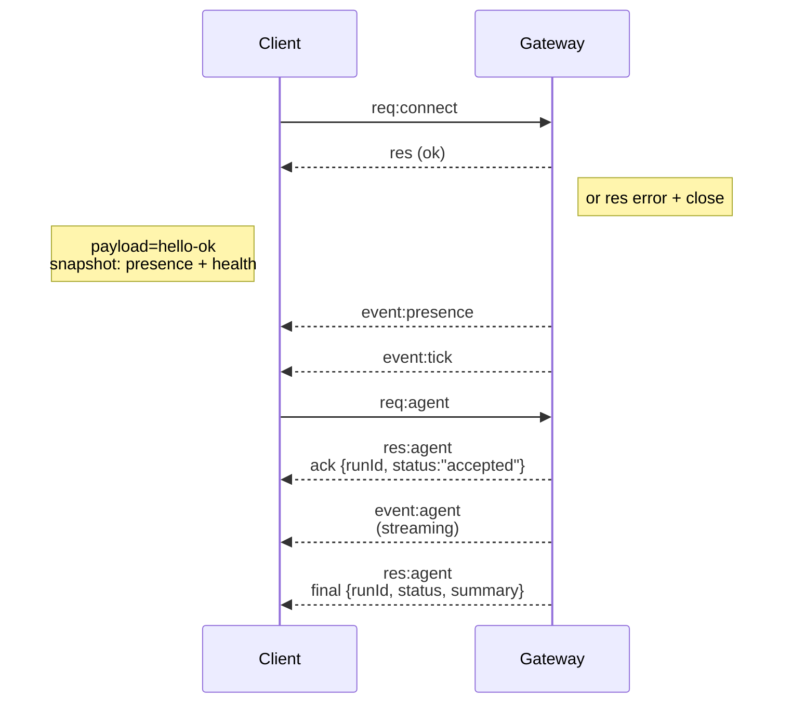

---
read_when:
    - Praca nad protokołem Gateway, klientami lub transportami
summary: Architektura Gateway WebSocket, komponenty i przepływy klientów
title: Architektura Gateway
x-i18n:
    generated_at: "2026-05-06T09:06:46Z"
    model: gpt-5.5
    provider: openai
    source_hash: 433489081bfe07691b211f5076ec45ce0ed3fd043eb86128f73121f2cab71cd3
    source_path: concepts/architecture.md
    workflow: 16
---

## Omówienie

- Jeden długotrwały **Gateway** obsługuje wszystkie powierzchnie komunikacji (WhatsApp przez
  Baileys, Telegram przez grammY, Slack, Discord, Signal, iMessage, WebChat).
- Klienci płaszczyzny sterowania (aplikacja macOS, CLI, web UI, automatyzacje) łączą się z
  Gateway przez **WebSocket** na skonfigurowanym hoście nasłuchu (domyślnie
  `127.0.0.1:18789`).
- **Node'y** (macOS/iOS/Android/headless) również łączą się przez **WebSocket**, ale
  deklarują `role: node` z jawnymi uprawnieniami caps/poleceniami.
- Jeden Gateway na host; jest to jedyne miejsce, które otwiera sesję WhatsApp.
- **Host kanwy** jest udostępniany przez serwer HTTP Gateway pod:
  - `/__openclaw__/canvas/` (edytowalny przez agenta HTML/CSS/JS)
  - `/__openclaw__/a2ui/` (host A2UI)
    Używa tego samego portu co Gateway (domyślnie `18789`).

## Komponenty i przepływy

### Gateway (daemon)

- Utrzymuje połączenia providerów.
- Udostępnia typowane API WS (żądania, odpowiedzi, zdarzenia server-push).
- Waliduje przychodzące ramki względem JSON Schema.
- Emituje zdarzenia takie jak `agent`, `chat`, `presence`, `health`, `heartbeat`, `cron`.

### Klienci (aplikacja Mac / CLI / panel web admin)

- Jedno połączenie WS na klienta.
- Wysyłają żądania (`health`, `status`, `send`, `agent`, `system-presence`).
- Subskrybują zdarzenia (`tick`, `agent`, `presence`, `shutdown`).

### Node'y (macOS / iOS / Android / headless)

- Łączą się z **tym samym serwerem WS** z `role: node`.
- Podają tożsamość urządzenia w `connect`; parowanie jest **oparte na urządzeniu** (rola `node`), a
  zatwierdzenie znajduje się w magazynie parowania urządzeń.
- Udostępniają polecenia takie jak `canvas.*`, `camera.*`, `screen.record`, `location.get`.

Szczegóły protokołu:

- [Protokół Gateway](/pl/gateway/protocol)

### WebChat

- Statyczny interfejs UI, który używa API WS Gateway do historii czatu i wysyłania.
- W konfiguracjach zdalnych łączy się przez ten sam tunel SSH/Tailscale co inni
  klienci.

## Cykl życia połączenia (pojedynczy klient)



## Protokół przewodowy (podsumowanie)

- Transport: WebSocket, ramki tekstowe z ładunkami JSON.
- Pierwsza ramka **musi** być `connect`.
- Po handshaku:
  - Żądania: `{type:"req", id, method, params}` → `{type:"res", id, ok, payload|error}`
  - Zdarzenia: `{type:"event", event, payload, seq?, stateVersion?}`
- `hello-ok.features.methods` / `events` to metadane wykrywania, a nie
  wygenerowany zrzut każdej wywoływalnej ścieżki helpera.
- Uwierzytelnianie shared-secret używa `connect.params.auth.token` albo
  `connect.params.auth.password`, zależnie od skonfigurowanego trybu uwierzytelniania Gateway.
- Tryby przenoszące tożsamość, takie jak Tailscale Serve
  (`gateway.auth.allowTailscale: true`) lub spoza local loopback
  `gateway.auth.mode: "trusted-proxy"`, spełniają uwierzytelnianie z nagłówków żądania
  zamiast `connect.params.auth.*`.
- Prywatne wejście `gateway.auth.mode: "none"` całkowicie wyłącza uwierzytelnianie
  shared-secret; nie używaj tego trybu na publicznym/niezaufanym wejściu.
- Klucze idempotencji są wymagane dla metod wywołujących skutki uboczne (`send`, `agent`), aby
  można było bezpiecznie ponawiać próby; serwer utrzymuje krótkotrwałą pamięć podręczną deduplikacji.
- Node'y muszą zawierać `role: "node"` oraz caps/polecenia/uprawnienia w `connect`.

## Parowanie + zaufanie lokalne

- Wszyscy klienci WS (operatorzy + Node'y) dołączają **tożsamość urządzenia** w `connect`.
- Nowe identyfikatory urządzeń wymagają zatwierdzenia parowania; Gateway wydaje **token urządzenia**
  dla kolejnych połączeń.
- Bezpośrednie połączenia local loopback mogą być automatycznie zatwierdzane, aby utrzymać płynne UX
  na tym samym hoście.
- OpenClaw ma także wąską ścieżkę samopołączenia lokalną dla backendu/kontenera dla
  zaufanych przepływów helperów shared-secret.
- Połączenia tailnet i LAN, w tym wiązania tailnet na tym samym hoście, nadal wymagają
  jawnego zatwierdzenia parowania.
- Wszystkie połączenia muszą podpisywać nonce `connect.challenge`.
- Ładunek podpisu `v3` wiąże też `platform` + `deviceFamily`; gateway
  przypina sparowane metadane przy ponownym połączeniu i wymaga parowania naprawczego przy zmianach
  metadanych.
- Połączenia **nielokalne** nadal wymagają jawnego zatwierdzenia.
- Uwierzytelnianie Gateway (`gateway.auth.*`) nadal dotyczy **wszystkich** połączeń, lokalnych i
  zdalnych.

Szczegóły: [Protokół Gateway](/pl/gateway/protocol), [Parowanie](/pl/channels/pairing),
[Bezpieczeństwo](/pl/gateway/security).

## Typowanie protokołu i generowanie kodu

- Schematy TypeBox definiują protokół.
- JSON Schema jest generowany z tych schematów.
- Modele Swift są generowane z JSON Schema.

## Dostęp zdalny

- Preferowane: Tailscale lub VPN.
- Alternatywa: tunel SSH

  ```bash
  ssh -N -L 18789:127.0.0.1:18789 user@host
  ```

- Ten sam handshake + token uwierzytelniania obowiązują przez tunel.
- TLS + opcjonalne pinning można włączyć dla WS w konfiguracjach zdalnych.

## Migawka operacyjna

- Uruchomienie: `openclaw gateway` (pierwszy plan, logi na stdout).
- Kondycja: `health` przez WS (uwzględnione też w `hello-ok`).
- Nadzór: launchd/systemd do automatycznego restartu.

## Inwarianty

- Dokładnie jeden Gateway kontroluje pojedynczą sesję Baileys na host.
- Handshake jest obowiązkowy; każda pierwsza ramka niebędąca JSON ani connect powoduje twarde zamknięcie.
- Zdarzenia nie są odtwarzane; klienci muszą odświeżać przy lukach.

## Powiązane

- [Pętla agenta](/pl/concepts/agent-loop) — szczegółowy cykl wykonywania agenta
- [Protokół Gateway](/pl/gateway/protocol) — kontrakt protokołu WebSocket
- [Kolejka](/pl/concepts/queue) — kolejka poleceń i współbieżność
- [Bezpieczeństwo](/pl/gateway/security) — model zaufania i wzmacnianie zabezpieczeń
