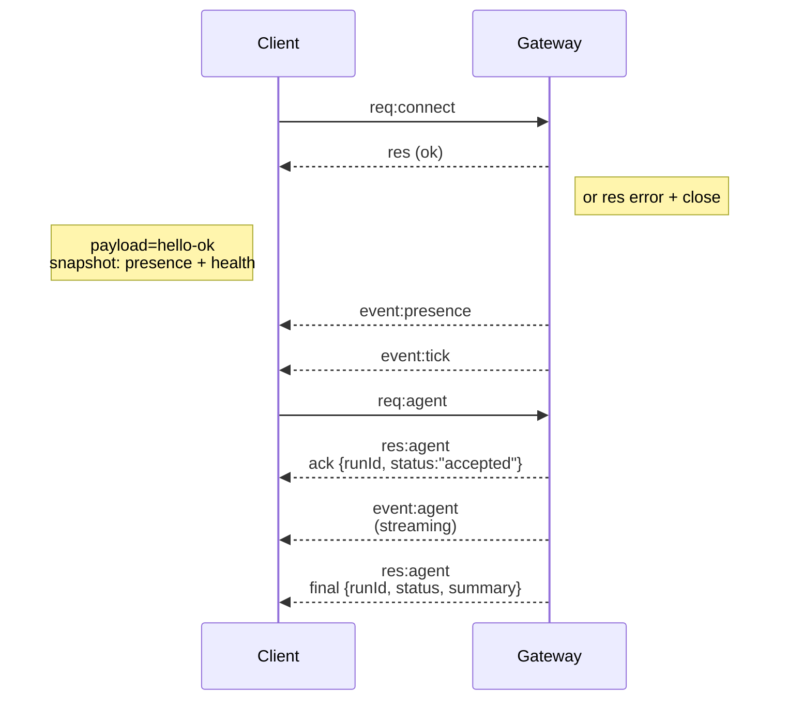

---
read_when:
    - Praca nad protokołem Gateway, klientami lub transportami
summary: Architektura Gateway WebSocket, komponenty i przepływy klientów
title: Architektura Gateway
x-i18n:
    generated_at: "2026-07-12T14:57:25Z"
    model: gpt-5.6
    postprocess_version: locale-links-v1
    provider: openai
    source_hash: f8054bd87f738b957c24f8d6965d55365de2293d44902530a9ba778afa597cc7
    source_path: concepts/architecture.md
    workflow: 16
---

## Przegląd

- Jeden długotrwale działający **Gateway** obsługuje wszystkie kanały komunikacji (WhatsApp przez
  Baileys, Telegram przez grammY, Slack, Discord, Signal, iMessage, WebChat).
- Klienci warstwy sterowania (aplikacja macOS, CLI, interfejs WWW, automatyzacje) łączą się z
  Gateway przez **WebSocket** na skonfigurowanym hoście nasłuchu (domyślnie
  `127.0.0.1:18789`).
- **Węzły** (macOS/iOS/Android/bez interfejsu) również łączą się przez **WebSocket**, ale
  deklarują `role: node` wraz z jawnymi możliwościami i poleceniami.
- Jeden Gateway na host; tylko on otwiera sesję WhatsApp.
- **Host obszaru roboczego** jest udostępniany przez serwer HTTP Gateway pod adresami:
  - `/__openclaw__/canvas/` (HTML/CSS/JS edytowalne przez agenta)
  - `/__openclaw__/a2ui/` (host A2UI)

  Używa tego samego portu co Gateway (domyślnie `18789`).

## Komponenty i przepływy

### Gateway (demon)

- Utrzymuje połączenia z dostawcami.
- Udostępnia typowane API WS (żądania, odpowiedzi, zdarzenia wypychane przez serwer).
- Sprawdza przychodzące ramki względem schematu JSON.
- Emituje zdarzenia takie jak `agent`, `chat`, `presence`, `health`, `heartbeat`, `cron`.

### Klienci (aplikacja na Maca / CLI / panel administracyjny WWW)

- Jedno połączenie WS na klienta.
- Wysyłają żądania (`health`, `status`, `send`, `agent`, `system-presence`).
- Subskrybują zdarzenia (`tick`, `agent`, `presence`, `shutdown`).

### Węzły (macOS / iOS / Android / bez interfejsu)

- Łączą się z **tym samym serwerem WS** z ustawieniem `role: node`.
- Przekazują tożsamość urządzenia w `connect`; parowanie jest **oparte na urządzeniu** (rola `node`), a
  zatwierdzenie jest przechowywane w magazynie parowania urządzeń.
- Udostępniają polecenia takie jak `canvas.*`, `camera.*`, `screen.record`, `location.get`.

Szczegóły protokołu: [Protokół Gateway](/pl/gateway/protocol)

### WebChat

- Statyczny interfejs, który używa API WS Gateway do obsługi historii czatu i wysyłania wiadomości.
- W konfiguracjach zdalnych łączy się przez ten sam tunel SSH/Tailscale co pozostali
  klienci.

## Cykl życia połączenia (pojedynczy klient)



## Protokół komunikacyjny (podsumowanie)

- Transport: WebSocket, ramki tekstowe z ładunkami JSON.
- Pierwszą ramką **musi** być `connect`.
- Po uzgodnieniu połączenia:
  - Żądania: `{type:"req", id, method, params}` → `{type:"res", id, ok, payload|error}`
  - Zdarzenia: `{type:"event", event, payload, seq?, stateVersion?}`
- `hello-ok.features.methods` / `events` to metadane wykrywania, a nie
  wygenerowany zrzut każdej dostępnej pomocniczej trasy wywołań.
- Uwierzytelnianie współdzielonym sekretem używa `connect.params.auth.token` lub
  `connect.params.auth.password`, zależnie od skonfigurowanego trybu uwierzytelniania Gateway.
- Tryby zawierające tożsamość, takie jak Tailscale Serve
  (`gateway.auth.allowTailscale: true`) lub `gateway.auth.mode: "trusted-proxy"`
  poza local loopback, spełniają wymagania uwierzytelniania na podstawie nagłówków żądania
  zamiast `connect.params.auth.*`.
- Tryb prywatnego ruchu przychodzącego `gateway.auth.mode: "none"` całkowicie wyłącza
  uwierzytelnianie współdzielonym sekretem; nie używaj tego trybu dla publicznego lub niezaufanego ruchu przychodzącego.
- Klucze idempotencji są wymagane dla metod wywołujących skutki uboczne (`send`, `agent`), aby
  umożliwić bezpieczne ponawianie; serwer utrzymuje krótkotrwałą pamięć podręczną deduplikacji.
- Węzły muszą zawierać `role: "node"` oraz możliwości, polecenia i uprawnienia w `connect`.

## Parowanie i zaufanie lokalne

- Wszyscy klienci WS (operatorzy i węzły) dołączają **tożsamość urządzenia** do `connect`.
- Nowe identyfikatory urządzeń wymagają zatwierdzenia parowania; Gateway wydaje **token urządzenia**
  na potrzeby kolejnych połączeń.
- Bezpośrednie połączenia local loopback mogą być zatwierdzane automatycznie, aby zapewnić płynną
  obsługę na tym samym hoście.
- OpenClaw ma również ograniczoną ścieżkę samodzielnego połączenia lokalnego dla zaplecza/kontenera,
  przeznaczoną dla zaufanych przepływów pomocniczych korzystających ze współdzielonego sekretu.
- Połączenia z sieci tailnet i LAN, w tym powiązania tailnet na tym samym hoście, nadal wymagają
  jawnego zatwierdzenia parowania.
- Wszystkie połączenia muszą podpisywać wartość jednorazową `connect.challenge`. Ładunek podpisu `v3`
  wiąże również `platform` i `deviceFamily`; Gateway przypina sparowane metadane przy
  ponownym połączeniu i wymaga naprawczego parowania w przypadku zmian metadanych.
- Połączenia **nielokalne** nadal wymagają jawnego zatwierdzenia.
- Uwierzytelnianie Gateway (`gateway.auth.*`) nadal dotyczy **wszystkich** połączeń, lokalnych i
  zdalnych.

Szczegóły: [Protokół Gateway](/pl/gateway/protocol), [Parowanie](/pl/channels/pairing),
[Bezpieczeństwo](/pl/gateway/security).

## Typowanie protokołu i generowanie kodu

- Schematy TypeBox definiują protokół.
- Schemat JSON jest generowany na podstawie tych schematów.
- Modele Swift są generowane na podstawie schematu JSON.

## Dostęp zdalny

- Preferowane rozwiązanie: Tailscale lub VPN.
- Alternatywa: tunel SSH

  ```bash
  ssh -N -L 18789:127.0.0.1:18789 user@gateway-host
  ```

- W tunelu obowiązują to samo uzgadnianie połączenia i ten sam token uwierzytelniający.
- W konfiguracjach zdalnych dla WS można włączyć TLS i opcjonalne przypinanie certyfikatu.

## Podsumowanie operacyjne

- Uruchamianie: `openclaw gateway` (na pierwszym planie, dzienniki trafiają do standardowego wyjścia).
- Stan: `health` przez WS (również zawarty w `hello-ok`).
- Nadzór: launchd/systemd do automatycznego ponownego uruchamiania.

## Niezmienniki

- Dokładnie jeden Gateway kontroluje pojedynczą sesję Baileys na host.
- Uzgadnianie połączenia jest obowiązkowe; pierwsza ramka, która nie jest w formacie JSON ani nie zawiera `connect`, powoduje natychmiastowe zamknięcie połączenia.
- Zdarzenia nie są odtwarzane; w przypadku luk klienci muszą odświeżyć stan.

## Powiązane materiały

- [Pętla agenta](/pl/concepts/agent-loop) — szczegółowy cykl wykonywania agenta
- [Protokół Gateway](/pl/gateway/protocol) — kontrakt protokołu WebSocket
- [Kolejka](/pl/concepts/queue) — kolejka poleceń i współbieżność
- [Bezpieczeństwo](/pl/gateway/security) — model zaufania i wzmacnianie zabezpieczeń
