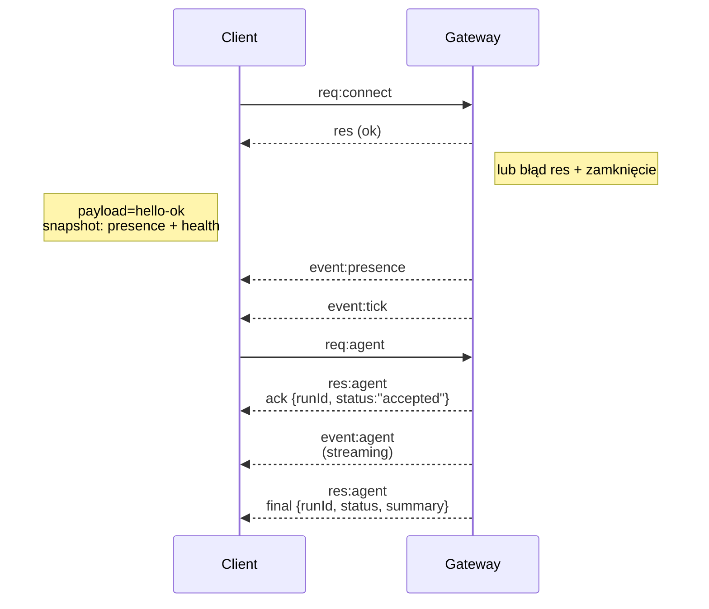

---
read_when:
    - Praca nad protokołem Gateway, klientami lub transportami
summary: Architektura bramy WebSocket, komponenty i przepływy klientów
title: Architektura Gateway
x-i18n:
    generated_at: "2026-04-05T13:50:16Z"
    model: gpt-5.4
    provider: openai
    source_hash: 2b12a2a29e94334c6d10787ac85c34b5b046f9a14f3dd53be453368ca4a7547d
    source_path: concepts/architecture.md
    workflow: 15
---

# Architektura Gateway

## Przegląd

- Pojedyncza długotrwale działająca **Gateway** zarządza wszystkimi powierzchniami komunikacyjnymi (WhatsApp przez
  Baileys, Telegram przez grammY, Slack, Discord, Signal, iMessage, WebChat).
- Klienci płaszczyzny sterowania (aplikacja macOS, CLI, interfejs webowy, automatyzacje) łączą się z
  Gateway przez **WebSocket** na skonfigurowanym hoście bindowania (domyślnie
  `127.0.0.1:18789`).
- **Nodes** (macOS/iOS/Android/headless) również łączą się przez **WebSocket**, ale
  deklarują `role: node` z jawnymi cap/commands.
- Jedna Gateway na host; to jedyne miejsce, które otwiera sesję WhatsApp.
- **canvas host** jest udostępniany przez serwer HTTP Gateway pod adresami:
  - `/__openclaw__/canvas/` (HTML/CSS/JS edytowalne przez agenta)
  - `/__openclaw__/a2ui/` (host A2UI)
    Używa tego samego portu co Gateway (domyślnie `18789`).

## Komponenty i przepływy

### Gateway (daemon)

- Utrzymuje połączenia z providerami.
- Udostępnia typowane API WS (żądania, odpowiedzi, zdarzenia push z serwera).
- Waliduje przychodzące ramki względem JSON Schema.
- Emituje zdarzenia takie jak `agent`, `chat`, `presence`, `health`, `heartbeat`, `cron`.

### Clients (aplikacja macOS / CLI / administrator webowy)

- Jedno połączenie WS na klienta.
- Wysyłają żądania (`health`, `status`, `send`, `agent`, `system-presence`).
- Subskrybują zdarzenia (`tick`, `agent`, `presence`, `shutdown`).

### Nodes (macOS / iOS / Android / headless)

- Łączą się z **tym samym serwerem WS** z `role: node`.
- Podają tożsamość urządzenia w `connect`; parowanie jest **oparte na urządzeniu** (rola `node`), a
  zatwierdzenie jest przechowywane w magazynie parowania urządzeń.
- Udostępniają polecenia takie jak `canvas.*`, `camera.*`, `screen.record`, `location.get`.

Szczegóły protokołu:

- [Protokół Gateway](/gateway/protocol)

### WebChat

- Statyczny interfejs, który używa API WS Gateway do historii czatu i wysyłania.
- W zdalnych konfiguracjach łączy się przez ten sam tunel SSH/Tailscale co inni
  klienci.

## Cykl życia połączenia (pojedynczy klient)



## Protokół przewodowy (podsumowanie)

- Transport: WebSocket, ramki tekstowe z ładunkiem JSON.
- Pierwsza ramka **musi** być `connect`.
- Po uzgodnieniu połączenia:
  - Żądania: `{type:"req", id, method, params}` → `{type:"res", id, ok, payload|error}`
  - Zdarzenia: `{type:"event", event, payload, seq?, stateVersion?}`
- `hello-ok.features.methods` / `events` to metadane wykrywania, a nie
  wygenerowany zrzut każdej wywoływalnej trasy pomocniczej.
- Uwierzytelnianie za pomocą współdzielonego sekretu używa `connect.params.auth.token` lub
  `connect.params.auth.password`, zależnie od skonfigurowanego trybu uwierzytelniania gateway.
- Tryby przenoszące tożsamość, takie jak Tailscale Serve
  (`gateway.auth.allowTailscale: true`) lub nie-loopback
  `gateway.auth.mode: "trusted-proxy"`, spełniają wymagania uwierzytelniania na podstawie nagłówków żądania
  zamiast `connect.params.auth.*`.
- Prywatny ingress `gateway.auth.mode: "none"` całkowicie wyłącza uwierzytelnianie współdzielonym sekretem;
  nie używaj tego trybu na publicznym/niezaufanym ingressie.
- Klucze idempotencji są wymagane dla metod wywołujących skutki uboczne (`send`, `agent`), aby można było
  bezpiecznie ponawiać próby; serwer utrzymuje krótkotrwałą pamięć podręczną deduplikacji.
- Nodes muszą zawierać `role: "node"` oraz caps/commands/permissions w `connect`.

## Parowanie + lokalne zaufanie

- Wszyscy klienci WS (operatorzy + nodes) uwzględniają **tożsamość urządzenia** w `connect`.
- Nowe identyfikatory urządzeń wymagają zatwierdzenia parowania; Gateway wydaje **token urządzenia**
  dla kolejnych połączeń.
- Bezpośrednie lokalne połączenia local loopback mogą być automatycznie zatwierdzane, aby zachować
  płynne działanie na tym samym hoście.
- OpenClaw ma też wąską ścieżkę samopołączenia backend/container-local dla
  zaufanych przepływów pomocniczych ze współdzielonym sekretem.
- Połączenia Tailnet i LAN, w tym bindowania tailnet na tym samym hoście, nadal wymagają
  jawnego zatwierdzenia parowania.
- Wszystkie połączenia muszą podpisywać nonce `connect.challenge`.
- Ładunek podpisu `v3` wiąże też `platform` + `deviceFamily`; gateway
  przypina sparowane metadane przy ponownym połączeniu i wymaga naprawczego parowania przy zmianach metadanych.
- Połączenia **nielokalne** nadal wymagają jawnego zatwierdzenia.
- Uwierzytelnianie Gateway (`gateway.auth.*`) nadal ma zastosowanie do **wszystkich** połączeń, lokalnych i
  zdalnych.

Szczegóły: [Protokół Gateway](/gateway/protocol), [Parowanie](/pl/channels/pairing),
[Bezpieczeństwo](/gateway/security).

## Typowanie protokołu i generowanie kodu

- Schematy TypeBox definiują protokół.
- JSON Schema jest generowany na podstawie tych schematów.
- Modele Swift są generowane z JSON Schema.

## Dostęp zdalny

- Preferowane: Tailscale lub VPN.
- Alternatywa: tunel SSH

  ```bash
  ssh -N -L 18789:127.0.0.1:18789 user@host
  ```

- Przez tunel obowiązuje to samo uzgadnianie połączenia i ten sam token uwierzytelniający.
- W konfiguracjach zdalnych można włączyć TLS + opcjonalne pinning dla WS.

## Migawka operacyjna

- Uruchamianie: `openclaw gateway` (na pierwszym planie, logi do stdout).
- Stan: `health` przez WS (również uwzględniane w `hello-ok`).
- Nadzór: launchd/systemd do automatycznego restartu.

## Niezmienniki

- Dokładnie jedna Gateway kontroluje pojedynczą sesję Baileys na hosta.
- Uzgodnienie połączenia jest obowiązkowe; każda pierwsza ramka, która nie jest JSON lub `connect`, powoduje bezwzględne zamknięcie.
- Zdarzenia nie są odtwarzane; klienci muszą odświeżyć stan przy lukach.

## Powiązane

- [Agent Loop](/concepts/agent-loop) — szczegółowy cykl wykonywania agenta
- [Gateway Protocol](/gateway/protocol) — kontrakt protokołu WebSocket
- [Queue](/concepts/queue) — kolejka poleceń i współbieżność
- [Security](/gateway/security) — model zaufania i utwardzanie
