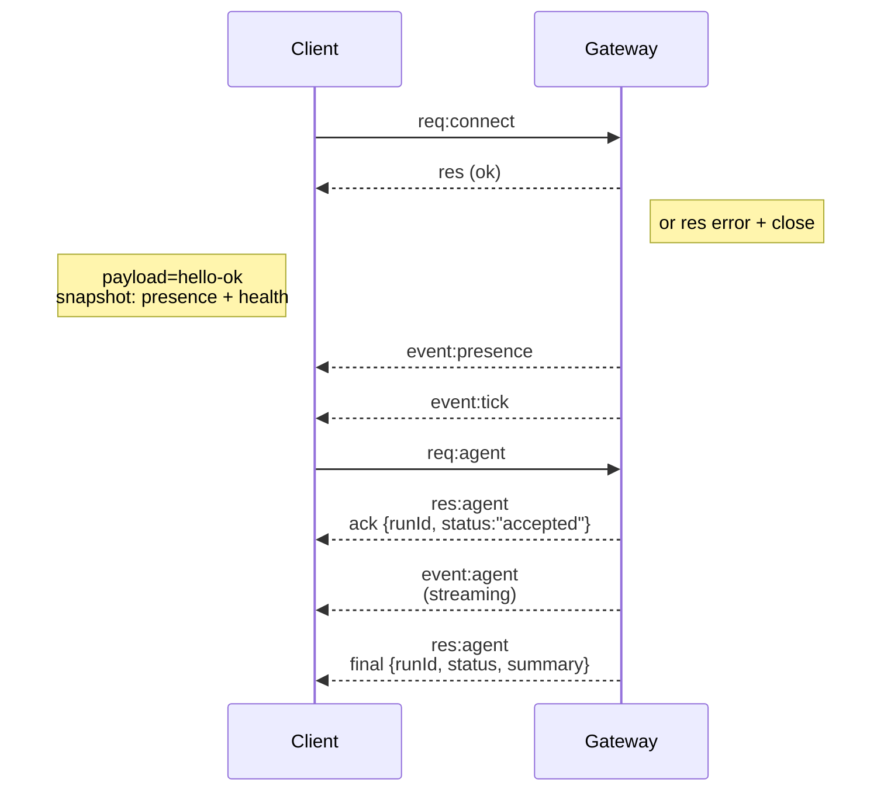

---
read_when:
    - Praca nad protokołem Gateway, klientami lub transportami
summary: Architektura bramki WebSocket, komponenty i przepływy klienta
title: Architektura Gateway
x-i18n:
    generated_at: "2026-04-24T09:05:01Z"
    model: gpt-5.4
    provider: openai
    source_hash: 91c553489da18b6ad83fc860014f5bfb758334e9789cb7893d4d00f81c650f02
    source_path: concepts/architecture.md
    workflow: 15
---

## Przegląd

- Jeden długotrwały **Gateway** zarządza wszystkimi powierzchniami komunikacyjnymi (WhatsApp przez
  Baileys, Telegram przez grammY, Slack, Discord, Signal, iMessage, WebChat).
- Klienci warstwy sterowania (aplikacja macOS, CLI, interfejs webowy, automatyzacje) łączą się z
  Gateway przez **WebSocket** na skonfigurowanym hoście bind (domyślnie
  `127.0.0.1:18789`).
- **Node** (macOS/iOS/Android/headless) również łączą się przez **WebSocket**, ale
  deklarują `role: node` z jawnymi caps/commands.
- Jeden Gateway na hosta; to jedyne miejsce, które otwiera sesję WhatsApp.
- **Host canvas** jest serwowany przez serwer HTTP Gateway pod:
  - `/__openclaw__/canvas/` (HTML/CSS/JS edytowalne przez agenta)
  - `/__openclaw__/a2ui/` (host A2UI)
    Używa tego samego portu co Gateway (domyślnie `18789`).

## Komponenty i przepływy

### Gateway (daemon)

- Utrzymuje połączenia dostawców.
- Udostępnia typowane API WS (żądania, odpowiedzi, zdarzenia push z serwera).
- Waliduje przychodzące ramki względem JSON Schema.
- Emituje zdarzenia takie jak `agent`, `chat`, `presence`, `health`, `heartbeat`, `cron`.

### Klienci (aplikacja mac / CLI / administracja webowa)

- Jedno połączenie WS na klienta.
- Wysyłają żądania (`health`, `status`, `send`, `agent`, `system-presence`).
- Subskrybują zdarzenia (`tick`, `agent`, `presence`, `shutdown`).

### Node (macOS / iOS / Android / headless)

- Łączą się z **tym samym serwerem WS** z `role: node`.
- Udostępniają tożsamość urządzenia w `connect`; pairing jest **oparty na urządzeniu** (`role: node`), a
  zatwierdzanie znajduje się w magazynie pairingu urządzeń.
- Udostępniają polecenia takie jak `canvas.*`, `camera.*`, `screen.record`, `location.get`.

Szczegóły protokołu:

- [Gateway protocol](/pl/gateway/protocol)

### WebChat

- Statyczny interfejs, który używa API WS Gateway do historii czatu i wysyłania.
- W konfiguracjach zdalnych łączy się przez ten sam tunel SSH/Tailscale co inni
  klienci.

## Cykl życia połączenia (pojedynczy klient)



## Protokół przewodowy (podsumowanie)

- Transport: WebSocket, ramki tekstowe z ładunkiem JSON.
- Pierwsza ramka **musi** być `connect`.
- Po handshake:
  - Żądania: `{type:"req", id, method, params}` → `{type:"res", id, ok, payload|error}`
  - Zdarzenia: `{type:"event", event, payload, seq?, stateVersion?}`
- `hello-ok.features.methods` / `events` to metadane wykrywania, a nie
  wygenerowany zrzut każdej wywoływalnej ścieżki helpera.
- Uwierzytelnianie współdzielonym sekretem używa `connect.params.auth.token` lub
  `connect.params.auth.password`, zależnie od skonfigurowanego trybu uwierzytelniania Gateway.
- Tryby niosące tożsamość, takie jak Tailscale Serve
  (`gateway.auth.allowTailscale: true`) lub bind nie-loopback
  `gateway.auth.mode: "trusted-proxy"`, spełniają uwierzytelnianie na podstawie nagłówków żądania
  zamiast `connect.params.auth.*`.
- Prywatny ingress `gateway.auth.mode: "none"` całkowicie wyłącza uwierzytelnianie współdzielonym sekretem; nie używaj tego trybu na publicznym/niezaufanym ingressie.
- Klucze idempotencji są wymagane dla metod wywołujących skutki uboczne (`send`, `agent`), aby
  bezpiecznie ponawiać próby; serwer utrzymuje krótkotrwałą pamięć podręczną deduplikacji.
- Node muszą zawierać `role: "node"` oraz caps/commands/permissions w `connect`.

## Pairing + zaufanie lokalne

- Wszyscy klienci WS (operatorzy + Node) dołączają **tożsamość urządzenia** przy `connect`.
- Nowe identyfikatory urządzeń wymagają zatwierdzenia pairingu; Gateway wydaje **token urządzenia**
  dla kolejnych połączeń.
- Bezpośrednie lokalne połączenia loopback mogą być automatycznie zatwierdzane, aby zachować płynne działanie UX na tym samym hoście.
- OpenClaw ma też wąską ścieżkę samopołączenia backend/container-local dla
  zaufanych przepływów helperów ze współdzielonym sekretem.
- Połączenia tailnet i LAN, w tym powiązania tailnet na tym samym hoście, nadal wymagają
  jawnego zatwierdzenia pairingu.
- Wszystkie połączenia muszą podpisać nonce `connect.challenge`.
- Ładunek podpisu `v3` wiąże również `platform` + `deviceFamily`; gateway
  przypina sparowane metadane przy ponownym połączeniu i wymaga naprawczego pairingu przy zmianach metadanych.
- Połączenia **nielokalne** nadal wymagają jawnego zatwierdzenia.
- Uwierzytelnianie Gateway (`gateway.auth.*`) nadal dotyczy **wszystkich** połączeń, lokalnych i
  zdalnych.

Szczegóły: [Gateway protocol](/pl/gateway/protocol), [Pairing](/pl/channels/pairing),
[Security](/pl/gateway/security).

## Typowanie protokołu i generowanie kodu

- Schematy TypeBox definiują protokół.
- JSON Schema jest generowane z tych schematów.
- Modele Swift są generowane z JSON Schema.

## Dostęp zdalny

- Preferowane: Tailscale lub VPN.
- Alternatywa: tunel SSH

  ```bash
  ssh -N -L 18789:127.0.0.1:18789 user@host
  ```

- To samo handshake + token uwierzytelniania obowiązują przez tunel.
- TLS + opcjonalne przypinanie mogą być włączone dla WS w konfiguracjach zdalnych.

## Migawka operacyjna

- Start: `openclaw gateway` (na pierwszym planie, logi na stdout).
- Kondycja: `health` przez WS (również zawarte w `hello-ok`).
- Nadzór: launchd/systemd do automatycznego restartu.

## Niezmienniki

- Dokładnie jeden Gateway kontroluje pojedynczą sesję Baileys na hosta.
- Handshake jest obowiązkowy; każda nie-JSON lub nie-`connect` pierwsza ramka powoduje natychmiastowe zamknięcie.
- Zdarzenia nie są odtwarzane; klienci muszą odświeżać po przerwach.

## Powiązane

- [Agent Loop](/pl/concepts/agent-loop) — szczegółowy cykl wykonywania agenta
- [Gateway Protocol](/pl/gateway/protocol) — kontrakt protokołu WebSocket
- [Queue](/pl/concepts/queue) — kolejka poleceń i współbieżność
- [Security](/pl/gateway/security) — model zaufania i utwardzanie
