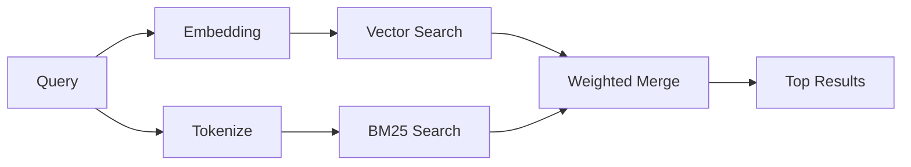

---
read_when:
    - Chcesz zrozumieć, jak działa memory_search
    - Chcesz wybrać providera osadzania
    - Chcesz dostroić jakość wyszukiwania
summary: Jak wyszukiwanie pamięci znajduje odpowiednie notatki przy użyciu osadzania i wyszukiwania hybrydowego
title: Wyszukiwanie pamięci
x-i18n:
    generated_at: "2026-04-24T09:06:14Z"
    model: gpt-5.4
    provider: openai
    source_hash: 04db62e519a691316ce40825c082918094bcaa9c36042cc8101c6504453d238e
    source_path: concepts/memory-search.md
    workflow: 15
---

`memory_search` znajduje odpowiednie notatki z twoich plików pamięci, nawet gdy
sformułowanie różni się od oryginalnego tekstu. Działa przez indeksowanie pamięci na małe
fragmenty i przeszukiwanie ich za pomocą osadzania, słów kluczowych albo obu metod naraz.

## Szybki start

Jeśli masz subskrypcję GitHub Copilot albo skonfigurowany klucz API OpenAI, Gemini, Voyage lub Mistral,
wyszukiwanie pamięci działa automatycznie. Aby jawnie ustawić providera:

```json5
{
  agents: {
    defaults: {
      memorySearch: {
        provider: "openai", // lub "gemini", "local", "ollama" itd.
      },
    },
  },
}
```

Dla lokalnych osadzań bez klucza API użyj `provider: "local"` (wymaga
node-llama-cpp).

## Obsługiwani providerzy

| Provider       | ID               | Wymaga klucza API | Uwagi                                                |
| -------------- | ---------------- | ----------------- | ---------------------------------------------------- |
| Bedrock        | `bedrock`        | Nie               | Wykrywany automatycznie, gdy łańcuch poświadczeń AWS się rozwiąże |
| Gemini         | `gemini`         | Tak               | Obsługuje indeksowanie obrazów/audio                 |
| GitHub Copilot | `github-copilot` | Nie               | Wykrywany automatycznie, używa subskrypcji Copilot   |
| Local          | `local`          | Nie               | Model GGUF, pobieranie ~0,6 GB                       |
| Mistral        | `mistral`        | Tak               | Wykrywany automatycznie                              |
| Ollama         | `ollama`         | Nie               | Lokalny, musi być ustawiony jawnie                   |
| OpenAI         | `openai`         | Tak               | Wykrywany automatycznie, szybki                      |
| Voyage         | `voyage`         | Tak               | Wykrywany automatycznie                              |

## Jak działa wyszukiwanie

OpenClaw uruchamia równolegle dwie ścieżki wyszukiwania i scala wyniki:



- **Wyszukiwanie wektorowe** znajduje notatki o podobnym znaczeniu (`"gateway host"` pasuje do
  `"the machine running OpenClaw"`).
- **Wyszukiwanie słów kluczowych BM25** znajduje dokładne dopasowania (ID, ciągi błędów, klucze
  konfiguracji).

Jeśli dostępna jest tylko jedna ścieżka (brak osadzania albo brak FTS), działa tylko ta jedna.

Gdy osadzanie jest niedostępne, OpenClaw nadal używa rankingu leksykalnego nad wynikami FTS zamiast wracać wyłącznie do surowego porządku dokładnych dopasowań. Ten tryb degradacji wzmacnia fragmenty z lepszym pokryciem terminów zapytania i istotnymi ścieżkami plików, co utrzymuje użyteczność recall nawet bez `sqlite-vec` lub providera osadzania.

## Poprawianie jakości wyszukiwania

Dwie opcjonalne funkcje pomagają, gdy masz długą historię notatek:

### Zanik czasowy

Stare notatki stopniowo tracą wagę rankingową, dzięki czemu najpierw pojawiają się nowsze informacje.
Przy domyślnym okresie półtrwania 30 dni notatka z zeszłego miesiąca ma wynik równy 50% swojej
pierwotnej wagi. Pliki trwałe, takie jak `MEMORY.md`, nigdy nie podlegają zanikowi.

<Tip>
Włącz zanik czasowy, jeśli agent ma miesiące dziennych notatek, a nieaktualne
informacje stale wyprzedzają nowszy kontekst.
</Tip>

### MMR (różnorodność)

Ogranicza nadmiarowe wyniki. Jeśli pięć notatek wspomina tę samą konfigurację routera, MMR
zapewnia, że najwyższe wyniki obejmują różne tematy zamiast się powtarzać.

<Tip>
Włącz MMR, jeśli `memory_search` stale zwraca niemal identyczne fragmenty z
różnych dziennych notatek.
</Tip>

### Włącz obie funkcje

```json5
{
  agents: {
    defaults: {
      memorySearch: {
        query: {
          hybrid: {
            mmr: { enabled: true },
            temporalDecay: { enabled: true },
          },
        },
      },
    },
  },
}
```

## Pamięć multimodalna

Za pomocą Gemini Embedding 2 możesz indeksować obrazy i pliki audio razem z
Markdown. Zapytania wyszukiwania pozostają tekstowe, ale dopasowują się do treści wizualnych i audio. Zobacz [Dokumentacja konfiguracji pamięci](/pl/reference/memory-config), aby poznać
konfigurację.

## Wyszukiwanie pamięci sesji

Możesz opcjonalnie indeksować transkrypty sesji, aby `memory_search` mogło przywoływać
wcześniejsze rozmowy. To funkcja opcjonalna przez
`memorySearch.experimental.sessionMemory`. Szczegóły znajdziesz w
[dokumentacji konfiguracji](/pl/reference/memory-config).

## Rozwiązywanie problemów

**Brak wyników?** Uruchom `openclaw memory status`, aby sprawdzić indeks. Jeśli jest pusty, uruchom
`openclaw memory index --force`.

**Tylko dopasowania słów kluczowych?** Twój provider osadzania może nie być skonfigurowany. Sprawdź
`openclaw memory status --deep`.

**Nie znajduje tekstu CJK?** Przebuduj indeks FTS za pomocą
`openclaw memory index --force`.

## Dalsza lektura

- [Active Memory](/pl/concepts/active-memory) -- pamięć subagenta dla interaktywnych sesji czatu
- [Pamięć](/pl/concepts/memory) -- układ plików, backendy, narzędzia
- [Dokumentacja konfiguracji pamięci](/pl/reference/memory-config) -- wszystkie opcje konfiguracji

## Powiązane

- [Przegląd pamięci](/pl/concepts/memory)
- [Active Memory](/pl/concepts/active-memory)
- [Wbudowany silnik pamięci](/pl/concepts/memory-builtin)
