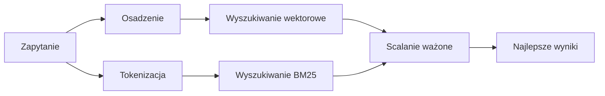

---
read_when:
    - Chcesz zrozumieć, jak działa memory_search
    - Chcesz wybrać dostawcę osadzania
    - Chcesz dostroić jakość wyszukiwania
summary: Jak wyszukiwanie w pamięci znajduje odpowiednie notatki za pomocą embeddingów i wyszukiwania hybrydowego
title: Wyszukiwanie w pamięci
x-i18n:
    generated_at: "2026-07-16T18:31:59Z"
    model: gpt-5.6
    postprocess_version: locale-links-v1
    prompt_version: 32
    provider: openai
    source_hash: 2ae0830843fba28c24159d85425240051fb8caf086cd0563d3091890045dcfad
    source_path: concepts/memory-search.md
    workflow: 16
---

`memory_search` znajduje odpowiednie notatki w plikach pamięci, nawet gdy
sformułowania różnią się od oryginalnego tekstu. Dzieli pamięć na małe fragmenty i
przeszukuje je za pomocą osadzeń, słów kluczowych lub obu tych metod.

## Szybki start

OpenClaw domyślnie używa osadzeń OpenAI. Aby użyć innego dostawcy, należy ustawić go
jawnie:

```json5
{
  agents: {
    defaults: {
      memorySearch: {
        provider: "openai", // lub "gemini", "voyage", "mistral", "bedrock", "local", "ollama", "lmstudio", "github-copilot", "openai-compatible"
      },
    },
  },
}
```

`provider` może również odwoływać się do niestandardowego wpisu `models.providers.<id>` (na
przykład `ollama-5080`), o ile ten wpis ustawia `api` na `"ollama"` lub
identyfikator innego dostawcy z adapterem osadzeń pamięci.

Aby korzystać z lokalnych osadzeń bez klucza API, należy zainstalować oficjalny
plugin dostawcy llama.cpp i ustawić `provider: "local"`:

```bash
openclaw plugins install @openclaw/llama-cpp-provider
```

Kopie kodu źródłowego nadal wymagają zatwierdzenia kompilacji natywnej: `pnpm approve-builds`, a następnie
`pnpm rebuild node-llama-cpp`.

Niektóre punkty końcowe osadzeń zgodne z OpenAI wymagają asymetrycznych etykiet `input_type`,
takich jak `"query"` dla wyszukiwań oraz `"document"`/`"passage"` dla indeksowanych
fragmentów. Należy je ustawić za pomocą `queryInputType` i `documentInputType`; zobacz
[Dokumentację konfiguracji pamięci](/pl/reference/memory-config#provider-specific-config).

## Obsługiwani dostawcy

| Dostawca          | ID                  | Wymaga klucza API | Uwagi                                      |
| ----------------- | ------------------- | ----------------- | ------------------------------------------ |
| Bedrock           | `bedrock`           | Nie               | Używa łańcucha poświadczeń AWS             |
| DeepInfra         | `deepinfra`         | Tak               | Domyślny model `BAAI/bge-m3`                |
| Gemini            | `gemini`            | Tak               | Obsługuje indeksowanie obrazów i dźwięku   |
| GitHub Copilot    | `github-copilot`    | Nie               | Używa subskrypcji Copilot                  |
| Lokalny           | `local`             | Nie               | Model GGUF, automatyczne pobieranie ~0.6 GB |
| LM Studio         | `lmstudio`          | Nie               | Serwer lokalny/samodzielnie hostowany      |
| Mistral           | `mistral`           | Tak               |                                            |
| Ollama            | `ollama`            | Nie               | Serwer lokalny/samodzielnie hostowany      |
| OpenAI            | `openai`            | Tak               | Domyślny                                   |
| Zgodny z OpenAI   | `openai-compatible` | Zazwyczaj          | Ogólny punkt końcowy `/v1/embeddings`          |
| Voyage            | `voyage`            | Tak               |                                            |

## Jak działa wyszukiwanie

OpenClaw uruchamia równolegle dwie ścieżki wyszukiwania i scala wyniki:



- **Wyszukiwanie wektorowe** dopasowuje podobne znaczenia („host gateway” pasuje do „komputer, na
  którym działa OpenClaw”).
- **Wyszukiwanie słów kluczowych BM25** dopasowuje dokładne terminy (identyfikatory, komunikaty błędów, klucze
  konfiguracji).
- **Wyszukiwanie nazw plików** indeksuje ścieżki oddzielnie od treści notatek. Dokładne pełne
  ścieżki, nazwy bazowe i rdzenie nazw plików są klasyfikowane wyżej niż częściowe dopasowania ścieżek,
  natomiast fragmenty i wyniki słów kluczowych w treści nadal pochodzą z zawartości notatek.

Jeśli dostępna jest tylko jedna ścieżka, działa ona samodzielnie.

**Tryb tylko FTS.** Należy ustawić `provider: "none"`, aby celowo wyłączyć osadzenia
i wyszukiwać wyłącznie za pomocą słów kluczowych. Pozostawienie `provider` bez ustawienia lub ustawienie na `"auto"`
również powoduje przejście na klasyfikację wyłącznie według słów kluczowych, jeśli nie skonfigurowano uwierzytelniania osadzeń,
bez zgłaszania błędu; tak samo działa `provider: "local"` (dostawca GGUF/llama.cpp),
gdy ulegnie awarii.

**Jawnie wskazany dostawca jest niedostępny.** Jeśli jawnie wskazano dowolnego innego dostawcę
(na przykład `openai`, `ollama`, `gemini`) i stanie się on niedostępny w
momencie żądania (nieprawidłowe uwierzytelnianie, awaria sieci), `memory_search` zgłasza pamięć jako
niedostępną zamiast po cichu przechodzić na wyniki wyłącznie FTS. Dzięki temu
nieprawidłowo działający skonfigurowany dostawca pozostaje widoczny. Należy ustawić `provider: "none"`, aby celowo
korzystać z wyszukiwania wyłącznie FTS, lub naprawić konfigurację dostawcy/uwierzytelniania, aby przywrócić klasyfikację
semantyczną.

## Poprawianie jakości wyszukiwania

Dwie opcjonalne funkcje pomagają w przypadku obszernej historii notatek.

### Zanik czasowy

Stare notatki stopniowo tracą wagę w klasyfikacji, dzięki czemu najpierw pojawiają się nowsze informacje.
Przy domyślnym 30-dniowym okresie półtrwania notatka z poprzedniego miesiąca otrzymuje 50% swojej
pierwotnej wagi. `MEMORY.md` i inne pliki bez daty w katalogu `memory/` są
ponadczasowe i nigdy nie podlegają zanikowi; zanikowi podlegają tylko datowane pliki `memory/YYYY-MM-DD.md`.

<Tip>
Warto włączyć tę funkcję, jeśli agent ma wiele miesięcy codziennych notatek, a nieaktualne informacje
są nadal klasyfikowane wyżej niż najnowszy kontekst.
</Tip>

### MMR (różnorodność)

Ogranicza nadmiarowe wyniki. Jeśli pięć notatek wspomina tę samą konfigurację routera,
MMR zapewnia, że najlepsze wyniki obejmują różne tematy zamiast się powtarzać.

<Tip>
Warto włączyć tę funkcję, jeśli `memory_search` stale zwraca niemal identyczne fragmenty z
różnych codziennych notatek.
</Tip>

### Włączanie obu funkcji

```json5
{
  agents: {
    defaults: {
      memorySearch: {
        query: {
          hybrid: {
            mmr: { enabled: true },
            temporalDecay: { enabled: true },
          },
        },
      },
    },
  },
}
```

## Pamięć multimodalna

Za pomocą `gemini-embedding-2-preview` można indeksować obrazy i dźwięk razem z
dokumentami Markdown. Dotyczy to wyłącznie plików w katalogu `memorySearch.extraPaths`; domyślne
katalogi główne pamięci (`MEMORY.md`, `memory/*.md`) nadal obsługują wyłącznie Markdown. Zapytania wyszukiwania
pozostają tekstowe, ale są dopasowywane do treści wizualnych i dźwiękowych. Instrukcje konfiguracji znajdują się w
[Dokumentacji konfiguracji pamięci](/pl/reference/memory-config#multimodal-memory-gemini).

## Wyszukiwanie w pamięci sesji

Aby dokładnie wyszukiwać pełny tekst w transkrypcjach sesji, należy użyć [`sessions_search`](/concepts/session-search),
a następnie otworzyć wynik za pomocą `sessions_history`. Wyszukiwanie w pamięci sesji pozostaje semantycznym,
eksperymentalnym uzupełnieniem.

Opcjonalnie można indeksować transkrypcje sesji, aby `memory_search` mógł przywoływać wcześniejsze
konwersacje. Jest to opcja wymagająca włączenia: należy ustawić `experimental.sessionMemory: true` i dodać
`"sessions"` do `sources` (domyślna wartość `sources` to `["memory"]`).

Wyniki sesji podlegają ustawieniu `tools.sessions.visibility`: domyślna wartość `"tree"` ujawnia tylko
bieżącą sesję oraz sesje przez nią utworzone. Aby z innej sesji przywołać niepowiązaną
sesję tego samego agenta (na przykład sesję uruchomioną przez gateway z wiadomości prywatnej),
należy rozszerzyć widoczność do `"agent"`.

W przypadku używania backendu QMD należy również ustawić `memory.qmd.sessions.enabled: true`, aby
transkrypcje były eksportowane do kolekcji QMD; same `experimental.sessionMemory`
i `sources` nie eksportują transkrypcji do QMD. Zobacz
[dokumentację konfiguracji](/pl/reference/memory-config#session-memory-search-experimental).

## Rozwiązywanie problemów

**Brak wyników?** Należy uruchomić `openclaw memory status`, aby sprawdzić indeks. Jeśli jest pusty, należy uruchomić
`openclaw memory index --force`.

**Tylko dopasowania słów kluczowych?** Dostawca osadzeń może nie być skonfigurowany. Należy sprawdzić
`openclaw memory status --deep`.

**Lokalne osadzenia przekraczają limit czasu?** `ollama`, `lmstudio` i `local` domyślnie używają dłuższego
limitu czasu dla wbudowanego przetwarzania wsadowego. Jeśli host jest po prostu powolny, należy ustawić
`agents.defaults.memorySearch.sync.embeddingBatchTimeoutSeconds` i ponownie uruchomić
`openclaw memory index --force`.

**Nie znaleziono tekstu CJK?** Należy ponownie utworzyć indeks FTS za pomocą
`openclaw memory index --force`.

## Powiązane materiały

- [Omówienie pamięci](/pl/concepts/memory)
- [Active Memory](/pl/concepts/active-memory)
- [Wbudowany mechanizm pamięci](/pl/concepts/memory-builtin)
- [Dokumentacja konfiguracji pamięci](/pl/reference/memory-config)
