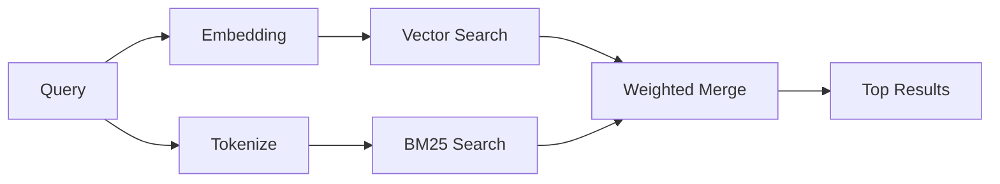

---
read_when:
    - Chcesz zrozumieć, jak działa memory_search
    - Chcesz wybrać dostawcę embeddingów
    - Chcesz dostroić jakość wyszukiwania
summary: Jak wyszukiwanie w pamięci znajduje istotne notatki za pomocą embeddingów i wyszukiwania hybrydowego
title: Wyszukiwanie pamięci
x-i18n:
    generated_at: "2026-06-27T17:27:18Z"
    model: gpt-5.5
    postprocess_version: locale-links-v1
    provider: openai
    source_hash: b0bcb8cf400100ba8b6ddbb46bdf8b2a89a8bc32a550ee6df47c874e7e9e0879
    source_path: concepts/memory-search.md
    workflow: 16
---

`memory_search` znajduje istotne notatki z plików pamięci, nawet gdy
sformułowanie różni się od oryginalnego tekstu. Działa przez indeksowanie pamięci w małe
fragmenty i przeszukiwanie ich przy użyciu embeddingów, słów kluczowych albo obu metod.

## Szybki start

Wyszukiwanie w pamięci domyślnie używa embeddingów OpenAI. Aby użyć innego backendu
embeddingów, ustaw dostawcę jawnie:

```json5
{
  agents: {
    defaults: {
      memorySearch: {
        provider: "openai", // or "gemini", "local", "ollama", "openai-compatible", etc.
      },
    },
  },
}
```

W konfiguracjach z wieloma endpointami i dostawcami specyficznymi dla pamięci `provider` może też
być niestandardowym wpisem `models.providers.<id>`, takim jak `ollama-5080`, gdy ten
dostawca ustawia `api: "ollama"` albo innego właściciela adaptera embeddingów pamięci.

Dla lokalnych embeddingów bez klucza API zainstaluj
`@openclaw/llama-cpp-provider` i ustaw `provider: "local"`. Checkouty źródłowe
mogą nadal wymagać zatwierdzenia natywnego budowania: `pnpm approve-builds`, a potem
`pnpm rebuild node-llama-cpp`.

Niektóre endpointy embeddingów zgodne z OpenAI wymagają asymetrycznych etykiet, takich jak
`input_type: "query"` dla wyszukiwań oraz `input_type: "document"` albo `"passage"`
dla indeksowanych fragmentów. Skonfiguruj je przez `memorySearch.queryInputType` i
`memorySearch.documentInputType`; zobacz [odniesienie konfiguracji pamięci](/pl/reference/memory-config#provider-specific-config).

## Obsługiwani dostawcy

| Dostawca          | ID                  | Wymaga klucza API | Uwagi                         |
| ----------------- | ------------------- | ----------------- | ----------------------------- |
| Bedrock           | `bedrock`           | Nie               | Używa łańcucha poświadczeń AWS |
| DeepInfra         | `deepinfra`         | Tak               | Domyślnie: `BAAI/bge-m3`      |
| Gemini            | `gemini`            | Tak               | Obsługuje indeksowanie obrazów/audio |
| GitHub Copilot    | `github-copilot`    | Nie               | Używa subskrypcji Copilot     |
| Lokalny           | `local`             | Nie               | Model GGUF, pobieranie ~0,6 GB |
| Mistral           | `mistral`           | Tak               |                               |
| Ollama            | `ollama`            | Nie               | Lokalny/samodzielnie hostowany |
| OpenAI            | `openai`            | Tak               | Domyślny                      |
| Zgodny z OpenAI   | `openai-compatible` | Zwykle            | Ogólny `/v1/embeddings`       |
| Voyage            | `voyage`            | Tak               |                               |

## Jak działa wyszukiwanie

OpenClaw uruchamia równolegle dwie ścieżki pobierania i scala wyniki:



- **Wyszukiwanie wektorowe** znajduje notatki o podobnym znaczeniu („gateway host” pasuje do
  „maszyny uruchamiającej OpenClaw”).
- **Wyszukiwanie słów kluczowych BM25** znajduje dokładne dopasowania (identyfikatory, ciągi błędów, klucze
  konfiguracji).

Jeśli dostępna jest tylko jedna ścieżka, druga działa samodzielnie. Celowy tryb tylko FTS
(`provider: "none"`) oraz automatyczny/domyślny wybór dostawcy nadal mogą używać
rankingu leksykalnego, gdy embeddingi są niedostępne.

Jawni, nielokalni dostawcy embeddingów działają inaczej. Jeśli ustawisz
`memorySearch.provider` na konkretny dostawca oparty na zdalnym backendzie, a ten dostawca
jest niedostępny w czasie działania, `memory_search` zgłasza pamięć jako niedostępną zamiast
po cichu używać wyników tylko FTS. Dzięki temu uszkodzony skonfigurowany dostawca semantyczny
pozostaje widoczny. Ustaw `provider: "none"` dla celowego odtwarzania tylko FTS albo napraw
konfigurację dostawcy/uwierzytelniania, aby przywrócić ranking semantyczny.

## Poprawianie jakości wyszukiwania

Dwie opcjonalne funkcje pomagają, gdy masz dużą historię notatek:

### Wygaszanie czasowe

Starsze notatki stopniowo tracą wagę rankingową, aby najnowsze informacje pojawiały się jako pierwsze.
Przy domyślnym okresie półtrwania wynoszącym 30 dni notatka z poprzedniego miesiąca otrzymuje 50%
swojej pierwotnej wagi. Pliki evergreen, takie jak `MEMORY.md`, nigdy nie są wygaszane.

<Tip>
Włącz wygaszanie czasowe, jeśli agent ma miesiące codziennych notatek, a nieaktualne
informacje stale wyprzedzają nowszy kontekst.
</Tip>

### MMR (różnorodność)

Ogranicza nadmiarowe wyniki. Jeśli pięć notatek wspomina tę samą konfigurację routera, MMR
zapewnia, że najlepsze wyniki obejmują różne tematy zamiast się powtarzać.

<Tip>
Włącz MMR, jeśli `memory_search` wciąż zwraca niemal zduplikowane fragmenty z
różnych codziennych notatek.
</Tip>

### Włącz obie funkcje

```json5
{
  agents: {
    defaults: {
      memorySearch: {
        query: {
          hybrid: {
            mmr: { enabled: true },
            temporalDecay: { enabled: true },
          },
        },
      },
    },
  },
}
```

## Pamięć multimodalna

Z Gemini Embedding 2 możesz indeksować obrazy i pliki audio obok
Markdown. Zapytania wyszukiwania pozostają tekstowe, ale są dopasowywane do treści wizualnych i audio.
Zobacz [odniesienie konfiguracji pamięci](/pl/reference/memory-config), aby poznać
konfigurację.

## Wyszukiwanie w pamięci sesji

Możesz opcjonalnie indeksować transkrypcje sesji, aby `memory_search` mogło przywoływać
wcześniejsze rozmowy. Jest to włączane opcjonalnie przez
`memorySearch.experimental.sessionMemory`. Szczegóły znajdziesz w
[odniesieniu konfiguracji](/pl/reference/memory-config).

## Rozwiązywanie problemów

**Brak wyników?** Uruchom `openclaw memory status`, aby sprawdzić indeks. Jeśli jest pusty, uruchom
`openclaw memory index --force`.

**Tylko dopasowania słów kluczowych?** Dostawca embeddingów może nie być skonfigurowany. Sprawdź
`openclaw memory status --deep`.

**Lokalne embeddingi przekraczają limit czasu?** `ollama`, `lmstudio` i `local` domyślnie używają dłuższego
limitu czasu wsadowego inline. Jeśli host jest po prostu wolny, ustaw
`agents.defaults.memorySearch.sync.embeddingBatchTimeoutSeconds` i uruchom ponownie
`openclaw memory index --force`.

**Nie znaleziono tekstu CJK?** Odbuduj indeks FTS poleceniem
`openclaw memory index --force`.

## Dalsza lektura

- [Active Memory](/pl/concepts/active-memory) -- pamięć podagentów dla interaktywnych sesji czatu
- [Pamięć](/pl/concepts/memory) -- układ plików, backendy, narzędzia
- [Odniesienie konfiguracji pamięci](/pl/reference/memory-config) -- wszystkie pokrętła konfiguracji

## Powiązane

- [Przegląd pamięci](/pl/concepts/memory)
- [Active Memory](/pl/concepts/active-memory)
- [Wbudowany silnik pamięci](/pl/concepts/memory-builtin)
