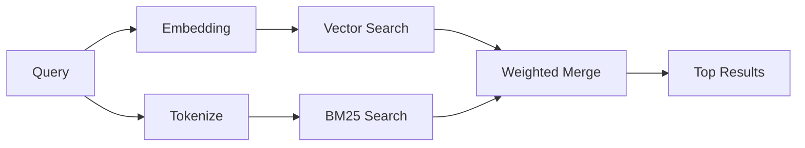

---
read_when:
    - Chcesz zrozumieć, jak działa memory_search
    - Chcesz wybrać dostawcę osadzeń
    - Chcesz dostroić jakość wyszukiwania
summary: Jak wyszukiwanie w pamięci znajduje trafne notatki za pomocą osadzeń i hybrydowego pobierania
title: Wyszukiwanie w pamięci
x-i18n:
    generated_at: "2026-05-02T09:47:55Z"
    model: gpt-5.5
    provider: openai
    source_hash: 2a71fb0809d5c70689e8046f854e4b4b4e79f45769ac2964e40a762ebb4e91a8
    source_path: concepts/memory-search.md
    workflow: 16
---

`memory_search` znajduje odpowiednie notatki w plikach pamięci, nawet gdy
sformułowanie różni się od oryginalnego tekstu. Działa przez indeksowanie pamięci w małych
fragmentach i przeszukiwanie ich za pomocą osadzeń, słów kluczowych albo obu metod.

## Szybki start

Jeśli masz skonfigurowaną subskrypcję GitHub Copilot albo klucz API OpenAI,
Gemini, Voyage lub Mistral, wyszukiwanie w pamięci działa automatycznie. Aby jawnie ustawić dostawcę:

```json5
{
  agents: {
    defaults: {
      memorySearch: {
        provider: "openai", // or "gemini", "local", "ollama", etc.
      },
    },
  },
}
```

W konfiguracjach z wieloma punktami końcowymi `provider` może też być niestandardowym
wpisem `models.providers.<id>`, takim jak `ollama-5080`, gdy ten dostawca ustawia
`api: "ollama"` lub innego właściciela adaptera osadzeń.

W przypadku lokalnych osadzeń bez klucza API ustaw `provider: "local"`. Checkouty źródłowe
mogą nadal wymagać zatwierdzenia natywnej kompilacji: `pnpm approve-builds`, a następnie
`pnpm rebuild node-llama-cpp`.

Niektóre punkty końcowe osadzeń zgodne z OpenAI wymagają asymetrycznych etykiet, takich jak
`input_type: "query"` dla wyszukiwań oraz `input_type: "document"` lub `"passage"`
dla zindeksowanych fragmentów. Skonfiguruj je za pomocą `memorySearch.queryInputType` i
`memorySearch.documentInputType`; zobacz [odniesienie konfiguracji pamięci](/pl/reference/memory-config#provider-specific-config).

## Obsługiwani dostawcy

| Dostawca       | ID               | Wymaga klucza API | Uwagi                                                |
| -------------- | ---------------- | ----------------- | ---------------------------------------------------- |
| Bedrock        | `bedrock`        | Nie               | Wykrywany automatycznie, gdy łańcuch poświadczeń AWS zostanie rozpoznany |
| Gemini         | `gemini`         | Tak               | Obsługuje indeksowanie obrazów/audio                 |
| GitHub Copilot | `github-copilot` | Nie               | Wykrywany automatycznie, używa subskrypcji Copilot   |
| Local          | `local`          | Nie               | Model GGUF, pobieranie ~0,6 GB                       |
| Mistral        | `mistral`        | Tak               | Wykrywany automatycznie                              |
| Ollama         | `ollama`         | Nie               | Lokalny, trzeba ustawić jawnie                       |
| OpenAI         | `openai`         | Tak               | Wykrywany automatycznie, szybki                      |
| Voyage         | `voyage`         | Tak               | Wykrywany automatycznie                              |

## Jak działa wyszukiwanie

OpenClaw uruchamia dwie ścieżki pobierania równolegle i scala wyniki:



- **Wyszukiwanie wektorowe** znajduje notatki o podobnym znaczeniu („gateway host” pasuje do
  „maszyny uruchamiającej OpenClaw”).
- **Wyszukiwanie słów kluczowych BM25** znajduje dokładne dopasowania (ID, ciągi błędów, klucze
  konfiguracji).

Jeśli dostępna jest tylko jedna ścieżka (brak osadzeń albo brak FTS), druga działa samodzielnie.

Gdy osadzenia są niedostępne, OpenClaw nadal używa rankingu leksykalnego wyników FTS, zamiast wracać wyłącznie do surowego porządku dokładnych dopasowań. Ten tryb zdegradowany wzmacnia fragmenty z lepszym pokryciem terminów zapytania i odpowiednimi ścieżkami plików, dzięki czemu przydatność wyników pozostaje dobra nawet bez `sqlite-vec` lub dostawcy osadzeń.

## Poprawianie jakości wyszukiwania

Dwie opcjonalne funkcje pomagają, gdy masz dużą historię notatek:

### Zanikanie czasowe

Stare notatki stopniowo tracą wagę rankingową, aby nowsze informacje pojawiały się pierwsze.
Przy domyślnym czasie połowicznego zaniku wynoszącym 30 dni notatka z zeszłego miesiąca uzyskuje 50%
swojej pierwotnej wagi. Pliki ponadczasowe, takie jak `MEMORY.md`, nigdy nie podlegają zanikaniu.

<Tip>
Włącz zanikanie czasowe, jeśli Twój agent ma miesiące codziennych notatek, a przestarzałe
informacje stale wyprzedzają nowszy kontekst.
</Tip>

### MMR (różnorodność)

Zmniejsza liczbę redundantnych wyników. Jeśli pięć notatek wspomina tę samą konfigurację routera, MMR
sprawia, że najlepsze wyniki obejmują różne tematy zamiast się powtarzać.

<Tip>
Włącz MMR, jeśli `memory_search` stale zwraca niemal identyczne fragmenty z
różnych codziennych notatek.
</Tip>

### Włącz oba

```json5
{
  agents: {
    defaults: {
      memorySearch: {
        query: {
          hybrid: {
            mmr: { enabled: true },
            temporalDecay: { enabled: true },
          },
        },
      },
    },
  },
}
```

## Pamięć multimodalna

Dzięki Gemini Embedding 2 możesz indeksować obrazy i pliki audio razem z
Markdown. Zapytania wyszukiwania pozostają tekstowe, ale dopasowują się do treści wizualnych i audio.
Zobacz [odniesienie konfiguracji pamięci](/pl/reference/memory-config), aby poznać konfigurację.

## Wyszukiwanie w pamięci sesji

Możesz opcjonalnie indeksować transkrypty sesji, aby `memory_search` mogło przywoływać
wcześniejsze rozmowy. Jest to opcja opt-in przez
`memorySearch.experimental.sessionMemory`. Szczegóły znajdziesz w
[odniesieniu konfiguracji](/pl/reference/memory-config).

## Rozwiązywanie problemów

**Brak wyników?** Uruchom `openclaw memory status`, aby sprawdzić indeks. Jeśli jest pusty, uruchom
`openclaw memory index --force`.

**Tylko dopasowania słów kluczowych?** Twój dostawca osadzeń może nie być skonfigurowany. Sprawdź
`openclaw memory status --deep`.

**Lokalne osadzenia przekraczają limit czasu?** `ollama`, `lmstudio` i `local` domyślnie używają dłuższego
limitu czasu wsadowego inline. Jeśli host jest po prostu wolny, ustaw
`agents.defaults.memorySearch.sync.embeddingBatchTimeoutSeconds` i ponownie uruchom
`openclaw memory index --force`.

**Nie znaleziono tekstu CJK?** Odbuduj indeks FTS za pomocą
`openclaw memory index --force`.

## Dalsza lektura

- [Active Memory](/pl/concepts/active-memory) -- pamięć subagenta dla interaktywnych sesji czatu
- [Pamięć](/pl/concepts/memory) -- układ plików, backendy, narzędzia
- [Odniesienie konfiguracji pamięci](/pl/reference/memory-config) -- wszystkie pokrętła konfiguracji

## Powiązane

- [Przegląd pamięci](/pl/concepts/memory)
- [Active Memory](/pl/concepts/active-memory)
- [Wbudowany silnik pamięci](/pl/concepts/memory-builtin)
