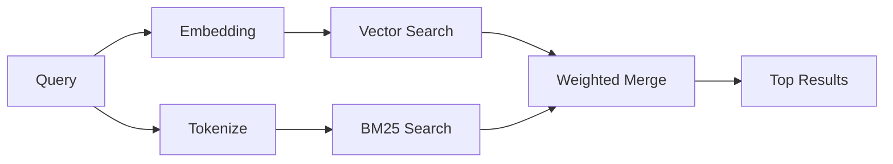

---
read_when:
    - Chcesz zrozumieć, jak działa memory_search
    - Chcesz wybrać dostawcę embeddingów
    - Chcesz dostroić jakość wyszukiwania
summary: Jak wyszukiwanie w pamięci znajduje odpowiednie notatki za pomocą embeddingów i wyszukiwania hybrydowego
title: Wyszukiwanie w pamięci
x-i18n:
    generated_at: "2026-06-28T22:33:44Z"
    model: gpt-5.5
    postprocess_version: locale-links-v1
    provider: openai
    source_hash: 32ffb9d996851566eb92b7812c5425f545ecbb5387a0a445686df35a6c8ae143
    source_path: concepts/memory-search.md
    workflow: 16
---

`memory_search` wyszukuje odpowiednie notatki w plikach pamięci, nawet gdy
sformułowanie różni się od oryginalnego tekstu. Działa przez indeksowanie pamięci
w małych fragmentach i przeszukiwanie ich za pomocą embeddingów, słów kluczowych
albo obu metod.

## Szybki start

Wyszukiwanie w pamięci domyślnie używa embeddingów OpenAI. Aby użyć innego
backendu embeddingów, ustaw dostawcę jawnie:

```json5
{
  agents: {
    defaults: {
      memorySearch: {
        provider: "openai", // or "gemini", "local", "ollama", "openai-compatible", etc.
      },
    },
  },
}
```

W konfiguracjach z wieloma endpointami i dostawcami specyficznymi dla pamięci
`provider` może też być niestandardowym wpisem `models.providers.<id>`, takim jak
`ollama-5080`, gdy ten dostawca ustawia `api: "ollama"` albo innego właściciela
adaptera embeddingów pamięci.

W przypadku lokalnych embeddingów bez klucza API zainstaluj
`@openclaw/llama-cpp-provider` i ustaw `provider: "local"`. Checkouts źródłowe
mogą nadal wymagać zgody na natywną kompilację: `pnpm approve-builds`, a potem
`pnpm rebuild node-llama-cpp`.

Niektóre endpointy embeddingów zgodne z OpenAI wymagają asymetrycznych etykiet,
takich jak `input_type: "query"` dla wyszukiwań oraz `input_type: "document"` lub
`"passage"` dla indeksowanych fragmentów. Skonfiguruj je za pomocą
`memorySearch.queryInputType` i `memorySearch.documentInputType`; zobacz
[referencję konfiguracji pamięci](/pl/reference/memory-config#provider-specific-config).

## Obsługiwani dostawcy

| Dostawca          | ID                  | Wymaga klucza API | Uwagi                                  |
| ----------------- | ------------------- | ----------------- | -------------------------------------- |
| Bedrock           | `bedrock`           | Nie               | Używa łańcucha poświadczeń AWS         |
| DeepInfra         | `deepinfra`         | Tak               | Domyślnie: `BAAI/bge-m3`               |
| Gemini            | `gemini`            | Tak               | Obsługuje indeksowanie obrazów/audio   |
| GitHub Copilot    | `github-copilot`    | Nie               | Używa subskrypcji Copilot              |
| Local             | `local`             | Nie               | Model GGUF, pobranie ~0,6 GB           |
| Mistral           | `mistral`           | Tak               |                                        |
| Ollama            | `ollama`            | Nie               | Lokalny/samodzielnie hostowany         |
| OpenAI            | `openai`            | Tak               | Domyślny                               |
| OpenAI-compatible | `openai-compatible` | Zwykle            | Ogólne `/v1/embeddings`                |
| Voyage            | `voyage`            | Tak               |                                        |

## Jak działa wyszukiwanie

OpenClaw uruchamia równolegle dwie ścieżki pobierania i scala wyniki:



- **Wyszukiwanie wektorowe** znajduje notatki o podobnym znaczeniu („gateway host”
  pasuje do „maszyna uruchamiająca OpenClaw”).
- **Wyszukiwanie słów kluczowych BM25** znajduje dokładne dopasowania (ID,
  ciągi błędów, klucze konfiguracji).

Jeśli dostępna jest tylko jedna ścieżka, działa ona samodzielnie. Celowy tryb
tylko FTS (`provider: "none"`) oraz automatyczny/domyślny wybór dostawcy nadal
mogą używać rankingu leksykalnego, gdy embeddingi są niedostępne.

Jawni nielokalni dostawcy embeddingów działają inaczej. Jeśli ustawisz
`memorySearch.provider` na konkretnego dostawcę zdalnego, a ten dostawca będzie
niedostępny w czasie działania, `memory_search` zgłosi pamięć jako niedostępną
zamiast po cichu używać wyników tylko FTS. Dzięki temu uszkodzony skonfigurowany
dostawca semantyczny pozostaje widoczny. Ustaw `provider: "none"` dla celowego
przypominania tylko FTS albo napraw konfigurację dostawcy/uwierzytelniania, aby
przywrócić ranking semantyczny.

## Poprawianie jakości wyszukiwania

Dwie opcjonalne funkcje pomagają, gdy masz dużą historię notatek:

### Spadek czasowy

Starsze notatki stopniowo tracą wagę rankingu, aby najpierw pojawiały się
najnowsze informacje. Przy domyślnym okresie półtrwania wynoszącym 30 dni
notatka z zeszłego miesiąca uzyskuje 50% swojej pierwotnej wagi. Pliki stale
aktualne, takie jak `MEMORY.md`, nigdy nie podlegają spadkowi.

<Tip>
Włącz spadek czasowy, jeśli agent ma miesiące codziennych notatek, a nieaktualne
informacje wciąż wyprzedzają nowszy kontekst.
</Tip>

### MMR (różnorodność)

Ogranicza nadmiarowe wyniki. Jeśli pięć notatek wspomina tę samą konfigurację
routera, MMR sprawia, że najlepsze wyniki obejmują różne tematy zamiast się
powtarzać.

<Tip>
Włącz MMR, jeśli `memory_search` stale zwraca prawie zduplikowane fragmenty z
różnych codziennych notatek.
</Tip>

### Włącz obie funkcje

```json5
{
  agents: {
    defaults: {
      memorySearch: {
        query: {
          hybrid: {
            mmr: { enabled: true },
            temporalDecay: { enabled: true },
          },
        },
      },
    },
  },
}
```

## Pamięć multimodalna

Dzięki Gemini Embedding 2 możesz indeksować obrazy i pliki audio razem z
Markdownem. Zapytania wyszukiwania pozostają tekstowe, ale dopasowują się do
treści wizualnych i audio. Instrukcję konfiguracji znajdziesz w
[referencji konfiguracji pamięci](/pl/reference/memory-config).

## Wyszukiwanie w pamięci sesji

Opcjonalnie możesz indeksować transkrypcje sesji, aby `memory_search` mogło
przypominać wcześniejsze rozmowy. Jest to funkcja włączana jawnie przez
`memorySearch.experimental.sessionMemory` oraz `sources: ["sessions"]`; domyślna
lista źródeł obejmuje tylko pamięć. Flaga eksperymentalna włącza indeksowanie
transkrypcji sesji, a `sources` kontroluje, czy fragmenty sesji są przeszukiwane.

Trafienia sesji przestrzegają `tools.sessions.visibility`: domyślne ustawienie
`tree` udostępnia tylko bieżącą sesję i sesje przez nią utworzone. Aby przywołać
niepowiązaną sesję tego samego agenta wysłaną przez Gateway z osobnej sesji DM,
celowo rozszerz widoczność do `agent`.

Podczas używania QMD ustaw także `memory.qmd.sessions.enabled: true`, aby
transkrypcje były eksportowane do kolekcji QMD. Szczegóły znajdziesz w
[referencji konfiguracji](/pl/reference/memory-config).

## Rozwiązywanie problemów

**Brak wyników?** Uruchom `openclaw memory status`, aby sprawdzić indeks. Jeśli
jest pusty, uruchom `openclaw memory index --force`.

**Tylko dopasowania słów kluczowych?** Dostawca embeddingów może nie być
skonfigurowany. Sprawdź `openclaw memory status --deep`.

**Lokalne embeddingi przekraczają limit czasu?** `ollama`, `lmstudio` i `local`
domyślnie używają dłuższego limitu czasu wsadowego inline. Jeśli host jest po
prostu wolny, ustaw
`agents.defaults.memorySearch.sync.embeddingBatchTimeoutSeconds` i uruchom
ponownie `openclaw memory index --force`.

**Nie znaleziono tekstu CJK?** Odbuduj indeks FTS za pomocą
`openclaw memory index --force`.

## Dalsza lektura

- [Active Memory](/pl/concepts/active-memory) -- pamięć subagenta dla interaktywnych sesji czatu
- [Pamięć](/pl/concepts/memory) -- układ plików, backendy, narzędzia
- [Referencja konfiguracji pamięci](/pl/reference/memory-config) -- wszystkie pokrętła konfiguracji

## Powiązane

- [Przegląd pamięci](/pl/concepts/memory)
- [Active Memory](/pl/concepts/active-memory)
- [Wbudowany silnik pamięci](/pl/concepts/memory-builtin)
