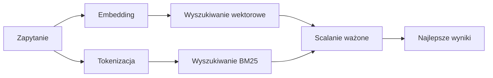

---
read_when:
    - Chcesz zrozumieć, jak działa memory_search
    - Chcesz wybrać dostawcę embeddingów
    - Chcesz dostroić jakość wyszukiwania
summary: Jak wyszukiwanie pamięci znajduje trafne notatki przy użyciu embeddingów i wyszukiwania hybrydowego
title: Wyszukiwanie pamięci
x-i18n:
    generated_at: "2026-04-05T13:50:29Z"
    model: gpt-5.4
    provider: openai
    source_hash: 87b1cb3469c7805f95bca5e77a02919d1e06d626ad3633bbc5465f6ab9db12a2
    source_path: concepts/memory-search.md
    workflow: 15
---

# Wyszukiwanie pamięci

`memory_search` znajduje trafne notatki z Twoich plików pamięci, nawet wtedy, gdy
sformułowanie różni się od oryginalnego tekstu. Działa przez indeksowanie pamięci na małe
fragmenty i przeszukiwanie ich przy użyciu embeddingów, słów kluczowych albo obu metod naraz.

## Szybki start

Jeśli masz skonfigurowany klucz API OpenAI, Gemini, Voyage lub Mistral, wyszukiwanie pamięci
działa automatycznie. Aby jawnie ustawić dostawcę:

```json5
{
  agents: {
    defaults: {
      memorySearch: {
        provider: "openai", // or "gemini", "local", "ollama", etc.
      },
    },
  },
}
```

W przypadku lokalnych embeddingów bez klucza API użyj `provider: "local"` (wymaga
`node-llama-cpp`).

## Obsługiwani dostawcy

| Dostawca | ID        | Wymaga klucza API | Uwagi                        |
| -------- | --------- | ----------------- | ---------------------------- |
| OpenAI   | `openai`  | Tak               | Wykrywany automatycznie, szybki |
| Gemini   | `gemini`  | Tak               | Obsługuje indeksowanie obrazów/audio |
| Voyage   | `voyage`  | Tak               | Wykrywany automatycznie      |
| Mistral  | `mistral` | Tak               | Wykrywany automatycznie      |
| Ollama   | `ollama`  | Nie               | Lokalny, trzeba ustawić jawnie |
| Local    | `local`   | Nie               | Model GGUF, pobranie ~0.6 GB |

## Jak działa wyszukiwanie

OpenClaw uruchamia równolegle dwie ścieżki wyszukiwania i scala wyniki:



- **Wyszukiwanie wektorowe** znajduje notatki o podobnym znaczeniu („gateway host” pasuje do
  „maszyna, na której działa OpenClaw”).
- **Wyszukiwanie słów kluczowych BM25** znajduje dokładne dopasowania (identyfikatory, ciągi błędów, klucze konfiguracji).

Jeśli dostępna jest tylko jedna ścieżka (brak embeddingów albo brak FTS), druga nie jest używana.

## Poprawianie jakości wyszukiwania

Dwie opcjonalne funkcje pomagają, gdy masz dużą historię notatek:

### Zanikanie czasowe

Stare notatki stopniowo tracą wagę w rankingu, dzięki czemu najpierw pojawiają się nowsze informacje.
Przy domyślnym okresie półtrwania wynoszącym 30 dni notatka z zeszłego miesiąca uzyskuje 50% swojej
oryginalnej wagi. Zawsze aktualne pliki, takie jak `MEMORY.md`, nigdy nie podlegają zanikaniu.

<Tip>
Włącz zanikanie czasowe, jeśli Twój agent ma miesiące codziennych notatek, a nieaktualne
informacje ciągle wyprzedzają nowszy kontekst.
</Tip>

### MMR (różnorodność)

Ogranicza nadmiarowe wyniki. Jeśli pięć notatek wspomina tę samą konfigurację routera, MMR
zapewnia, że najlepsze wyniki obejmują różne tematy zamiast się powtarzać.

<Tip>
Włącz MMR, jeśli `memory_search` ciągle zwraca niemal identyczne fragmenty z
różnych dziennych notatek.
</Tip>

### Włącz oba

```json5
{
  agents: {
    defaults: {
      memorySearch: {
        query: {
          hybrid: {
            mmr: { enabled: true },
            temporalDecay: { enabled: true },
          },
        },
      },
    },
  },
}
```

## Pamięć multimodalna

Dzięki Gemini Embedding 2 możesz indeksować obrazy i pliki audio razem z
Markdown. Zapytania wyszukiwania pozostają tekstowe, ale dopasowują się do treści wizualnych i dźwiękowych. Zobacz [dokumentację konfiguracji pamięci](/reference/memory-config), aby
poznać konfigurację.

## Wyszukiwanie pamięci sesji

Opcjonalnie możesz indeksować transkrypty sesji, aby `memory_search` mogło przywoływać
wcześniejsze rozmowy. Ta funkcja jest opcjonalna przez
`memorySearch.experimental.sessionMemory`. Szczegóły znajdziesz w
[dokumentacji konfiguracji](/reference/memory-config).

## Rozwiązywanie problemów

**Brak wyników?** Uruchom `openclaw memory status`, aby sprawdzić indeks. Jeśli jest pusty, uruchom
`openclaw memory index --force`.

**Tylko dopasowania słów kluczowych?** Twój dostawca embeddingów może nie być skonfigurowany. Sprawdź
`openclaw memory status --deep`.

**Nie można znaleźć tekstu CJK?** Odbuduj indeks FTS za pomocą
`openclaw memory index --force`.

## Dalsza lektura

- [Memory](/concepts/memory) -- układ plików, backendy, narzędzia
- [Dokumentacja konfiguracji pamięci](/reference/memory-config) -- wszystkie opcje konfiguracji
