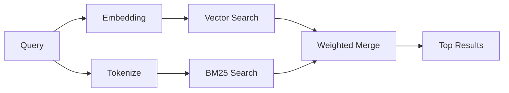

---
read_when:
    - Chcesz zrozumieć, jak działa memory_search
    - Chcesz wybrać dostawcę osadzeń
    - Chcesz dostosować jakość wyszukiwania
summary: Jak wyszukiwanie w pamięci znajduje trafne notatki za pomocą osadzeń i wyszukiwania hybrydowego
title: Wyszukiwanie w pamięci
x-i18n:
    generated_at: "2026-04-30T09:47:45Z"
    model: gpt-5.5
    provider: openai
    source_hash: 3e6c44d90f49a797bda01b9a575928c128a334f89ae14fc3620e65562a866aa9
    source_path: concepts/memory-search.md
    workflow: 16
---

`memory_search` znajduje odpowiednie notatki z plików pamięci, nawet gdy
sformułowanie różni się od oryginalnego tekstu. Działa przez indeksowanie pamięci
w małe fragmenty i przeszukiwanie ich za pomocą osadzeń, słów kluczowych albo
obu tych metod.

## Szybki start

Jeśli masz skonfigurowaną subskrypcję GitHub Copilot, klucz API OpenAI, Gemini,
Voyage albo Mistral, wyszukiwanie w pamięci działa automatycznie. Aby jawnie
ustawić dostawcę:

```json5
{
  agents: {
    defaults: {
      memorySearch: {
        provider: "openai", // or "gemini", "local", "ollama", etc.
      },
    },
  },
}
```

W konfiguracjach z wieloma endpointami `provider` może być także niestandardowym
wpisem `models.providers.<id>`, takim jak `ollama-5080`, gdy ten dostawca ustawia
`api: "ollama"` albo innego właściciela adaptera osadzeń.

W przypadku lokalnych osadzeń bez klucza API zainstaluj opcjonalny pakiet
uruchomieniowy `node-llama-cpp` obok OpenClaw i użyj `provider: "local"`.

Niektóre endpointy osadzeń zgodne z OpenAI wymagają etykiet asymetrycznych, takich jak
`input_type: "query"` dla wyszukiwań oraz `input_type: "document"` albo `"passage"`
dla zaindeksowanych fragmentów. Skonfiguruj je za pomocą `memorySearch.queryInputType` i
`memorySearch.documentInputType`; zobacz [dokumentację konfiguracji pamięci](/pl/reference/memory-config#provider-specific-config).

## Obsługiwani dostawcy

| Dostawca       | ID               | Wymaga klucza API | Uwagi                                                |
| -------------- | ---------------- | ----------------- | ---------------------------------------------------- |
| Bedrock        | `bedrock`        | Nie               | Wykrywany automatycznie, gdy łańcuch poświadczeń AWS zostanie rozwiązany |
| Gemini         | `gemini`         | Tak               | Obsługuje indeksowanie obrazów/audio                 |
| GitHub Copilot | `github-copilot` | Nie               | Wykrywany automatycznie, używa subskrypcji Copilot   |
| Local          | `local`          | Nie               | Model GGUF, pobieranie ~0,6 GB                       |
| Mistral        | `mistral`        | Tak               | Wykrywany automatycznie                              |
| Ollama         | `ollama`         | Nie               | Lokalny, musi być ustawiony jawnie                   |
| OpenAI         | `openai`         | Tak               | Wykrywany automatycznie, szybki                      |
| Voyage         | `voyage`         | Tak               | Wykrywany automatycznie                              |

## Jak działa wyszukiwanie

OpenClaw uruchamia równolegle dwie ścieżki pobierania i scala wyniki:



- **Wyszukiwanie wektorowe** znajduje notatki o podobnym znaczeniu („gateway host” pasuje do
  „the machine running OpenClaw”).
- **Wyszukiwanie słów kluczowych BM25** znajduje dokładne dopasowania (ID, ciągi błędów, klucze
  konfiguracji).

Jeśli dostępna jest tylko jedna ścieżka (brak osadzeń albo brak FTS), druga działa samodzielnie.

Gdy osadzenia są niedostępne, OpenClaw nadal używa rankingu leksykalnego wyników FTS zamiast wracać wyłącznie do surowego porządkowania dokładnych dopasowań. Ten tryb ograniczony wzmacnia fragmenty z lepszym pokryciem terminów zapytania i odpowiednimi ścieżkami plików, dzięki czemu trafność pozostaje użyteczna nawet bez `sqlite-vec` albo dostawcy osadzeń.

## Poprawianie jakości wyszukiwania

Dwie opcjonalne funkcje pomagają, gdy masz dużą historię notatek:

### Zanikanie czasowe

Stare notatki stopniowo tracą wagę rankingową, aby najpierw pojawiały się świeże informacje.
Przy domyślnym okresie półtrwania wynoszącym 30 dni notatka z zeszłego miesiąca ma 50%
swojej pierwotnej wagi. Pliki zawsze aktualne, takie jak `MEMORY.md`, nigdy nie podlegają zanikaniu.

<Tip>
Włącz zanikanie czasowe, jeśli Twój agent ma miesiące codziennych notatek, a nieaktualne
informacje stale wyprzedzają nowszy kontekst.
</Tip>

### MMR (różnorodność)

Ogranicza nadmiarowe wyniki. Jeśli pięć notatek wspomina tę samą konfigurację routera, MMR
zapewnia, że najlepsze wyniki obejmują różne tematy zamiast się powtarzać.

<Tip>
Włącz MMR, jeśli `memory_search` ciągle zwraca prawie zduplikowane fragmenty z
różnych codziennych notatek.
</Tip>

### Włącz obie funkcje

```json5
{
  agents: {
    defaults: {
      memorySearch: {
        query: {
          hybrid: {
            mmr: { enabled: true },
            temporalDecay: { enabled: true },
          },
        },
      },
    },
  },
}
```

## Pamięć multimodalna

Dzięki Gemini Embedding 2 możesz indeksować obrazy i pliki audio razem z
Markdown. Zapytania wyszukiwania pozostają tekstowe, ale są dopasowywane do treści wizualnych i audio.
Zobacz [dokumentację konfiguracji pamięci](/pl/reference/memory-config), aby poznać
konfigurację.

## Wyszukiwanie w pamięci sesji

Możesz opcjonalnie indeksować transkrypcje sesji, aby `memory_search` mogło przywoływać
wcześniejsze rozmowy. Jest to opcja włączana jawnie przez
`memorySearch.experimental.sessionMemory`. Szczegóły znajdziesz w
[dokumentacji konfiguracji](/pl/reference/memory-config).

## Rozwiązywanie problemów

**Brak wyników?** Uruchom `openclaw memory status`, aby sprawdzić indeks. Jeśli jest pusty, uruchom
`openclaw memory index --force`.

**Tylko dopasowania słów kluczowych?** Dostawca osadzeń może nie być skonfigurowany. Sprawdź
`openclaw memory status --deep`.

**Lokalne osadzenia przekraczają limit czasu?** `ollama`, `lmstudio` i `local` domyślnie używają dłuższego
limitu czasu dla wsadowego przetwarzania inline. Jeśli host jest po prostu wolny, ustaw
`agents.defaults.memorySearch.sync.embeddingBatchTimeoutSeconds` i ponownie uruchom
`openclaw memory index --force`.

**Nie znaleziono tekstu CJK?** Odbuduj indeks FTS za pomocą
`openclaw memory index --force`.

## Dalsza lektura

- [Active Memory](/pl/concepts/active-memory) -- pamięć subagenta dla interaktywnych sesji czatu
- [Pamięć](/pl/concepts/memory) -- układ plików, backendy, narzędzia
- [Dokumentacja konfiguracji pamięci](/pl/reference/memory-config) -- wszystkie przełączniki konfiguracji

## Powiązane

- [Przegląd pamięci](/pl/concepts/memory)
- [Active Memory](/pl/concepts/active-memory)
- [Wbudowany silnik pamięci](/pl/concepts/memory-builtin)
