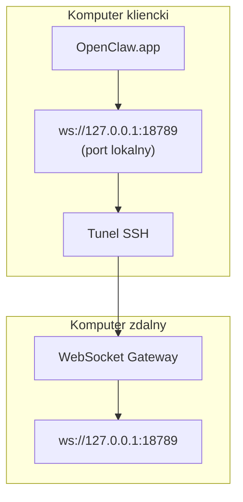

<Note>
Ta treść znajduje się teraz na stronie [Dostęp zdalny](/pl/gateway/remote#macos-persistent-ssh-tunnel-via-launchagent). Aktualny przewodnik jest dostępny na tamtej stronie; ta strona pozostaje celem przekierowania.
</Note>

# Uruchamianie OpenClaw.app ze zdalnym Gateway

OpenClaw.app łączy się ze zdalnym Gateway przez tunel SSH: dyrektywa SSH `LocalForward` mapuje port lokalny na port WebSocket Gateway na zdalnym hoście.

## Konfiguracja

1. Dodaj wpis do konfiguracji SSH z dyrektywą `LocalForward 18789 127.0.0.1:18789` (pełny blok konfiguracji znajdziesz na stronie [Dostęp zdalny](/pl/gateway/remote#macos-persistent-ssh-tunnel-via-launchagent)).
2. Skopiuj swój klucz SSH na zdalny host za pomocą polecenia `ssh-copy-id`.
3. Ustaw `gateway.remote.token` (lub `gateway.remote.password`) za pomocą polecenia `openclaw config set gateway.remote.token "<your-token>"`.
4. Uruchom tunel: `ssh -N remote-gateway &`.
5. Zamknij i ponownie otwórz OpenClaw.app.

Aby tunel działał po ponownym uruchomieniu systemu i automatycznie wznawiał połączenie, zamiast ręcznego polecenia `ssh -N` użyj konfiguracji LaunchAgent opisanej na stronie [Dostęp zdalny](/pl/gateway/remote#macos-persistent-ssh-tunnel-via-launchagent).

## Jak to działa

| Komponent                            | Działanie                                                               |
| ------------------------------------ | ----------------------------------------------------------------------- |
| `LocalForward 18789 127.0.0.1:18789` | Przekierowuje lokalny port 18789 na zdalny port 18789                    |
| `ssh -N`                             | Uruchamia SSH bez wykonywania zdalnych poleceń (tylko przekierowanie portów) |
| `KeepAlive`                          | Automatycznie ponownie uruchamia tunel w razie awarii (LaunchAgent)      |
| `RunAtLoad`                          | Uruchamia tunel podczas ładowania LaunchAgent (LaunchAgent)              |

OpenClaw.app łączy się z adresem `ws://127.0.0.1:18789` na komputerze klienckim. Tunel przekierowuje to połączenie na port 18789 zdalnego hosta, na którym działa Gateway.

## Powiązane

- [Dostęp zdalny](/pl/gateway/remote)
- [Tailscale](/pl/gateway/tailscale)
