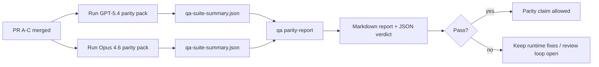

---
read_when:
    - Przegląd serii PR dotyczących zgodności GPT-5.4 / Codex
    - Utrzymywanie sześciokontraktowej architektury agentowej stojącej za programem zgodności
summary: Jak przejrzeć program zgodności GPT-5.4 / Codex jako cztery jednostki scalania
title: Uwagi maintainera dotyczące zgodności GPT-5.4 / Codex
x-i18n:
    generated_at: "2026-04-22T04:23:13Z"
    model: gpt-5.4
    provider: openai
    source_hash: b872d6a33b269c01b44537bfa8646329063298fdfcd3671a17d0eadbc9da5427
    source_path: help/gpt54-codex-agentic-parity-maintainers.md
    workflow: 15
---

# Uwagi maintainera dotyczące zgodności GPT-5.4 / Codex

Ta notatka wyjaśnia, jak przeglądać program zgodności GPT-5.4 / Codex jako cztery jednostki scalania bez utraty pierwotnej sześciokontraktowej architektury.

## Jednostki scalania

### PR A: ścisłe wykonanie agentowe

Obejmuje:

- `executionContract`
- dalszą realizację w tej samej turze z priorytetem dla GPT-5
- `update_plan` jako nieterminalne śledzenie postępu
- jawne stany zablokowania zamiast cichych zatrzymań opartych wyłącznie na planie

Nie obejmuje:

- klasyfikacji błędów auth/runtime
- prawdomówności uprawnień
- przeprojektowania replay/kontynuacji
- benchmarkingu zgodności

### PR B: prawdomówność środowiska uruchomieniowego

Obejmuje:

- poprawność zakresów OAuth Codex
- typowaną klasyfikację błędów providera/środowiska uruchomieniowego
- prawdziwą dostępność `/elevated full` i powody zablokowania

Nie obejmuje:

- normalizacji schematu narzędzi
- stanu replay/żywotności
- bramkowania benchmarków

### PR C: poprawność wykonania

Obejmuje:

- zgodność narzędzi OpenAI/Codex należących do providera
- ścisłą obsługę schematów bez parametrów
- ujawnianie stanu replay-invalid
- widoczność stanów long task: paused, blocked i abandoned

Nie obejmuje:

- samodzielnie wybieranej kontynuacji
- ogólnego zachowania dialektu Codex poza hookami providera
- bramkowania benchmarków

### PR D: harness zgodności

Obejmuje:

- pierwszy pakiet scenariuszy GPT-5.4 vs Opus 4.6
- dokumentację zgodności
- raport zgodności i mechanikę bramki wydania

Nie obejmuje:

- zmian zachowania środowiska uruchomieniowego poza QA-lab
- symulacji auth/proxy/DNS wewnątrz harnessu

## Mapowanie z powrotem do pierwotnych sześciu kontraktów

| Pierwotny kontrakt                       | Jednostka scalania |
| ---------------------------------------- | ------------------ |
| Poprawność transportu/auth providera     | PR B               |
| Zgodność kontraktu/schematu narzędzi     | PR C               |
| Wykonanie w tej samej turze              | PR A               |
| Prawdomówność uprawnień                  | PR B               |
| Poprawność replay/kontynuacji/żywotności | PR C               |
| Benchmark/bramka wydania                 | PR D               |

## Kolejność przeglądu

1. PR A
2. PR B
3. PR C
4. PR D

PR D jest warstwą dowodową. Nie powinien być powodem opóźniania PR-ów dotyczących poprawności środowiska uruchomieniowego.

## Na co zwracać uwagę

### PR A

- uruchomienia GPT-5 wykonują działanie albo kończą się bezpiecznym błędem zamiast zatrzymywać się na komentarzu
- `update_plan` samo w sobie nie wygląda już jak postęp
- zachowanie pozostaje z priorytetem dla GPT-5 i ograniczone do embedded-Pi

### PR B

- błędy auth/proxy/runtime przestają zapadać się do ogólnej obsługi typu „model failed”
- `/elevated full` jest opisywane jako dostępne tylko wtedy, gdy faktycznie jest dostępne
- powody zablokowania są widoczne zarówno dla modelu, jak i dla środowiska uruchomieniowego skierowanego do użytkownika

### PR C

- ścisła rejestracja narzędzi OpenAI/Codex zachowuje się przewidywalnie
- narzędzia bez parametrów nie oblewają ścisłych kontroli schematów
- wyniki replay i Compaction zachowują prawdziwy stan żywotności

### PR D

- pakiet scenariuszy jest zrozumiały i odtwarzalny
- pakiet zawiera ścieżkę mutującego bezpieczeństwa replay, a nie tylko przepływy tylko do odczytu
- raporty są czytelne dla ludzi i automatyzacji
- twierdzenia o zgodności są poparte dowodami, a nie anegdotami

Oczekiwane artefakty z PR D:

- `qa-suite-report.md` / `qa-suite-summary.json` dla każdego uruchomienia modelu
- `qa-agentic-parity-report.md` z porównaniem zbiorczym i na poziomie scenariuszy
- `qa-agentic-parity-summary.json` z werdyktem w formacie czytelnym maszynowo

## Bramka wydania

Nie twierdź, że GPT-5.4 osiąga zgodność lub przewagę nad Opus 4.6, dopóki:

- PR A, PR B i PR C nie zostaną scalone
- PR D nie uruchomi czysto pierwszej fali pakietu zgodności
- zestawy regresji runtime-truthfulness pozostają zielone
- raport zgodności nie pokazuje przypadków fałszywego sukcesu ani regresji w zachowaniu zatrzymania

Harness zgodności nie jest jedynym źródłem dowodów. Zachowaj ten podział jawnie w przeglądzie:

- PR D obejmuje porównanie GPT-5.4 vs Opus 4.6 oparte na scenariuszach
- deterministyczne zestawy PR B nadal obejmują dowody dotyczące auth/proxy/DNS i prawdomówności pełnego dostępu

## Mapa celu do dowodów

| Element bramki ukończenia                | Główny właściciel | Artefakt przeglądu                                                  |
| ---------------------------------------- | ----------------- | ------------------------------------------------------------------- |
| Brak zacięć opartych wyłącznie na planie | PR A              | testy środowiska ścisłego wykonania agentowego i `approval-turn-tool-followthrough` |
| Brak fałszywego postępu lub fałszywego ukończenia narzędzia | PR A + PR D       | liczba fałszywych sukcesów zgodności plus szczegóły raportu na poziomie scenariuszy |
| Brak fałszywych wskazówek `/elevated full` | PR B            | deterministyczne zestawy runtime-truthfulness                       |
| Błędy replay/żywotności pozostają jawne  | PR C + PR D       | zestawy lifecycle/replay plus `compaction-retry-mutating-tool`      |
| GPT-5.4 dorównuje lub przewyższa Opus 4.6 | PR D             | `qa-agentic-parity-report.md` i `qa-agentic-parity-summary.json`    |

## Skrót dla recenzenta: przed vs po

| Problem widoczny dla użytkownika przed zmianą              | Sygnał w przeglądzie po zmianie                                                         |
| ---------------------------------------------------------- | --------------------------------------------------------------------------------------- |
| GPT-5.4 zatrzymywał się po planowaniu                      | PR A pokazuje zachowanie typu działaj-albo-zablokuj zamiast ukończenia opartego wyłącznie na komentarzu |
| Użycie narzędzi wydawało się kruche przy ścisłych schematach OpenAI/Codex | PR C utrzymuje przewidywalność rejestracji narzędzi i wywołań bez parametrów |
| Wskazówki `/elevated full` bywały mylące                   | PR B wiąże wskazówki z rzeczywistą możliwością środowiska uruchomieniowego i powodami zablokowania |
| Długie zadania mogły zniknąć w niejednoznaczności replay/Compaction | PR C emituje jawny stan paused, blocked, abandoned i replay-invalid |
| Twierdzenia o zgodności były anegdotyczne                  | PR D tworzy raport plus werdykt JSON z tym samym pokryciem scenariuszy dla obu modeli |
