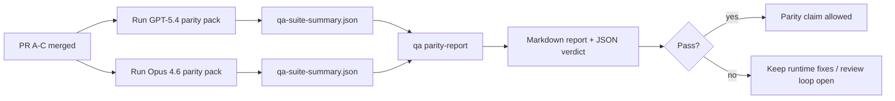

---
read_when:
    - Przeglądanie serii PR zgodności GPT-5.4 / Codex
    - Utrzymywanie sześciokontraktowej architektury agentowej stojącej za programem zgodności
summary: Jak przeglądać program zgodności GPT-5.4 / Codex jako cztery jednostki scalania
title: Notatki maintainera dotyczące zgodności GPT-5.4 / Codex
x-i18n:
    generated_at: "2026-04-24T09:14:10Z"
    model: gpt-5.4
    provider: openai
    source_hash: 803b62bf5bb6b00125f424fa733e743ecdec7f8410dec0782096f9d1ddbed6c0
    source_path: help/gpt54-codex-agentic-parity-maintainers.md
    workflow: 15
---

Ta notatka wyjaśnia, jak przeglądać program zgodności GPT-5.4 / Codex jako cztery jednostki scalania bez utraty oryginalnej sześciokontraktowej architektury.

## Jednostki scalania

### PR A: ścisłe wykonanie agentowe

Obejmuje:

- `executionContract`
- domknięcie tej samej tury w podejściu GPT-5-first
- `update_plan` jako nieterminalne śledzenie postępu
- jawne stany zablokowania zamiast cichych zatrzymań opartych wyłącznie na planie

Nie obejmuje:

- klasyfikacji błędów auth/runtime
- prawdziwości uprawnień
- przeprojektowania replay/kontynuacji
- benchmarkingu zgodności

### PR B: prawdziwość runtime

Obejmuje:

- poprawność zakresów Codex OAuth
- typowaną klasyfikację błędów provider/runtime
- prawdziwą dostępność `/elevated full` i powody zablokowania

Nie obejmuje:

- normalizacji schematu narzędzi
- stanu replay/liveness
- bramkowania benchmarków

### PR C: poprawność wykonania

Obejmuje:

- kompatybilność narzędzi OpenAI/Codex należącą do providera
- ścisłą obsługę schematów bez parametrów
- ujawnianie replay-invalid
- widoczność stanów paused, blocked i abandoned dla długich zadań

Nie obejmuje:

- samodzielnie wybranej kontynuacji
- ogólnego zachowania dialektu Codex poza hookami providera
- bramkowania benchmarków

### PR D: harness zgodności

Obejmuje:

- pierwszy pakiet scenariuszy GPT-5.4 vs Opus 4.6
- dokumentację zgodności
- raport zgodności i mechanikę bramki wydania

Nie obejmuje:

- zmian zachowania runtime poza QA-lab
- symulacji auth/proxy/DNS wewnątrz harness

## Odwzorowanie z powrotem na oryginalne sześć kontraktów

| Oryginalny kontrakt                     | Jednostka scalania |
| -------------------------------------- | ------------------ |
| Poprawność transportu/auth providera   | PR B               |
| Kompatybilność kontraktu/schematu narzędzi | PR C           |
| Wykonanie w tej samej turze            | PR A               |
| Prawdziwość uprawnień                  | PR B               |
| Poprawność replay/kontynuacji/liveness | PR C               |
| Bramka benchmark/wydania               | PR D               |

## Kolejność przeglądu

1. PR A
2. PR B
3. PR C
4. PR D

PR D to warstwa dowodowa. Nie powinien być powodem opóźniania PR dotyczących poprawności runtime.

## Na co zwracać uwagę

### PR A

- uruchomienia GPT-5 działają albo kończą się bezpieczną odmową zamiast zatrzymywać się na komentarzu
- `update_plan` nie wygląda już samo w sobie jak postęp
- zachowanie pozostaje ograniczone do GPT-5-first i embedded-Pi

### PR B

- błędy auth/proxy/runtime przestają zapadać się do ogólnej obsługi „model failed”
- `/elevated full` jest opisywane jako dostępne tylko wtedy, gdy rzeczywiście jest dostępne
- powody zablokowania są widoczne zarówno dla modelu, jak i dla runtime skierowanego do użytkownika

### PR C

- ścisła rejestracja narzędzi OpenAI/Codex zachowuje się przewidywalnie
- narzędzia bez parametrów nie oblewają ścisłych kontroli schematu
- wyniki replay i Compaction zachowują prawdziwy stan liveness

### PR D

- pakiet scenariuszy jest zrozumiały i odtwarzalny
- pakiet zawiera ścieżkę bezpieczeństwa replay z mutacją, a nie tylko przepływy tylko do odczytu
- raporty są czytelne dla ludzi i automatyzacji
- twierdzenia o zgodności są oparte na dowodach, a nie na anegdotach

Oczekiwane artefakty z PR D:

- `qa-suite-report.md` / `qa-suite-summary.json` dla każdego uruchomienia modelu
- `qa-agentic-parity-report.md` z porównaniem zagregowanym i na poziomie scenariuszy
- `qa-agentic-parity-summary.json` z werdyktem czytelnym dla maszyn

## Bramka wydania

Nie twierdź, że GPT-5.4 osiąga zgodność lub przewagę nad Opus 4.6, dopóki:

- PR A, PR B i PR C nie zostaną scalone
- PR D nie uruchomi czysto pierwszego pakietu zgodności
- zestawy regresji prawdziwości runtime pozostają zielone
- raport zgodności nie pokazuje przypadków fałszywego sukcesu ani regresji w zachowaniu zatrzymania

Harness zgodności nie jest jedynym źródłem dowodów. W przeglądzie zachowaj wyraźny ten podział:

- PR D odpowiada za porównanie GPT-5.4 vs Opus 4.6 oparte na scenariuszach
- deterministyczne zestawy PR B nadal odpowiadają za dowody dotyczące auth/proxy/DNS i prawdziwości pełnego dostępu

## Mapa celu do dowodu

| Element bramki ukończenia              | Główny właściciel | Artefakt przeglądu                                                   |
| -------------------------------------- | ----------------- | -------------------------------------------------------------------- |
| Brak zatrzymań tylko na planie         | PR A              | testy ścisłego runtime agentowego i `approval-turn-tool-followthrough` |
| Brak fałszywego postępu lub fałszywego ukończenia narzędzia | PR A + PR D | liczba fałszywych sukcesów zgodności plus szczegóły raportu na poziomie scenariuszy |
| Brak fałszywych wskazówek `/elevated full` | PR B          | deterministyczne zestawy prawdziwości runtime                        |
| Błędy replay/liveness pozostają jawne  | PR C + PR D       | zestawy lifecycle/replay plus `compaction-retry-mutating-tool`       |
| GPT-5.4 dorównuje lub przewyższa Opus 4.6 | PR D           | `qa-agentic-parity-report.md` i `qa-agentic-parity-summary.json`     |

## Skrót dla recenzenta: przed vs po

| Problem widoczny dla użytkownika wcześniej                 | Sygnał w przeglądzie po zmianach                                                       |
| ---------------------------------------------------------- | -------------------------------------------------------------------------------------- |
| GPT-5.4 zatrzymywał się po planowaniu                      | PR A pokazuje zachowanie act-or-block zamiast ukończenia opartego wyłącznie na komentarzu |
| Użycie narzędzi wydawało się kruche przy ścisłych schematach OpenAI/Codex | PR C utrzymuje przewidywalność rejestracji narzędzi i wywołań bez parametrów |
| Wskazówki `/elevated full` bywały mylące                   | PR B wiąże wskazówki z rzeczywistą możliwością runtime i powodami zablokowania         |
| Długie zadania mogły znikać w niejednoznaczności replay/Compaction | PR C emituje jawny stan paused, blocked, abandoned i replay-invalid             |
| Twierdzenia o zgodności były anegdotyczne                  | PR D tworzy raport oraz werdykt JSON z tym samym pokryciem scenariuszy dla obu modeli |

## Powiązane

- [Zgodność agentowa GPT-5.4 / Codex](/pl/help/gpt54-codex-agentic-parity)
