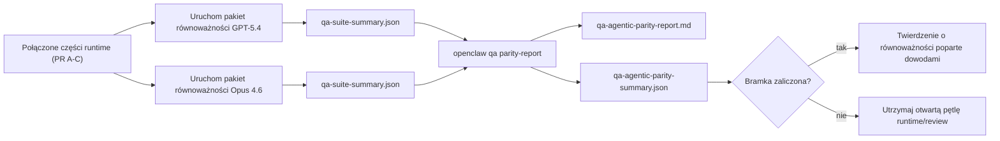

---
read_when:
    - Debugowanie zachowania agenta GPT-5.4 lub Codex
    - Porównywanie zachowania agentowego OpenClaw w różnych modelach frontier
    - Przegląd poprawek dotyczących strict-agentic, tool-schema, elevation i replay
summary: Jak OpenClaw zamyka luki w wykonywaniu agentowym dla GPT-5.4 i modeli w stylu Codex
title: Równoważność agentowa GPT-5.4 / Codex
x-i18n:
    generated_at: "2026-04-22T04:23:27Z"
    model: gpt-5.4
    provider: openai
    source_hash: 77bc9b8fab289bd35185fa246113503b3f5c94a22bd44739be07d39ae6779056
    source_path: help/gpt54-codex-agentic-parity.md
    workflow: 15
---

# Równoważność agentowa GPT-5.4 / Codex w OpenClaw

OpenClaw już dobrze współpracował z modelami frontier używającymi narzędzi, ale modele GPT-5.4 i w stylu Codex nadal w kilku praktycznych aspektach działały poniżej oczekiwań:

- mogły zatrzymywać się po zaplanowaniu zamiast wykonać pracę
- mogły niepoprawnie używać ścisłych schematów narzędzi OpenAI/Codex
- mogły prosić o `/elevated full`, nawet gdy pełny dostęp był niemożliwy
- mogły tracić stan długotrwałych zadań podczas replay lub Compaction
- twierdzenia o równoważności względem Claude Opus 4.6 opierały się na anegdotach zamiast na powtarzalnych scenariuszach

Ten program równoważności usuwa te luki w czterech dających się recenzować częściach.

## Co się zmieniło

### PR A: wykonywanie strict-agentic

Ta część dodaje opcjonalny kontrakt wykonywania `strict-agentic` dla osadzonych uruchomień Pi GPT-5.

Po włączeniu OpenClaw przestaje akceptować tury zawierające wyłącznie plan jako „wystarczająco dobre” zakończenie. Jeśli model tylko mówi, co zamierza zrobić, a faktycznie nie używa narzędzi ani nie robi postępu, OpenClaw ponawia próbę z nakierowaniem typu act-now, a następnie zamyka się w trybie fail-closed z jawnym stanem zablokowania zamiast po cichu kończyć zadanie.

Najbardziej poprawia to działanie GPT-5.4 w następujących przypadkach:

- krótkie odpowiedzi typu „ok zrób to”
- zadania związane z kodem, gdzie pierwszy krok jest oczywisty
- przepływy, w których `update_plan` powinno służyć do śledzenia postępu zamiast być tekstem-zapychaczem

### PR B: prawdomówność runtime

Ta część sprawia, że OpenClaw mówi prawdę o dwóch rzeczach:

- dlaczego wywołanie providera/runtime się nie powiodło
- czy `/elevated full` jest rzeczywiście dostępne

Oznacza to, że GPT-5.4 dostaje lepsze sygnały runtime dotyczące brakującego zakresu, błędów odświeżania uwierzytelnienia, błędów uwierzytelniania HTML 403, problemów z proxy, błędów DNS lub limitu czasu oraz zablokowanych trybów pełnego dostępu. Model z mniejszym prawdopodobieństwem będzie halucynował błędne działania naprawcze albo dalej prosił o tryb uprawnień, którego runtime nie może zapewnić.

### PR C: poprawność wykonywania

Ta część poprawia dwa rodzaje poprawności:

- zgodność schematów narzędzi OpenAI/Codex należących do providera
- uwidacznianie replay i żywotności długich zadań

Prace nad zgodnością narzędzi zmniejszają tarcie schematów przy ścisłej rejestracji narzędzi OpenAI/Codex, szczególnie w obszarze narzędzi bez parametrów i ścisłych oczekiwań co do obiektu głównego. Prace nad replay/żywotnością sprawiają, że długotrwałe zadania są lepiej obserwowalne, więc stany wstrzymania, zablokowania i porzucenia są widoczne zamiast znikać w ogólnym tekście błędu.

### PR D: harness równoważności

Ta część dodaje pierwszy pakiet równoważności QA-lab, aby GPT-5.4 i Opus 4.6 można było uruchamiać w tych samych scenariuszach i porównywać przy użyciu wspólnych dowodów.

Pakiet równoważności jest warstwą dowodową. Sam w sobie nie zmienia zachowania runtime.

Gdy masz już dwa artefakty `qa-suite-summary.json`, wygeneruj porównanie bramki wydania za pomocą:

```bash
pnpm openclaw qa parity-report \
  --repo-root . \
  --candidate-summary .artifacts/qa-e2e/gpt54/qa-suite-summary.json \
  --baseline-summary .artifacts/qa-e2e/opus46/qa-suite-summary.json \
  --output-dir .artifacts/qa-e2e/parity
```

To polecenie zapisuje:

- raport Markdown czytelny dla człowieka
- werdykt JSON czytelny maszynowo
- jawny wynik bramki `pass` / `fail`

## Dlaczego to w praktyce poprawia GPT-5.4

Przed tą pracą GPT-5.4 w OpenClaw mógł sprawiać wrażenie mniej agentowego niż Opus w rzeczywistych sesjach programistycznych, ponieważ runtime tolerował zachowania szczególnie szkodliwe dla modeli w stylu GPT-5:

- tury zawierające wyłącznie komentarz
- tarcie schematów wokół narzędzi
- niejasną informację zwrotną o uprawnieniach
- ciche uszkodzenia replay lub Compaction

Celem nie jest sprawienie, by GPT-5.4 imitował Opus. Celem jest zapewnienie GPT-5.4 kontraktu runtime, który nagradza rzeczywisty postęp, dostarcza czystszej semantyki narzędzi i uprawnień oraz zamienia tryby awarii na jawne stany czytelne dla maszyn i ludzi.

To zmienia doświadczenie użytkownika z:

- „model miał dobry plan, ale się zatrzymał”

na:

- „model albo zadziałał, albo OpenClaw pokazał dokładny powód, dla którego nie mógł”

## Przed i po dla użytkowników GPT-5.4

| Przed tym programem                                                                             | Po PR A-D                                                                               |
| ----------------------------------------------------------------------------------------------- | --------------------------------------------------------------------------------------- |
| GPT-5.4 mógł zatrzymać się po sensownym planie bez wykonania kolejnego kroku narzędziowego     | PR A zamienia „sam plan” na „działaj teraz albo pokaż stan zablokowania”               |
| Ścisłe schematy narzędzi mogły odrzucać narzędzia bez parametrów lub narzędzia w kształcie OpenAI/Codex w mylący sposób | PR C sprawia, że rejestracja i wywoływanie narzędzi należących do providera są bardziej przewidywalne |
| Wskazówki dotyczące `/elevated full` mogły być niejasne lub błędne w zablokowanych runtime      | PR B daje GPT-5.4 i użytkownikowi prawdziwe wskazówki runtime i dotyczące uprawnień    |
| Awaria replay lub Compaction mogła sprawiać wrażenie, że zadanie po cichu zniknęło             | PR C jawnie pokazuje wyniki wstrzymania, zablokowania, porzucenia i replay-invalid     |
| „GPT-5.4 wydaje się gorszy niż Opus” było głównie anegdotyczne                                  | PR D zamienia to w ten sam pakiet scenariuszy, te same metryki i twardą bramkę pass/fail |

## Architektura


## Przepływ wydania



## Pakiet scenariuszy

Pakiet równoważności pierwszej fali obejmuje obecnie pięć scenariuszy:

### `approval-turn-tool-followthrough`

Sprawdza, czy model nie zatrzymuje się na „zajmę się tym” po krótkiej zgodzie. Powinien podjąć pierwsze konkretne działanie w tej samej turze.

### `model-switch-tool-continuity`

Sprawdza, czy praca z użyciem narzędzi pozostaje spójna przy przełączaniu modelu/runtime zamiast resetować się do komentarza lub tracić kontekst wykonania.

### `source-docs-discovery-report`

Sprawdza, czy model potrafi czytać źródła i dokumentację, syntetyzować ustalenia oraz kontynuować zadanie agentowo zamiast tworzyć cienkie podsumowanie i przedwcześnie się zatrzymywać.

### `image-understanding-attachment`

Sprawdza, czy zadania mieszane z załącznikami pozostają wykonalne i nie zapadają się do niejasnej narracji.

### `compaction-retry-mutating-tool`

Sprawdza, czy zadanie z rzeczywistym mutującym zapisem utrzymuje jawność niebezpieczeństwa replay zamiast po cichu wyglądać na bezpieczne dla replay, jeśli uruchomienie wykona Compaction, ponowi próbę lub pod presją utraci stan odpowiedzi.

## Macierz scenariuszy

| Scenariusz                         | Co testuje                              | Dobre zachowanie GPT-5.4                                                      | Sygnał awarii                                                                  |
| ---------------------------------- | --------------------------------------- | ----------------------------------------------------------------------------- | ------------------------------------------------------------------------------ |
| `approval-turn-tool-followthrough` | Krótkie tury zgody po planie            | Natychmiast rozpoczyna pierwsze konkretne działanie narzędziowe zamiast powtarzać zamiar | odpowiedź zawierająca tylko plan, brak aktywności narzędziowej lub zablokowana tura bez rzeczywistej blokady |
| `model-switch-tool-continuity`     | Przełączanie runtime/modelu przy użyciu narzędzi | Zachowuje kontekst zadania i dalej działa spójnie                             | reset do komentarza, utrata kontekstu narzędzi lub zatrzymanie po przełączeniu |
| `source-docs-discovery-report`     | Czytanie źródeł + synteza + działanie   | Znajduje źródła, używa narzędzi i tworzy użyteczny raport bez utknięcia       | cienkie podsumowanie, brak pracy narzędziowej lub zatrzymanie niepełnej tury   |
| `image-understanding-attachment`   | Agentowa praca sterowana załącznikiem   | Interpretuje załącznik, łączy go z narzędziami i kontynuuje zadanie           | niejasna narracja, zignorowany załącznik lub brak konkretnego następnego działania |
| `compaction-retry-mutating-tool`   | Mutująca praca pod presją Compaction    | Wykonuje rzeczywisty zapis i utrzymuje jawność niebezpieczeństwa replay po efekcie ubocznym | następuje mutujący zapis, ale bezpieczeństwo replay jest sugerowane, nieobecne lub sprzeczne |

## Bramka wydania

GPT-5.4 może być uznany za równoważny lub lepszy tylko wtedy, gdy połączony runtime przechodzi jednocześnie pakiet równoważności i regresje prawdomówności runtime.

Wymagane wyniki:

- brak utknięcia na samym planie, gdy kolejna akcja narzędziowa jest oczywista
- brak fałszywego zakończenia bez rzeczywistego wykonania
- brak niepoprawnych wskazówek `/elevated full`
- brak cichego porzucenia replay lub Compaction
- metryki pakietu równoważności co najmniej tak dobre jak uzgodniona baza Opus 4.6

Dla harnessu pierwszej fali bramka porównuje:

- współczynnik ukończenia
- współczynnik niezamierzonych zatrzymań
- współczynnik poprawnych wywołań narzędzi
- liczbę fałszywych sukcesów

Dowody równoważności są celowo podzielone na dwie warstwy:

- PR D dowodzi zachowania GPT-5.4 vs Opus 4.6 w tych samych scenariuszach przy użyciu QA-lab
- deterministyczne zestawy PR B dowodzą prawdomówności w zakresie auth, proxy, DNS i `/elevated full` poza harness

## Macierz cel-do-dowodu

| Element bramki ukończenia                               | Odpowiedzialny PR | Źródło dowodu                                                      | Sygnał zaliczenia                                                                      |
| ------------------------------------------------------- | ----------------- | ------------------------------------------------------------------ | -------------------------------------------------------------------------------------- |
| GPT-5.4 nie zatrzymuje się już po planowaniu            | PR A              | `approval-turn-tool-followthrough` plus zestawy runtime PR A       | tury zgody wyzwalają rzeczywistą pracę albo jawny stan zablokowania                   |
| GPT-5.4 nie udaje już postępu ani fałszywego ukończenia narzędzia | PR A + PR D       | wyniki scenariuszy raportu równoważności i liczba fałszywych sukcesów | brak podejrzanych wyników pass i brak zakończeń opartych wyłącznie na komentarzu      |
| GPT-5.4 nie daje już fałszywych wskazówek `/elevated full` | PR B              | deterministyczne zestawy prawdomówności                            | powody blokady i wskazówki pełnego dostępu pozostają zgodne z rzeczywistym runtime    |
| Awarie replay/żywotności pozostają jawne                | PR C + PR D       | zestawy lifecycle/replay PR C plus `compaction-retry-mutating-tool` | praca mutująca utrzymuje jawną niebezpieczność replay zamiast po cichu znikać         |
| GPT-5.4 dorównuje lub przewyższa Opus 4.6 w uzgodnionych metrykach | PR D              | `qa-agentic-parity-report.md` i `qa-agentic-parity-summary.json`   | ten sam zakres scenariuszy i brak regresji w ukończeniu, zachowaniu zatrzymań lub poprawnym użyciu narzędzi |

## Jak czytać werdykt równoważności

Użyj werdyktu w `qa-agentic-parity-summary.json` jako ostatecznej decyzji czytelnej maszynowo dla pakietu równoważności pierwszej fali.

- `pass` oznacza, że GPT-5.4 objął te same scenariusze co Opus 4.6 i nie zanotował regresji w uzgodnionych zagregowanych metrykach.
- `fail` oznacza, że została uruchomiona co najmniej jedna twarda bramka: słabsze ukończenie, gorsze niezamierzone zatrzymania, słabsze poprawne użycie narzędzi, jakikolwiek przypadek fałszywego sukcesu albo niedopasowany zakres scenariuszy.
- „shared/base CI issue” samo w sobie nie jest wynikiem równoważności. Jeśli szum CI poza PR D blokuje uruchomienie, werdykt powinien poczekać na czyste wykonanie połączonego runtime zamiast być wnioskowanym na podstawie logów z okresu pracy na gałęzi.
- Prawdomówność dotycząca auth, proxy, DNS i `/elevated full` nadal pochodzi z deterministycznych zestawów PR B, więc końcowe twierdzenie wydaniowe wymaga obu elementów: zaliczonego werdyktu równoważności PR D i zielonego pokrycia prawdomówności PR B.

## Kto powinien włączyć `strict-agentic`

Używaj `strict-agentic`, gdy:

- od agenta oczekuje się natychmiastowego działania, gdy kolejny krok jest oczywisty
- modele GPT-5.4 lub z rodziny Codex są podstawowym runtime
- wolisz jawne stany zablokowania zamiast „pomocnych” odpowiedzi zawierających tylko podsumowanie

Pozostaw domyślny kontrakt, gdy:

- chcesz zachować obecne luźniejsze zachowanie
- nie używasz modeli z rodziny GPT-5
- testujesz prompty, a nie egzekwowanie przez runtime
